import VideoEmbed from '@components/VideoEmbed.astro';

Warp has native planning functionality that helps you break down complex engineering tasks into structured, executable steps. Planning is tightly integrated with Warp's coding agent and provides a persistent plan editor, version history, selective execution, and deep links into your workspace.

<VideoEmbed url="https://youtu.be/DawcFWyudV0?si=OzvuInMl8DoNR97R" />

---

### Creating a plan

You can generate a plan using the `/plan` [slash command](/agent-platform/capabilities/slash-commands/) or by asking the agent in natural language.

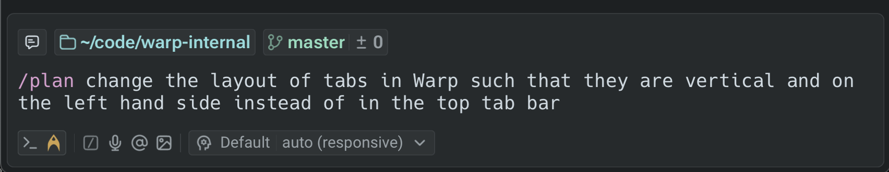

The agent then creates a structured plan inside Warp’s native rich text editor, which is designed for long, multi-step workflows. The editor includes clean formatting, inline code blocks, and clickable file paths so you can open referenced files immediately in Warp (see below) or in your external editor.

### Reviewing and editing

Once a plan is generated, you can review it, reorganize steps, or refine details. You can edit the document manually or ask the agent to revise sections for you.

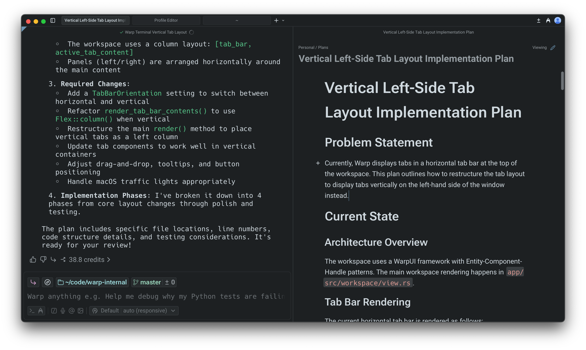

Any update made by the agent **creates a new version**. Version history lets you compare past iterations and restore an older version if you want to revert your approach, preserving a clear decision trail as the plan evolves.

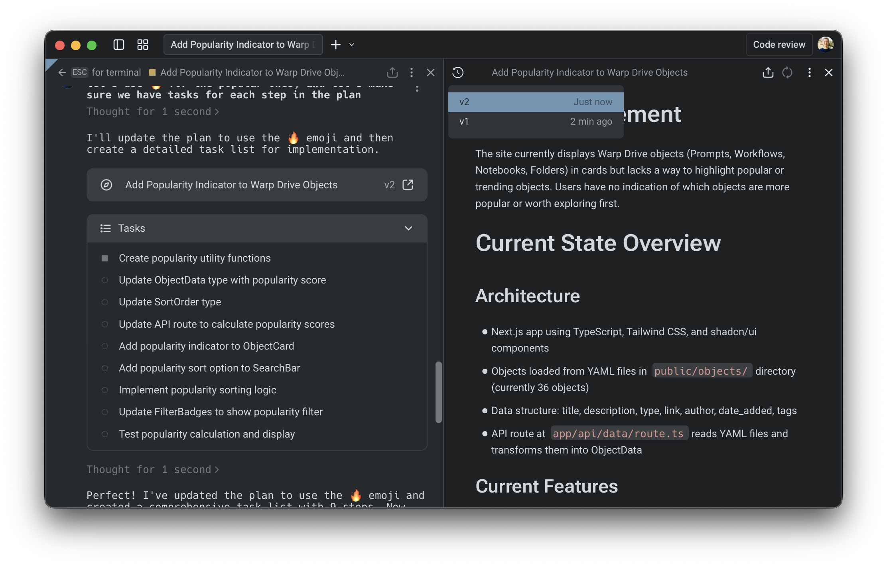

### Executing a plan

When you’re ready to start implementing, prompt the agent to run the plan. You can ask it to execute the full set of steps or only a specific section, such as “Implement phase 1 of the plan.”

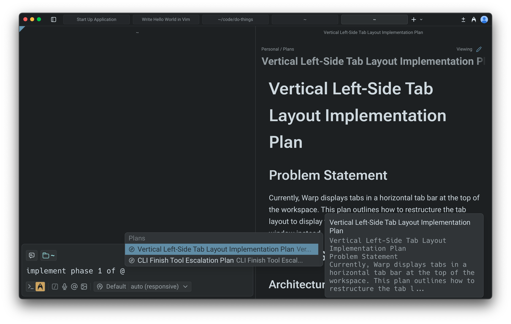

The agent applies changes incrementally and updates files as it proceeds. This makes it easy to validate early steps before moving forward, adjust the plan mid-run, or try alternative paths without committing to the full workflow.

If you revise the plan while the agent is running, you can notify it directly; the agent will adjust its execution based on your updates.

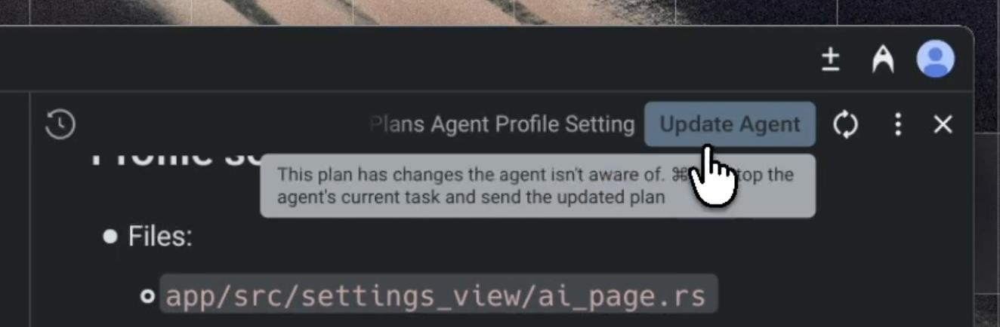

### Monitoring progress

While the agent is running, you can reopen the plan at any time by selecting **View plan** in the input. You can also follow each change in real time through the [Code Review](/code/code-review/) panel and add comments or guidance using [Interactive Code Review](/agent-platform/local-agents/interactive-code-review/).

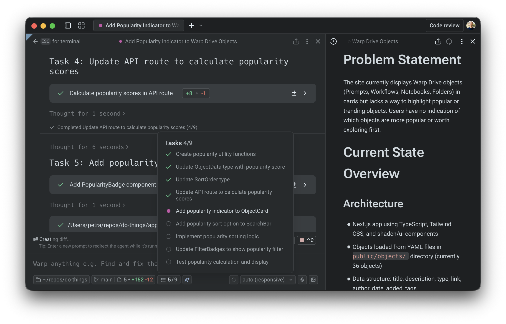

This gives you clear oversight, helps confirm expected behavior, and lets you intervene quickly if something needs correction.

### Saving and sharing

Warp automatically saves all plans in the _Plans_ folder in [Warp Drive](/knowledge-and-collaboration/warp-drive/). You'll see a confirmation when your plan is synced.

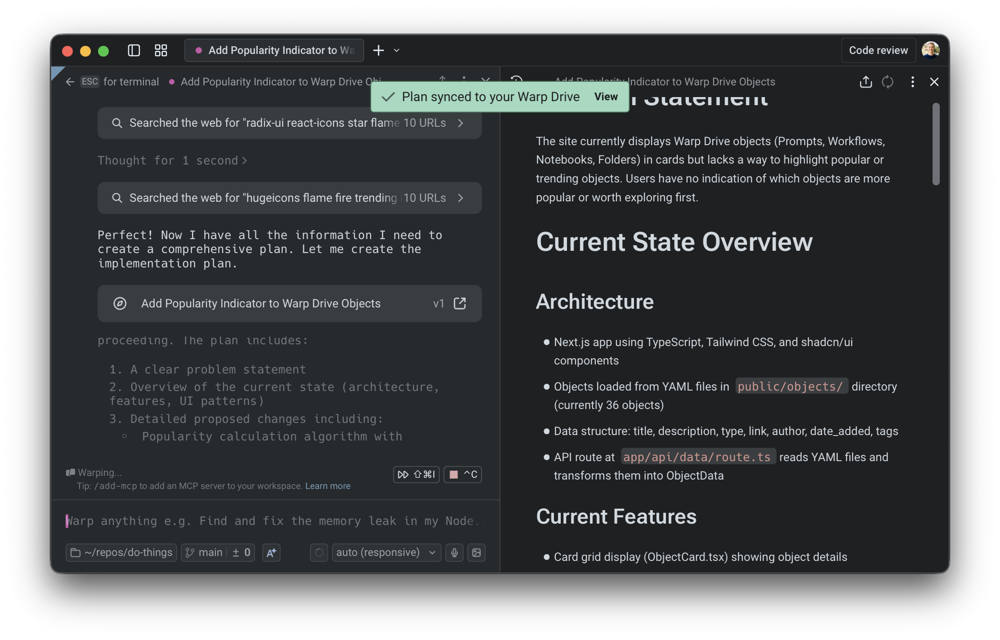

You can export any plan as Markdown, check it into your repository, or share a link—useful for GitHub PRs, design reviews, or async collaboration.

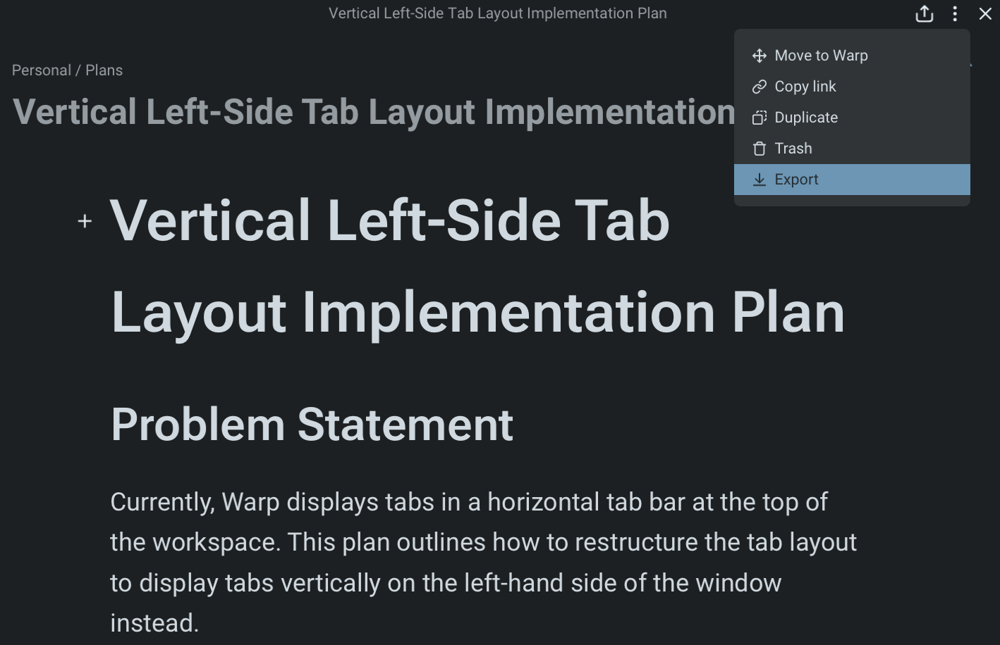

Because plans persist in Warp Drive, you can return to them later, reuse them for new work, or treat them as documentation for ongoing projects. This is also naturally passed to the agent as context.

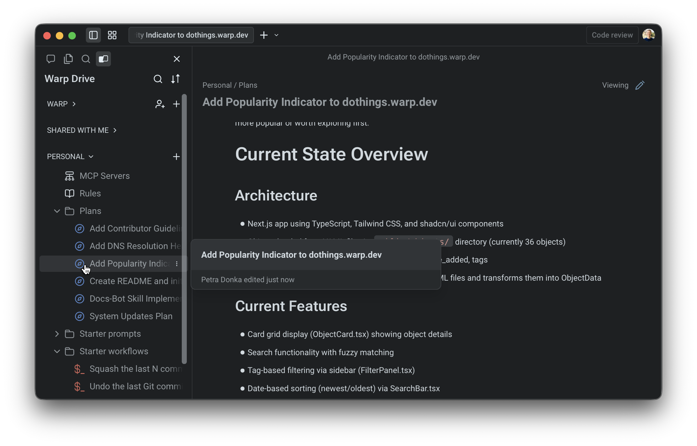

You can configure whether your plans will be automatically added and synced to Warp Drive in your [Agent Profiles & Permissions](/agent-platform/capabilities/agent-profiles-permissions/) under **Settings** > **Agents** > **Profiles**.

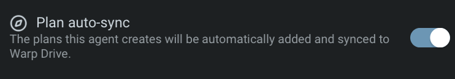

### Using plans across conversations

Plans are reusable across tasks and sessions. You can reference them in future prompts, continue where you left off, or build follow-up plans that rely on earlier work.

The **@plans** command helps you quickly search for and reopen previously saved plans, making planning a consistent part of your development workflow rather than a one-off step. Learn more about attaching context using @ [here](/agent-platform/local-agents/agent-context/using-to-add-context/).

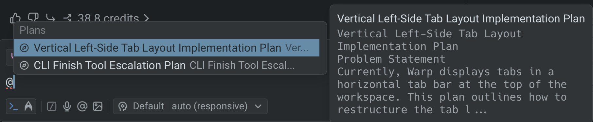

---

## Next steps

As the agent executes your plan, you'll review code changes and may want to scale work to the cloud.

* **[Interactive Code Review](/agent-platform/local-agents/interactive-code-review/)** - Leave inline comments on agent-generated diffs and have the agent revise in one pass.
* **[Cloud Agents quickstart](/agent-platform/cloud-agents/quickstart/)** - Run agents in the cloud for longer tasks, background automation, or parallel work across repos.
