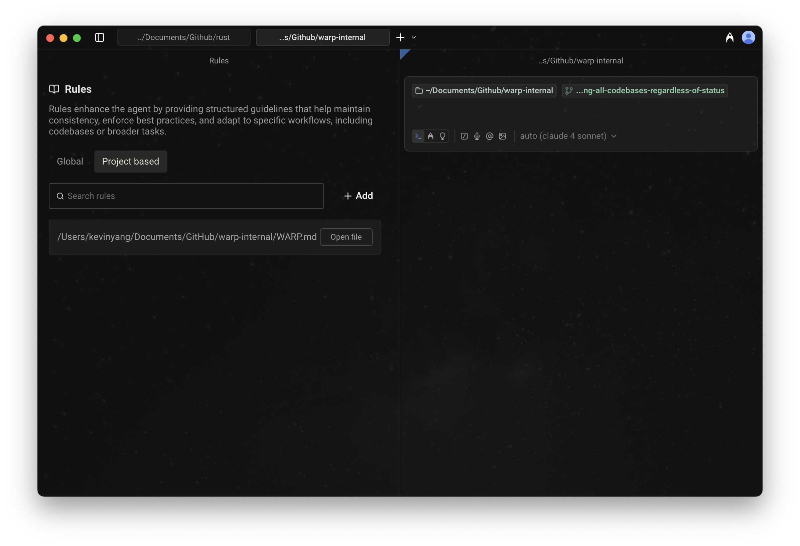
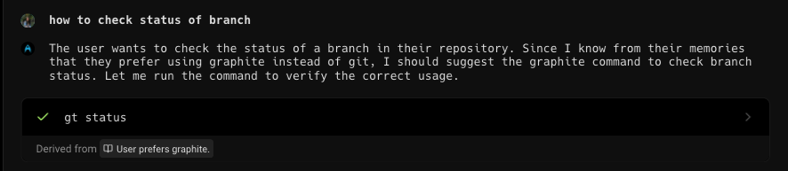
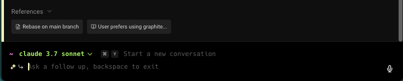

import VideoEmbed from '@components/VideoEmbed.astro';
import { FileTree } from '@astrojs/starlight/components';

Warp’s **Rules** feature lets you create reusable guidelines that inform how agents respond to your prompts. Rules help tailor responses to match your coding standards, project conventions, and personal preferences, making agent interactions smarter and more consistent.

Warp supports two types of rules: **Global Rules** and **Project Rules**.

<VideoEmbed url="https://youtu.be/fDr0-3bLxMQ" />

## Global Rules

Global Rules apply across all projects and contexts. They're ideal for:

* Coding standards and best practices
* Workspace-wide guidelines
* Tool configurations or preferences you want applied everywhere

Warp may also suggest Global Rules based on your usage patterns to make future interactions smarter and more consistent.
## Project Rules

Project Rules live in your codebase and apply automatically when working within that project. They're stored in an `AGENTS.md` file (or `WARP.md` for backwards compatibility) and can be:

* Placed in the root of your repository
* Added in subdirectories for more targeted guidance

:::note
Warp uses `AGENTS.md` as the default project rules file. Existing `WARP.md` files are still fully supported—if you have `WARP.md`, it will continue to work as expected. You can also rename `WARP.md` to `AGENTS.md` at any time without additional changes.

If both `WARP.md` and `AGENTS.md` exist in the same directory, `WARP.md` takes priority.
:::

:::caution
The filename must be in **all caps** for Warp to recognize it (e.g., `AGENTS.md`, not `agents.md` or `Agents.md`). We recommend creating `AGENTS.md` for new projects.
:::

**When you're in a directory:**

* Warp automatically applies the `AGENTS.md` (or `WARP.md`) in the root and in the current directory.
* If you edit files in another subdirectory, Warp makes a best-effort attempt to include that subdirectory's rules file as well.

Example project structure:

<FileTree>
- project/
  - api/
    - AGENTS.md API-specific rules
  - ui/
    - AGENTS.md UI-specific rules
  - AGENTS.md Project-wide rules
</FileTree>

How Warp applies these Project Rules:

* **If the current directory is `ui/`**
  * Automatically applied: `project/AGENTS.md` and `project/ui/AGENTS.md`
  * Best effort: `project/api/AGENTS.md` if editing files there
* **If the current directory is `api/`**
  * Automatically applied: `project/AGENTS.md` and `project/api/AGENTS.md`
  * Best effort: `project/ui/AGENTS.md` if editing files there

### **Rules precedence**

When multiple rules apply, Warp follows this order of precedence:

1. Rules in the current subdirectory's project rules file
2. Rules in the root directory's project rules file
3. Global Rules

This ensures the most specific, project-relevant rules take priority over broader ones.

---

## How to access Rules

* From [Warp Drive](/knowledge-and-collaboration/warp-drive/): **Personal** > **Rules**
* From the [Command Palette](/terminal/command-palette/): search for "Open AI Rules"
* From the Settings panel: **Settings** > **Agents** > **Knowledge** > **Manage Rules**
  * Here, you can manage both Global as well as Project Rules.
* From the macOS Menu: `AI > Open Rules` &#x20;
* From the Slash Commands menu: `/open-project-rules`  to open Project Rules directly in Warp's code editor

## How to create, edit, or delete Rules

#### Global Rules

* **From Warp Drive Rules pane:** **Personal** > **Rules** > **Global**\
  Add, edit, or delete any number of rules. Each rule can include:
  * Name (optional)
  * Description (what the rule does and when to apply it)
* **From the Slash Commands menu:** `/add-rule` in Auto or Agent input modes to create a new Global Rule (automatically opens the Warp Drive Rules pane).

<VideoEmbed url="https://www.loom.com/share/3a49462c01e149cf9c040130cebe1184?hideEmbedTopBar=true&hide_owner=true&hide_share=true&hide_title=true" title="Rules Demo (legacy) with just Global Rules. Project rules can also be found there." />

#### Project Rules

* **When in a directory, set up Project Rules with a slash command:** Use `/init` in Auto-Detection or Agent Mode to:
  * Begin indexing your codebase or display indexing status
  * Generate an `AGENTS.md` file with initial context, or
  * Link an existing Rules file to `AGENTS.md`
    * Warp currently supports linking the following external Rules files: `CLAUDE.md`, `.cursorrules`, `AGENT.md`, `GEMINI.md`, `.clinerules`, `.windsurfrules`, `.github/copilot-instructions.md`&#x20;

To view all Project Rules and open them in Warp, access it via the Warp Drive Rules pane: **Personal** > **Rules** > **Project-based**

### Rules as Agent context

When relevant, Agents automatically pull in applicable rules to guide their responses. Rules used in an interaction will appear in the conversation under **References** or marked as derived from a specific rule.

### Rules privacy

See our [Privacy Page](/support-and-community/privacy-and-security/privacy/) for more information on how we handle data with Rules.
