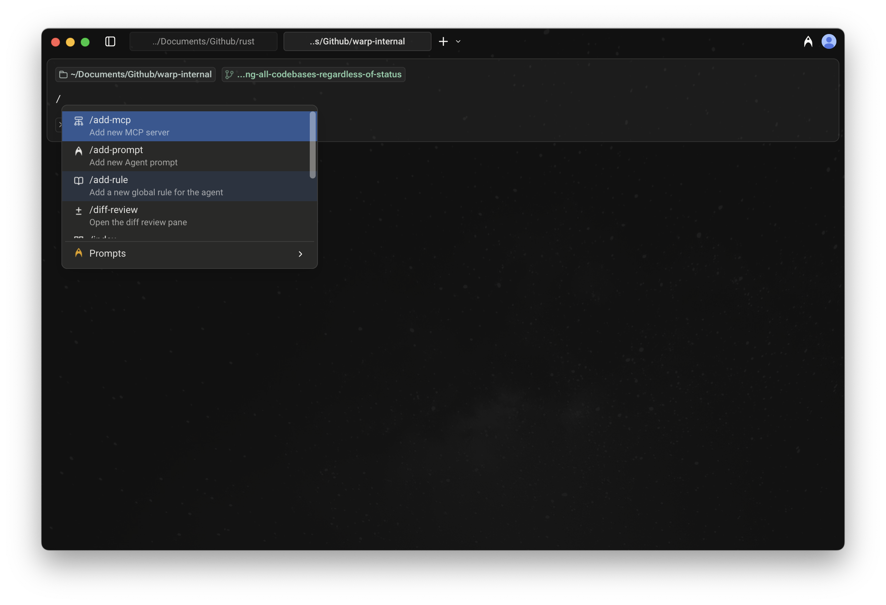
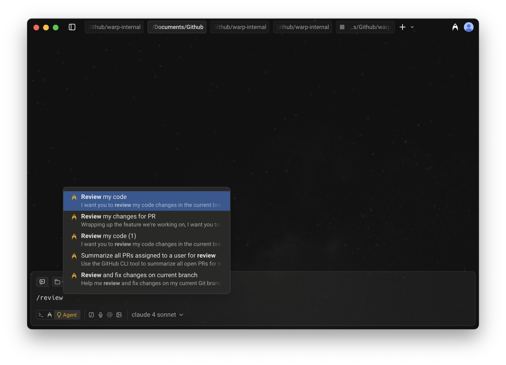
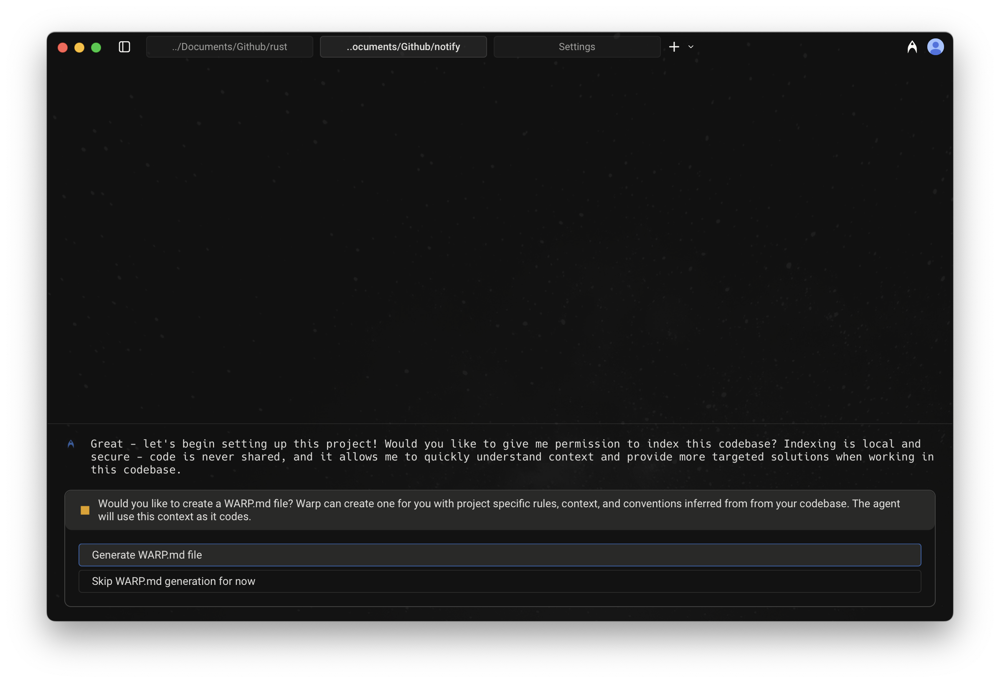
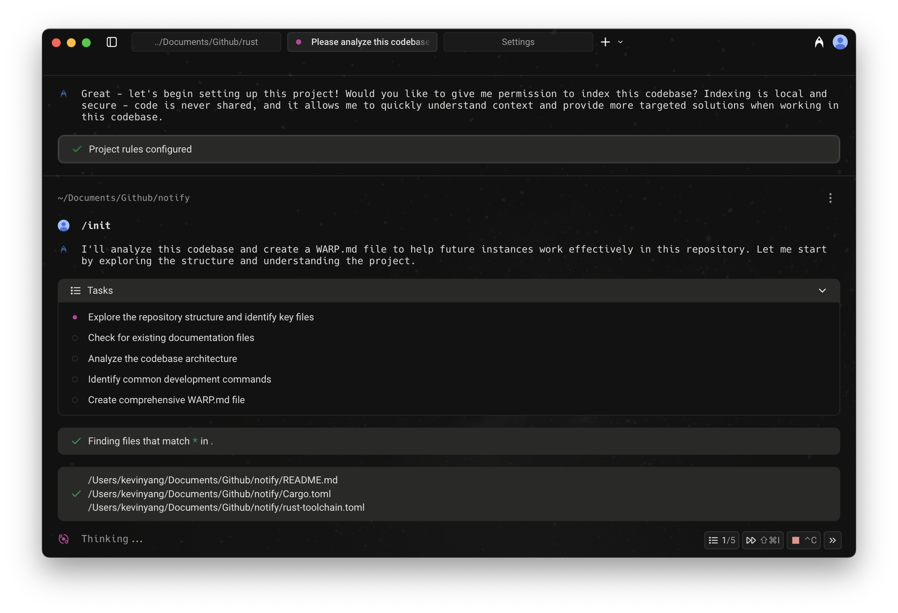

When using Agent Mode or Auto-Detection Mode, typing `/` in the input field opens the Slash Commands menu.

As you type, the menu filters results in real time, making it easy to find and run the command or prompt you need.

## Static slash commands

Warp currently supports the following built-in Slash Commands:

<table><thead><tr><th width="211.64453125">Slash Command</th><th>Description</th></tr></thead><tbody><tr><td><code>/add-mcp</code></td><td>Add a new <a href="/agent-platform/capabilities/mcp/">MCP server</a>.</td></tr><tr><td><code>/add-prompt</code></td><td>Add a new <a href="/knowledge-and-collaboration/warp-drive/prompts/">Agent Prompt</a> in Warp Drive.</td></tr><tr><td><code>/add-rule</code></td><td>Add a new <a href="/agent-platform/capabilities/rules/">Global Rule</a> for the Agent.</td></tr><tr><td><code>/agent</code></td><td>Start a new <a href="/agent-platform/local-agents/interacting-with-agents/">agent conversation</a>. Optionally include a prompt to send immediately.</td></tr><tr><td><code>/changelog</code></td><td>Open the latest Warp <a href="/changelog/">changelog</a>.</td></tr><tr><td><code>/cloud-agent</code></td><td>Start a new <a href="/agent-platform/cloud-agents/overview/">cloud agent conversation</a>. <code>{'*'}</code></td></tr><tr><td><code>/compact</code></td><td>Free up context by summarizing conversation history.</td></tr><tr><td><code>/compact-and</code></td><td>Compact the current conversation and then send a follow-up prompt.</td></tr><tr><td><code>/conversations</code></td><td>Open <a href="/agent-platform/local-agents/interacting-with-agents/">conversation history</a>.</td></tr><tr><td><code>/cost</code></td><td>Toggle credit usage details in the current conversation.</td></tr><tr><td><code>/create-environment</code></td><td>Create a <a href="/agent-platform/cloud-agents/environments/">Warp Environment</a> (Docker image + repos) via guided setup. <code>{'*'}</code></td></tr><tr><td><code>/create-new-project</code></td><td>Have the Agent walk you through creating a new coding project. <code>{'*'}</code></td></tr><tr><td><code>/export-to-clipboard</code></td><td>Export the current conversation to clipboard in markdown format.</td></tr><tr><td><code>/export-to-file</code></td><td>Export the current conversation to a markdown file.</td></tr><tr><td><code>/feedback</code></td><td>Send feedback to the Warp team. Only the Agent-drafted flow consumes credits. See <a href="/support-and-community/troubleshooting-and-support/sending-us-feedback/#using-feedback-in-warp">Using <code>/feedback</code> in Warp</a> for details. <code>{'*'}</code></td></tr><tr><td><code>/fork</code></td><td><a href="/agent-platform/local-agents/interacting-with-agents/conversation-forking/">Forks the current conversation</a> into a new thread with the full context and history of the original.   You can optionally include a prompt that will be sent immediately in the forked conversation.</td></tr><tr><td><code>/fork-and-compact</code></td><td><a href="/agent-platform/local-agents/interacting-with-agents/conversation-forking/">Forks the current conversation</a> and automatically compacts the forked version.  Useful when you want a fresh, summarized starting point that preserves relevant context while trimming the rest.</td></tr><tr><td><code>/fork-from</code></td><td>Open a searchable menu to <a href="/agent-platform/local-agents/interacting-with-agents/conversation-forking/">fork the conversation</a> from a specific query. Select a query to create a fork that includes everything up to that point.</td></tr><tr><td><code>/index</code></td><td>Index the current codebase using <a href="/agent-platform/capabilities/codebase-context/">Codebase Context</a>.</td></tr><tr><td><code>/init</code></td><td>Index the current codebase and generate an <a href="/agent-platform/capabilities/rules/">AGENTS.md file</a>. <code>{'*'}</code></td></tr><tr><td><code>/model</code></td><td>Switch the base agent model for the current conversation.</td></tr><tr><td><code>/new</code></td><td>Start a new <a href="/agent-platform/local-agents/interacting-with-agents/">agent conversation</a> (alias for <code>/agent</code>).</td></tr><tr><td><code>/open-code-review</code></td><td>Open the <a href="/code/code-review/">code review</a> pane.</td></tr><tr><td><code>/open-file</code></td><td>Open a file for editing in Warp's <a href="/code/code-editor/">code editor</a>.</td></tr><tr><td><code>/open-mcp-servers</code></td><td>View the status of your <a href="/agent-platform/capabilities/mcp/">MCP servers</a>.</td></tr><tr><td><code>/open-project-rules</code></td><td>Open the <a href="/agent-platform/capabilities/rules/#project-rules">Project Rules</a> file (<code>AGENTS</code>).</td></tr><tr><td><code>/open-repo</code></td><td>Switch to another indexed repository.</td></tr><tr><td><code>/open-rules</code></td><td>View all of your global and project <a href="/agent-platform/capabilities/rules/">rules</a>.</td></tr><tr><td><code>/open-settings-file</code></td><td>Open the Warp <a href="/terminal/settings/">settings file</a> (<code>settings.toml</code>) in Warp's code editor.</td></tr><tr><td><code>/open-skill</code></td><td>Open an interactive menu to browse and edit project or global <a href="/agent-platform/capabilities/skills/">skills</a>.</td></tr><tr><td><code>/orchestrate</code></td><td>Break a task into subtasks and run them in parallel with multiple agents. <code>{'*'}</code></td></tr><tr><td><code>/plan</code></td><td>Prompt the Agent to do some research and create a <a href="/agent-platform/capabilities/planning/">plan</a> for a task.</td></tr><tr><td><code>/pr-comments</code></td><td>Pull GitHub PR review comments into Warp. <code>{'*'}</code></td></tr><tr><td><code>/profile</code></td><td>Switch the active <a href="/agent-platform/capabilities/agent-profiles-permissions/">execution profile</a>.</td></tr><tr><td><code>/prompts</code></td><td>Search saved <a href="/knowledge-and-collaboration/warp-drive/prompts/">prompts</a>.</td></tr><tr><td><code>/rename-tab</code></td><td>Rename the current tab. Include the new tab name as an argument (for example, <code>/rename-tab deploy</code>).</td></tr><tr><td><code>/rewind</code></td><td>Rewind to a previous point in the conversation.</td></tr><tr><td><code>/skills</code></td><td>Invoke a <a href="/agent-platform/capabilities/skills/">skill</a> from a searchable menu.</td></tr><tr><td><code>/usage</code></td><td>Open <a href="/support-and-community/plans-and-billing/">billing and usage</a> settings.</td></tr></tbody></table>

:::caution
Slash commands marked with a `*` consume credits to complete the task.
:::

#### Using Agent Prompts via Slash Commands

In addition to static commands, the menu also shows [Agent Prompts](/knowledge-and-collaboration/warp-drive/prompts/) saved in your [Warp Drive](/knowledge-and-collaboration/warp-drive/).

* These prompts can be custom ones you’ve created or ones shared with you.
* As you type after `/`, prompts are filtered dynamically, so you can quickly run them without leaving the input field.

### Tips

* **Context-aware:** Many Slash Commands use your current working directory or file selection as context.
* **Quick access:** Use `/` from anywhere in Agent Mode or Auto-Detection Mode to avoid navigating through menus.

### Example of using a Slash Command

Below is an example interaction when `/init` is run:

