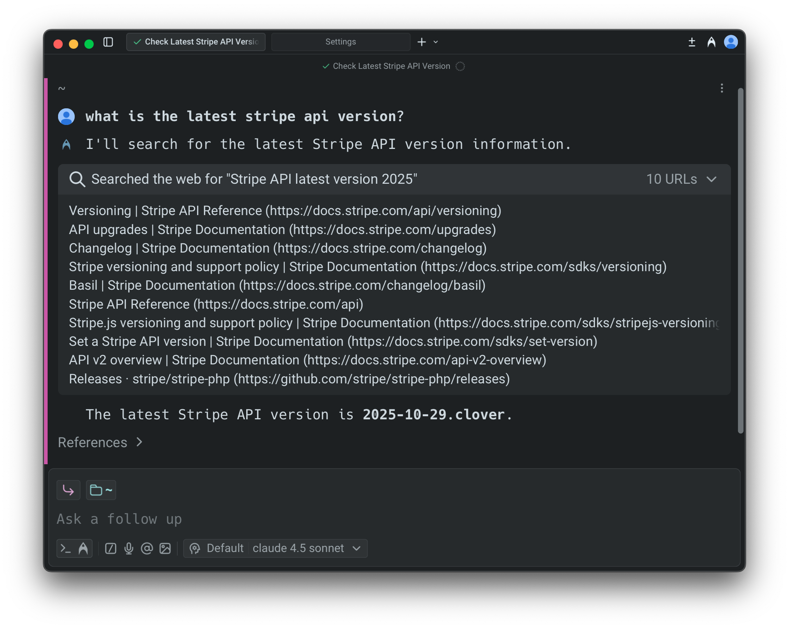
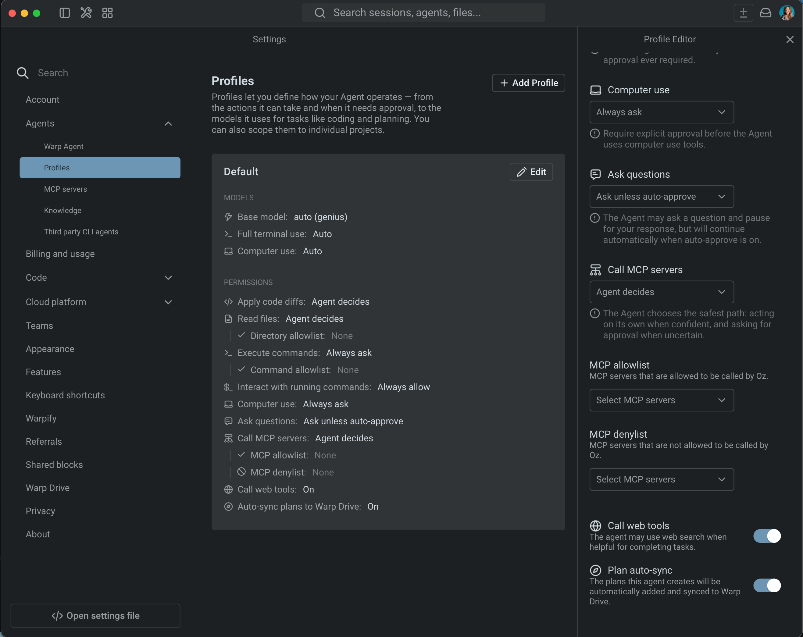

import VideoEmbed from '@components/VideoEmbed.astro';

Warp includes native web search for models that support first-party search tools. When enabled, agents can look up information in real time, consult documentation, retrieve current version numbers, and cite the sources used to generate responses.

<VideoEmbed url="https://www.loom.com/share/06a4ba98f2e0446d80cb37aa4c23848c" />

This page covers how web search works, supported models, what you can expect inside Warp, configuration options, and how this differs from attaching URLs directly to a prompt.

---

### When the Agent uses web search

Models initiate a web search when it improves the quality or accuracy of an answer. **Common scenarios include:**

* Retrieving official documentation or API references
* Getting the latest version of a library or tool
* Checking error messages, GitHub issues, or StackOverflow discussions
* Looking up ongoing incidents or recent changes
* Answering questions where recency matters (e.g., “best approach in 2025 to…”)

Web searches are automatically triggered when the model considers them useful. You don’t need special syntax.

### How web search works in Warp

**When a search occurs:**

1. Warp shows a “Searching the web…” indicator inside the conversation.
2. You can expand the search result to view:
   * The query issued
   * The pages retrieved
3. **The model reads results and produces a grounded response.**
   * Claude models cite sources in the references footer.
   * OpenAI models use inline citations and also show references in the footer.

### Supported and unsupported models

Web search is available only for models that offer a native web search integration, that works in tandem with other custom tools.

**Models that support web search**

* Anthropic: `Claude 4.6 Series`, `Claude 4.5 Series`, `Claude 4 Series`
* OpenAI:
  * `GPT-5.4`, `GPT-5.3 Codex`, `GPT-5.2 Codex`, `GPT-5.2`

Warp uses each vendor’s official tool:

* **Claude Web Search**: [https://docs.claude.com/en/docs/agents-and-tools/tool-use/web-search-tool](https://docs.claude.com/en/docs/agents-and-tools/tool-use/web-search-tool)
* **OpenAI Web Search**: [https://developers.openai.com/api/docs/guides/tools-web-search](https://developers.openai.com/api/docs/guides/tools-web-search)

:::note
**Note**: We plan to add native web search for additional models as soon as their APIs fully support it. We’ll continue updating the list of search-capable models as vendors roll out broader tooling. We're also exploring custom web search tools that'll work across all models.
:::

### Viewing search results

You can inspect the web search UI at any time:

* Expand the **Web Search** section in the agent response
* You can see:
  * The list of pages fetched
  * The text used to answer your question
  * Citations and reference metadata

This makes it easy to verify accuracy, audit reasoning, and validate sources.

### Enabling or disabling web search

Web search is controlled per [Profiles & Permissions](/agent-platform/capabilities/agent-profiles-permissions/).

To configure:

1. In the Warp app, navigate to **Settings** > **Agents** > **Profiles**.
2. Next to the agent profile, click **Edit**.
3. Scroll to **Call web tools** and toggle the setting on or off.

Disabling this prevents the agent from performing searches, even if a model would normally use them.

### Credit usage

Web search incurs two types of credit usage:

1. A small fixed cost per search invocation
2. Additional cost proportional to retrieved content, since retrieved text is passed to the model

You’ll see these contributions itemized in the conversation’s credit usage footer, alongside model calls, planning calls, and other tool usage.
