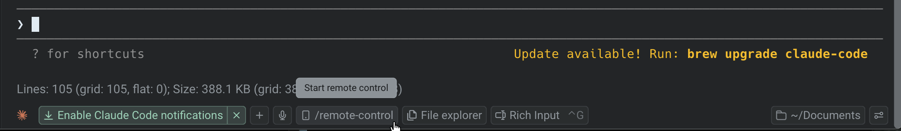

Remote Control lets you publish a running third-party agent session — such as Claude Code, Codex, or OpenCode — to the cloud with a single click. Once published, you can monitor progress, review output, and steer the agent from your phone, a web browser, or another computer without staying at the original machine. See [Third-Party CLI Agents](/agent-platform/cli-agents/overview/) for the full list of supported agents.

This is especially useful for long-running agent tasks. Start a coding agent, publish the session, and check back whenever you want.

:::note
Remote Control is built on top of [Agent Session Sharing](/agent-platform/local-agents/session-sharing/). It uses the same underlying infrastructure to publish sessions and generate shareable links.
:::

## Key capabilities

* **One-click publish** - Click the `/remote-control` chip in the agent utility bar to publish instantly. The shareable link is copied to your clipboard automatically.
* **Monitor from anywhere** - Check on agent progress from a phone, tablet, or another computer — no install required for web viewers
* **Steer remotely** - Send input, approve commands, or redirect the agent without being at your original machine
* **Team access** - Share the link with teammates so they can observe or collaborate on the session
* **Persistent cloud access** - The session stays in sync while it's active. New agent output and terminal activity appear for all viewers in real time. Syncing stops when you close or stop publishing the session.

## How it works

When you publish a session through Remote Control, Warp uploads the session state to the cloud and generates a shareable link. The link stays live and in sync — any new agent output, tool use, or terminal activity appears for all connected viewers in real time. You control who can view and who can steer the agent.

Remote Control differs from standard [Agent Session Sharing](/agent-platform/local-agents/session-sharing/) in its intent: Session Sharing is designed for live collaborative work (pair-programming, interactive debugging), while Remote Control is designed for async monitoring and steering when you're away from your machine.

## Publishing a session

1. Start or resume a third-party agent session in Warp (for example, Claude Code or Codex).
2. Click the **`/remote-control`** chip in the agent utility bar. Warp publishes the session to the cloud and copies the shareable link to your clipboard.

3. A **Sharing link copied** toast notification confirms the link is on your clipboard, and the pane's status icon changes to a red broadcast indicator to show that publishing is active.
4. Open the link on another device, or share it with a teammate.

To stop publishing, click the **Stop sharing** button in the agent utility bar. The status icon returns to its normal state, confirming the session is no longer accessible remotely.

## Accessing a remote session

Published sessions are accessible from:

* **Web browser** - Open the shared link in any browser. No app install required.
* **Warp desktop app** - Paste the link into Warp on a different machine for the full desktop experience
* **Mobile** - Open the link on your phone or tablet browser to check on progress while away from your desk

The web experience mirrors the desktop view, showing complete agent activity including thinking steps, tool use, and terminal output.

## Permissions

When you publish a session, you control access:

* **View access** - Anyone with the link can watch the session, see agent output, and review terminal activity
* **Edit access** - You can grant viewers permission to send input, approve commands, or redirect the agent

Only you (the publisher) can revoke access or stop publishing the session.

## Related pages

* [Agent Session Sharing](/agent-platform/local-agents/session-sharing/)
* [Third-Party CLI Agents](/agent-platform/cli-agents/overview/)
* [Viewing Cloud Agent Runs](/agent-platform/cloud-agents/viewing-cloud-agent-runs/)
