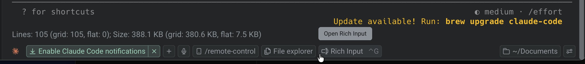
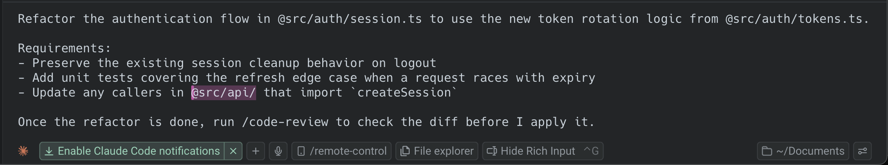
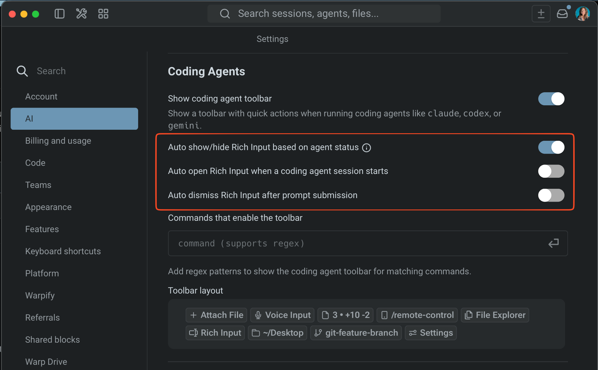

Warp's rich input editor lets you write prompts for any CLI coding agent with the same editing experience you'd expect from an IDE — mouse support, context attachment, voice, and more. Press `Ctrl-G` (configurable) or click the **Rich Input** button in the agent utility bar to open it.

## Key capabilities

* **IDE-style editing** - Click, select, and navigate your prompt with your mouse. Copy, cut, paste, undo, and word-level navigation all work. Write multi-line prompts with line breaks and soft wrapping. Vim keybindings are also supported. See [Modern text editing](/terminal/editor/) for the full list of shortcuts.
* **Rich context with @mentions** - Reference files, folders, and code symbols with `@` mentions. Attach images for visual context. Search for specific symbols directly from the editor. See [Agent Context](/agent-platform/local-agents/agent-context/) for details.
* **Voice input** - Dictate prompts instead of typing. See [Voice](/agent-platform/local-agents/interacting-with-agents/voice/) for details.
* **Slash commands and skills** - Access saved `/prompts`, `/skills`, and [Warp Drive](/knowledge-and-collaboration/warp-drive/) content with `/`. The editor shows skills specific to the running agent's provider (e.g., Claude-specific skills when running Claude Code). See [Slash Commands](/agent-platform/capabilities/slash-commands/) for details.
* **Agent toolbar** - Browse files, view code changes, and manage the agent session from the toolbar.

## How to open

There are two ways to open the rich input editor:

1. **Keyboard shortcut** - Press `Ctrl-G` (configurable) while a supported agent is running in the active pane.
2. **Rich Input button** - Click the **Rich Input** button in the agent utility bar at the bottom of the pane.

The rich input editor also auto-opens when an agent resumes from a blocked state (for example, after you approve a command). This requires the agent's plugin to be supported and installed. Toggle **Auto show/hide based on agent status** in [Rich input settings](#rich-input-settings) to control this behavior.

When the rich input editor is active, Warp hides the cursor inside the CLI agent and moves focus to the editor input. Submit your prompt from here and it goes directly to the running agent.

## Rich input settings

In the Warp app, go to **Settings** > **Agents** > **Third party CLI agents** to configure the following:

* **Auto show/hide based on agent status** - Automatically open the rich input editor when the agent needs input, and hide it when the agent is working. Works with agents that have plugin support and the plugin installed (Claude Code and OpenCode).
* **Auto open on session start** - Automatically open the rich input editor when a CLI agent session starts.
* **Auto dismiss after submission** - Close the editor after you send a prompt.
* **Keyboard shortcut** - The default shortcut is `Ctrl-G`. Customize this in **Settings** > **Keyboard shortcuts**.
* **Disable the Rich Input button** - Right-click the agent utility bar and remove the **Rich Input** chip, or disable the footer entirely in **Settings** > **Agents** > **Third party CLI agents**.

## Related pages

* [Third-Party CLI Agents Overview](/agent-platform/cli-agents/overview/)
* [Remote Control](/agent-platform/cli-agents/remote-control/)
* [Voice](/agent-platform/local-agents/interacting-with-agents/voice/)
* [Slash Commands](/agent-platform/capabilities/slash-commands/)
* [Agent Context](/agent-platform/local-agents/agent-context/)
