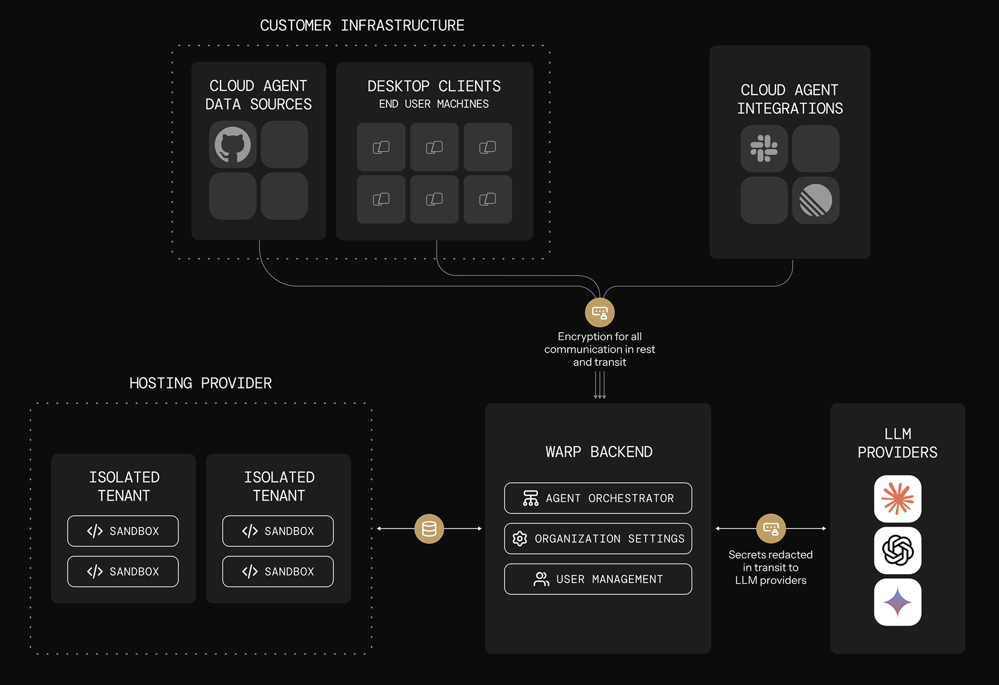

Teams adopt cloud agents in a few repeatable ways. This page outlines the most common architectures, what they're good for, and how they fit together.

#### Quick mental model

Oz cloud agent setups usually have four moving parts:

1. **Trigger**: something happens (CI step, webhook, cron, Slack mention).
2. **Orchestration**: something decides what to run and tracks it (Oz orchestrator, GitHub Actions, your internal system).
3. **Execution**: where the agent actually runs (your runner, Oz-hosted environment, or self-hosted workers).
4. **Visibility**: how the team monitors and intervenes (Oz dashboard, session sharing, APIs).

---

### Pattern 1: CLI-only agents (bring your own orchestrator)

Use this when you already have a system that schedules work (CI, dev boxes, internal orchestrators), and you just need a reliable, cloud-connected agent runner.

#### What it looks like

* **Trigger**: GitHub Actions / CI, a script, a dev box action, or an internal orchestrator
* **Orchestration**: your existing system
* **Execution**: wherever that system runs
* **Warp adds**: cloud connectivity, shared context, visibility, session sharing, and tracking

#### Why teams choose it

* You want a **drop-in replacement** for other CLI/SDK-based agents (Claude Code, Codex CLI, Gemini CLI/SDK-style flows).
* You want to run agents anywhere without requiring Warp desktop.
* You still want **team-level observability** even when execution is “outside Warp.”

#### Common examples

* **CI PR helper**: run formatting checks, generate review comments, suggest fixes, open PRs.
* **Remote dev box agent**: run refactors or debugging tasks inside a pre-provisioned box.
* **Internal orchestrator integration**: treat Warp as one agent option alongside other model providers.

#### What you still get even without Warp orchestration

* Access to your shared Warp context (for example MCP config, Warp Drive context, rules/prompts).
* Agent Session Sharing to monitor/steer runs.
* Read-only APIs for tracking and reporting.
* A path to “handoff” workflows (where a run can be continued or inspected in richer surfaces).

#### Minimal setup checklist

* A Warp team
* A service account (recommended for automation)
* The Oz CLI installed on the runner / box
* Any needed credentials (often via secrets + environment variables)

---

### Pattern 2: Oz-hosted agents + Oz orchestration (managed cloud execution)

Use this when you want Oz to run agent workloads on Warp-managed infrastructure, typically inside reproducible Docker environments, with built-in lifecycle management.

#### What it looks like

* **Trigger**: first-party integrations, cron schedules, API/SDK calls, or on-demand commands
* **Orchestration**: Oz orchestrator
* **Execution**: Oz-hosted environments (Docker-based)
* **Visibility**: Oz dashboard + session sharing + APIs/SDKs

#### Why teams choose it

* You want the simplest path to reproducible, scalable cloud execution.
* You want to run many tasks in parallel without building your own sandboxing and scaling layer.
* You want a consistent “production” setup with standardized environments and centralized configuration.

#### Common ways to trigger

* **First-party integrations (Slack, Linear, etc.)** that create tasks automatically from external events.
* **Scheduled agents** for recurring work (cron-like automation).
* **Custom triggers** from your own systems using Warp’s API/SDK.
* **On-demand cloud jobs** using CLI commands like oz agent run-cloud.

#### Example recipe: daily dead-code cleanup

1. Define an Oz Environment with the repo + toolchain.
2. Create a schedule with a fixed prompt for cleanup.
3. Oz runs the agent on the cadence.
4. Your team monitors runs in the Oz dashboard, reviews artifacts (PRs, plans), and intervenes when needed.

#### Example recipe: crash triage via Sentry webhook

1. Define an Oz Environment with the target repo.
2. Register a Sentry webhook to your handler (server, cloud function, Zapier/n8n).
3. Handler extracts crash details, constructs a prompt, and calls the Oz orchestrator API/SDK to start a task.
4. Warp spins up the run in the environment and you monitor progress via UI/API.

#### Example recipe: fan-out parallel work (sharding)

If a task is naturally divisible:

* Launch multiple cloud agents via oz agent run-cloud, each with:
  * A shard of the repo (directory/module ownership)
  * A shard of the prompt (one responsibility)
* Aggregate results (PRs, notes, plans) in whatever system you prefer.

#### Example recipe: same task across multiple models

* Launch N runs with the same prompt, but different profiles that map to different models.
* Compare results and choose the best output (or merge).

---

### Pattern 3: Self-hosted execution

Use this when you need to control where agent execution happens while still using Oz orchestration and visibility. Repositories are cloned and stored only on your infrastructure; orchestration metadata, session transcripts, and LLM inference route through Warp's backend under [ZDR](/enterprise/security-and-compliance/security-overview/#zero-data-retention-zdr).

:::note
**Enterprise feature**: Self-hosted execution is available exclusively to teams on an Enterprise plan.
:::

Self-hosting has two architectures that differ on **who orchestrates agent runs** (both keep code and execution on your infrastructure):

* **[Managed](/agent-platform/cloud-agents/self-hosting/#managed-architecture)** — Oz orchestrates. You run the `oz-agent-worker` daemon; Oz routes runs to it from Slack, Linear, schedules, the API, or `oz agent run-cloud`. Tasks execute in Docker containers, Kubernetes Jobs, or directly on the host.
* **[Unmanaged](/agent-platform/cloud-agents/self-hosting/unmanaged/)** — You orchestrate. Invoke `oz agent run` directly from your CI, Kubernetes, or dev environment. Warp provides session tracking and observability; it does not start or stop agents.

Why teams choose self-hosted execution:

* Code and execution must stay within your network boundary for compliance or security requirements.
* Agents need to access services behind a VPN or self-hosted SCMs like GitLab or Bitbucket. Warp-hosted agents can also access GitLab and Bitbucket over the public internet — see the [GitLab](/agent-platform/cloud-agents/integrations/gitlab/) and [Bitbucket](/agent-platform/cloud-agents/integrations/bitbucket/) setup guides.
* Your environments (multi-service stacks, heavy resource requirements) don't fit in a single Docker container.

For setup, decision guides, and a quickstart, start with [Self-hosting](/agent-platform/cloud-agents/self-hosting/).
