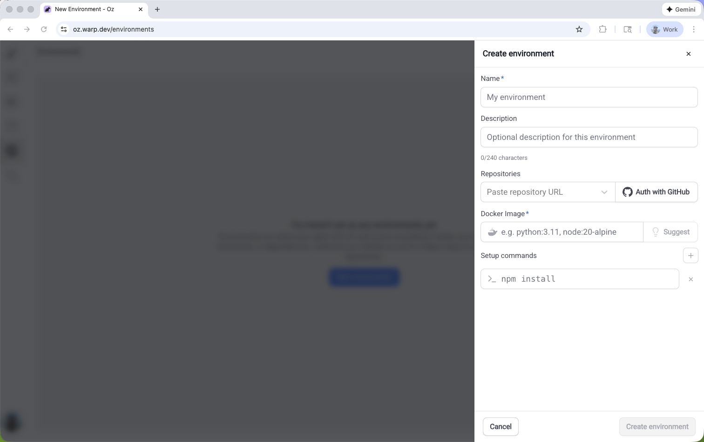

Environments ensure your [cloud agents](/agent-platform/cloud-agents/overview/) run with the same toolchain and setup every time, regardless of where they're triggered from.

An environment defines the execution context for automated agent runs: the **Docker image**, **repositories to clone**, **setup commands**, and **runtime configuration** Warp uses to prepare the workspace before the agent starts.

:::note
You often don't need an environment for interactive local runs where you’re already in a working checkout and relying on your existing machine setup.
:::

## Key features

What environments give you:

* **Consistent behavior across triggers** – A workflow triggered from Slack behaves identically to one run from Linear or the CLI, using the same toolchain and setup steps every time.
* **One configuration, many uses** – Define your Docker image and setup once, then reuse it across triggers and hosts without duplicating configuration.
* **Full visibility into runs** – Inspect the image, repos, and commands used by a run, making it easy to debug failures or reproduce results.

:::note
Don't want to bring your own image? Warp provides [prebuilt dev images](https://github.com/warpdotdev/oz-dev-environments) with common languages and tools pre-installed.
:::

## About environments

Environments define _how_ an agent runs, not _what_ it does. They're required for [Oz Platform](/agent-platform/cloud-agents/platform/) automation (cloud agents, integrations, API runs) but are not required for interactive local usage.

An environment typically includes:

* **Docker image (required)** – The toolchain and runtime the agent runs with. For self-hosted Kubernetes workers, a [`default_image`](/agent-platform/cloud-agents/self-hosting/managed-kubernetes/) on the worker lets you skip creating an environment entirely.
* **Repository/workspace** – One or more repos the agent can clone and operate on.
* **Setup commands** – Commands to prepare the workspace (e.g., dependency install, builds, bootstrapping).

:::note
Configuring runtime settings:

* **Environment variables**: Configure these in your Dockerfile using Docker’s \`ENV\` directives or pass them when running the container.
* **Secrets**: For credentials and sensitive data, use [Agent Secrets](/agent-platform/cloud-agents/secrets/). These are configured separately from environments and injected securely at runtime.
:::

What an environment is not:

* Host – Hosts determine where execution happens (Warp-hosted vs. self-hosted infrastructure).
* [Agent Profile](/agent-platform/capabilities/agent-profiles-permissions/) – Profiles control agent behavior like permissions, model choice, and defaults, not the runtime environment.
* [Rules](/agent-platform/capabilities/rules/) – Rules determine agent responses and decisions but don't define the container or toolchain.
* [MCP Servers](/agent-platform/cloud-agents/mcp/) – connect agents to external tools and data via MCP.
* Per-run context – Trigger-specific data like Slack threads, PR metadata, or CI logs attach to individual tasks, not the environment configuration.

## How environments fit into the Oz Platform

An environment is the runtime layer for automated Oz Platform runs. It defines the container image, repos, and setup steps used when a trigger kicks off an agent task.

Components in the execution flow:

1. **Trigger** – An event starts work (Slack mention, Linear comment, CI event, API call)
2. **Task** – Warp creates a tracked task for the run
3. **Environment** – The task uses an environment to define execution context
4. **Host** – The environment runs on a host (Warp-hosted or self-hosted infrastructure).
5. **Agent execution** – The workflow runs in the prepared environment
6. **Outputs** – The run produces PRs, messages, reports, or transcripts

:::note
**Local agent** runs (using `oz agent run`) don't require an environment. These runs use your current machine's setup. Environments are required for **automated platform** runs like Oz cloud agents and integrations
:::

### Hosts and environments

While environments define _how_ an agent runs, hosts determine _where_ the environment executes.

Host options:

* **Warp-hosted (default)** – Warp provides the infrastructure. Best for most users who want hands-off execution.
* **[Self-hosted](/agent-platform/cloud-agents/self-hosting/)** – You provide the infrastructure (runners in your cloud or network). Best for compliance requirements, on-premise execution, or custom hardware needs.
* Local (coming soon) – Run environments on your local machine for sandbox development and testing.

The same environment can run on different hosts with identical behavior. For more details on hosting options, see [Deployment Patterns](/agent-platform/cloud-agents/deployment-patterns/) and [execution hosts](/agent-platform/cloud-agents/platform/#execution-hosts).

### What happens at runtime

When you trigger an agent, Warp follows this process:

1. **Warp receives the trigger.** Warp captures the message content (Slack thread, Linear issue) and any linked context.
2. **Warp creates an execution environment.** Warp spins up an isolated execution context from the Docker image defined in your environment.
3. **Repositories are cloned.** GitHub repositories associated with the environment are cloned into the container.
4. **Setup commands run.** Configured setup commands execute (installing dependencies, running builds, etc.)
5. **The agent workflow runs.** The agent executes the task using the provided context, tools, and permissions.
6. **Results are posted back.** Progress updates, summaries, and results post to the trigger source (Slack, Linear, etc.), or are available in the task transcript.
7. **The container is destroyed.** After completion, the container is torn down. Each run starts from a clean, isolated environment.

This process ensures every run starts from the same baseline, making results reproducible and debugging straightforward.

---

## When to use environments

Use an environment when your run needs a predictable toolchain and repeatable setup, regardless of where it’s triggered from.

* **Integrations and schedules** – Use an environment when runs start from Slack, Linear, GitHub Actions, schedules, or other integrations, and you need consistent behavior each time.
* **CI and remote automation** – Use an environment when the host isn’t consistent (e.g., different runners, varying base images).
* **Team standardization** – Use an environment when you want everyone’s automation runs to use the same image, repos, and setup steps.
* **Toolchain-specific workflows** – Use an environment when the workflow depends on specific language versions, linters, build tools, or system packages.

**When you can skip an environment**

You often don’t need an environment for interactive local runs where you’re already in a working checkout and relying on your existing machine setup.

**Decision checklist**

Choose an environment if any of the following apply:

* Runs must be consistent across triggers/hosts. The workflow should behave the same regardless of where it is triggered from.
* The toolchain must be fixed. You need a known image and deterministic setup steps to avoid “it works on my machine” drift.
* The workflow is shared across a team. Multiple people, or systems, will run the workflow and expect repeatable results.&#x20;

**Example:**

If your team tags @Oz in Slack to fix a failing CI job, an environment ensures every run uses the same Docker image, clones the same repos, and runs the same setup commands.&#x20;

The fix the agent applies matches what runs in CI and what your teammates see when they review the PR.&#x20;

### Where to configure environments

You can create and configure environments with Warp’s guided setup, or through the CLI. Use the guided flow when you’re first getting started, and use the CLI when you want full control or need to automate environment creation.

**Before you begin**

Make sure you have:

* One or more GitHub repositories that the agent should clone and work in.
* **GitHub authorization configured** so the agent can access your repos. For user-triggered runs, each user authorizes GitHub individually. For automated workflows using team API keys, configure [team GitHub authorization](/agent-platform/cloud-agents/team-access-billing-and-identity/#team-github-authorization) in the Admin Panel.
* A publicly-accessible Docker image that can build and run your code. Official images like [node](https://hub.docker.com/_/node), [python](https://hub.docker.com/_/python), or [rust](https://hub.docker.com/_/rust) work for many projects. You can also use one of [Warp's prebuilt dev images](https://github.com/warpdotdev/oz-dev-environments).

:::caution
Musl-based Docker images (such as Alpine Linux) are not supported. The agent runtime requires glibc. Use glibc-based images like Debian, Ubuntu, or the default (non-Alpine) variants of official Docker Hub images.
:::

:::note
Create one environment per codebase, then reuse it across triggers like Slack, Linear, and CLI runs.
:::



### Create an environment with guided setup (recommended)

Use [`/create-environment`](warp://action/create_environment) when you want Warp to inspect your repos and recommend an environment configuration automatically. This is the fastest way to get started: Warp detects your languages, frameworks, and tools, then suggests appropriate images and setup commands.

You can run the command inside a Git repo directory with no argument, or with one or more repo paths or URLs.&#x20;

```shellscript
# Local file paths
/create-environment ./warp-internal ./warp-server

# owner/repo
/create-environment warpdotdev/warp-internal warpdotdev/warp-server

# GitHub URLs
/create-environment 
https://github.com/warpdotdev/warp-internal.git    
```

Warp will:

* Detect the repositories you want the agent to work with and identify languages, frameworks, and tools
* Look for an existing Dockerfile, recommend an official base image, or help build a custom image (if needed)
* Suggest setup commands based on your scripts and package managers
* Create the environment through the CLI and return an `environment ID`

This produces a ready-to-use environment that can immediately be connected to integrations and cloud agents.

### Create an environment with the CLI

Use the CLI when you already know how you want to configure your environment, you have a custom Docker image you want to use, or when you’re automating environment creation.

```sh
oz environment create \
  --name <name> \
  --docker-image <image> \
  --repo <owner/repo> \
  --repo <owner/repo> \
  --setup-command "<command1>" \
  --setup-command "<command2>" \
  --description "Optional description"
```

Key flags:

* `--name` (`-n`) — human-readable label for the environment.
* `--docker-image` (`-d`) — image name on Docker Hub. If not specified, you'll be prompted to select from available images (see `oz environment image list`).
* `--repo` (`-r`) — repo to clone (repeatable).
* `--setup-command` (`-c`) — commands run in the order provided (repeatable).
* `--description` — optional description (max 240 characters).

---

## Managing environments

Once created, you can use the [Oz CLI](/reference/cli/) to inspect and update environments.

**List environments**

```sh
oz environment list
```

**View an environment’s configuration.** Replace \<ENV\_ID> with the ID of the environment you want to view.

```sh
oz environment get <ENV_ID>
```

**Update an environment**

Add/remove repos, setup commands, and other properties without recreating the environment. Replace \<ENV\_ID> with the ID of the environment you want to modify.

```sh
# Add a repo
oz environment update <ENV_ID> --repo owner/repo

# Remove a repo
oz environment update <ENV_ID> --remove-repo owner/repo

# Add a setup command
oz environment update <ENV_ID> --setup-command "your command"

# Remove a setup command (must match exactly)
oz environment update <ENV_ID> --remove-setup-command "exact command"

# Update the name, description, or Docker image
oz environment update <ENV_ID> --name "new name"
oz environment update <ENV_ID> --description "Updated description"
oz environment update <ENV_ID> --docker-image node:22
```

Additional flags:

* `--remove-description` — clear the description.
* `--force` — skip confirmation checks for environments used by integrations.

**Delete an environment.** Replace \<ENV\_ID> with the ID of the environment you want to delete.

```sh
oz environment delete <ENV_ID>
```

Add `--force` to skip confirmation checks for environments used by integrations.

:::note
For end-to-end setup, see the [Integration setup](/reference/cli/integration-setup/) guide.
:::

---

## Environment design and best practices

A well-designed environment removes guesswork by giving every run the same starting conditions. When an agent opens a PR from Slack or fixes a failed CI job, the result matches what your team can reproduce locally and in CI.&#x20;

**Design guidelines**<br />

* **Keep setup repeatable** – Write setup steps that are safe to rerun and that produce the same toolchain and workspace state for a given repo revision. This keeps agent runs reliable across triggers and hosts.
* **Pin versions in the toolchain** – Prefer a Docker or base image that pins language runtimes and core tools, then use lockfiles (\`package-lock.json\`, etc.) for dependencies.
* **Define a clear workspace boundary** – In multi-repo environments, explicitly state which repos are cloned and where setup commands run so the agent doesn’t “guess” the working directory.
* **Make prerequisites explicit** – If the agent must run a build step, generate code, or install system packages before it can do meaningful work, encode that as setup.

**Example setup commands**

```sh
# Safer patterns (repeatable and stable)
mkdir -p .cache
npm ci

# Less safe patterns (can fail on rerun or drift over time)
mkdir .cache
npm install
```

:::note
If your setup commands depend on secrets or credentials, configure them through Warp's [secrets mechanism](/agent-platform/cloud-agents/secrets/) rather than hardcoding tokens.
:::

### Common issues

* **Setup assumes previous state** – Steps that rely on leftover caches, existing directories, or already-cloned repos can make runs unreliable.
  * Solution: Write idempotent setup commands that work on a fresh container.
* **Missing credentials or secrets** – Builds fail when private repos, package registries, or external services require authorization.
  * Solution: Configure credentials with [Agent Secrets](/agent-platform/cloud-agents/secrets/).
* **Repo access and GitHub authorization issues** – Runs fail when GitHub doesn't have repo access or the triggering user lacks permissions.
  * Solution: See [Integration setup](/reference/cli/integration-setup/#how-github-authorization-works) for GitHub authorization setup.
* **Docker image incompatibility** – You see the error: "VM failed before the agent could run. This is likely an issue with your Docker image."
  * Possible cause: Alpine Linux and other musl-based images are not compatible with the agent runtime, which requires glibc.
  * Solution: Switch to a glibc-based image such as Debian, Ubuntu, or the default (non-Alpine) variants of official Docker Hub images (e.g. `node`, `python`, `rust`).
