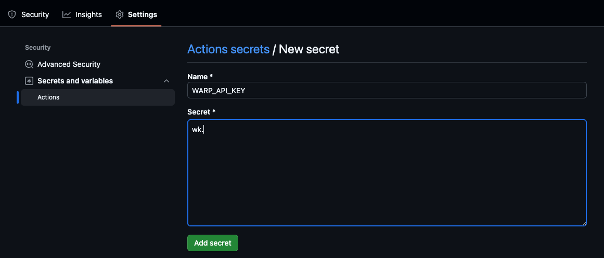

import VideoEmbed from '@components/VideoEmbed.astro';

Warp's GitHub Actions integration lets you run Oz agents directly inside your CI workflows. Using the `oz-agent-action` Github Action, you can delegate tasks such as code review, issue triage, bug fixing, or automated maintenance to the agent as part of a standard Actions pipeline.

The agent runs inside your workflow, uses your repository context, and can open pull requests or comment on issues using your GitHub permissions.

:::note
For more detailed setup instructions, please refer to the [Oz Agent Action](https://github.com/warpdotdev/oz-agent-action) repo.
:::

This page explains what the integration does, how to use it in workflows, and common patterns for automating development tasks with Warp.

<VideoEmbed url="https://www.loom.com/share/534f88b6a98e43ca9769ca09de6424b5" />

In this demo

* Automated PR reviews with both summary feedback and inline suggestions
* One-click batching and committing of agent suggestions directly from the GitHub UI
* Automatically fixing failing CI checks by opening a suggested PR
* Suggesting fixes for small review comments (“nits”) without checking out code locally

---

### What the GitHub Actions integration does

The `oz-agent-action` is a GitHub Action that wraps the Oz CLI and:

* Runs an Oz agent inside an Actions job
* Caches package installation for faster builds
* Captures the agent's output for use in subsequent workflow steps
* Lets you pass workflow context, event data, and previous step outputs into the agent prompt
* Allows the agent to comment on PRs, post results, or open branches via the GitHub CLI
* Supports inline code suggestions that can be batched and committed directly from the GitHub pull request UI
* Enables using pre-built skills or custom skills for specialized tasks

### Requirements

To use Oz agents in GitHub Actions, you need:

* A [**Warp API Key**](/reference/cli/#generating-api-keys) stored as a [GitHub secret](https://docs.github.com/en/actions/concepts/security/secrets)
* A workflow with permissions that match your intended actions (for example, write access to PRs if the agent should commit or comment)
* The `oz-agent-action` step added to your workflow
* **For private repositories using `@oz-agent` mention workflows**: The [`oz-agent`](https://github.com/oz-agent) GitHub user must be [invited as a member](https://docs.github.com/en/organizations/managing-membership-in-your-organization/inviting-users-to-join-your-organization) of your GitHub organization (see [Responding to comments with @ mentions](#1-responding-to-comments-with--mentions) for details)
* Familiarity with GitHub Actions concepts — see the official docs for [GitHub Actions](https://docs.github.com/en/actions)

The agent runs using your GitHub account’s permissions for the workflow run.

### Quick start

_For detailed setup instructions, please refer to the_ [_Oz Agent Action_](https://github.com/warpdotdev/oz-agent-action) _repo._

To run agents from GitHub Actions, **you must store your Warp API Key as a GitHub Actions secret**. This allows your workflow to authenticate with Warp securely.

#### Add your Warp API Key to GitHub Secrets

1. Go to your repository on GitHub.
2. Navigate to: `Settings > Secrets and variables > Actions`.
3. Click **New repository secret**.
4. Set the secret name to `WARP_API_KEY`.
5. Paste your Warp API Key into the **Secret** field.
6. Click **Add secret**.



#### Add the Oz Agent Action to your workflow

Once your `WARP_API_KEY` secret is set, add a step to your workflow:

```yaml
- name: Review code changes in Oz
  uses: warpdotdev/oz-agent-action@v1
  with:
    prompt: |
      Review the code changes on this branch:
      1. Use the `git` command to identify changes from the base branch.
      2. Analyze the diff for style, security, or correctness issues.
      3. If you have suggestions, use the `gh` command to comment on the PR.
    warp_api_key: ${{ secrets.WARP_API_KEY }}
```

The agent will run inside your workflow and return its output to subsequent steps.

#### Working with agent output

The action sets the following output:

```
steps.<step_id>.outputs.agent_output
```

Use `output_format: json` for structured, machine-readable results:

```yaml
with:
  output_format: json
```

This allows downstream steps to branch, format messages, or post results programmatically.

:::note
Because the agent is fully prompt-driven, you can insert it anywhere in a GitHub Actions workflow, pass in files or event context, and control whether the output is human-readable comments or structured JSON for downstream automation.
:::

#### Debugging and session sharing

For debugging workflows, you can enable session sharing so teammates can open a live interactive agent session:

```yaml
with:
  share: true
```

This posts a [cloud agent session sharing link](/agent-platform/cloud-agents/viewing-cloud-agent-runs/) to the job logs. Anyone with the link can inspect the agent's execution directly.

The session sharing option also accepts multi-line configuration for the recipients of the share link.

```
with:
  share:
    | jane@example.com
    | john@example.com
```

### Using Skills

Skills provide reusable instructions for Oz agents. You can use pre-built skills from the [oz-skills repository](https://github.com/warpdotdev/oz-skills) or create custom [skills](/agent-platform/capabilities/skills/) for your specific workflows. Skills can also be deployed as [standalone agents](/agent-platform/capabilities/skills/#skills-as-agents) to run on a schedule or in response to events.

#### How to use skills

You can specify a skill using the `skill` input parameter, either instead of or in combination with prompts:

```yaml
- name: Run agent with a skill
  uses: warpdotdev/oz-agent-action@v1
  with:
    skill: 'code-review'
    warp_api_key: ${{ secrets.WARP_API_KEY }}
```

#### Skill format options

The `skill` parameter supports multiple formats for referencing skills:

* **`skill_name`** - Searches for the skill in your repository's skill directories
* **`repo:skill_name`** - Uses a skill from a specific repository
* **`org/repo:skill_name`** - Uses a skill from a specific organization's repository

#### Combining skills with prompts

You can combine skills with prompts to provide specialized context while customizing the specific task:

```yaml
with:
  skill: 'code-review'
  prompt: 'Focus on security vulnerabilities in authentication code'
  warp_api_key: ${{ secrets.WARP_API_KEY }}
```

In this example, the `code-review` skill provides the base context and approach for code review, while the prompt narrows the focus to security concerns in authentication code.

:::note
Skills help maintain consistency across your workflows and can encapsulate best practices for common tasks like code review, issue triage, or automated testing.
:::

---

## Common use cases

The `oz-agent-action` supports several automation patterns commonly used in CI.

### 1. Responding to comments with @ mentions

* **File**: [`examples/respond-to-comment.yml`](https://github.com/warpdotdev/oz-agent-action/blob/main/examples/respond-to-comment.yml)
* **Use case**: Add "@oz-agent fix this typo" or similar comments to a PR or Issue.

What it does:

* Listens for comments containing a trigger phrase
* Sends the comment and thread context into the agent
* Agent replies directly to the comment
* If code changes are requested, the agent commits fixes to the PR branch

**When to use:**

* Interactive coding assistance during review or issue triage.

:::note
**Private repositories require org membership for `@oz-agent`**

If your repository is in a **private GitHub organization**, you must [invite the `oz-agent` user](https://docs.github.com/en/organizations/managing-membership-in-your-organization/inviting-users-to-join-your-organization) as a member of your organization before using `@oz-agent` mention workflows. Without this:

* `@oz-agent` will not appear in GitHub's autocomplete when writing comments.
* Comments containing `@oz-agent` will not trigger the workflow, because GitHub does not recognize the mention.

This is a GitHub platform limitation for private organizations — any user must be an org member to be mentioned in comments on private repos.

Public repositories are not affected by this requirement.
:::

### 2. Automated pull request review

* **File**: [`examples/review-pr.yml`](https://github.com/warpdotdev/oz-agent-action/blob/main/examples/review-pr.yml)
* **Use case**: Provide automated agent feedback when a PR is opened or marked ready for review.

What it does:

* Automatically runs when PRs open or switch to “ready for review”
* Agent inspects changed files, analyzes the diff, and comments inline
* Optionally posts a summary comment

**When to use:**

* Fast initial review before human reviewers step in.

### 3. Automatically fix issues

* **File**: [`examples/auto-fix-issue.yml`](https://github.com/warpdotdev/oz-agent-action/blob/main/examples/auto-fix-issue.yml)
* **Use case**: Apply the `oz-agent` label on an Issue to trigger automated fixes.

What it does:

* Detects when the label is added
* Agent analyzes the issue description and repo context
* Creates a PR with a fix (fix/issue-NUMBER)
* Or comments explaining why automation wasn’t possible

**When to use:**

* Automating bug fixes, small features, or maintenance tasks.

### 4. Daily issue summaries

* **File**: [`examples/daily-issue-summary.yml`](https://github.com/warpdotdev/oz-agent-action/blob/main/examples/daily-issue-summary.yml)
* **Use case**: Scheduled summaries of newly opened issues.

What it does:

* Runs daily at 09:00 UTC
* Fetches issues created in the past 24 hours
* Generates a categorized summary
* Sends the summary to Slack via webhook

**When to use:**

* Daily visibility into new work across your repositories.

### 5. Fixing failing CI checks

* **File**: [`examples/fix-failing-checks.yml`](https://github.com/warpdotdev/oz-agent-action/blob/main/examples/fix-failing-checks.yml)
* **Use case**: Automatically attempt fixes when a workflow or test suite fails.

What it does:

* Triggers when specified CI workflows fail
* Pulls failure logs
* Attempts to diagnose and fix the root cause
* Opens a PR with the fix and comments with a link

**When to use:**

* Reducing downtime from failing builds or flaky tests.

### 6. Suggest fixes for review comments

* **File**: [`examples/suggest-review-fixes.yml`](https://github.com/warpdotdev/oz-agent-action/blob/main/examples/suggest-review-fixes.yml)
* **Use case**: Automatically propose code suggestions for small, actionable review comments such as typos, naming tweaks, and minor refactors.

**What it does:**

* Triggers when a pull request review is submitted
* Fetches review comments and stores them in review\_comments.json
* Sends comments and context to an agent to decide which ones are simple, actionable fixes
* Generates `responses.json` with explanations and suggestion blocks for each fixable comment
* Replies inline to the original review comments with the generated suggestions

**When to use:**

* Quickly addressing straightforward review feedback such as typos, naming tweaks, style nits, and small refactors.

---

## Troubleshooting

### `@oz-agent` mention doesn't trigger the workflow

If you're tagging `@oz-agent` in a PR or issue comment and the workflow doesn't run:

1. **Check org membership (private repos only)**: In private organizations, the `oz-agent` GitHub user must be a [member of your organization](https://docs.github.com/en/organizations/managing-membership-in-your-organization/inviting-users-to-join-your-organization). Without this, GitHub won't recognize the mention and the `issue_comment` event won't match the workflow trigger. Ask an org admin to invite [`oz-agent`](https://github.com/oz-agent) via **Settings > People > Invite member**.
2. **Verify the workflow file**: Ensure your workflow is on the default branch and the trigger condition matches `@oz-agent` (e.g. `contains(github.event.comment.body, '@oz-agent')`).
3. **Check workflow permissions**: The workflow must have the appropriate permissions (e.g. `issues: read`, `pull-requests: write`) to respond.

### `@oz-agent` doesn't appear in GitHub autocomplete

GitHub only suggests users who are members of the organization when typing `@` in comments on private repositories. [Invite `oz-agent`](https://docs.github.com/en/organizations/managing-membership-in-your-organization/inviting-users-to-join-your-organization) to your organization to make it appear in autocomplete.

Note: Even if `@oz-agent` doesn't autocomplete, you can still type the mention manually — but the workflow will only trigger if the user is an org member (for private repos).
