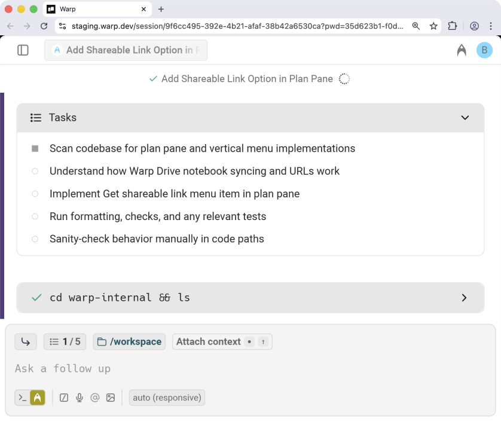

import VideoEmbed from '@components/VideoEmbed.astro';

The Linear integration lets your team delegate development work directly to agents from inside Linear. When you tag @Oz on an issue or comment, an agent will spin up in the cloud, clone the repos defined in your environment, and begin working through the task.

Agents keep you updated inside Linear, generate pull requests using your GitHub account, and provide a link to join a live remote session so you can watch or steer the workflow in real time.

<VideoEmbed url="https://youtu.be/FNefNmbSdmg?si=PxvDuW6OfNZBvhSl" />

This guide explains what the integration does, how it works end-to-end, and how to configure it for your Warp team.

---

### Using Oz inside Linear

Tagging @Oz on an issue or in a Linear comment starts an agent run. Oz clones the repositories defined in your environment, sets up your development environment using your Docker image and setup commands, and begins working through the task with full context from your codebase and the Linear issue. Agents post updates as they progress, including a task list, elapsed time, and checkpoints, so you can follow along without leaving Linear.

Agents also share a link to an interactive remote session using Warp's [cloud agent session sharing](/agent-platform/cloud-agents/viewing-cloud-agent-runs/). Opening this link lets you view the live terminal output for the running agent in Warp or in the browser. From there, you can interrupt or guide the agent with additional instructions when needed. Once the agent finishes, it will create a pull request on your behalf — using your GitHub permissions — and post a summary of its work and the PR link back into Linear.

You can start an agent in two ways:

* **Tag @Oz in a comment** and describe what you want done.
* **Assign the issue to Oz** as if it were a teammate.

Oz will acknowledge the request directly in the Linear issue and begin working.

Agents keep you informed through:

* **Activity updates** inside Linear
* A **running task list** and timeline showing what the agent is working on
* A **shared session link** that opens a live view of the agent’s cloud environment

Session sharing works in Warp or in a browser view and allows multiple teammates to watch the session.



#### Joining the remote session

Selecting [**Open in Warp**](/agent-platform/cloud-agents/viewing-cloud-agent-runs/) (or the web option) opens the active session. You'll see:

* The agent’s full execution log
* The plan pane with the task list
* An input box to add clarifying instructions
* A real-time view identical to a local Warp task

Any instructions you give will interrupt the agent, feed the new context, and resume work.

When the task is complete:

* Warp commits the changes using your GitHub identity
* A pull request is created through the GitHub CLI
* The PR includes a clean title and description based on the Linear issue and the agent’s work
* A summary and link to the PR appear in the Linear issue

Because PRs are created as _you_, this makes code review, auditing, and team collaboration straightforward.

---

### Requirements

* **Team membership** - The Linear integration requires you to be part of a [Warp team](/knowledge-and-collaboration/teams/). Teams can be created on any plan, including Free.
* **Plan and credits** - Your team must be on a plan that supports integrations (Build, Max, or Business) and have at least 20 credits available (any type of Warp credits work). See [Access, Billing, and Identity](/agent-platform/cloud-agents/team-access-billing-and-identity/) for details.
* **Infrastructure** - By default, agents run on Warp-hosted infrastructure. Enterprise teams can [self-host agents](/agent-platform/cloud-agents/self-hosting/) on their own infrastructure.
* **Identity** - You must be logged into Warp with the same email as your Linear workspace.
* **GitHub authorization** - You must authorize the Warp GitHub app the first time you trigger an agent.
  * The repositories involved must be included in your environment and accessible to the Warp GitHub app.
  * You must have write access to the repo if you want Warp to create PRs on your behalf.

---

### How to configure the integration

Setup involves two steps powered by the [Oz CLI](/reference/cli/). For more instructions, see [Integrations Overview](/agent-platform/cloud-agents/integrations/).

#### 1. Create an environment

An environment defines everything the agent needs to run your code:

* A **Docker image** (public on Docker Hub)
* A set of **GitHub repos** the agent should clone
* Optional **setup commands** that run before the agent starts

You can create an environment via:

* The CLI
* The guided flow using `/create-environment` ([Slash Commands](/agent-platform/capabilities/slash-commands/))

For full instructions, see our [Environment Setup](/agent-platform/cloud-agents/integrations/) docs.

#### 2. Create the Linear integration

Once your environment exists, create the integration.

:::note
For easier setup, use the [Oz web app](https://oz.warp.dev) to configure integrations with a guided flow.
:::

Alternatively, you can use the CLI:

```
oz integration create linear --environment <ENV_ID>
```

The CLI will open a browser window prompting you to install the Oz app into your Linear workspace. After installation, the integration becomes available to all members of your Warp team.

---

### Uninstallation instructions

To remove the Oz integration from Linear:

1. Only a Linear team admin can manage app permissions.
2. In Linear, go to **Settings**.
3. Navigate to Agents under the Features section.
4. Select Oz from the list of installed agents.
5. Click **Revoke access** to remove the integration for your workspace.

<VideoEmbed url="https://www.loom.com/share/2f1648586d8148dc80561c00a09ca334" />

After revoking access, Warp will no longer be able to read issues, receive triggers, or create updates in Linear. If you reinstall later, you’ll need to authorize Warp again during setup.

### Troubleshooting

If something isn't working as expected—missing repos, PR failures, Linear not detecting Oz, or environment issues—see our [Integrations Troubleshooting](/agent-platform/cloud-agents/integrations/#troubleshooting) page for detailed guidance on GitHub permissions, environment configuration, and common setup problems.
