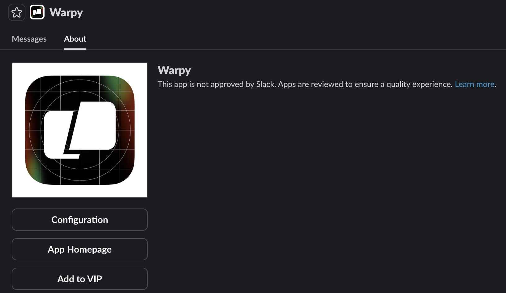
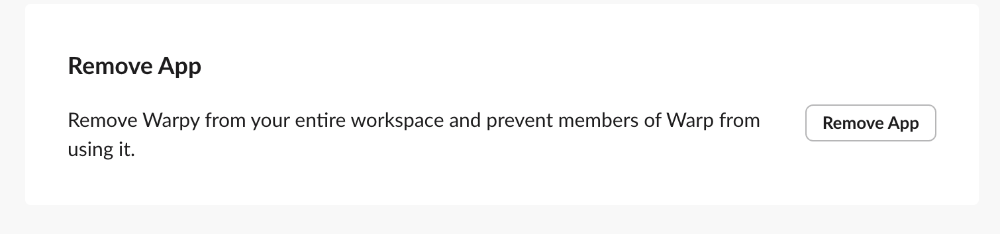

### Overview

The Slack integration lets your team trigger agents directly from conversations in Slack. When you tag **@Oz** in a message or DM the bot, Warp will start an agent in the cloud, clone the repositories defined in your environment, and begin working through the task with full context from your codebase and the Slack thread.

Agents keep you updated as they work, generate pull requests using your GitHub account, and share a link to a live remote session so you can watch or guide the workflow in real time.

This page explains what the integration does, how it behaves inside Slack, and how to configure it for your Warp team.

---

### Using Oz inside Slack

Tagging @Oz in a message or thread starts an agent run. The agent clones the repositories in your environment, sets up your development environment using your Docker image and setup commands, and begins working with the context from the Slack conversation. Oz posts updates back into the thread as it progresses so you can follow along without opening your terminal.

Agents also share a link to an interactive remote session using Warp's [cloud agent session sharing](/agent-platform/cloud-agents/viewing-cloud-agent-runs/). Opening this link gives you a live terminal view of the cloud agent running your code. You can interrupt or steer the agent by providing additional instructions, and the agent will pick up where it left off with the new context.

When the work is complete, Warp will create a pull request on your behalf using your GitHub permissions and send a summary and PR link back to the original Slack thread.

### Triggering an agent

You can start an agent in three ways:

*   **Tag @Oz in a channel message**

    Describe the task, and Oz will begin working with full context from the thread.
*   **Tag @Oz inside a thread**

    Oz will automatically collect the thread's prior messages and use them as context.
*   **DM Oz directly**

    Useful for private tasks or experimentation.

Oz will acknowledge the request in Slack and start running the task immediately.

### Monitoring agent progress

Agents keep you informed directly in Slack via:

* Activity updates showing progress throughout the run
* An evolving task list and timeline
* Checkpoints indicating major steps completed
* A direct link to the Oz run in the [Oz web app](/agent-platform/cloud-agents/oz-web-app/), where you can view the full run transcript and metadata
* A session-sharing link that opens a live terminal view of the remote agent

[Cloud agent session sharing](/agent-platform/cloud-agents/viewing-cloud-agent-runs/) works in Warp or in your browser and supports multiple teammates joining the same live session.

### Joining the live remote session

Selecting `View agent` opens the active agent session. Inside the session you’ll see:

* The agent’s full execution log
* The plan/task list
* Real-time output just like a local Warp task
* An input box for follow-up instructions

Any instruction you type will interrupt the agent, incorporate the new guidance, and then resume execution. This is the best way to debug or steer multi-step tasks.

### Pull requests and output

Once the agent finishes, it will:

* Commit changes using your GitHub account
* Create a pull request via the GitHub CLI
* Generate a clean title and description referencing your Slack request
* Post the summary and PR link directly into the Slack thread

Because PRs are created as you, the workflow slots seamlessly into your team’s existing review process.

---

### Requirements

* **Team membership** - The Slack integration requires you to be part of a [Warp team](/knowledge-and-collaboration/teams/). Teams can be created on any plan, including Free.
* **Plan and credits** - Your team must be on a plan that supports integrations (Build, Max, or Business) and have at least 20 credits available (any type of Warp credits work). See [Access, Billing, and Identity](/agent-platform/cloud-agents/team-access-billing-and-identity/) for details.
* **Infrastructure** - By default, agents run on Warp-hosted infrastructure. Enterprise teams can [self-host agents](/agent-platform/cloud-agents/self-hosting/) on their own infrastructure.
* **Identity** - You must be logged into Warp with the same email used in your Slack workspace.
* **GitHub authorization** - You must authorize the **Warp GitHub app** the first time you trigger a Slack integration request.
  * The repositories involved must be included in your environment and accessible to the Warp GitHub app.
  * You must have write access for Warp to open PRs on your behalf.

### How to configure the Slack integration

Setup involves two steps, powered by the [Oz CLI](/reference/cli/).

#### 1. Create an environment

An environment defines everything the agent needs to run your code in the cloud:

* A Docker image (public on Docker Hub)
* The GitHub repos the agent should clone
* Optional setup commands that run before the agent starts

Create an environment via:

* **Oz CLI**

```bash
oz environment create \
  --name <name> \
  --docker-image <image> \
  --repo <owner/repo> \
  --setup-command "<command>"
```

*   **Guided setup using `/create-environment`** ( [Slash Commands](/agent-platform/capabilities/slash-commands/))

    This flow analyzes your repos, recommends a Docker image, suggests setup commands, and can build + push a custom image if needed.

See the [Environment Setup](/agent-platform/cloud-agents/integrations/) docs for detailed instructions.

#### 2. Create the Slack integration

Once your environment is ready, create the integration.

:::note
For easier setup, use the [Oz web app](https://oz.warp.dev) to configure integrations with a guided flow.
:::

Alternatively, use the CLI:

```
oz integration create slack --environment <ENV_ID>
```

The CLI will open a browser window to install the Oz app into your Slack workspace. After installation, the integration becomes available to all members of your Warp team.

You can optionally attach a custom prompt that is applied to every agent run:

```
oz integration create slack \
  --environment <ENV_ID> \
  --prompt "Always prefix PR titles with '[WARP]' and include detailed test steps."
```

### Identity mapping and team access

* Integrations are scoped to your Warp team.
* Any teammate in the same Slack workspace and Warp team can use the integration.
* Warp maps Slack users to Warp accounts by email address.
* Teammates must individually authorize GitHub on their first run.

---

### Uninstallation instructions

To remove the Oz app from your Slack workspace:

1. Open Slack and go to **Apps** in the left sidebar.
2. Search for Oz.
3. Select the app, then open the **About** tab.
4. Click **Configuration**. This will open your workspace’s app configuration page in the browser.
5. Scroll to the bottom and select **Remove App**.
6. Confirm the removal.





Once removed, Slack will immediately disable the integration for all teammates.

### Troubleshooting

If something isn't working—missing repos, Slack not detecting @Oz, PR failures, or environment configuration issues—see the [Integrations Troubleshooting](/agent-platform/cloud-agents/integrations/#troubleshooting) page. It covers:

* GitHub authorization and repo access
* Docker image pull errors
* Environment visibility
* Email and identity mismatches
* Integration installation issues
