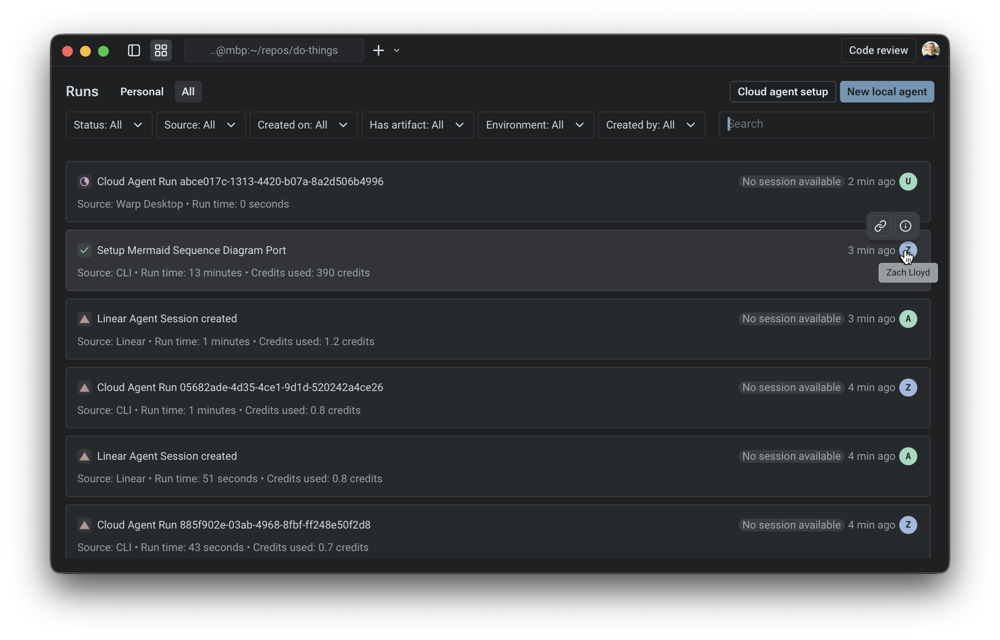

import VideoEmbed from '@components/VideoEmbed.astro';

Warp provides a centralized management view where you can monitor agent activity across your account and (where applicable) your team. You can access this view in the Warp app or through the [Oz web app](/agent-platform/cloud-agents/oz-web-app/) at [oz.warp.dev](https://oz.warp.dev), which works on mobile devices.

The management view is designed to answer, at a glance:

* Which agents have been running recently (and what's running right now)
* Which runs succeeded, failed, or were canceled
* Where an agent run was triggered from (a local agent conversation, the Oz CLI, Slack, etc.)
* How many credits those runs consumed

<VideoEmbed url="https://www.loom.com/share/679c267ddd2d44519abf79edcb1122c7" />

This management view includes your **local (interactive) agents** and [cloud agent](/agent-platform/cloud-agents/overview/) runs.

### What appears in the management view

The management view includes two categories of agent activity.

#### Interactive agents

* Initiated from the Warp desktop app.
* The conversation is owned by you. It opens locally in Warp, and can be shared via a link when needed.
* Credit usage reflects inference.

#### Cloud agent runs

* Background executions initiated by triggers such as integrations and automations (for example: Slack, Linear, schedules, GitHub Actions, or API/CLI invocations).
* Each run produces a shared session that can be inspected after completion (including logs, messages, and outputs).
* Credit usage reflects inference + compute, shown as a single combined value in this view.

:::caution
All usage rolls up into Warp's standard [**credit**](/support-and-community/plans-and-billing/credits/) system.
:::

In the **Personal** tab, you can view all of the interactive and cloud agent conversations that you own. In the **All** tab, you can see everything from the personal tab, as well as any cloud agent sessions that are shared with you by your teammates; right now, this only includes things triggered from integrations.

---

### The agents list

Each row represents a single item in the management view (either an interactive conversation or a cloud agent run). The list is intended to be scannable: you should be able to understand “what happened” without opening anything.

#### Fields you’ll see

**Source**

Where the agent was launched from. Common sources include:

* **Interactive:** an [agent conversation](/agent-platform/local-agents/overview/) started in the Warp app
* **CLI**: a local run triggered by the [Oz CLI](/reference/cli/)
* **API**: a run triggered by [Warp's API](/reference/api-and-sdk/)
* **Slack / Linear**: runs triggered by [integrations](/agent-platform/cloud-agents/integrations/)
* **Scheduled**: runs triggered on a [cron schedule](/agent-platform/cloud-agents/triggers/scheduled-agents/)

**Status**

Warp uses a small set of statuses to help you quickly identify what needs attention:

<table><thead><tr><th width="173.375">Status</th><th width="78.41973876953125">Icon</th><th>Description</th></tr></thead><tbody><tr><td><code>Working</code></td><td>N/A</td><td>in progress (may include queued / running states)</td></tr><tr><td><code>Blocked</code></td><td>🟨</td><td>
<em>(interactive only)</em>

 the conversation is waiting on user input or a required step
</td></tr><tr><td><code>Canceled</code></td><td>⬜️</td><td>(interactive only)  the interactive conversation was canceled before completion</td></tr><tr><td><code>Failed / Errored</code></td><td>🔺</td><td>something went wrong (applies to both interactive and cloud agent runs)</td></tr><tr><td><code>Success</code></td><td>✅</td><td>completed successfully (applies to both interactive and cloud agent runs)</td></tr></tbody></table>

**Duration (for cloud agent tasks)**

* Shown for cloud agent runs to indicate how long the task executed.
* Note: Interactive conversations generally don’t map cleanly to a single “run duration,” so this is currently omitted.

---

### Inspecting an agent

**The primary interaction is simple:**

* Clicking a cloud agent row opens the [shared session](/agent-platform/cloud-agents/viewing-cloud-agent-runs/) for that run (logs/messages/output).
* Clicking an interactive row opens the conversation locally in the Warp app.

This makes the management view a navigation surface: find the thing you care about, click once, and you’re in the right context to inspect or continue work.

### Filtering

In both _Personal_ and _All_ views, you can open the filter menu and filter by:

* Source (interactive, API, CLI, Slack/Linear, scheduled)
* Day of creation
* Creator
* Status

This is the fastest way to isolate "everything that failed today," "runs from Slack," or "what a specific teammate triggered via integrations."
