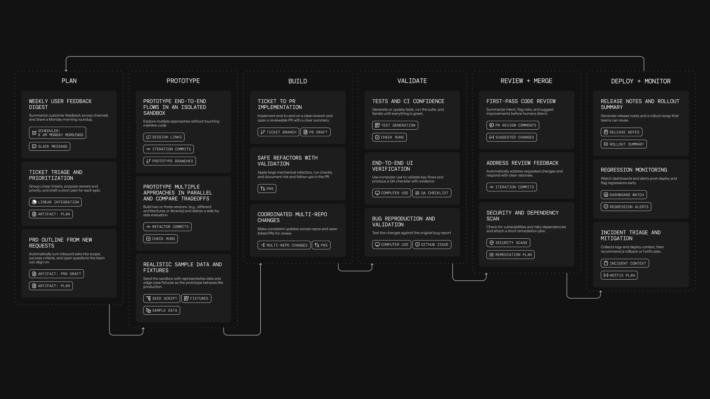

import VideoEmbed from '@components/VideoEmbed.astro';

Oz Cloud Agents are **cloud-connected**, **background agents** that run on the [Oz Platform](/agent-platform/cloud-agents/platform/).

**New to cloud agents?** Start with the [Cloud Agents Quick Start](/agent-platform/cloud-agents/quickstart/) to run your first cloud agent in ~10 minutes.

<VideoEmbed url="https://youtu.be/poLkJhO7fdo" />

### What cloud agents are designed for

Cloud agents are designed for situations where:

* **You need agents to react to system events.**
  * Examples include crashes, bug reports, Slack interactions, cron timers, or CI steps.
* **You want observability into agent activity across a team or system.**
  * This includes being able to see what ran, when it ran, and what it did.
* **You need more parallelism than local execution typically allows.**
  * For example, running many agent tasks concurrently in the cloud, sharding a repo-wide task into multiple runs, or fanning out the same task across multiple targets.
* **You want agents to operate continuously as part of engineering infrastructure.**
  * This includes scheduled maintenance tasks and integration-driven automation.

---

### What is a cloud agent run?

A cloud agent run is represented as an agent task. A task is created when a trigger fires (for example a webhook event or schedule) or when a user starts a run explicitly.

Each task includes:

* **Inputs**: a prompt, and often additional context from the triggering system (for example a Slack message, PR metadata, or CI logs).
* **Execution context (optional)**: an [Environment](/agent-platform/cloud-agents/environments/) that defines the repo, image, and startup commands the agent should run with.
* **Lifecycle state**: created → running → completed / failed.
* **Persistent record**: status, metadata, and a session transcript that can be reviewed after the task completes.

:::note
If you are evaluating whether something should be a cloud agent, a good test is whether you can define:\
(1) what triggers it, (2) what context it needs, and (3) how the team will inspect or validate the output.
:::

### How cloud agents work

Cloud agents run on the [Oz Platform](/agent-platform/cloud-agents/platform/), which provides the primitives for triggering work, orchestrating tasks, executing agents (optionally in environments), injecting secrets, and inspecting results.

* Something **triggers** an agent task.
* The **orchestrator creates** and tracks the task.
* The agent **executes** on a host, optionally inside an [environment](/agent-platform/cloud-agents/environments/), with whatever [secrets](/agent-platform/cloud-agents/secrets/) and credentials it needs.

The exact way tasks are triggered and executed depends on your deployment model (for example CLI-only, Warp-hosted orchestration, or self-hosted execution). Those options are covered in the [Deployment Patterns](/agent-platform/cloud-agents/deployment-patterns/) pages.

For teams that need execution to stay within their network boundary, self-hosting supports two architectures: a **managed** worker daemon that lets Oz orchestrate agents in Docker containers on your machines, and an **unmanaged** mode where you run `oz agent run` directly in your CI, Kubernetes, or dev environment. See [Self-Hosting](/agent-platform/cloud-agents/self-hosting/) for details.

### What you get by default

Because cloud agents run on the [Oz Platform](/agent-platform/cloud-agents/platform/), each run is tracked and produces a persistent record that can be observed, shared, and audited (even if execution happens outside the Warp app).

#### Codebase Context

Cloud agent runs automatically benefit from [Codebase Context](/agent-platform/capabilities/codebase-context/) for semantic code understanding and search, as long as Codebase Context is enabled for your account. See [Codebase Context in cloud agent runs](/agent-platform/capabilities/codebase-context/#codebase-context-in-cloud-agent-runs) for details.

#### Observability and steerability

Cloud agent tasks are designed to be inspectable by the team:

* [Agent Session Sharing](/agent-platform/local-agents/session-sharing/) lets authorized teammates attach to a running task to monitor progress and, where supported, steer the agent while it runs.
* Each run produces a session transcript and task metadata, which provides a record of what the agent did.
* A [management experience](/agent-platform/cloud-agents/managing-cloud-agents/) surfaces task status and history.

#### Centralized configuration

Cloud agent workflows often rely on shared configuration such as [MCP servers](/agent-platform/cloud-agents/mcp/), rules, saved prompts, environment variables, and [secrets](/agent-platform/cloud-agents/secrets/).

Warp supports centralized configuration so the same workflow behaves consistently across triggers (for example Slack + CI + schedules), without duplicating setup in every system.

For details on configuring MCP servers for cloud agents, see [MCP Servers](/agent-platform/cloud-agents/mcp/).

#### API access to tasks

The Oz Platform exposes task visibility via the [**Oz API and SDKs**](/reference/api-and-sdk/), so teams can:

* Query which tasks are running or have run.
* Fetch task metadata and outcomes.
* Build internal dashboards or monitoring (for example success rates, runtime, failure reasons).

### Using cloud agents with or without the Warp app

Cloud agents do not require the Warp desktop app. Teams can deploy and operate them through the [Oz Platform](/agent-platform/cloud-agents/platform/) using:

* [Oz CLI](/reference/cli/) — run agents from scripts, CI, or the terminal
* [Oz web app](/agent-platform/cloud-agents/oz-web-app/) — visual interface for managing runs, schedules, environments, and integrations (works on mobile)
* [Agent Session Sharing](/agent-platform/local-agents/session-sharing/) — attach to running tasks to monitor or steer
* [Agent Management UX](/agent-platform/cloud-agents/managing-cloud-agents/) — view agent activity and run history
* [APIs and SDKs](/reference/api-and-sdk/) — programmatic access for custom integrations

If your team also uses Warp's terminal, you get an additional workflow: tasks launched via the CLI can be handed off into an interactive session for review, edits, or continuation.

---

### Billing and plan requirements

Cloud agents and [integrations](/agent-platform/cloud-agents/integrations/) run on the [Oz Platform](/agent-platform/cloud-agents/platform/) control plane, and usage is billed using credits.

:::note
[Bring Your Own Key (BYOK)](/support-and-community/plans-and-billing/bring-your-own-api-key/) is not supported for cloud agent runs. BYOK keys are stored locally on your device and are not accessible to cloud-hosted agents. All cloud agent runs consume Warp credits.
:::

#### For Cloud Agents via CLI/API

Individual users can run cloud agents without being on a team. Requirements:

* You need at least 20 credits (any type: normal Warp credits, [Cloud Agent Credits](/support-and-community/plans-and-billing/credits/#cloud-agent-credits), or Build plan credits)
* Cloud agents run on Warp-hosted infrastructure
* Self-hosted agents require a team subscription

#### For Integrations (Slack/Linear)

Integrations require you to be part of a [Warp team](/knowledge-and-collaboration/teams/) and additional requirements:

* **Plan requirements**
  * **Supported plans**: Build, Max, Business
  * Not supported: Pro, Turbo, Lightspeed, legacy Business
  * Your plan must support Add-on Credits.
* **Credit requirements**
  * Your team must have at least 20 credits available (any type of Warp credits work) to run cloud agents and integrations.
  * Usage is billed based on credit type and team configuration.
  * Normal credits, [Cloud Agent Credits](/support-and-community/plans-and-billing/credits/#cloud-agent-credits), and [Add-on Credits](/support-and-community/plans-and-billing/add-on-credits/) all work.

For more details, see [Access, Billing, and Identity Permissions](/agent-platform/cloud-agents/team-access-billing-and-identity/).

:::caution
If your credit balance reaches zero, cloud agent runs will not be able to execute until credits are replenished.
:::

---

### Learn more

* [Cloud Agents Quick Start](/agent-platform/cloud-agents/quickstart/) — run your first cloud agent with an environment in ~10 minutes.
* [Oz Platform](/agent-platform/cloud-agents/platform/) — CLI, Oz API/SDK, orchestration, tasks, environments, hosts, integrations, and more.
* [Skills as Agents](/agent-platform/cloud-agents/skills-as-agents/) — run agents based on reusable skill definitions from the CLI, web app, API, or on a schedule.
* [Oz CLI](/reference/cli/) — shows how to run Oz agents in non-interactive mode from CI, scripts, or remote machines, including auth and common commands.
* [Environments](/agent-platform/cloud-agents/environments/) — explains how environments provide the runtime context (repo, image, startup commands) for agent tasks.
* [Oz API and SDK](/reference/api-and-sdk/) — documents the REST API for creating, querying, and monitoring agent tasks programmatically.
* [Agent Secrets](/agent-platform/cloud-agents/secrets/) — covers how to store, scope, and inject credentials into agent runs safely.
* [MCP Servers](/agent-platform/cloud-agents/mcp/) — how to configure MCP servers for agent tool access and how MCP configuration is applied across runs.
* [Deployment Patterns](/agent-platform/cloud-agents/deployment-patterns/) (beta) — compares common ways to deploy cloud agents and when to use each.
* [Access, Billing, and Identity Permissions](/agent-platform/cloud-agents/team-access-billing-and-identity/) — explains individual and team-level requirements, credit billing behavior, and the permission model for who can run, view, and steer cloud agent tasks.
