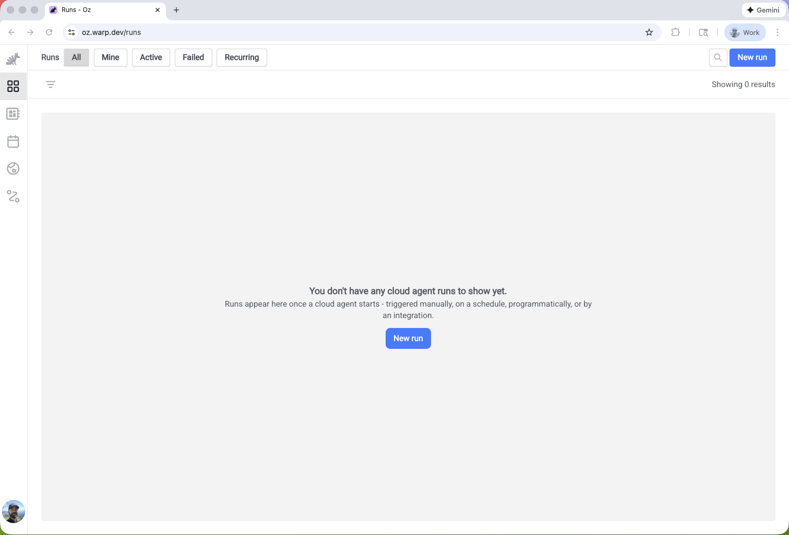
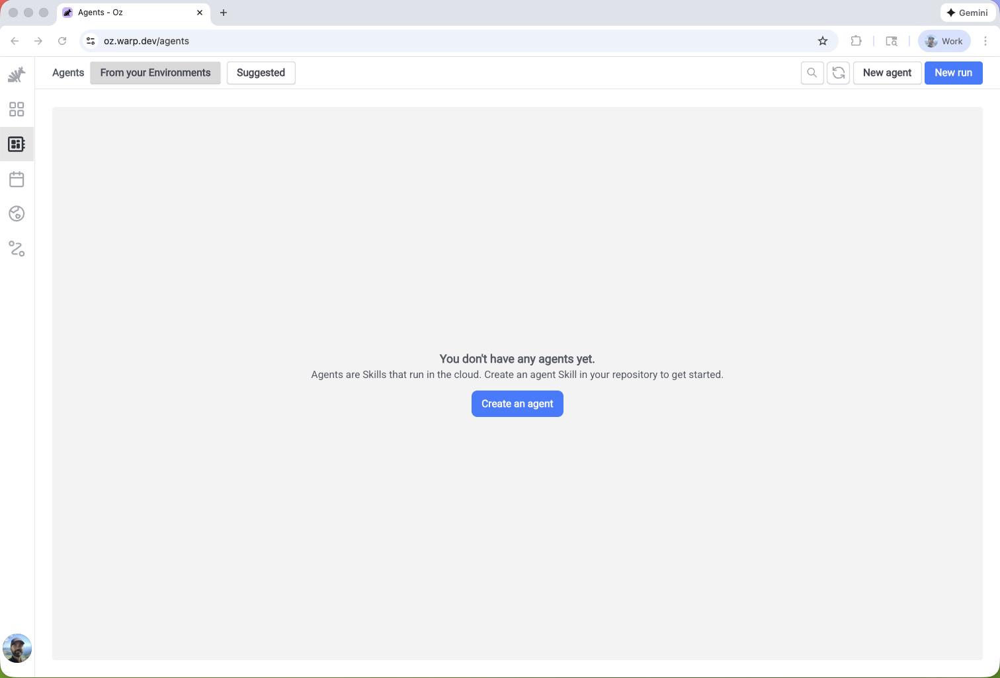
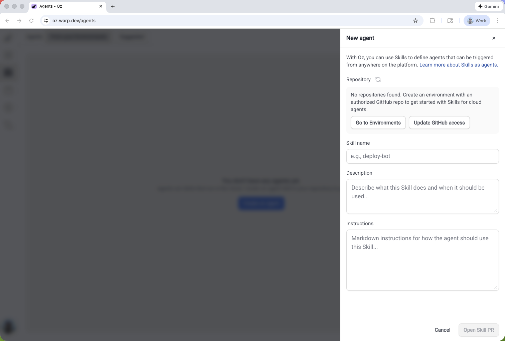
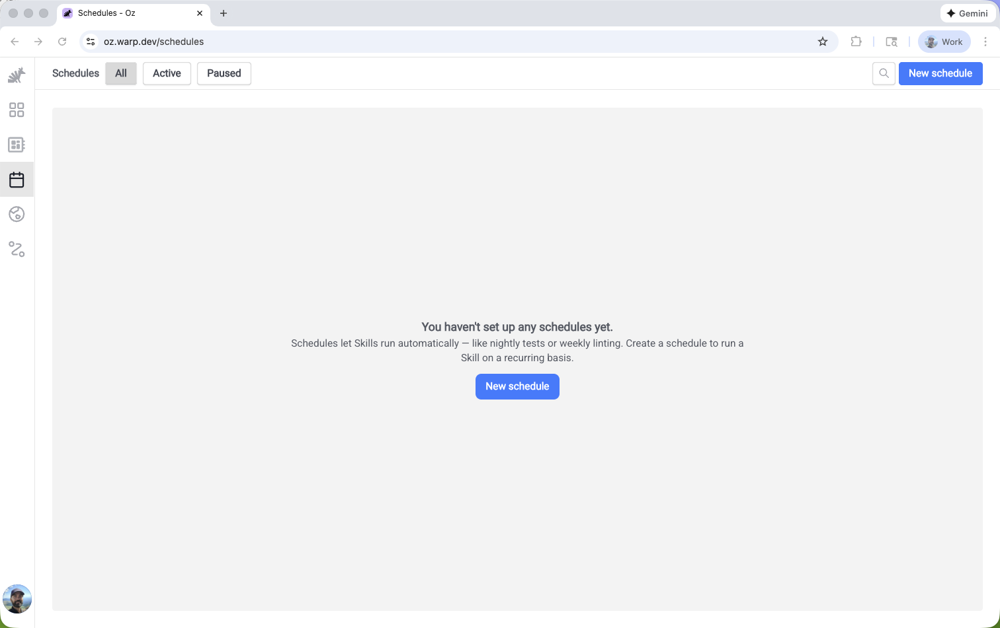
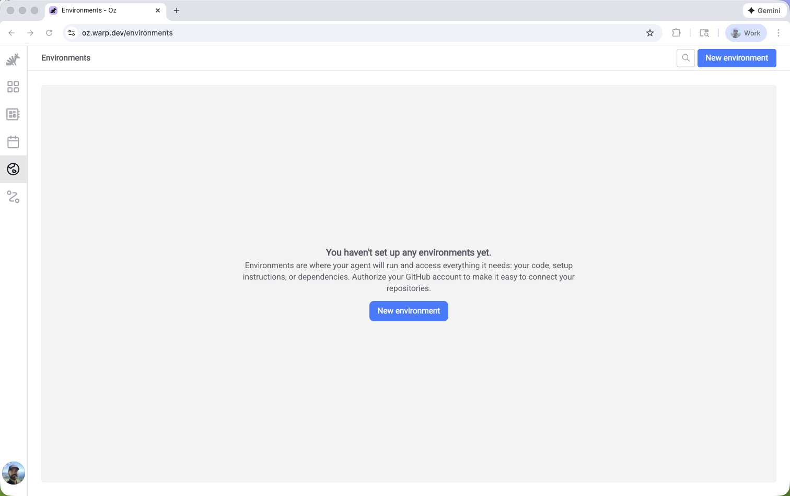
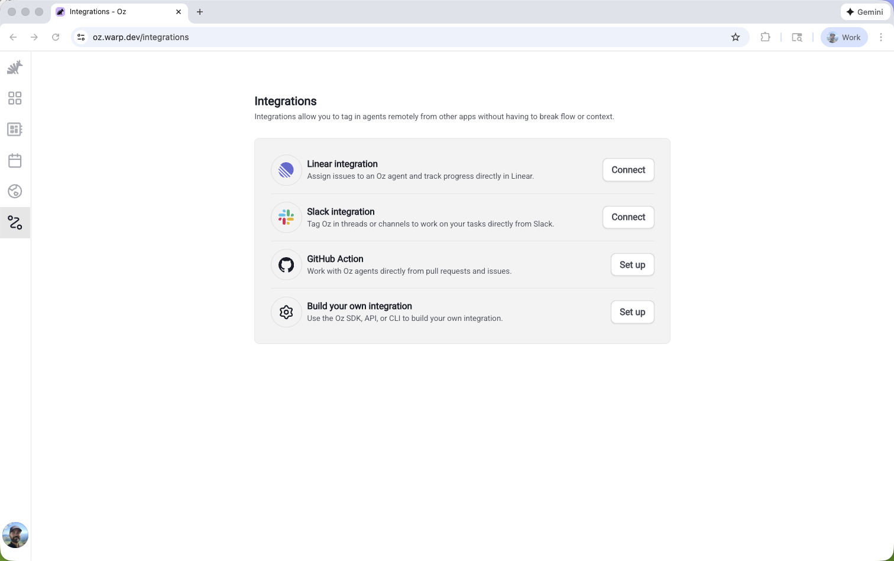

import VideoEmbed from '@components/VideoEmbed.astro';

The [Oz web app](https://oz.warp.dev) provides a visual interface for managing cloud agents. You can start runs, browse agents, create schedules, configure environments, and set up integrations—all without installing Warp or using the CLI.

:::note
The Oz web app works on mobile devices, so you can monitor and manage your cloud agents from anywhere.
:::

Watch this short demo to create an environment and run an agent using the Oz web app:
<VideoEmbed url="https://youtu.be/h9Wd77leIYg" />

## Quick reference

<table><thead><tr><th width="150">Page</th><th width="120">Path</th><th>What you can do</th></tr></thead><tbody><tr><td><strong>Dashboard</strong></td><td><code>/dashboard</code></td><td>Quick actions, suggested agents, recent agents, and featured reads</td></tr><tr><td><strong>Runs</strong></td><td><code>/runs</code></td><td>View all runs, filter by status/source/creator, start new runs, inspect transcripts</td></tr><tr><td><strong>Agents</strong></td><td><code>/agents</code></td><td>Browse skills from your environments, view suggested skills, dispatch skills as agents</td></tr><tr><td><strong>Schedules</strong></td><td><code>/schedules</code></td><td>Create scheduled agents, pause/enable schedules, view run history</td></tr><tr><td><strong>Environments</strong></td><td><code>/environments</code></td><td>Create and manage environments with repos, Docker images, and setup commands</td></tr><tr><td><strong>Integrations</strong></td><td><code>/integrations</code></td><td>Connect Slack and Linear to trigger agents from external tools</td></tr></tbody></table>

## When to use the web app

The Oz web app is ideal when you want to:

* **Monitor agent activity** — View runs, check status, and inspect outputs from any device
* **Start quick runs** — Dispatch agents without opening a terminal
* **Manage schedules visually** — Create and edit scheduled agents with a guided interface
* **Configure environments** — Set up repos, Docker images, and setup commands through a form-based flow
* **Set up integrations** — Connect Slack and Linear with a guided setup flow

For scripting, automation, and CI/CD workflows, use the [Oz CLI](/reference/cli/) or [API](/reference/api-and-sdk/).

---

## Getting started

When you first sign in to the Oz web app, you'll see a guided onboarding flow that helps you get started based on your goals.

The onboarding asks "What brings you to Oz?" and offers three paths:

* **Create an agent automation** — Walks you through setting up a scheduled agent, integration-triggered agent, or other automation
* **Run Oz Cloud Agents in Warp** — Opens the Warp desktop app (or takes you to the download page) to run cloud agents interactively
* **Build an app that uses agents** — Links to the [Oz Platform](/agent-platform/cloud-agents/platform/) docs for using the CLI, SDK, or API

You can skip onboarding at any time to go directly to the Runs page.

---

## Dashboard

The **Dashboard** page (`/dashboard`) is your starting point for common actions and discovery. It provides quick access to the features you use most.

### Quick actions

Four action cards at the top let you immediately:

* **New run** — Start a cloud agent run
* **New agent** — Create a new skill
* **New schedule** — Set up a scheduled agent
* **New environment** — Configure a new execution environment

Each action opens a guided side pane without leaving the Dashboard.

### Suggested agents

A curated list of pre-built skills from Warp's public [oz-skills repository](https://github.com/warpdotdev/oz-skills). Click **Run** on any suggested agent to start a run with that skill.

### Recent agents

Shows the last three agents you've run, so you can quickly re-run common workflows. If you haven't run any agents yet, you'll see prompts to start a new run or create your first agent.

### Featured reads

Links to curated articles and documentation to help you get the most out of Oz (visible on desktop).

---

## Runs

The **Runs** page (`/runs`) is your central view for monitoring cloud agent activity. It shows all runs across your account, including those triggered from the CLI, API, integrations, and schedules.

### Run details

Each run displays the following information:

<table><thead><tr><th width="140">Field</th><th>Description</th></tr></thead><tbody><tr><td><strong>Status</strong></td><td>Working, succeeded, failed, canceled, errored, or blocked</td></tr><tr><td><strong>Title</strong></td><td>The run's title or prompt summary</td></tr><tr><td><strong>Environment</strong></td><td>Which environment the agent ran in</td></tr><tr><td><strong>Creator</strong></td><td>Who started the run</td></tr><tr><td><strong>Source</strong></td><td>Where the run was triggered from (CLI, API, Slack, Linear, scheduled)</td></tr><tr><td><strong>Artifacts</strong></td><td>Any outputs like PRs or files created</td></tr><tr><td><strong>Credits</strong></td><td>How many credits the run consumed</td></tr></tbody></table>

Click any run to open the detail pane, where you can view the full transcript, artifacts, and metadata.

### Filtering and search

<table><thead><tr><th width="140">Quick filter</th><th>Shows</th></tr></thead><tbody><tr><td><strong>All</strong></td><td>All runs</td></tr><tr><td><strong>Mine</strong></td><td>Only runs you created</td></tr><tr><td><strong>Active</strong></td><td>Runs currently in progress</td></tr><tr><td><strong>Failed</strong></td><td>Runs that failed</td></tr><tr><td><strong>Recurring</strong></td><td>Runs triggered by schedules</td></tr></tbody></table>

You can also search by title, prompt, or skill name, and add advanced filters for source, status, creator, and date range.

---

### Starting a new run

:::note
Click **New run** in the header to start a cloud agent.
:::

1. **Select an agent (optional)** — Choose a skill to use as the base instructions, or select "Quick run" to run without a skill
2. **Select an environment** — Choose which environment the agent runs in
3. **Add a prompt** — Provide context and instructions for this specific run

The skill provides base instructions; your prompt adds context for this particular execution.

---

## Agents

The **Agents** page (`/agents`) shows all skills available from your environments, plus suggested skills from Warp's public [oz-skills repository](https://github.com/warpdotdev/oz-skills).

### Skill details

Each skill displays:

<table><thead><tr><th width="150">Field</th><th>Description</th></tr></thead><tbody><tr><td><strong>Name</strong></td><td>The skill's identifier</td></tr><tr><td><strong>Description</strong></td><td>What the skill does</td></tr><tr><td><strong>Environments</strong></td><td>Which environments have access to this skill</td></tr></tbody></table>

Filter by environment or switch to the **Suggested** tab to see pre-built skills for common workflows like code review, dependency updates, and documentation sync.

### Running a skill as an agent

Click any skill to view its details, then click **Run** to start an agent with that skill. You can also click **New run** from the header to start a run with optional skill selection.

:::note
For more details on how skills work with cloud agents, see [Skills as Agents](/agent-platform/cloud-agents/skills-as-agents/).
:::

### Creating new agents

Click **New agent** to create a new skill. The guided flow helps you define the skill's instructions, which are then available for future runs.

---

## Schedules

The **Schedules** page (`/schedules`) lets you create and manage scheduled agents that run automatically on a cron schedule.

### Schedule details

Each schedule displays:

<table><thead><tr><th width="150">Field</th><th>Description</th></tr></thead><tbody><tr><td><strong>Name</strong></td><td>A descriptive name for the scheduled task</td></tr><tr><td><strong>Frequency</strong></td><td>Human-readable description of the cron schedule (e.g., "Every Monday at 10am")</td></tr><tr><td><strong>Next run</strong></td><td>When the schedule will next execute</td></tr><tr><td><strong>Environment</strong></td><td>Which environment the scheduled agent runs in</td></tr><tr><td><strong>Agent</strong></td><td>Which skill the schedule uses (if any)</td></tr><tr><td><strong>Status</strong></td><td>Whether the schedule is active or paused</td></tr></tbody></table>

---

### Creating a schedule

:::note
Click **New schedule** in the header to create a scheduled agent.
:::

1. **Name** — Give the schedule a descriptive name
2. **Frequency** — Set the cron schedule (with presets for common patterns)
3. **Environment** — Select the environment to run in
4. **Agent (optional)** — Choose a skill to use
5. **Prompt** — Define what the agent should do each time it runs

---

### Managing schedules

Click any schedule to view its details and recent run history. From the detail pane, you can:

* **Edit** the schedule configuration
* **Pause** or **enable** the schedule
* **Delete** the schedule
* **View past runs** triggered by this schedule

:::note
For CLI-based schedule management, see [Scheduled Agents](/agent-platform/cloud-agents/triggers/scheduled-agents/).
:::

---

## Environments

The **Environments** page (`/environments`) shows all environments configured for your account. Environments define the execution context for cloud agents, including repos, Docker images, and setup commands.

### Environment details

Each environment displays:

<table><thead><tr><th width="170">Field</th><th>Description</th></tr></thead><tbody><tr><td><strong>Name</strong></td><td>The environment's identifier</td></tr><tr><td><strong>Docker image</strong></td><td>The container image used for execution</td></tr><tr><td><strong>Repositories</strong></td><td>Which repos the agent can access</td></tr><tr><td><strong>Setup commands</strong></td><td>Commands run before the agent starts</td></tr></tbody></table>

---

### Creating an environment

:::note
Click **New environment** in the header to create a new environment.
:::

1. **Name** — Give the environment a descriptive name
2. **Docker image** — Specify a Docker image (Warp provides prebuilt dev images, or use your own)
3. **Repositories** — Add GitHub repos the agent should have access to
4. **Setup commands** — Define commands to run when the environment starts (e.g., `npm install`)

:::note
For advanced environment configuration, see [Environments](/agent-platform/cloud-agents/environments/) and the [CLI reference](/reference/cli/integration-setup/).
:::

---

## Integrations

The **Integrations** page (`/integrations`) lets you configure first-party integrations with Slack and Linear.

### Available integrations

<table><thead><tr><th width="120">Integration</th><th>Description</th></tr></thead><tbody><tr><td><strong>Slack</strong></td><td>Tag @Oz in messages or threads to trigger agents directly from Slack conversations</td></tr><tr><td><strong>Linear</strong></td><td>Tag @Oz on issues to trigger agents from your issue tracker</td></tr></tbody></table>

### Setting up an integration

Click an integration to start the guided setup flow. You'll authorize Warp to connect with the external service, select an environment, and configure any integration-specific settings.

:::note
For detailed integration setup instructions, see [Slack](/agent-platform/cloud-agents/integrations/slack/) and [Linear](/agent-platform/cloud-agents/integrations/linear/).
:::

---

## Related resources

* [Cloud Agents Overview](/agent-platform/cloud-agents/overview/) — Learn about cloud agents and when to use them
* [Skills as Agents](/agent-platform/cloud-agents/skills-as-agents/) — Run agents based on reusable skill definitions
* [Scheduled Agents](/agent-platform/cloud-agents/triggers/scheduled-agents/) — Run agents automatically on a cron schedule
* [Environments](/agent-platform/cloud-agents/environments/) — Configure runtime context for cloud agents
* [Managing Cloud Agents](/agent-platform/cloud-agents/managing-cloud-agents/) — Monitor agent activity and inspect runs
* [Oz CLI](/reference/cli/) — Command-line interface for running agents
* [Oz API & SDK](/reference/api-and-sdk/) — Programmatic access to cloud agents
