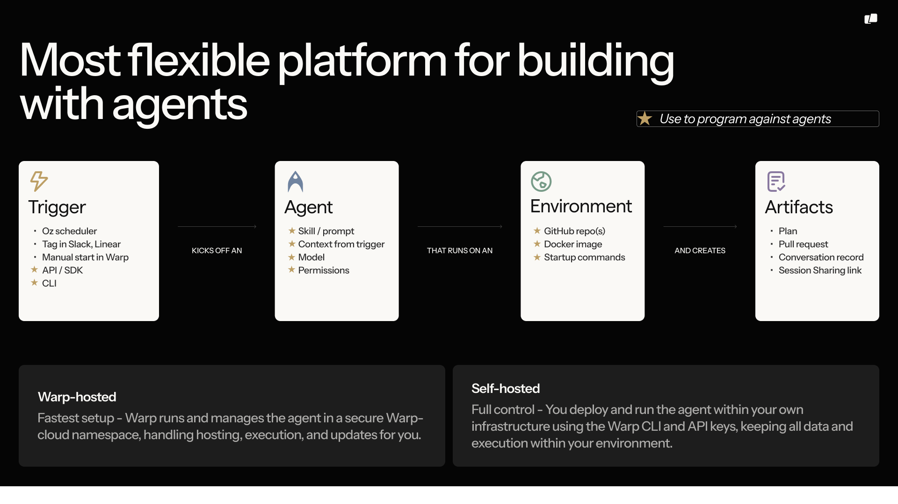
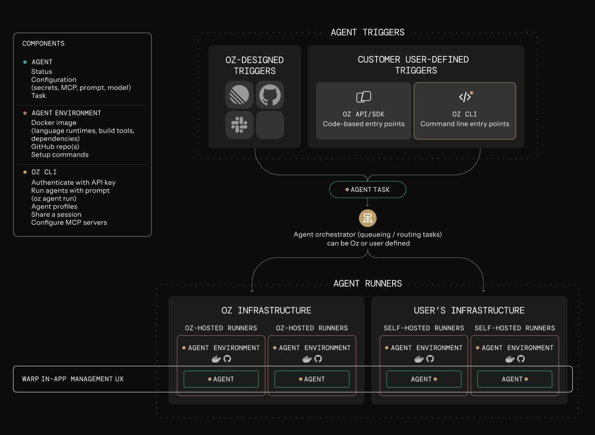

import VideoEmbed from '@components/VideoEmbed.astro';

Cloud agents run on the **Oz Platform**. The platform gives you a consistent way to **trigger work**, **orchestrate and track tasks**, **execute agents** (in an optional [environment](/reference/cli/integration-setup/), on a host), and inspect outcomes with team visibility. First-party [integrations](/agent-platform/cloud-agents/integrations/) connect external events — like Slack messages, GitHub PRs, or CI failures — to cloud agents automatically.

<VideoEmbed url="https://youtu.be/poLkJhO7fdo" />

:::note
**New to cloud agents?** Start with the [Cloud Agents Quick Start](/agent-platform/cloud-agents/quickstart/) to run your first agent in ~10 minutes.
:::

**Most production setups follow the same flow:**

1. A **trigger** fires (schedule, integration event, CI step, webhook, API call, or manual run).
2. Warp's **orchestration layer** creates a cloud agent task and tracks its lifecycle.
3. The agent executes on a **host**, optionally inside an environment, using the required configuration and credentials.
4. The task produces a **persistent record** (status, metadata, transcript, outputs) your team can review and manage.





The sections below describe the Oz Platform primitives that power this flow, and how they compose.

---

### Key concepts

Before diving into the components, it helps to align on a few terms:

* **Trigger**: The event that starts work (for example: cron, Slack mention, PR opened, CI failure, “run now”).
* **Task:** The unit of work Warp tracks. A task includes inputs, state, metadata, and an execution record (where it ran, what it did, and what it produced).
* **Context**: Additional inputs attached to a task (for example: a Slack message, PR metadata, CI logs, repository diffs).
* **Outputs:** What the task produced (for example: created a PR, posted a Slack reply, emitted a report, or just a transcript + summary).

In practice: **triggers create tasks; tasks execute on a host (optionally in an environment); tasks produce outputs.**

---

### Oz CLI

The [Oz CLI](/reference/cli/) is the **headless interface** for running Oz agents in non-interactive mode. It's commonly used in CI, scripts, and server environments where there is no interactive UI. For interactive workflows, use the [agent](/agent-platform/local-agents/overview/) embedded in Warp's desktop app.

A key property of the CLI is that it is **cloud-connected**. Even when an agent is started on a local machine or in CI, it reports progress to Warp’s servers. This enables team visibility, session sharing (where supported), and programmatic tracking through the API.

#### When to use the CLI

Use the CLI when:

* You want to run an agent anywhere (local machine, CI runner, remote dev box, server).
* An external system is orchestrating runs (for example GitHub Actions, custom automation, incident tooling).
* You want task observability and auditing without requiring Warp desktop.

#### How it fits in the Oz Platform

Depending on the command, the CLI typically:

* Authenticates as you (or as a member of your team, if applicable).
* Starts work by creating a task in the orchestrator (either directly via CLI commands, or indirectly via an integration/schedule).
* Streams progress back to Warp for live observability and a persistent record.
* Optionally attaches an environment and other configuration.

#### Example (no environment)

You can also run an agent locally without an environment using a command like:

```bash
oz agent run ...
```

---

### Warp Orchestrator

The orchestration layer manages the lifecycle of cloud agent tasks. It creates tasks, tracks state transitions, and is the system of record for what’s running and what ran.

#### What the orchestrator does

The orchestrator:

* Runs on Warp's servers (cloud control plane).
* Creates tasks when triggers fire (integrations, schedules, API calls, or explicit starts).
* Tracks lifecycle state (created → running → completed/failed) and associated metadata.
* Exposes task lifecycle operations via the [Oz CLI](/reference/cli/) and a [REST API](/reference/api-and-sdk/) (create tasks, query history, and inspect status/outputs).
* Powers SDKs (TypeScript/Python) for programmatic usage on top of the orchestrator API.

#### When teams use the API/SDK

Teams typically use the API/SDK when:

* Triggering agents from custom internal systems (incident tools, bots, internal automation).
* Building internal dashboards or monitoring (success rates, runtime, failure reasons).
* Coordinating many runs (fanout, sharding, queueing, retries, rate limiting at the app layer).
* Creating higher-level workflows that treat tasks as building blocks.

---

### Environments

[Environments](/agent-platform/cloud-agents/environments/) define the execution context an agent should run in.

**An Environment typically includes:**

* A Docker image (toolchain and runtime).
* One or more repositories (or a workspace definition).
* Startup commands and configuration (setup steps, dependency install, bootstrapping).
* Optional environment variables and other runtime settings.

:::note
Environments are how teams make agent runs consistent across triggers (Slack, CI, schedules) and across hosts.
:::

#### Environments are optional

Agents can run without an environment (for example, against an existing local checkout or a CI workspace). Teams usually move to environments when they want stronger reproducibility, isolation, and standardization.

#### When to use environments

Environments are recommended when:

* The agent needs a consistent toolchain (linters, build tools, language runtimes).
* You want repeatable execution across CI and cloud execution.
* You want standard execution across a team (same repo state rules, same setup steps).
* You want to reduce “works on my machine” variability across tasks.

---

### Oz API and SDK

The Oz [Agent API](/reference/api-and-sdk/) is the HTTP interface to the Oz Platform. It lets you create and inspect cloud agent tasks from any system (CI, cron, backend services, internal tools), without requiring the Warp desktop app.

**What you can do with the API**

* Run an agent by submitting a prompt plus optional configuration (model, environment, MCP servers, base prompt, etc.).
* Monitor execution by listing tasks and tracking state transitions over time (for example: `QUEUED` → `INPROGRESS` → `SUCCEEDED/FAILED`).
* Inspect results and provenance by fetching a task’s full details, including the original prompt, creator/source metadata, session link, and resolved agent configuration.

**Oz Agent SDKs**

Oz provides official [Python](https://github.com/warpdotdev/oz-sdk-python) and [TypeScript SDKs](https://github.com/warpdotdev/oz-sdk-typescript) that wrap the Oz API with:

* Typed requests/responses (autocomplete, fewer schema mistakes)
* Built-in retries and timeouts (with per-request overrides)
* Consistent error types mapped to API status codes
* Helpers for raw responses when you need headers/status/custom parsing

If you’re building an integration (CI, Slack bots, internal tooling, orchestrators), the [SDKs](/reference/api-and-sdk/) are typically the quickest and safest starting point.

**SDK vs raw REST**

* Use the SDK when you want strong typing, standardized error handling, and easy concurrency patterns.
* Use raw REST when you want minimal dependencies or full control over your HTTP client.

:::note
For full endpoint semantics and schema definitions, please refer to the dedicated [API docs](/reference/api-and-sdk/) and Models/Schema reference, plus the [Python SDK](https://github.com/warpdotdev/oz-sdk-python) and [TypeScript SDK](https://github.com/warpdotdev/oz-sdk-typescript) repos for the latest usage/examples.
:::

---

### Execution hosts

A host describes where the agent actually executes. Warp supports multiple execution models depending on your security, compliance, and operational requirements.

#### Warp-hosted execution

With Warp hosting:

* Warp runs the environment on Warp-managed infrastructure.
* This is the default model for teams that want the simplest setup and do not need execution to occur inside their network boundary.

#### Self-hosted execution

With self-hosting:

* The agent runs on customer-managed infrastructure.
* Oz orchestrator still manages lifecycle and observability.
* This is used when teams want code and execution to remain on their own systems rather than being cloned or executed in Warp's cloud.

:::note
**Enterprise feature**: Self-hosted execution requires an Enterprise plan. See [Self-Hosting](/agent-platform/cloud-agents/self-hosting/) for setup instructions.
:::

---

### Integrations

[Integrations](/agent-platform/cloud-agents/integrations/) connect external events to cloud agent tasks. When an event occurs in a third-party system, Warp creates a task with the relevant context and starts it automatically.

Warp supports two integration models:

* **First-party integrations** — Warp manages the event subscription and context extraction end to end.
* **Custom integrations** — you handle event ingestion and filtering, then call the API or SDK to create tasks.

#### First-party integrations

First-party integrations can be configured with a simple setup flow (for example via CLI):

```bash
oz integration create …
```

Warp registers webhooks with the third-party system, receives events, extracts context (payload, metadata, links, logs), and creates a task — optionally in an [Environment](/agent-platform/cloud-agents/environments/).

Examples of context extracted by first-party integrations:

* [Slack](/agent-platform/cloud-agents/integrations/slack/): message text, channel, thread, and user identity
* [GitHub](/agent-platform/cloud-agents/integrations/github-actions/): PR metadata, diffs, labels, and check results
* CI: logs, job metadata, and artifacts

#### Custom integrations

With custom integrations, you own the webhook and event-handling logic. Your system receives an event, applies any filtering or enrichment you need, and then calls the Oz API (directly or via an SDK) to create a task. The resulting task is still a full Oz agent run — observable, manageable, and auditable like any other.

Custom integrations are a good fit when:

* You have internal event sources (custom tooling, proprietary systems).
* You need custom filtering, routing, or enrichment before triggering an agent.
* You want to implement your own permissioning, queueing, or governance around triggers.

---

### Secrets

Cloud agents often need credentials to access external systems (APIs, cloud providers, databases, internal tools, MCP servers). Warp provides a [secrets store](/agent-platform/cloud-agents/secrets/) that can inject secrets at runtime so agents can use authenticated tools without exposing secret values in logs or UI.

#### What secrets are for

In most deployments, secrets power:

* API keys and tokens (GitHub, Slack, Linear, internal APIs).
* Shared team credentials (cloud providers, CI identities).
* Database credentials (read-only query bots, reporting).
* Credentials required by MCP servers (static tokens/keys).

#### Scoping and control

Today, secrets support two scopes:

* **Team secrets:** shared credentials available to the team (useful for shared infrastructure).
* **Personal secrets**: credentials tied to an individual (useful when actions must be attributable to a specific person).

---

### Management and observability

Cloud agents are designed so task execution is visible to the team.

While a task is executing, the agent reports progress and status back to Warp. After completion, the task retains a persistent record for review and debugging.

Warp provides multiple surfaces for observability:

* [Management UI](/agent-platform/cloud-agents/managing-cloud-agents/): lists tasks, status, timing, metadata, and history.
* [Agent Session Sharing](/agent-platform/local-agents/session-sharing/): authorized teammates can attach to a running task to monitor and, where supported, steer it.
* [APIs](/reference/api-and-sdk/) and SDKs: query task history, build monitoring, and generate reports.

#### Access control

**Access control is part of the model:**

* Teams can restrict who can run, view, or intervene in agent tasks.
* At the same time, organizations can enable system-wide visibility where appropriate for auditing and operations.

### Centralized configuration

Cloud agent setups often include shared configuration such as:

* [MCP Servers](/agent-platform/cloud-agents/mcp/)
* [rules / guardrails](/agent-platform/capabilities/rules/)
* [saved prompts](/knowledge-and-collaboration/warp-drive/prompts/)
* [environment variables](/knowledge-and-collaboration/warp-drive/environment-variables/)
* [secrets](/agent-platform/cloud-agents/secrets/)

Warp supports centralized configuration so these settings apply consistently regardless of where a task is launched.

This is especially useful when the same workflow can be triggered from multiple places (for example Slack, CI, and schedules). Instead of duplicating setup across systems, teams can keep configuration in one place and reuse it across triggers.

### Using the Oz Platform with or without the Warp app

[Cloud agents](/agent-platform/cloud-agents/overview/) do not require Warp's desktop terminal. Teams can operate cloud agent workflows using:

* [Oz CLI](/reference/cli/) — run agents from scripts, CI, or the terminal
* [Oz web app](/agent-platform/cloud-agents/oz-web-app/) — visual interface at [oz.warp.dev](https://oz.warp.dev) for managing runs, schedules, environments, and integrations (works on mobile)
* [Session sharing](/agent-platform/local-agents/session-sharing/) — attach to running tasks to monitor or steer
* [Management UI](/agent-platform/cloud-agents/managing-cloud-agents/) — view agent activity and run history
* [APIs and SDKs](/reference/api-and-sdk/) — programmatic access for custom integrations

**If your team also uses Warp’s terminal, you gain an additional workflow:**

* Tasks launched via the CLI can be handed off into an interactive session for review, edits, or continuation.
* This is useful when you want a human checkpoint (final edits, validation, merge decisions) without losing the audit trail from the cloud agent run.
