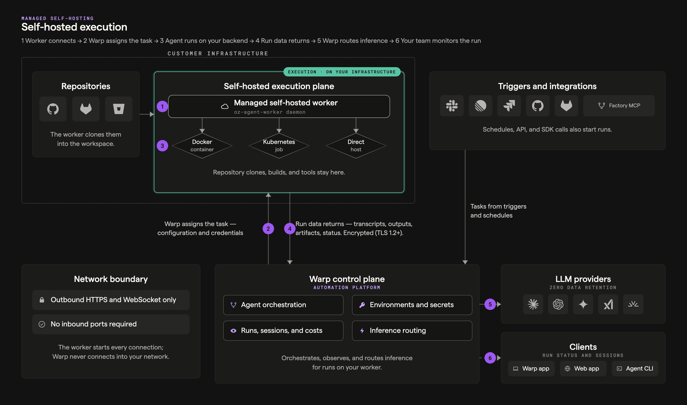

:::note
**Enterprise feature**: Self-hosted Oz agents are available exclusively to teams on an Enterprise plan. To enable self-hosting for your team, [contact sales](https://warp.dev/contact-sales).
:::

Self-hosting lets your team run Oz agent workloads on your own infrastructure instead of Warp-managed servers. Source code, build artifacts, shell commands, and runtime secrets stay entirely within your network — only orchestration metadata, session state, and LLM inference route through Warp's backend.

This split architecture gives you the same orchestration, session sharing, and team visibility features as Warp-hosted execution, while keeping code and execution inside your network boundary.



With any self-hosted architecture:

* **Agent runs are tracked and steerable** — View status, metadata, and session transcripts in the [Oz dashboard](https://oz.warp.dev), the Warp app, or via the [API/SDK](https://docs.warp.dev/reference/api-and-sdk/agent). Authorized teammates can attach to running sessions to monitor or steer agents.
* **Connectivity to Warp's backend is required** — Agents need outbound access to Warp for orchestration, session storage, and LLM inference. No inbound ports need to be opened.
* **Resource limits are controlled by your infrastructure** — Concurrency and compute are only limited by the machines you provision, not by Warp.

:::note
Enterprise teams that need full control over LLM inference routing can use [Bring Your Own LLM (BYOLLM)](https://docs.warp.dev/enterprise/enterprise-features/bring-your-own-llm) to route inference through their own AWS Bedrock or other cloud provider accounts. BYOLLM currently applies to interactive (local) agents; cloud agent support is coming.
:::

---

## Architecture options

There are two architectures for self-hosted Oz agents:

* **Managed** — Run the `oz-agent-worker` daemon on your infrastructure. The Oz platform orchestrates agents remotely, starting them in isolated Docker containers on your machines. Similar to a [GitHub self-hosted runner](https://docs.github.com/en/actions/hosting-your-own-runners).
* **Unmanaged** — Use the `oz agent run` command to start agents anywhere — in CI pipelines, Kubernetes pods, VMs, or dev boxes. You control orchestration; Warp provides tracking and observability.

### Comparison

**Managed architecture:**

* ✅ Full Oz orchestration — start agents from Slack, Linear, the API/SDK, Cloud Mode, or `oz agent run-cloud`
* ✅ Automatic environment setup (Docker image, repo cloning, setup commands)
* ✅ Task isolation via Docker containers
* ✅ Remotely start and stop agents
* ✅ Linux (supported shells)
* 🟧 macOS and Windows support (future)
* Requires Docker on the host

**Unmanaged architecture:**

* ✅ Runs on any platform Warp supports (Linux, macOS, Windows)
* ✅ No Docker dependency — agents run directly on the host
* ✅ Drop-in replacement for other CLI agents (Claude Code, Codex CLI) in your existing orchestrator
* ✅ Tracked and steerable sessions
* ❌ No remote start via Slack, Linear, or the API (you start agents yourself)
* ❌ No automatic environment setup (you manage the environment)

✅ = supported today, 🟧 = future extension, ❌ = not planned / incompatible with architecture

---

## Choosing an architecture

Use these questions to determine which architecture fits your team:

1. **Do you want Oz to handle starting and stopping agents** (from Slack, the web interface, the Warp desktop app, or the API)?
   * Yes → Use the **managed** architecture.
   * No, you have your own triggering mechanism → Use the **unmanaged** architecture.

2. **Do you need agents to run on Windows or macOS?**
   * Yes → Use the **unmanaged** architecture.

3. **Can your development environment run in a Docker container?**
   * No (for example, complex multi-service stacks, heavy resource requirements, or Docker-in-Docker limitations) → Use the **unmanaged** architecture.
   * Yes → Either architecture works.

4. **Do you have your own orchestrator** (CI/CD, Kubernetes, internal job scheduler) **that starts agents on demand?**
   * Yes → Use the **unmanaged** architecture with `oz agent run` as a drop-in.
   * No → Use the **managed** architecture.

:::note
The two architectures are not mutually exclusive. Some teams use the managed architecture for integration-triggered work (Slack, Linear) and the unmanaged architecture for CI pipelines or dev boxes.
:::

---

## Unmanaged architecture

With the unmanaged architecture, you run `oz agent run` inside your own orchestrator or dev environment. This works on any platform Warp supports (Linux, macOS, and Windows), with no dependency on Docker or any other sandboxing platform.

You are responsible for executing `oz agent run` on your infrastructure, similarly to how you would integrate Claude Code or Codex CLI. The agent runs directly on the host, which could itself be a Kubernetes pod, VM, container, or CI runner.

### When to use

* **CI/CD pipelines** — Run agents as part of your build or deployment workflow. This is how the [oz-agent-action](https://github.com/warpdotdev/oz-agent-action) GitHub Action works.
* **Kubernetes pods** — Run agents in pods with access to your cluster's network and services.
* **Dev boxes and VMs** — Run agents in pre-provisioned development environments, especially useful for large monorepos with long setup times.
* **Existing orchestrators** — Drop `oz agent run` into any system that schedules work (Jenkins, Buildkite, internal job schedulers).

### Setup

1. **Install the Oz CLI** on the machine where agents will run. See [Installing the CLI](/reference/cli/#installing-the-cli) for platform-specific instructions.

2. **Authenticate** using an API key (recommended for automation):

```bash
export WARP_API_KEY="your_team_api_key"
```

3. **Run the agent:**

```bash
oz agent run --prompt "Refactor the authentication module" --share team
```

The agent runs in the current working directory and has access to whatever tools and network resources the host provides. Use `--share` to make the session visible to your team.

### Example: GitHub Actions

Warp maintains the [oz-agent-action](https://github.com/warpdotdev/oz-agent-action) for running agents in GitHub Actions. This is the recommended approach for CI integration:

```yaml
- name: Run Oz agent
  uses: warpdotdev/oz-agent-action@v1
  with:
    prompt: "Review the code changes on this branch"
    warp_api_key: ${{ secrets.WARP_API_KEY }}
```

See [GitHub Actions integration](/agent-platform/cloud-agents/integrations/github-actions/) for full details.

### Example: Kubernetes

Run an agent inside a Kubernetes pod with access to your cluster's services:

```yaml
apiVersion: batch/v1
kind: Job
metadata:
  name: oz-agent-task
spec:
  template:
    spec:
      containers:
      - name: oz-agent
        image: warpdotdev/oz-cli:latest
        command: ["oz", "agent", "run", "--prompt", "Run the test suite and report failures"]
        env:
        - name: WARP_API_KEY
          valueFrom:
            secretKeyRef:
              name: warp-credentials
              key: api-key
      restartPolicy: Never
```

:::caution
For production deployments, pin to a specific image version (e.g., `warpdotdev/oz-cli:1.2.3`) instead of `latest` to ensure reproducible builds.
:::

:::note
Whether Kubernetes pods provide sufficient sandboxing for agents depends on your cluster configuration and risk profile. Evaluate your pod security policies, network policies, and RBAC settings based on your organization's security requirements.
:::

### Tracking and observability

Unmanaged agents are tracked on Warp's backend. Each run creates a persistent session that your team can view in the [Oz dashboard](https://oz.warp.dev), attach to via session sharing, and query through the [API/SDK](https://docs.warp.dev/reference/api-and-sdk/agent).

---

## Managed architecture

With the managed architecture, you run the `oz-agent-worker` daemon on your infrastructure. The daemon connects to Warp's backend, waits for agent tasks to be assigned to it, and runs those tasks in isolated Docker containers on its host. This model works similarly to a [GitHub self-hosted runner](https://docs.github.com/en/actions/hosting-your-own-runners).

The managed architecture enables full orchestration by the Oz platform — it can remotely start agents via Slack, Linear, the API/SDK, Cloud Mode, and the `oz agent run-cloud` command. Containerized agents can still access host resources through volume mounts and injected environment variables.

### Prerequisites

Before setting up a self-hosted worker, ensure you have:

* **A machine to run the worker** — This can be a VM, a server, or even a local machine. The worker host can run on macOS, Linux, or Windows — any machine that runs Docker. Linux is recommended for production deployments.
* **Docker installed** — The worker uses Docker to run agent tasks. Verify Docker is installed and running with `docker info`.
* **Enterprise plan with self-hosting enabled** — [Contact sales](https://warp.dev/contact-sales) if self-hosting is not yet enabled for your team.
* **A team API key** — In the Warp app, go to **Settings** > **Platform** to create a team-scoped API key.

:::caution
Task containers require a **linux/amd64** or **linux/arm64** Docker daemon. The worker host itself can be any OS — Docker Desktop on macOS and Windows runs a Linux VM that satisfies this requirement.
:::

### Install Docker

If Docker is not already installed, follow the [official Docker installation guide](https://docs.docker.com/get-docker/) for your platform.

Verify Docker is running:

```bash
docker info
```

### Running the worker

The worker is open source. See the [oz-agent-worker repository](https://github.com/warpdotdev/oz-agent-worker) for source code, issues, and contribution guidelines.

There are three ways to run the worker: via Docker (recommended), via `go install`, or by building from source.

### Set your API key

In the Warp app, go to **Settings** > **Platform** to create a team API key. Then export it as an environment variable:

```bash
export WARP_API_KEY="your_team_api_key"
```

### Option 1: Docker (recommended)

The worker needs access to the Docker daemon to spawn task containers. Mount the host's Docker socket into the container:

```bash
docker run -v /var/run/docker.sock:/var/run/docker.sock \
  -e WARP_API_KEY="$WARP_API_KEY" \
  warpdotdev/oz-agent-worker --worker-id "my-worker"
```

### Option 2: Go install

```bash
go install github.com/warpdotdev/oz-agent-worker@latest
oz-agent-worker --api-key "$WARP_API_KEY" --worker-id "my-worker"
```

### Option 3: Build from source

```bash
git clone https://github.com/warpdotdev/oz-agent-worker.git
cd oz-agent-worker
go build -o oz-agent-worker
./oz-agent-worker --api-key "$WARP_API_KEY" --worker-id "my-worker"
```

For the full list of worker CLI flags, Docker connectivity options, and private registry configuration, see the [managed worker reference](/agent-platform/cloud-agents/managed-worker-reference/).

---

## Routing runs to self-hosted workers

To run an Oz cloud agent on your self-hosted worker, specify the `--host` flag with your worker ID. The `--host` value must match the `--worker-id` of a connected worker exactly.

### From the CLI

```bash
oz agent run-cloud --prompt "Refactor the authentication module" --host "my-worker"
```

You can combine `--host` with any other `run-cloud` flags, such as `--environment`, `--model`, `--mcp`, `--skill`, `--computer-use`, and `--attach`.

### From scheduled agents

When creating or updating a schedule, specify the host:

```bash
oz schedule create --name "daily-cleanup" \
  --cron "0 9 * * *" \
  --prompt "Run dead code cleanup" \
  --environment ENV_ID \
  --host "my-worker"

oz schedule update SCHEDULE_ID --host "my-worker"
```

### From integrations

When creating or updating an integration, specify the host:

```bash
oz integration create slack --host "my-worker" ...
oz integration update linear --host "my-worker" ...
```

All tasks created through that integration will be routed to your self-hosted worker.

### From the API / SDKs

When creating a run via the [Oz Agent API](https://docs.warp.dev/reference/api-and-sdk/agent), include `worker_host` in the config:

```bash
curl -X POST https://app.warp.dev/api/v1/agent/run \
  --header 'Authorization: Bearer YOUR_API_KEY' \
  --header 'Content-Type: application/json' \
  --data '{
    "prompt": "Refactor the authentication module",
    "config": {
      "environment_id": "ENV_ID",
      "worker_host": "my-worker"
    }
  }'
```

### From the web UI

When creating a run, schedule, or integration in the [Oz web app](https://oz.warp.dev), select your self-hosted worker from the host dropdown.

---

## Environments with self-hosted workers

Self-hosted workers fully support [environments](/agent-platform/cloud-agents/environments/). When a task specifies an environment, the worker:

1. Pulls the Docker image defined in the environment (or falls back to `ubuntu:22.04` if none is specified).
2. Clones the repositories and runs setup commands as configured.
3. Executes the agent inside the prepared container.

The same environment can be used for both Warp-hosted and self-hosted runs without modification. See [Environments](/agent-platform/cloud-agents/environments/) for details on creating and configuring environments.

:::caution
The architecture of the environment's Docker image must match the architecture of the worker's Docker daemon. For example, an `arm64` image will not run on a worker with an `amd64` Docker daemon.
:::

:::caution
Musl-based Docker images (such as Alpine Linux) are not supported as task images. The agent runtime requires glibc. Use glibc-based images like Debian, Ubuntu, or the default (non-Alpine) variants of official Docker Hub images.
:::

---

## Monitoring runs

Self-hosted runs have the same observability as Warp-hosted runs:

* **Management UI** — View task status, history, and metadata in the [Oz dashboard](https://oz.warp.dev).
* **Session sharing** — Authorized teammates can attach to running tasks to monitor progress.
* **APIs and SDKs** — Query task history and build monitoring using the [Oz Agent API](https://docs.warp.dev/reference/api-and-sdk/agent).

---

## Network requirements

Self-hosted Oz agents do not require any network ingress. They do require outbound (egress) access to the following services:

**All architectures (managed and unmanaged):**

* `app.warp.dev` — port 443
* `rtc.app.warp.dev` — port 443
* `sessions.app.warp.dev` — port 443

**Managed architecture only:**

* `oz.warp.dev` — port 443 (WebSocket connection for task assignment)
* Docker Hub (`hub.docker.com`) — for pulling task images
* GitHub (`github.com`) — only when using environments with configured GitHub repositories
* Linux package repositories — only when using environments that install packages during setup. The exact repositories depend on the package manager configuration within the environment's base image.

:::note
For firewall configuration, all traffic uses HTTPS (port 443). The managed architecture's worker maintains a persistent WebSocket connection to `oz.warp.dev` for receiving task assignments.
:::

---

## Security considerations

Self-hosting uses a split architecture. Understanding which data stays on your infrastructure and which routes through Warp is critical for security evaluation:

**Stays on your infrastructure:**

* Source code and repository contents
* Build artifacts and compiled outputs
* Shell commands and their output
* Runtime secrets and environment variables
* Container filesystem state

**Routes through Warp's backend (under [ZDR](https://docs.warp.dev/enterprise/security-and-compliance/security-overview#zero-data-retention-zdr)):**

* Orchestration metadata (task status, lifecycle events)
* Session state and transcripts
* LLM inference requests and responses

**Additional considerations:**

* **Docker socket access** (managed only) — The worker requires access to the Docker daemon to create task containers. When running the worker via Docker, this means mounting `/var/run/docker.sock`. Ensure appropriate access controls on the host.
* **Network egress** — See [Network requirements](#network-requirements) for the full list of required endpoints. No inbound ports need to be opened.
* **API key management** — Store your `WARP_API_KEY` securely (e.g., in a secrets manager). Avoid hardcoding it in scripts or config files.
* **Task isolation** (managed only) — Each task runs in its own Docker container. Containers are removed after execution by default (disable with `--no-cleanup` for debugging). All Docker daemon isolation and configuration options are available.
* **Volume mounts** (managed only) — If using `-v` / `--volumes`, be mindful of what host paths you expose to task containers.
* **LLM inference** — Enterprise teams needing full inference control can use [BYOLLM](https://docs.warp.dev/enterprise/enterprise-features/bring-your-own-llm) for interactive (local) agents; cloud agent BYOLLM support is coming.
* **VPN and on-prem access** — Since agents run on your infrastructure, they inherit your network access. This means self-hosted agents can reach services behind VPNs, self-hosted GitLab/Bitbucket instances, and other internal resources.

---

## Troubleshooting

### Worker won't start

* Verify Docker is running: `docker info`.
* Ensure the Docker daemon platform is `linux/amd64` or `linux/arm64`.

### Worker won't connect

* Verify your API key is correct, not expired, and has team scope.
* Regenerate the API key in **Settings** > **Platform** if you suspect it is invalid.
* Ensure the machine has outbound internet access to Oz.
* Check that no firewall rules are blocking WebSocket connections to `wss://oz.warp.dev`.
* Increase log verbosity with `--log-level debug` to see connection details.

### Tasks not being picked up

* Confirm the worker is running and connected (check the worker logs).
* Verify the `--host` parameter matches your `--worker-id` exactly (case-sensitive).
* Ensure the worker's team matches the team creating the task.

### Task failures

* Check Docker is running: `docker info`.
* Review task logs in the Oz dashboard or via session sharing.
* Use `--no-cleanup` to keep the container around for inspection after failure.
* Use `--log-level debug` to see detailed container creation and execution logs.
* Ensure the worker machine has sufficient resources (CPU, memory, disk).
* If using a custom Docker image, verify it is glibc-based (not Alpine/musl).
* Verify the environment image architecture matches the worker's Docker daemon platform (e.g., an `amd64` image on an `amd64` daemon).

### Image pull failures

* If using a private registry, ensure Docker credentials are available to the worker (see [Private Docker registries](/agent-platform/cloud-agents/managed-worker-reference/#private-docker-registries)).
* Try pulling the image manually with `docker pull <image>` on the worker host to verify access and diagnose authentication issues.
* Verify the image exists and the tag is correct.
* Check network connectivity to the registry.
