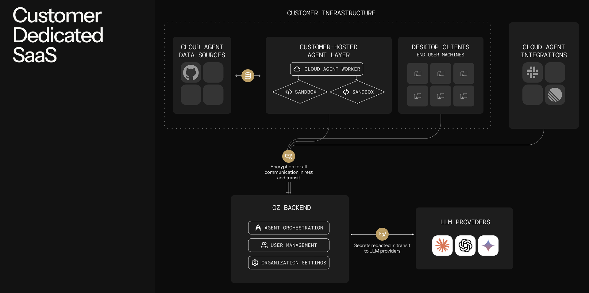

Self-hosting lets your team run Oz cloud agent workloads on your own infrastructure instead of Warp-managed servers. You control the execution environment, compute resources, and network access. Repositories are cloned and stored only on your machines, and agents can reach services behind your VPN or firewall.

**New to self-hosting?** Start with the [Self-hosting quickstart](/agent-platform/cloud-agents/self-hosting/quickstart/) to get a managed worker running on Docker in under 10 minutes.

**Want a CLI-only path with no Docker requirement?** Jump straight to the [Unmanaged quickstart](/agent-platform/cloud-agents/self-hosting/unmanaged/#unmanaged-quickstart) to run `oz agent run` directly on any host.

:::note
**Enterprise feature**: Self-hosted Oz agents are available exclusively to teams on an Enterprise plan. To enable self-hosting for your team, [contact sales](https://warp.dev/contact-sales).
:::

## Managed vs unmanaged

Self-hosting has two architectures. The core distinction is **who orchestrates agent runs** — not who owns the compute. Both models keep code and execution on your infrastructure.

* **Managed** — Oz orchestrates agent runs. You run the `oz-agent-worker` daemon on your infrastructure; it connects to Oz and waits for work. Slack mentions, Linear comments, schedules, API calls, and `oz agent run-cloud` commands all route tasks to your worker, which executes them in isolated Docker containers, Kubernetes Jobs, or directly on the host. Similar to a [GitHub self-hosted runner](https://docs.github.com/en/actions/hosting-your-own-runners).
* **Unmanaged** — You orchestrate agent runs. You invoke `oz agent run` directly from your existing CI pipeline, Kubernetes pod, VM, or dev box. Oz provides session tracking and observability for each run, but does not start or stop agents for you.

### At a glance

| Aspect | **Managed** | **Unmanaged** |
| --- | --- | --- |
| **Who triggers runs** | Oz (Slack, Linear, schedules, API, `run-cloud`) | Your system (CI, cron, scripts) |
| **What runs on your infra** | Long-lived `oz-agent-worker` daemon | One-shot `oz agent run` invocations |
| **OS support** | Linux (macOS/Windows coming) | Linux, macOS, Windows |
| **Execution isolation** | Docker container, Kubernetes Job, or direct host | Whatever your host provides |
| **Automatic environment setup** | Yes (via Warp [environments](/agent-platform/cloud-agents/environments/)) | No (you manage it) |
| **Session tracking and steering** | Yes | Yes |

The two architectures are not mutually exclusive. Some teams run managed workers for integration-triggered work and unmanaged agents in CI pipelines.

## How self-hosting works

Warp uses a split-plane architecture: **execution happens on your infrastructure**, while **orchestration, session management, and LLM inference route through Warp's backend**. Agent interactions — including code context in session transcripts and LLM prompts — transit Warp's control plane under [Zero Data Retention (ZDR)](/enterprise/security-and-compliance/security-overview/#zero-data-retention-zdr) agreements. Warp does not persistently store your source code or train on it.



With any self-hosted architecture:

* **Agent runs are tracked and steerable** — View status, metadata, and session transcripts in the [Oz dashboard](https://oz.warp.dev), the Warp app, or via the [API/SDK](/reference/api-and-sdk/). Authorized teammates can attach to running sessions to monitor or steer agents.
* **Connectivity to Warp's backend is required** — Agents need outbound access to Warp for orchestration, session storage, and LLM inference. No inbound ports need to be opened.
* **Resource limits are controlled by your infrastructure** — Concurrency and compute are only limited by the machines you provision, not by Warp.

:::note
Enterprise teams that need full control over LLM inference routing can use [Bring Your Own LLM (BYOLLM)](/enterprise/enterprise-features/bring-your-own-llm/) to route inference through their own cloud provider accounts. BYOLLM currently applies to interactive (local) agents; cloud agent support is coming.
:::

---

## Choosing an architecture

:::caution
**OS support:** The managed architecture is **Linux-only** today (macOS and Windows support is coming). If you need agents to run on macOS or Windows, use the [unmanaged](/agent-platform/cloud-agents/self-hosting/unmanaged/) architecture, which works on any platform Warp supports.
:::

Use these questions to decide between managed and unmanaged:

1. **Do you need agents to run on Windows or macOS?**
   * Yes → Use the [unmanaged](/agent-platform/cloud-agents/self-hosting/unmanaged/) architecture. Managed is Linux-only today.
   * No, Linux works → Continue to the next question.
2. **Do you want Oz to handle starting and stopping agents** (from Slack, the web interface, the Warp app, schedules, or the API)?
   * Yes → Use the [managed](#managed-architecture) architecture.
   * No, you have your own triggering mechanism → Use the [unmanaged](/agent-platform/cloud-agents/self-hosting/unmanaged/) architecture.
3. **Can your development environment run in a Docker container or Kubernetes pod?**
   * Yes, Docker → [Managed: Docker](/agent-platform/cloud-agents/self-hosting/managed-docker/) backend.
   * Yes, Kubernetes → [Managed: Kubernetes](/agent-platform/cloud-agents/self-hosting/managed-kubernetes/) backend.
   * No (multi-service stacks that don't fit a single container, or environments where container runtimes aren't available) → [Unmanaged](/agent-platform/cloud-agents/self-hosting/unmanaged/) or [Managed: Direct](/agent-platform/cloud-agents/self-hosting/managed-direct/).
4. **Do you have your own orchestrator** (CI/CD, Kubernetes, internal job scheduler) **that starts agents on demand?**
   * Yes → [Unmanaged](/agent-platform/cloud-agents/self-hosting/unmanaged/), using `oz agent run` as a drop-in.
   * No → [Managed](#managed-architecture).

### Choosing a managed backend

The managed architecture supports three backends for task execution:

1. **Are you deploying the worker into a Kubernetes cluster?**
   * Yes → Use the [Kubernetes backend](/agent-platform/cloud-agents/self-hosting/managed-kubernetes/). Each task runs as a Kubernetes Job in your cluster; install with the included Helm chart.
   * No → Continue.
2. **Is Docker available on your worker host?**
   * Yes → Use the [Docker backend](/agent-platform/cloud-agents/self-hosting/managed-docker/) (default). Tasks run in isolated containers.
   * No → Use the [Direct backend](/agent-platform/cloud-agents/self-hosting/managed-direct/). Tasks run directly on the host.
3. **Do you need container-level isolation between tasks?**
   * Yes → [Docker](/agent-platform/cloud-agents/self-hosting/managed-docker/) or [Kubernetes](/agent-platform/cloud-agents/self-hosting/managed-kubernetes/) backend.
   * No → Any backend works.
4. **Do you need Kubernetes-native scheduling, resource management, or policy enforcement?**
   * Yes → [Kubernetes backend](/agent-platform/cloud-agents/self-hosting/managed-kubernetes/).
   * No → [Docker](/agent-platform/cloud-agents/self-hosting/managed-docker/) or [Direct](/agent-platform/cloud-agents/self-hosting/managed-direct/) is simpler to set up.

---

## Managed architecture

With the managed architecture, you run the `oz-agent-worker` daemon on your infrastructure. The daemon connects to Oz's backend, waits for tasks to be assigned to it, and executes those tasks on its host using one of three backends:

* **[Docker backend](/agent-platform/cloud-agents/self-hosting/managed-docker/)** (default) — Runs each task in an isolated Docker container.
* **[Kubernetes backend](/agent-platform/cloud-agents/self-hosting/managed-kubernetes/)** — Runs each task as a Kubernetes Job in your cluster.
* **[Direct backend](/agent-platform/cloud-agents/self-hosting/managed-direct/)** — Runs each task directly on the host without a container runtime.

The managed architecture enables full orchestration by Oz — it can remotely start agents via Slack, Linear, the [Oz web app](https://oz.warp.dev), the API/SDK, and the `oz agent run-cloud` command. Agents can access host resources through volume mounts (Docker), Kubernetes-native configuration (Kubernetes), and injected environment variables.

## Unmanaged architecture

With the [unmanaged architecture](/agent-platform/cloud-agents/self-hosting/unmanaged/), you run `oz agent run` inside your own orchestrator or dev environment. This works on any platform Warp supports (Linux, macOS, Windows), with no dependency on Docker or any other sandboxing platform.

You're responsible for executing `oz agent run` on your infrastructure — similar to how you'd integrate Claude Code or Codex CLI. The agent runs directly on the host, which could itself be a Kubernetes pod, VM, container, or CI runner.

---

## Routing runs to self-hosted workers

This section applies to **all managed backends** (Docker, Kubernetes, and Direct). Once a worker is connected, route Oz cloud agent runs to it by specifying the `--host` flag (or equivalent) with your worker ID. The `--host` value must match the `--worker-id` of a connected worker exactly.

:::note
Unmanaged runs don't need routing — you invoke `oz agent run` directly on the host where you want the agent to execute. Routing is only relevant for managed workers.
:::

### From the CLI

```bash
oz agent run-cloud --prompt "Refactor the authentication module" --host "my-worker"
```

You can combine `--host` with any other `run-cloud` flags, such as `--environment`, `--model`, `--mcp`, `--skill`, `--computer-use`, and `--attach`.

### From scheduled agents

When creating or updating a schedule, specify the host:

```bash
oz schedule create --name "daily-cleanup" \
  --cron "0 9 * * *" \
  --prompt "Run dead code cleanup" \
  --environment ENV_ID \
  --host "my-worker"

oz schedule update SCHEDULE_ID --host "my-worker"
```

### From integrations

When creating or updating an integration, specify the host:

```bash
oz integration create slack --host "my-worker" ...
oz integration update linear --host "my-worker" ...
```

All tasks created through that integration route to your self-hosted worker.

### From the API and SDKs

When creating a run via the [Oz API](/reference/api-and-sdk/), include `worker_host` in the config:

```bash
curl -X POST https://app.warp.dev/api/v1/agent/run \
  --header 'Authorization: Bearer YOUR_API_KEY' \
  --header 'Content-Type: application/json' \
  --data '{
    "prompt": "Refactor the authentication module",
    "config": {
      "environment_id": "ENV_ID",
      "worker_host": "my-worker"
    }
  }'
```

### From the web UI

When creating a run, schedule, or integration in the [Oz web app](https://oz.warp.dev), select your self-hosted worker from the host dropdown.

---

## Environments with self-hosted workers

Self-hosted workers fully support [environments](/agent-platform/cloud-agents/environments/). When a task specifies an environment, the worker resolves the Docker image, clones the repositories, runs setup commands, and executes the agent inside the prepared container or Kubernetes Job.

The same environment can be used for both Warp-hosted and self-hosted runs without modification. See [Environments](/agent-platform/cloud-agents/environments/) for details on creating and configuring them.

:::note
With the Kubernetes backend, setting a [`default_image`](/agent-platform/cloud-agents/self-hosting/reference/#kubernetes-backend-config) on the worker lets you skip creating a Warp environment when all your tasks use the same base image.
:::

:::caution
Musl-based Docker images (such as Alpine Linux) are not supported as task images. The agent runtime requires glibc. Use glibc-based images like Debian, Ubuntu, or the default (non-Alpine) variants of official Docker Hub images.
:::

## Monitoring runs

Self-hosted runs have the same observability as Warp-hosted runs:

* **Oz dashboard** — View task status, history, and metadata at [oz.warp.dev](https://oz.warp.dev).
* **Session sharing** — Authorized teammates can attach to running tasks to monitor progress.
* **APIs and SDKs** — Query task history and build monitoring using the [Oz API](/reference/api-and-sdk/).

For infrastructure-level observability, the `oz-agent-worker` daemon can export OpenTelemetry metrics (worker health, task throughput, capacity saturation) to Prometheus, an OTLP collector, or the console. See [Monitoring](/agent-platform/cloud-agents/self-hosting/monitoring/) for setup, the full metric catalog, and sample PromQL queries.

---

## Related pages

* [Self-hosting quickstart](/agent-platform/cloud-agents/self-hosting/quickstart/) — Get a managed worker running in ~10 minutes.
* [Unmanaged](/agent-platform/cloud-agents/self-hosting/unmanaged/) — Run `oz agent run` in your CI, K8s, or dev environment.
* [Managed: Docker](/agent-platform/cloud-agents/self-hosting/managed-docker/) — Default managed setup with the Docker backend.
* [Managed: Kubernetes](/agent-platform/cloud-agents/self-hosting/managed-kubernetes/) — Managed setup with the Kubernetes backend and Helm chart.
* [Managed: Direct](/agent-platform/cloud-agents/self-hosting/managed-direct/) — Managed setup with no container runtime.
* [Self-hosted worker reference](/agent-platform/cloud-agents/self-hosting/reference/) — CLI flags and config file schema.
* [Monitoring](/agent-platform/cloud-agents/self-hosting/monitoring/) — OpenTelemetry metrics for worker health, task throughput, and capacity.
* [Security and networking](/agent-platform/cloud-agents/self-hosting/security-and-networking/) — Data boundaries, network egress, and security considerations.
* [Troubleshooting](/agent-platform/cloud-agents/self-hosting/troubleshooting/) — Worker won't start, tasks not picked up, and other common issues.
* [Deployment patterns](/agent-platform/cloud-agents/deployment-patterns/) — How self-hosting compares to CLI-only and Warp-hosted deployment.
* [Environments](/agent-platform/cloud-agents/environments/) — Define the runtime context for agent tasks.
