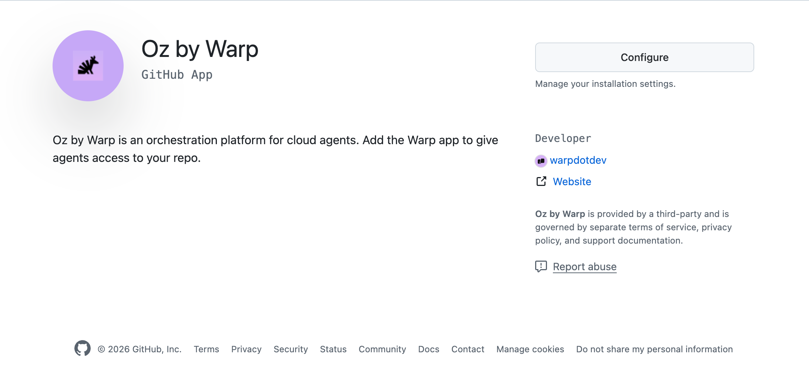

This page explains how access to cloud agents works for both individual users and teams, how billing and credits apply, and how Warp maps user identities across integrations.

---

## Overview: individual vs team access

Cloud agents can be used in two ways:

**Individual users** (without a team):
* Can run cloud agents via CLI or API
* Can use normal Warp credits, [Cloud Agent Credits](/support-and-community/plans-and-billing/credits/#cloud-agent-credits), or a Build plan with available credits
* Agents run on Warp-hosted infrastructure
* Cannot use integrations (Slack, Linear) or self-hosted agents

**Teams** (users who are part of a [Warp team](/knowledge-and-collaboration/teams/)):
* All individual capabilities, plus:
* Can use integrations (Slack, Linear) to trigger agents
* Can self-host agents on their own infrastructure (Enterprise only)
* Share team-level configuration (environments, secrets, integrations)
* Team must be on Build, Max, or Business plan with at least 20 credits (any type) for cloud agents and integrations

---

## Individual access

Individual users can run cloud agents via the CLI or API without being part of a team.

**How it works:**

* Run agents using `oz agent run-cloud` or the Oz API
* Credits are drawn from your normal Warp credits, Cloud Agent Credits (if available), or Build plan credits
* Agents execute on Warp-hosted infrastructure

**What you can do:**

* Run cloud agents from CI/CD pipelines
* Trigger agents programmatically via API
* Use personal secrets for authentication

**What requires a team:**

* Integrations (Slack, Linear)
* Self-hosted agent execution
* Team secrets and shared configuration

---

## Team access

A [Warp team](/knowledge-and-collaboration/teams/) is a group of users who share configuration and collaborate on cloud agents. Teams can be created on any plan, including Free.

**What teams enable:**

* **Integrations** - Create Slack and Linear integrations that all team members can use
* **Shared configuration** - Team-level environments, secrets, and settings
* **Self-hosting** - Run agents on your own infrastructure (Enterprise only)
* **Team visibility** - Shared observability into agent runs and history

Integrations are created at the team level, not per-user. Once a Slack or Linear integration is installed, everyone on your Warp team can use **@Oz** in the connected workspace. The integration behaves the same way for all teammates, and everyone shares the same underlying environment configuration.

When someone triggers a cloud agent for the first time, Warp may prompt them to grant GitHub authorization so the agent can open pull requests or push branches under their identity. This allows each run to use the correct permissions without requiring additional setup from an admin.

#### Requirements for integrations

Integrations and [cloud agents](/agent-platform/cloud-agents/overview/) run inside Warp's cloud, which means usage is billed based on [credits](/support-and-community/plans-and-billing/credits/).

Your team must meet the following requirements to run integrations:

* You must be on a plan that supports **[Reload Credits (Add-on Credits)](/support-and-community/plans-and-billing/add-on-credits/)**.
  * Supported: **Build, Max, Business**
  * Not supported: Pro, Turbo, Lightspeed, legacy Business.
* Your team needs at least **20 credits** available to run cloud agents and integrations (any type of Warp credits work)

When a user triggers an agent through an integration (like Slack or Linear), the run draws from credits in a specific order. It starts with any [Cloud Agent Credits](/support-and-community/plans-and-billing/credits/#cloud-agent-credits) the user has, then moves to the user's base credits, followed by the team's Reload Credits, and finally the user's own Reload Credits. Enterprises may have different payment options and credit plans that affect this flow. If all applicable credit sources are exhausted, integrations and cloud agents will not work until credits are added.

:::note
If you're on an Enterprise plan, please reach out to [warp.dev/contact-sales](https://warp.dev/contact-sales) with any billing questions related to integrations.
:::

### Identity mapping

Warp needs a reliable way to know which person a cloud agent run is acting for, across Warp, Slack, Linear, and GitHub.

* Slack uses a dedicated account-linking flow to map a Slack user to their Warp account. This is the recommended path for Slack-triggered agents, since it doesn’t rely on email matching.
* Linear currently maps identities using email address matching. Your Linear email must match your Warp account email for Warp to correctly attribute and scope agent runs.
* Each teammate must authorize GitHub before an agent can write PRs or push branches on their behalf
* Agents always operate using the GitHub permissions of the triggering user

This ensures runs are scoped to what the user is allowed to see and modify, and that ownership of PRs remains clear across teams and repositories.

---

## Team GitHub authorization

By default, Oz cloud agents authenticate with GitHub using the personal token of the user who triggered the run. Team GitHub authorization gives you an alternative: authenticate with the **Oz by Warp** GitHub App instead, so agents can clone repositories and open pull requests without relying on any individual's token.

This is useful for fully automated workflows that use a [team API key](/reference/cli/api-keys/), like CI/CD pipelines, scheduled agents, and SDK-triggered runs, where you want code changes attributed to the GitHub App rather than a specific person.

### How it works

When an Oz agent task is initiated with a team API key, there is no individual user to authenticate on behalf of. Instead, Warp uses tokens issued by the **Oz by Warp** GitHub App installation to authenticate directly with GitHub.

The GitHub App token gives the agent access to the repositories included in the app installation — it can clone repos, create branches, push commits, and open pull requests. During installation, you choose whether the app can access **all repositories** or only **selected repositories** in your GitHub organization, and this controls what team API key runs can access.

### Setting up team GitHub authorization

1. **Install the Oz by Warp GitHub App.** A user with admin permissions on the GitHub organization installs the [Oz by Warp](https://github.com/apps/oz-by-warp) GitHub App. During installation, grant the app access to **all repositories** or **selected repositories** in your org.

   :::note
There are two places you may encounter this installation flow:
   * During the first-time experience for Oz, when you connect your GitHub account.
   * When you click **Configure access on GitHub** in the repository selector while creating an environment.

   Each installation is scoped to a single GitHub organization or personal account — you can install the app to multiple orgs separately.
:::

   

2. **Enable the GitHub org for your Warp team.** A Warp team admin opens the Admin Panel in the Warp app (**Settings** > **Admin Panel** > **Platform**) and adds the GitHub organization under **Enabled GitHub Orgs**. This associates the GitHub App installation with your Warp team.

   

3. **Use a team API key.** Tasks initiated with a team API key now use tokens from the GitHub App installation to clone repos and push changes. No individual GitHub authorization is needed.

### How this relates to environments

An [environment](/agent-platform/cloud-agents/environments/) is a template for an Oz cloud agent's sandbox — it defines the Docker image, repos, and setup commands, but it does not carry its own GitHub permissions. The same environment can be used by different users or by team API key runs, and each will authenticate to GitHub independently.

The environment configuration and the **Enabled GitHub Orgs** setting in the Admin Panel serve different purposes:

* **Environment repo list** - "This agent needs repos A, B, and C."
* **Enabled GitHub Orgs** - "This team can use the Oz by Warp GitHub App to access repos in this GitHub organization."

### Personal tokens vs. GitHub App tokens

Team GitHub authorization is complementary to the existing personal token flow:

* **User-triggered runs** (personal API key, Slack, Linear, Warp app) - The agent authenticates as Oz acting on the triggering user's behalf. PRs and commits are attributed to that user.
* **Team API key runs with GitHub App authorization** - The agent authenticates as the GitHub App installation. PRs and commits are not attributed to any individual user.

Both flows can coexist on the same team. Personal tokens are still used for user-triggered runs, and the GitHub App installation token is used when a task is initiated with a team API key.

:::caution
GitHub App installation tokens are scoped to a single GitHub organization at a time. If your team works across repos in multiple GitHub organizations, the agent can only use the installation token for the organization enabled in the Admin Panel. Repos in other organizations require user-triggered runs with a personal API key.
:::

:::note
To change which repositories the GitHub App can access, edit the app installation in your [GitHub settings](https://github.com/settings/installations).
:::

---

## Data and permissions

#### Slack / Linear

Installing the Oz app gives Warp access to the Slack channels or Linear teams where the app is installed.

**When a run is triggered, Warp receives:**

* The content of the tagged thread or issue
* Relevant surrounding context used to build the agent prompt

Warp stores only the content required for the agent to complete its task. You can message @Oz directly, mention it in channels, or tag it on specific issues depending on the integration.

#### GitHub

Warp’s behavior in GitHub is defined by two layers of control:

1. **The Warp GitHub App installation scope**
   * Determines which organizations and repositories Warp can read and write to
   * Can be edited at any time in GitHub settings
2. **Permissions of the triggering user**
   * Agents inherit the user’s read/write privileges
   * Agents cannot elevate permissions, see additional repos, or write to repos the user cannot access

**In practice, agents can only operate on repositories that:**

* Are included in the environment configuration
* Are accessible to both the GitHub app and the triggering user

---

## Additional notes: how cloud agents use credits

Cloud agents can run automatically in the background when activated by a trigger such as a Slack mention, a Linear update, or a scheduled task. These runs require compute and model usage, which translates to credit consumption.

**Typical credit usage:**

Cloud agent runs consume credits based on the complexity of the task and whether an environment is used. The exact amount varies by run.

#### How credit usage works

How credits are consumed depends on how the agent run is triggered and authenticated:

**User-triggered runs** (CLI with personal API key, Slack, Linear, or the Warp app):

* Runs are tied to the triggering user's identity
* Credits are consumed starting with any credit grants specifically allocated for cloud agent usage, then the user's base credits, followed by the team's Reload Credits, and finally the user's own Reload Credits

**Team API key runs** (fully automated or headless workflows):

* Runs are not tied to any individual user
* Only the team's Reload Credit pool is used—no individual base credits are available
* Ideal for CI/CD pipelines, scheduled tasks, and other automated workflows
* For workflows that require code changes (opening pull requests, pushing branches, or writing to a repository), configure [team GitHub authorization](#team-github-authorization) so the agent can authenticate with the Oz by Warp GitHub App. Alternatively, use a [personal API key](/reference/cli/api-keys/) to authenticate as an individual user.

For more details on creating and using API keys, see [API Keys](/reference/cli/api-keys/).

:::note
When a user triggers an agent via Slack or Linear, the run follows the standard credit precedence, starting with any credit grants specifically allocated for cloud agent usage. This applies even for integrations—as long as the triggering user's identity can be mapped to their Warp account.
:::

#### Who configures triggers and workflows

All triggers and instructions used by cloud agents are defined and controlled by your team’s authorized users.

* Admins or other authorized users decide which triggers exist, when they fire, and what the agent should do in response.
* Trigger behavior and the agent’s instructions (system prompts, workflow steps, repo access, etc.) are fully managed by your admins or other designated users.

#### Staying aware of usage

Because triggers and instructions are configured by your team, any credits used when an agent runs are billed to your team's Reload Credit balance.

* It’s the team’s responsibility to manage triggers, confirm they behave as intended, and monitor usage.
* Reviewing triggers, prompts, and agent behavior periodically helps ensure that credit usage aligns with expectations.
