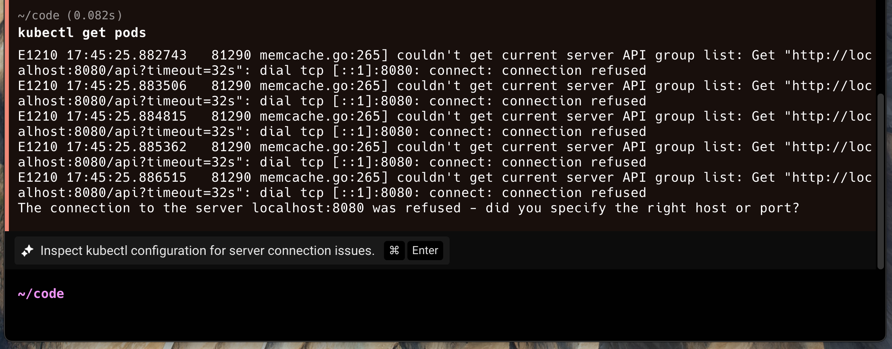
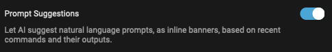
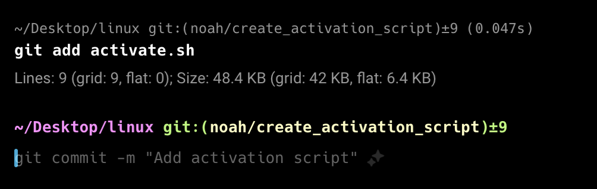
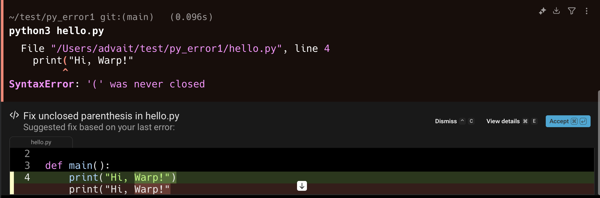

:::note
Active AI features can be disabled in **Settings** > **Agents** > **Warp Agent** with the Active AI toggle.
:::

### Prompt Suggestions

Prompt Suggestions are contextual, AI-powered suggestions that activate Agent Mode. These banners will provide suggestions for what to ask Agent Mode in specific scenarios, similar to how Warp already suggests commands to run.

To disable, please visit **Settings** > **Agents** > **Warp Agent** > **Active AI** > **Prompt Suggestions**

#### Accepting a prompt suggestion

If you press `CMD-ENTER` (on macOS), `CTRL-SHIFT-ENTER` (on Linux/Windows), or click on the chip, the suggestion will auto-populate into your input and run against [Agent Mode](/agent-platform/local-agents/interacting-with-agents/) (with the most recent block attached).

:::note
Prompt Suggestions use an LLM to generate prompts based on your terminal session, specifically the most recent block. These AI requests do not contribute towards your AI limits, however, any accepted prompts run in Agent Mode contribute as normal. Visit **Settings** > **Agents** > **Warp Agent** > **Active AI** if you'd like to turn it off.

If [Secret Redaction](/support-and-community/privacy-and-security/secret-redaction/) is enabled, any selected regexes are applied to content sent to Active AI features to prevent any sensitive data being leaked.
:::

### Next Command

Next Command uses AI to suggest the next command to run based on your active terminal session and command history. It uses your active terminal session contents and an LLM to generate commands.

To disable, please visit **Settings** > **Agents** > **Warp Agent** > **Active AI** > **Next Command**

:::note
Next Command is an LLM-based feature that uses your command history (enriched with git branch, exit code, and directory metadata) as well as recent block input and output to generate the next command suggestions.

[Secret Redaction](/support-and-community/privacy-and-security/secret-redaction/) is automatically applied to any content sent to Active AI features to prevent any sensitive data being leaked.
:::

#### Accepting Next Command suggestions

Press `→` or `CTRL-F` to accept a Next Command suggestion into your input buffer, then press `ENTER` to execute it. You can change the accept keybinding (for example, to `TAB`) via the inline keybinding picker that appears next to the suggestion.

#### Billing

Next Commands are unlimited across all of Warp's plans, including the Free plan. For the latest information on other AI limits and other pricing details, visit [warp.dev/pricing](https://warp.dev/pricing).

### Suggested Code Diffs

Suggested Code Diffs automatically surface potential fixes for command-line errors encountered within Warp. These are most often compiler errors, but they may also include other situations where Warp can confidently predict a straightforward resolution, such as simple merge conflicts.

When an error occurs, Warp evaluates whether it is appropriate for an LLM to generate a fix. If so, a “Generating fix” banner will appear while Warp prepares a proposed diff. You can stop this process at any time by pressing `CTRL + C` or the stop button.

#### **Using a suggested code diff**

Once the diff is generated, you can either dismiss it or accept it. Acceptance can be done directly via the buttons in the diff view, or with `CMD + ENTER` on macOS and `CTRL + ENTER` on Windows/Linux.

You can also view additional details of the diff by pressing `CMD + E` (macOS) or `CTRL + E` (Windows/Linux), which expands the view to allow further inspection (including refining or editing it). You can also use `↓` to view the entire diff.

**Billing**

Suggested Code Diffs do not count toward your AI request limits. There are maximum limits to the number of code diffs surfaced per month, which scales based on your plan tier. For the latest details on plan limits and pricing, please visit [warp.dev/pricing](https://warp.dev/pricing).

## Active AI privacy

See our [Privacy Page](/support-and-community/privacy-and-security/privacy/) for more information on how we handle data with Active AI.
