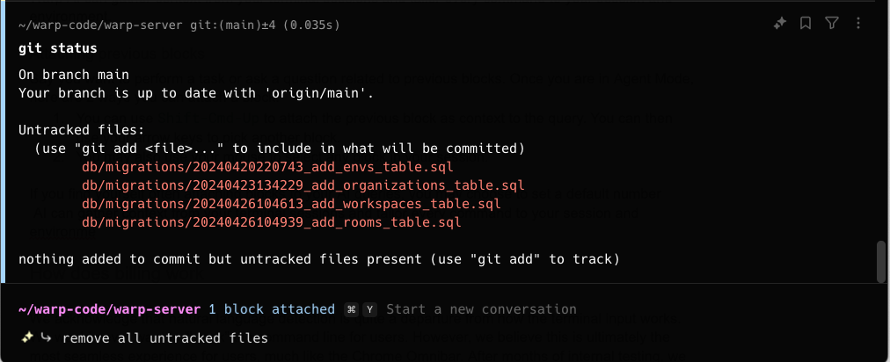

import { Tabs, TabItem } from '@astrojs/starlight/components';

## Attaching blocks as context

Warp’s Agent can use blocks from your Agent conversations as context to better understand your queries and generate more relevant responses.

You can attach a block directly from the terminal blocklist by clicking the AI sparkles icon on it and selecting “Attach as context.”

The most common use case is to ask the AI to fix an error. You can attach the error in a query to Agent Mode and type "fix it."

**If you're already in Agent Mode, use the following ways to attach or clear context from your query:**

<Tabs>
  <TabItem label="macOS">
    **Attach a previous block**

    * To attach blocks to a query, you can use `CMD-UP` to attach the previous block as context to the query. While holding `CMD`, you can then use your `UP/DOWN` keys to pick another block to attach.
      * You may also use your mouse to attach blocks in your session. Hold `CMD` as you click on other blocks to extend your block selection.

    **Clear a previous block**

    * To clear blocks from a query, you can use `CMD-DOWN` until the blocks are removed from context.
      * You may also use your mouse to clear blocks in your session. Hold `CMD` as you click on an attached block to clear it.

    :::note
    When using "Pin to the top" [Input Position](/terminal/appearance/input-position/), the direction for attaching or detaching is reversed (i.e. `CMD-DOWN` attaches blocks to context, while `CMD-UP` clears blocks from context).
    :::
  </TabItem>
  <TabItem label="Windows">
    **Attach a previous block**

    * To attach blocks to a query, you can use `CTRL-UP` to attach the previous block as context to the query. While holding `CTRL`, you can then use your `UP/DOWN` keys to pick another block to attach.
      * You may also use your mouse to select blocks in your session. Hold `CTRL` as you click on other blocks to extend your block selection.

    **Clear a previous block**

    * To clear blocks from a query, you can use `CTRL-DOWN` until the blocks are removed from context.
      * You may also use your mouse to clear blocks in your session. Hold `CTRL` as you click on an attached block to clear it.

    :::note
    When using "Pin to the top" [Input Position](/terminal/appearance/input-position/), the direction for attaching or detaching is reversed (i.e. `CTRL-DOWN` attaches blocks to context, while `CTRL-UP` clears blocks from context).
    :::
  </TabItem>
  <TabItem label="Linux">
    **Attach a previous block**

    * To attach blocks to a query, you can use `CTRL-UP` to attach the previous block as context to the query. While holding `CTRL`, you can then use your `UP/DOWN` keys to pick another block to attach.
      * You may also use your mouse to select blocks in your session. Hold `CTRL` as you click on other blocks to extend your block selection.

    **Clear a previous block**

    * To clear blocks from a query, you can use `CTRL-DOWN` until the blocks are removed from context.
      * You may also use your mouse to clear blocks in your session. Hold `CTRL` as you click on an attached block to clear it.

    :::note
    When using "Pin to the top" [Input Position](/terminal/appearance/input-position/), the direction for attaching or detaching is reversed (i.e. `CTRL-DOWN` attaches blocks to context, while `CTRL-UP` clears blocks from context).
    :::
  </TabItem>
</Tabs>

---

## Block visibility across views

Blocks in Warp belong to either the terminal view or a specific agent conversation:

* **Terminal blocks** - Commands you run directly in the terminal. These always appear in your terminal blocklist and can be attached as context to multiple conversations.
* **Agent conversation blocks** - Commands executed within an agent conversation (either by you or the agent). These only appear within that specific conversation and don't clutter your terminal blocklist.

This separation keeps your terminal view clean while preserving full context within each conversation.

---

## Automatic context in agent conversations

When you're working inside an agent conversation, any shell commands you run are automatically included as context for your next query. This means you can:

1. Run a command to see its output
2. Ask the agent about the results without manually attaching the block

For example, in an agent conversation, run `npm test` and then ask "why did these tests fail?"—the test output is already part of the conversation context.

You can also manually attach terminal view blocks to add additional context from commands you ran outside the conversation.

---

## Pending and attached context

When you select blocks in terminal view and start a new conversation, those blocks become **pending context**:

* **Pending context** - Blocks are selected but the conversation hasn't started yet. If you deselect the blocks (`ESC` or `CMD-K` on macOS, `ESC` or `CTRL-K` on Windows/Linux), they're removed from the agent view.
* **Attached context** - Once you submit your first query, the pending blocks become attached to the conversation and remain part of the context.
