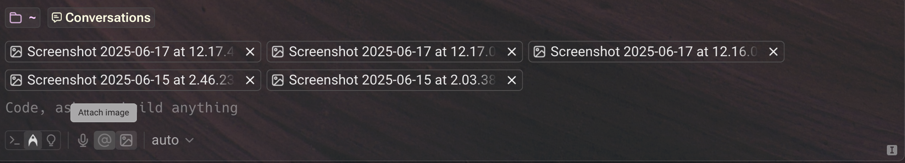
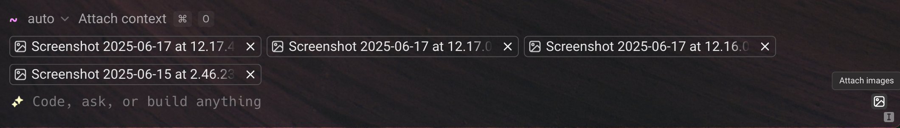

## **Attaching images as context**

To provide visual context, you can attach images directly to an agent prompt. This is useful for including screenshots, diagrams, or other visual references alongside your query.

You can attach images in the following ways:

* Using the **image upload button** found on the toolbelt (either on the bottom left or right), depending on which input mode you're using:

* Copy and paste images directly (e.g. right-click an image > "Copy image" or copy from a file manager) into Warp.
* Drag and drop images, such as from a file manager or screenshot utility.

:::note
Warp accepts the following image formats: `.jpg` , `.jpeg` , `.png` , `.gif` , and .`webp` .
:::

You can attach up to **5 images per request**, and up to **20 images across a single conversation**. Each image is sent to the model provider and immediately discarded — nothing is stored on Warp's servers.

:::caution
**Cloud agent conversations do not currently support image attachments.** Image attachment is only available in local agent conversations. If you need to provide visual context to a cloud agent, describe the image contents in your prompt or reference the image file path within the cloud agent's [environment](/agent-platform/cloud-agents/environments/).
:::

### Model behavior and image handling

All supported models listed in [Model Choice](/agent-platform/capabilities/model-choice/) can interpret image input.

Attaching images will consume additional requests, proportional to the number of images added. To stay within model limits, Warp will intelligently resize images before passing them as context, minimizing token usage and respecting the model's maximum image dimensions.

