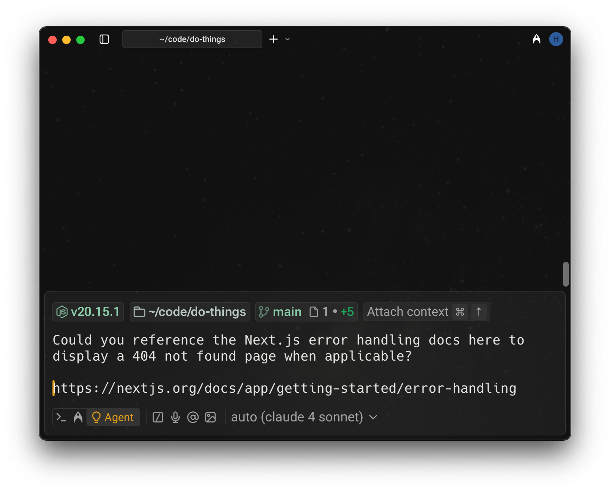

## Referencing websites via URLs

You can attach a public URL to any prompt to provide page content as context. Warp will scrape the page and surface the extracted text directly to the model.

* Only publicly accessible pages are supported.
* The full page is added to the model’s context, which may increase credit usage for long documents.
* Only the specific URL you provide is processed. The agent won’t explore the site, follow links, or crawl beyond that page.

:::note
**Important**: URL attachments are different from web search. If you need the agent to look something up, gather real-time information, or pull in multiple sources, use [Web Search](/agent-platform/capabilities/web-search/) instead.
:::

