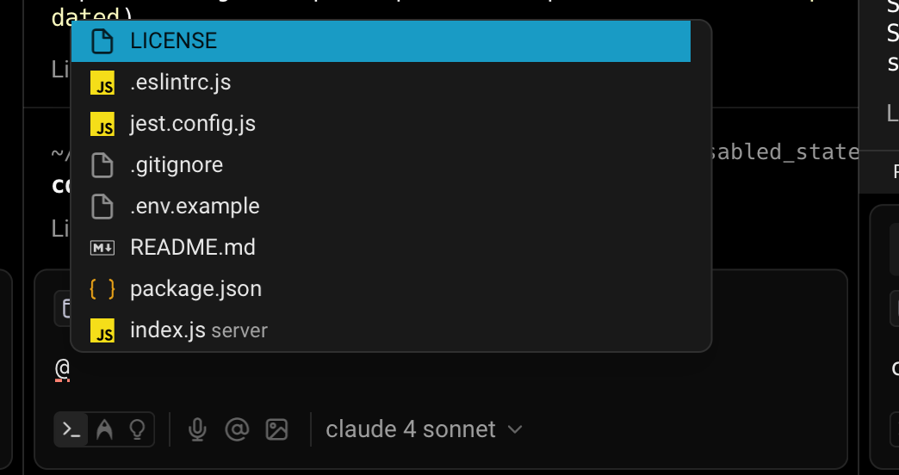
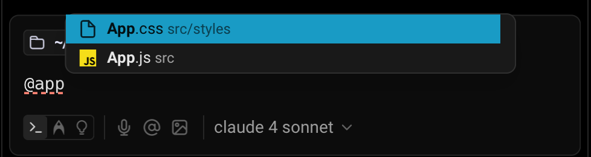
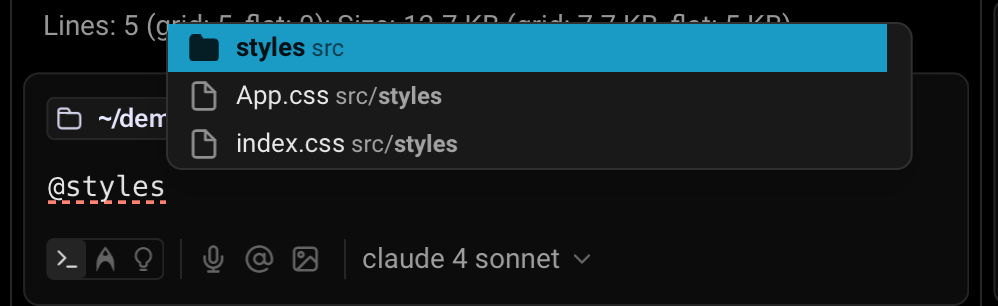

import VideoEmbed from '@components/VideoEmbed.astro';

## How the @ context menu works

You can attach specific files, folders, code symbols, Warp Drive objects, and blocks from other sessions as context to a prompt using the @ symbol. When you’re inside a **Git repository**, typing @ opens a context menu that allows you to search for and select files or directories to include.

:::note
Attaching context with @ works in **both natural language mode** (when interacting with Agents) and **classic terminal commands** for referencing file paths.
:::

**Note**: the search in the @-context menu is always relative to the root of the Git repository, even when you're working in a subdirectory. This means you can reference _any_ file or folder tracked in the repo, regardless of the current working directory.

Additionally, no codebase indexing (via [Codebase Context](/agent-platform/capabilities/codebase-context/)) is required — file search is available immediately in any Git-initialized directory. The search also respects `.gitignore` rules and will exclude ignored files from the results.

### Referencing code symbols

The @ menu can also be used to fuzzy-search for code symbols in your codebase. This includes functions, classes, interfaces, etc.

If you type something like `@main`, Warp will surface a matching `main()` function and insert it into your prompt as a reference with the line number. By pointing the Agent to a specific symbol, you can give it exactly the context it needs to make a targeted edit or explanation.

<VideoEmbed url="https://www.loom.com/share/da0c491bd2a44ed58d4fbdf2c260b019" />

### Referencing Warp Drive objects

Warp Drive objects are another way to attach context with **@**. You can reference:

* [Workflows](/knowledge-and-collaboration/warp-drive/workflows/) — parameterized commands you can name and save in Warp with descriptions and arguments.
* [Notebooks](/knowledge-and-collaboration/warp-drive/notebooks/) — runnable documentation consisting of markdown text and list elements, code blocks, and runnable shell snippets that can be automatically executed in your terminal session.
* [Rules](/agent-platform/capabilities/rules/) — reusable guidelines and constraints that inform how Agents respond to your prompts.

When you select one of these objects, Warp inserts a reference token into your prompt. The contents of the object are then automatically passed as context to the Agent.

<VideoEmbed url="https://www.loom.com/share/abd065af9fea421d925664135341c682" />

### Referencing blocks from other sessions

You are not limited to the current terminal session. With @, you can also bring in blocks of output from earlier sessions.

&#x20;In the demo below, Ian shows how he previously ran cargo clippy and now wants help fixing the reported errors. Typing `@cargo clippy` surfaces the relevant block, which you can insert into your prompt. Once added, the Agent parses the output and generates fixes or explanations directly.&#x20;

You can also reference live blocks, not just those that have already completed execution.

<VideoEmbed url="https://www.loom.com/share/a4e72847341044cca2fed59a6299e1b7" />

### Why @ to reference context?

Attaching context with @ helps you:

* Reference exact outputs instead of copy-pasting entire logs
* Attach relevant files or directories without leaving Warp
* Reuse existing context and knowledge in Warp Drive

This makes Agent interactions more accurate, clearer, and efficient, without additional setup.
