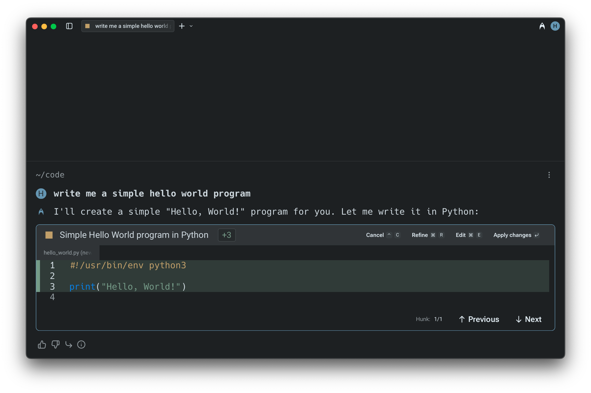
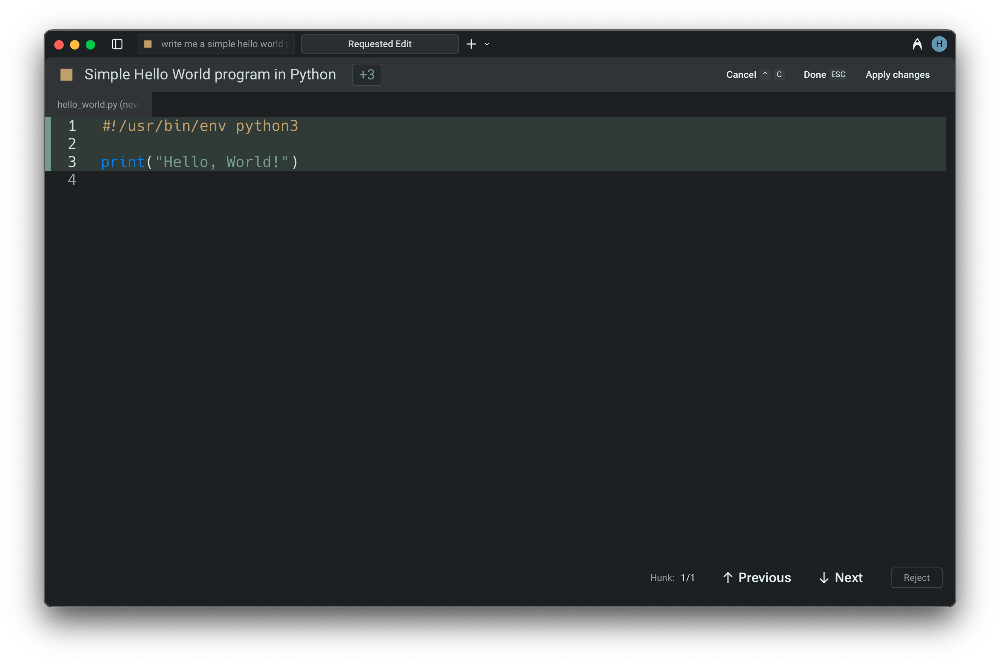

import VideoEmbed from '@components/VideoEmbed.astro';

## Reviewing code diffs

During an Agent Conversation, Warp can generate code diffs that open directly in a built-in diff editor.

This lets you review proposed changes line by line, refine them with natural language, or make manual edits before choosing whether to apply them. It’s a fast, transparent way to stay in control of agent-generated code.

:::caution
If the `Apply Code Diffs` permission is set to `Always allow` in [Agent Profiles & Permissions](/agent-platform/capabilities/agent-profiles-permissions/), code diffs are applied automatically without being surfaced for review. If it's set to `Agent decides` or `Always ask`, you'll always be prompted to review diffs before they're applied.
:::

:::note
Code diffs generated by Warp are never stored on our servers. Warp's coding agent only works on local repositories. The agent can make changes on remote or docker repositories, but falls back to using terminal commands (i.e. `sed`, `grep` ) to make the changes.
:::

You can also choose whether Warp automatically opens the [Code Review](/code/code-review/) panel the first time you accept a diff in a conversation.

## **Navigating and applying diffs**

When an Agent generates a code diff, Warp opens it in a built-in text editor with a visual diff view. Changes are grouped into clear hunks for easy inspection.

* Use the `UP` and `DOWN` arrow keys (or mouse clicks) to move between hunks.
* For multi-file changes, use `LEFT` and `RIGHT` arrow keys to switch between files.
* Once satisfied with the changes, you can apply the diffs using `ENTER` or clicking "**Accept Changes**" to apply the modifications.

:::caution
These modifications will not be applied to the files unless you explicitly accept them.
:::

## **Refining or editing the diffs**

If the initial suggestion needs more work:

* Press `R` or select the "**Refine**" button to provide follow-up instructions in natural language. The agent will regenerate the diff based on your input.
* To manually adjust the code, press `E` or click "**Edit**" to switch into an editable view.
* To cancel a pending operation, use `CTRL-C` (on macOS, Windows, or Linux). Similarly, you can exit the editor at any time with `ESC` .

:::note
You can open up code files in Warp in various different ways, refer to: [Opening files in Warp](/code/code-editor/#opening-files-in-warp)
:::

## Accepting diffs and continuing in Agent Mode

When the Agent generates a code diff outside of an active conversation — for example, from a suggested code banner or a passive recommendation — you can accept the diff and seamlessly continue in Agent Mode. After accepting, Warp opens (or returns to) the Agent conversation with the applied changes as context, so you can immediately ask follow-up questions or request further modifications without starting a new conversation.

### Demo: Editing Agent Code in Warp

Here's an example from [Warp Guides](/guides/), where Zach demonstrates how to review and edit Agent code diffs natively in Warp:

<VideoEmbed url="https://www.youtube.com/watch?time_continue=111&v=dm-P63USsVg" />
