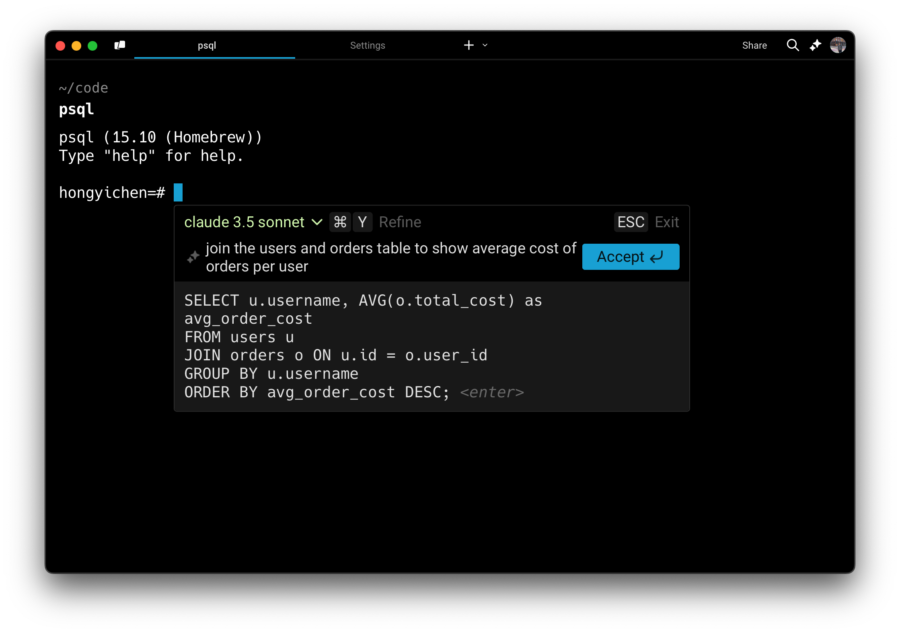
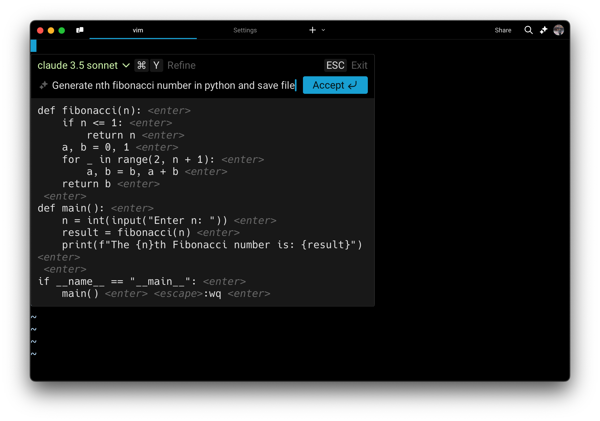

import { Tabs, TabItem } from '@astrojs/starlight/components';
import VideoEmbed from '@components/VideoEmbed.astro';

## What is Generate?

Generate helps turn natural language queries into precise commands as terminal input or contextual suggestions inside interactive commands and programs, whether you're using psql, gdb, git, mysql, or any other CLI tool.

Generate is backed by Large Language Models from API providers like OpenAI and Anthropic, and are completely opt-in.

:::note
Currently, you need to be online to use this feature. If this feature doesn't work, your ISP or firewall may be blocking the calls to `app.warp.dev`
:::

## Ways to Generate with AI

### Generate commands as command-line input

Type `#` on the command-line input to generate command suggestions.

<VideoEmbed url="https://www.loom.com/share/424a763ef0c8455e8269e541301968f2" title="Generating commands as command-line input demo" />

1. Press `` CTRL-` `` or type `#` into the text input editor to search using natural language.
2. Type in the input box what you'd like to do. For example, "replace a string in a file."
3. Results are generated in real-time, and you can keep the current prompt or modify the prompt to generate new commands.
4. When you've found the command you want to execute, it can be run or saved as a Workflow onto Warp Drive to easily recall it in the future.

### \[Legacy] Generate text and contextual suggestions in interactive CLIs

:::caution
**Our legacy Generate feature which works in interactive CLIs has been replaced by** [Full Terminal Use](/agent-platform/capabilities/full-terminal-use/)**, where Warp's agent can now run and control long-running or full-screen terminal applications**.\
The agent can provide input when prompted, navigate interactive screens, and continue execution without stalling.
:::

In interactive CLI applications, you can generate input using natural language.

<Tabs>
  <TabItem label="macOS">
    1. Inside a long-running, interactive command, press `CMD-I` when you see the hint text appear.
    2. Type what you would like to generate in the input box. For example, "show me all tables in my Postgres database" or in Vim, "generate a recursive Fibonacci function and save it to the file."
    3. Results are generated in real time using the [LLM of your choice](/agent-platform/local-agents/generate/#supported-interactive-cli-models).
    4. To refine or follow up on your query, press `CMD-Y`. You can then either edit your last message by pressing `UP ↑` or add a follow-up by typing in new text.
    5. When you've found the text you want to add or execute, press `Enter` or click the Accept button.
  </TabItem>
  <TabItem label="Windows">
    1. Inside a long-running, interactive command, press `CTRL-SHIFT-I` when you see the hint text appear.
    2. Type what you would like to generate in the input box. For example, "show me all tables in my Postgres database" or in Vim, "generate a recursive Fibonacci function and save it to the file."
    3. Results are generated in real time using the [LLM of your choice](/agent-platform/local-agents/generate/#supported-interactive-cli-models)
    4. To refine or follow up on your query, press `CTRL-SHIFT-Y`. You can then either edit your last message by pressing `UP ↑` or add a follow-up by typing in new text.
    5. When you've found the text you want to add or execute, press `Enter` or click the Accept button.
  </TabItem>
  <TabItem label="Linux">
    1. Inside a long-running, interactive command, press `CTRL-SHIFT-I` when you see the hint text appear.
    2. Type what you would like to generate in the input box. For example, "show me all tables in my Postgres database" or in Vim, "generate a recursive Fibonacci function and save it to the file."
    3. Results are generated in real time using the [LLM of your choice](/agent-platform/local-agents/generate/#supported-interactive-cli-models)
    4. To refine or follow up on your query, press `CTRL-SHIFT-Y`. You can then either edit your last message by pressing `UP ↑` or add a follow-up by typing in new text.
    5. When you've found the text you want to add or execute, press `Enter` or click the Accept button.
  </TabItem>
</Tabs>

A couple of other examples of interactive CLIs where you can invoke Generate:

* **Database REPL** (e.g. `psql`, `mysql`, `sqlite`): Generate SQL queries such as "create a table to store user data" or "show me all the rows in orders for the last month"
* **Text editors** (e.g. `vim`, `nano`): Quickly generate text such as a markdown header, a code block comment, or a boilerplate CSS class.
* **Python REPL** (e.g. `ipython`, `python`): Quickly generate Python snippets such as "create a simple plot of x" or "write a unit test for this function"
* **Debugger tools** (e.g. `gdb`, `lldb`): Get commands for setting breakpoints or inspecting memory
* **Version control** (e.g. `git rebase -i`): Speed up complex git commands by describing your goal such as "interactively rebase master onto feature-branch"
* **Cloud provider shells** (e.g. `gcloud`, `aws cli`): faster setup or resource management such as "create a new Kubernetes cluster" or "provision a new RDS instance"

:::caution
If you experience any issues with Generate, please visit known issues for [troubleshooting steps](/support-and-community/troubleshooting-and-support/known-issues/#online-features-dont-work).
:::
