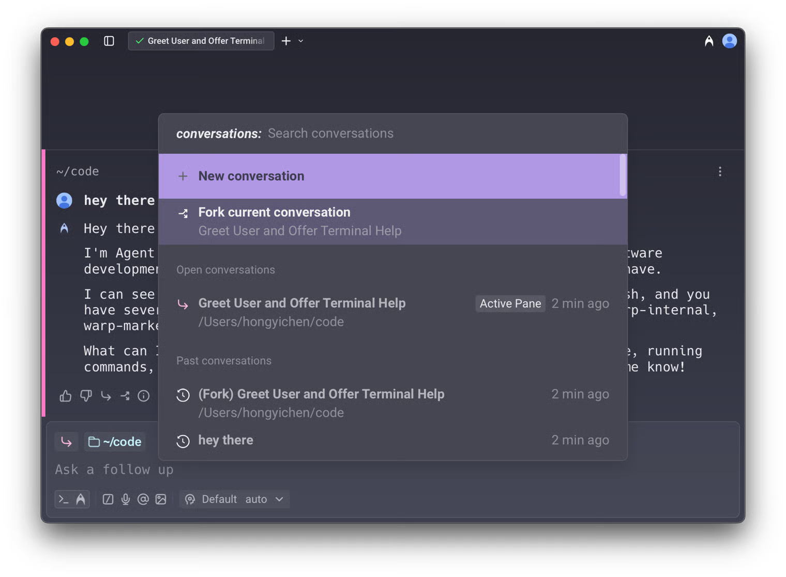
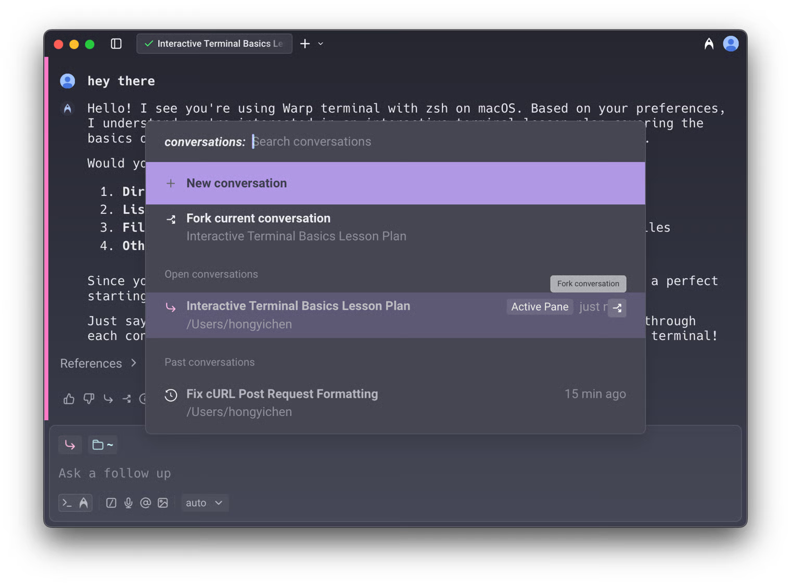
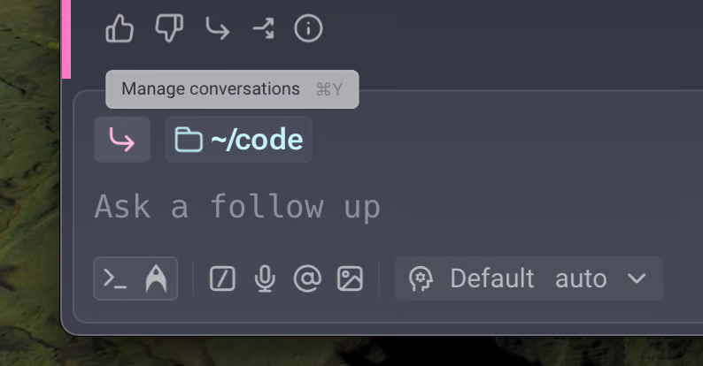
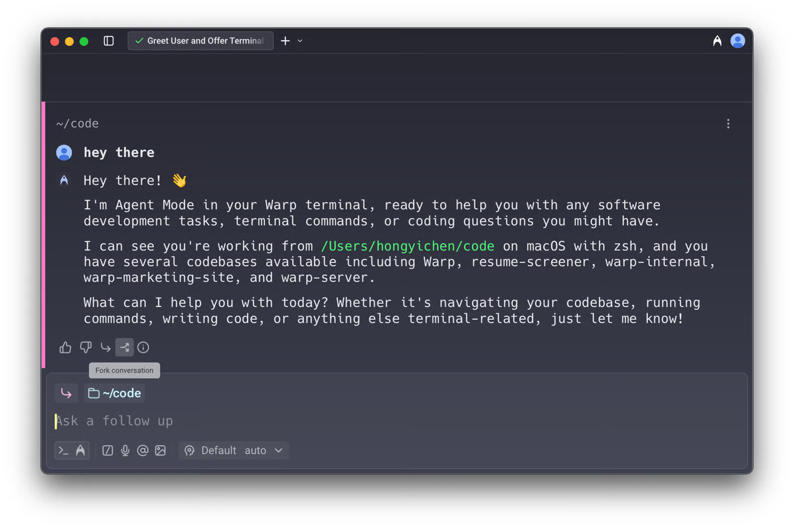
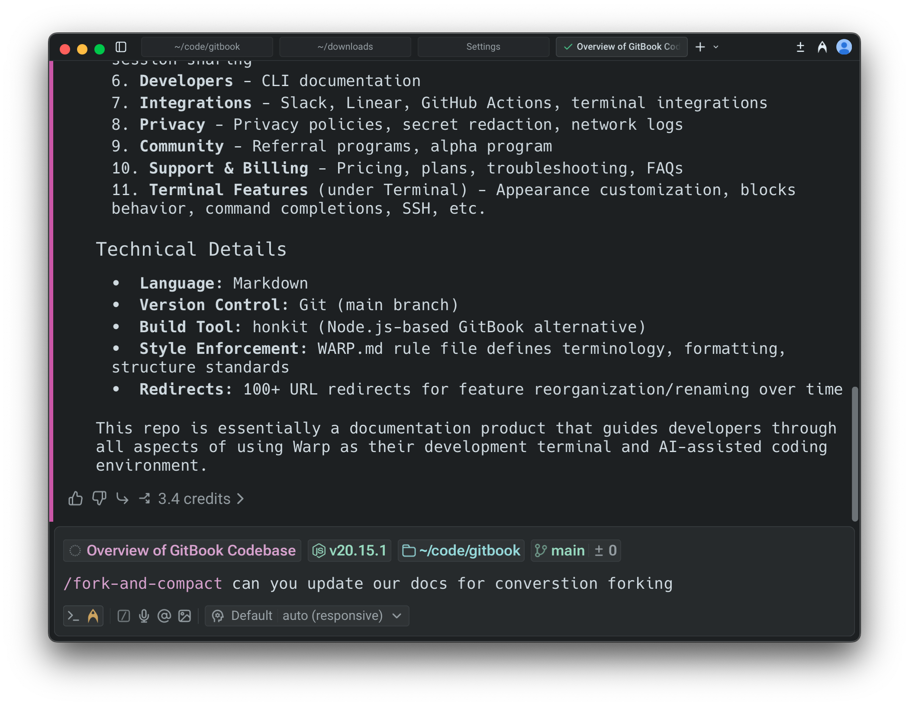

import VideoEmbed from '@components/VideoEmbed.astro';

Warp allows you to **fork conversations** to create a new thread that inherits all of the context, messages, and history from an existing conversation. This is useful when you want to branch off in a new direction without affecting the original conversation.

<VideoEmbed url="https://www.loom.com/share/15164f2abc19437ebefb47a8c6b52eb8?t=54" />

### How conversation forking works

* When you fork a conversation, the new thread starts with the same context and history as the original.
* Any follow-ups in the forked conversation do **not** impact the original. Likewise, continuing in the original conversation does not change the fork.
* Forked conversations behave just like any other conversation: you can move them into new windows, panes, or tabs.
* Your selected model and execution profile are preserved in the forked conversation.

_Example_: You can fork a conversation to explore an alternate solution, ask “what if” questions, or continue down two separate paths in parallel.

### How to fork a conversation

There are five ways to fork an existing conversation:

#### **1. From the Command Palette**

Open the menu using the Command Palette (`CMD + Y` on macOS / `CTRL + SHIFT + Y` on Windows/Linux).

Select **Fork current conversation** to fork your current conversation, or fork a specific conversation from open conversations.

In addition, when you hover over any open conversation in the Command Palette, you'll see a **fork button**. This lets you fork not only active conversations, but also inactive and historical ones.

You can also access this conversation view from the conversation chip in the current conversation.

#### **2. From the footer of the most recent AI response block**

In any conversation in the blocklist, click the **fork button** in the footer of the most recent AI block. A new conversation opens in a separate pane with the full context of the original.

#### **3. Using the `/fork` slash command**

Type `/fork` in the input to fork the current conversation. You can optionally include a prompt after the command, and Warp will send that prompt in the newly forked conversation.

* Press `Enter` to open the fork in a new pane (default)
* Press `⌘+Enter` (macOS) or `Ctrl+Enter` (Windows/Linux) to open the fork in the current pane

_Example_: `/fork Can you try a different approach?` Forks the selected conversation and immediately sends `Can you try a different approach?` in the forked conversation.

#### **4. Using the /fork-and-compact slash command**

Type `/fork-and-compact` to fork the current conversation and automatically compact the forked version. This combines forking with [context window management](/agent-platform/local-agents/interacting-with-agents/#context-window-management), giving you a fresh start with a summarized context.

* Press `Enter` to open the fork in a new pane (default)
* Press `⌘+Enter` (macOS) or `Ctrl+Enter` (Windows/Linux) to open the fork in the current pane

#### **5. Using the `/fork-from` slash command**

Type `/fork-from` to open a searchable menu of all queries in the current conversation. Select a query to fork the conversation from that specific point—everything up to and including that exchange is included in the fork, but subsequent messages are excluded.

This is a more discoverable alternative to right-clicking on an agent response block.

### Fork from anywhere in a conversation

In addition to forking from the end of a conversation, you can fork from any point in the conversation history. This lets you return to an earlier agent response and branch off in a new direction from there.

<VideoEmbed url="https://youtu.be/SlhF4_0bBxY" />

To fork from a specific point, **right-click** on any agent response block or click the three-dot menu in the top-right corner of the block.&#x20;

* Select **Fork conversation from here** to create a new conversation that includes everything up to and including that response, but excludes any queries or responses that came after it.

**This is particularly useful for:**

* **Exploring alternate paths** - Go back to a point where the conversation was on track and try a different approach.
* **Managing your context window** - If a conversation has grown too long, fork from an earlier point to continue with only the relevant context.
* **Preventing context pollution** - When a conversation has accumulated errors or gone off track, fork from before those issues occurred to start fresh.

### Settings

You can configure the default layout for forked conversations in **Settings** > **Features** > **Open forked conversation layout**:

* **Split Pane** (default): Opens the forked conversation in a new pane alongside your current view.
* **New Tab**: Opens the forked conversation in a new tab.

This setting controls the default behavior when forking via the Command Palette, AI block footer button, or slash commands (when pressing `Enter`).

### Using forked conversations

* Once forked, you can continue prompting as if you were still in the original conversation. The original conversation remains unchanged, allowing you to reference or continue both in parallel.
* For example, after forking you can ask _"Could you explain more?"_ and Warp responds using the inherited context.

**Forking is especially useful when:**

* You want to explore different approaches without losing the original thread.
* You need to keep one conversation "clean" while experimenting in another.
* You want to reuse context or specific blocks from older conversations.
