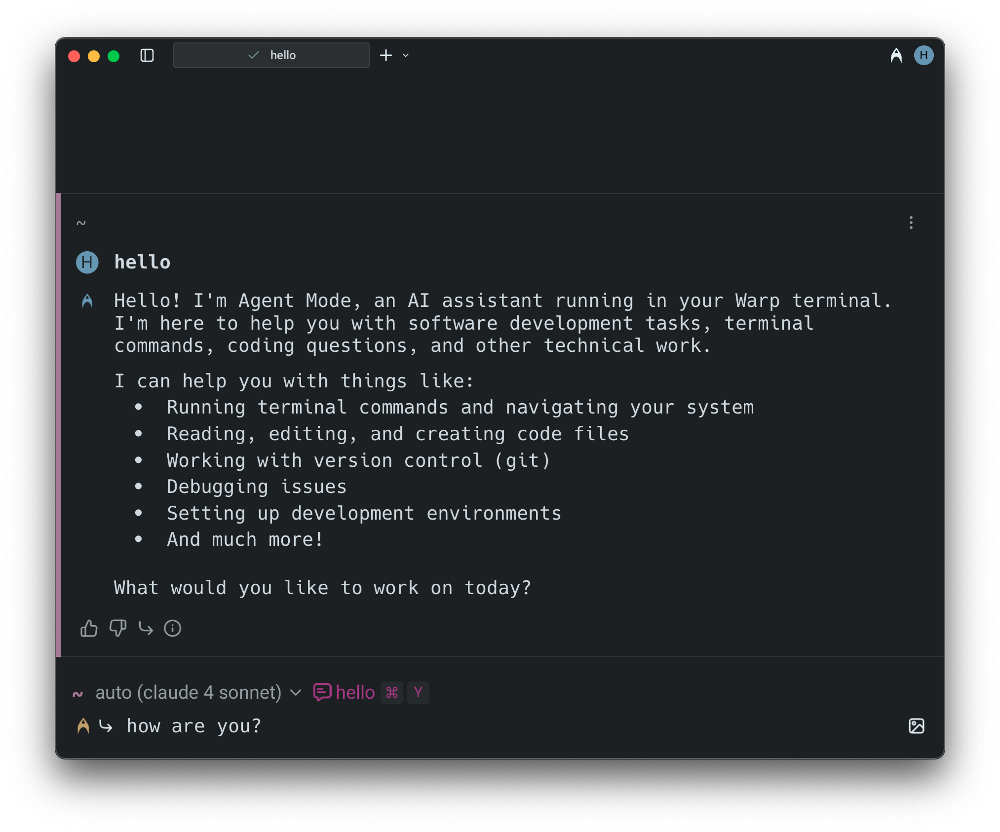
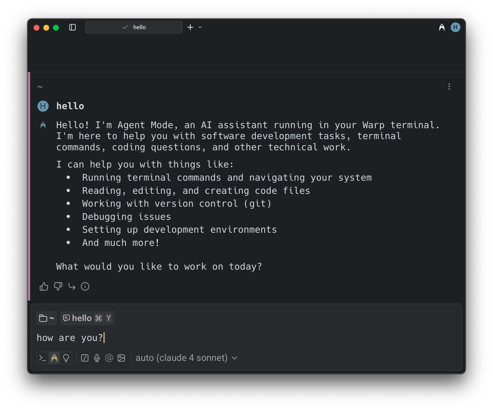
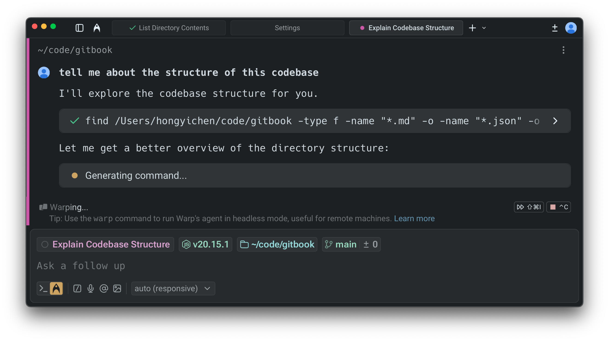
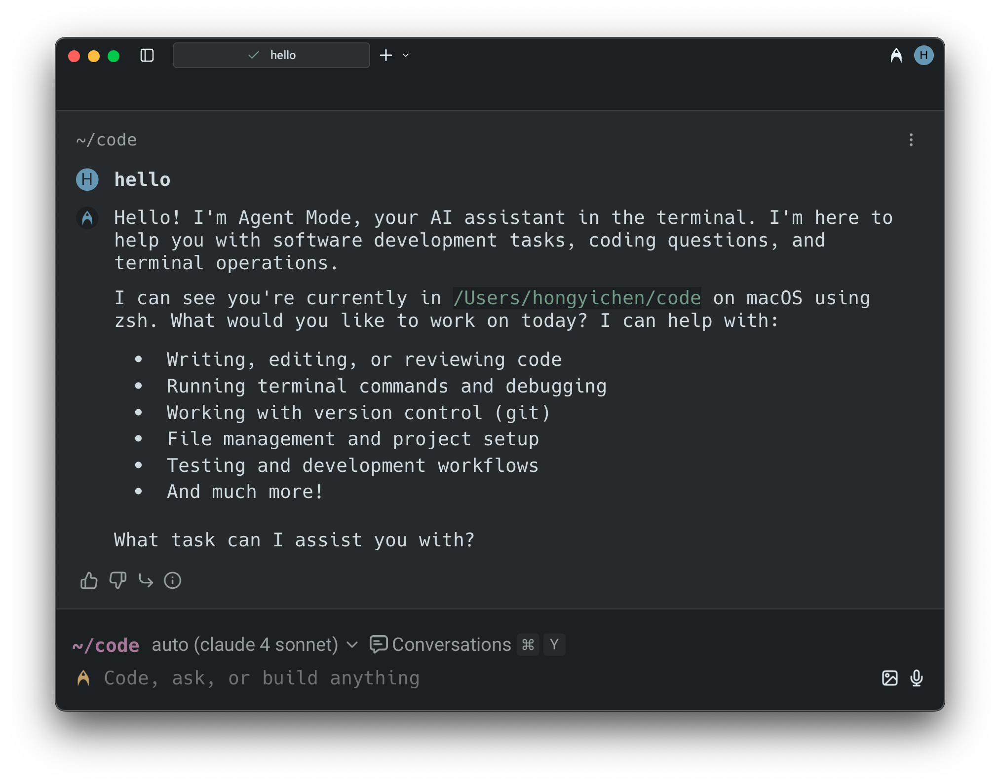
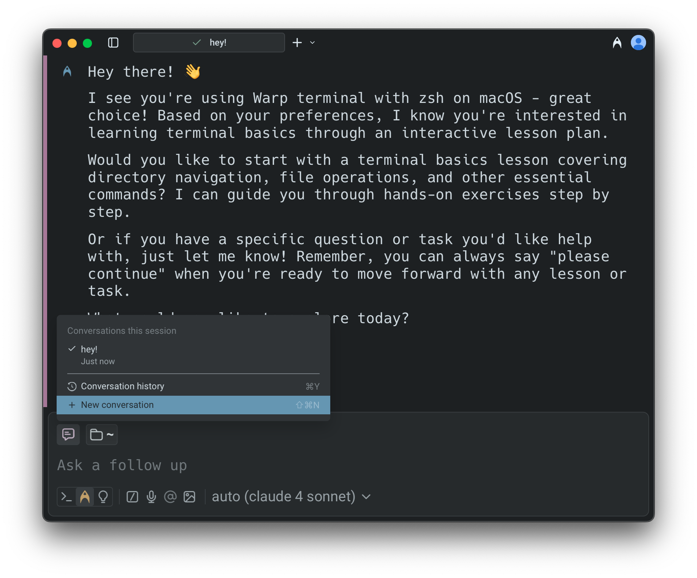
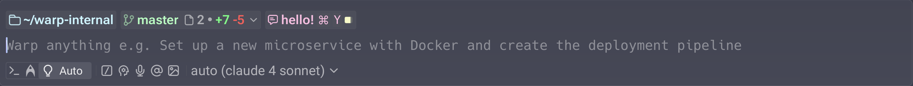
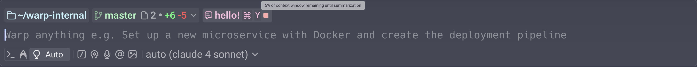
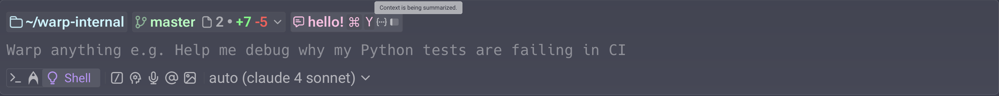
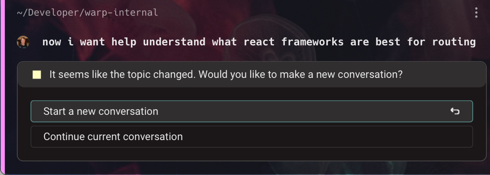
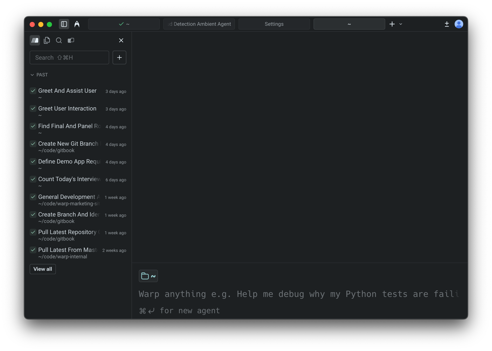

import { Tabs, TabItem } from '@astrojs/starlight/components';
import VideoEmbed from '@components/VideoEmbed.astro';

## Conversations with Warp's Agent

Conceptually, a conversation is a sequence of AI queries and blocks. Conversations are tied to sessions and you can run multiple Agent Mode conversations simultaneously in different windows, tabs, or panes.

Conversations work best when the queries are related. If your new question builds on the last one, continue in the same conversation. If it is unrelated, it is better to start a new one so that the context remains relevant.

:::note
Long conversations can cause slower performance and lower-quality answers. When working on a separate task or question, start fresh rather than relying on context from earlier interactions.
:::

:::note
To access conversations across devices, share them with teammates, or restore past cloud Agent conversations, enable [Cloud-synced Conversations](/agent-platform/local-agents/cloud-conversations/).
:::

### Staying in a conversation (follow-ups)

By default, if you ask an AI query immediately after interacting in Agent Mode, your query is sent as a **follow-up** to the current conversation.

* In **Classic Input**, you'll see both the pink highlight bar on the left side of the block and a bent follow-up arrow (↳) next to your input. The conversation input chip also shows which conversation you are in.
* In **Terminal and Agent modes** (the default), the conversation view provides a dedicated space for multi-turn interactions. The conversation panel shows which conversation you are in.

**To follow-up on a previous conversation:**

* Simply continue prompting the agent if you are already in an active conversation.
* Open the **Conversations menu** (`CMD + Y` on macOS, `CTRL + SHIFT + Y` on Windows/Linux), select a conversation, and then enter your query.
* Alternatively, click the pink conversation chip in the input field to resume.

#### Agent tips in the input

While Warp’s agent is thinking and processing your request, Warp may surface short tips with helpful workflows and ways to use Warp. These tips appear under the Warping indicator.

You can enable or disable these tips in two places:

* **Settings**: **Settings** > **Agents** > **Warp Agent** > **Input** > **Show agent tips**
* **Command Palette**: Open the Command Palette (`CMD + P` on macOS, `CTRL + SHIFT + P` on Windows/Linux), then select "**Show Agent Tips**" or "**Hide Agent Tips**"

### **Managing conversations**

You can view previous conversations or start a new conversation via the **Conversations Menu** (`CMD + Y` on macOS, `CTRL + SHIFT + Y` on Windows/Linux).

<VideoEmbed url="https://www.loom.com/share/9cc2451412be43e389a6b1414ea185e4?sid=4457ba14-4876-4988-ade6-1dca43dda96a" />

:::note
The "New Conversation" item disappears once you start searching for an actual conversation.
:::

### **Starting a new conversation**

Warp automatically creates a new conversation in a few situations. For example, if you ask an AI query after running a shell command or if three hours pass without activity, Agent Mode will start a fresh conversation.

Visual indicators differ slightly depending on input mode:

* In **Classic Input,** a new conversation begins when there is no follow-up arrow (↳) next to your input.
* In **Terminal and Agent modes**, starting a new conversation opens a fresh conversation view. Use the conversation panel to see all active and past conversations.

<Tabs>
  <TabItem label="macOS">
    You can also start a new conversation manually at any time:

    * In **Classic Input**, press `CMD + I` or press `BACKSPACE` while in follow-up mode.
    * In **Terminal and Agent modes**, press `CMD + ↵` to start a new conversation, or use the `/new` slash command.
    * Open the **Conversations Menu** using `CMD + Y` and select "New Conversation".
  </TabItem>
  <TabItem label="Windows">
    You can also start a new conversation manually at any time:

    * In **Classic Input**, press `CTRL + I` or press `BACKSPACE` while in follow-up mode.
    * In **Terminal and Agent modes**, press `CTRL + SHIFT + ↵` to start a new conversation, or use the `/new` slash command.
    * Open the **Conversations Menu** using `CTRL + SHIFT + Y` and select "New Conversation".
  </TabItem>
  <TabItem label="Linux">
    You can also start a new conversation manually at any time:

    * In **Classic Input**, press `CTRL + I` or press `BACKSPACE` while in follow-up mode.
    * In **Terminal and Agent modes**, press `CTRL + SHIFT + ↵` to start a new conversation, or use the `/new` slash command.
    * Open the **Conversations Menu** using `CTRL + SHIFT + Y` and select "New Conversation".
  </TabItem>
</Tabs>

## Context window management

Every conversation with an agent consumes tokens stored in a **context window**. The context window (sometimes called _context length_) is the amount of text (measured in tokens) that a Large Language Model (LLM) can process at one time. **The size of the context window depends on the model you are using.**

As tokens accumulate and exceed the context window, performance and response quality may degrade. If the context window is exceeded, the model may lose track of earlier parts of the conversation, and **Warp will automatically summarize the conversation to free up space**.

### Warp provides a **context window usage indicator** to help you track this:

When less than 20% of the window is used, no indicator is shown. As more tokens accumulate, the usage bar progresses to reflect how much of the context window has been consumed.

As you approach the limit, the indicator turns red to warn that the context window is nearly full.

Once the limit is exceeded, Warp automatically summarizes the conversation so you can continue without losing important context.

The context window usage indicator is available in agent conversation views.

:::note
If you switch models during a conversation, the context usage indicator updates only after you send your next message.
:::

## Conversation segmentation

Warp automatically detects when your query has shifted to a new topic. When this happens, it suggests starting a new conversation instead of continuing in the same context.

These options appear in the blocklist, where you can decide whether to branch off into a new conversation or keep going with the current one.

You can also create a new conversation manually at any time by using the keyboard shortcut, opening a new tab, or opening a new pane.

<Tabs>
  <TabItem label="macOS">
    * Start a new conversation: `CMD + SHIFT + N`
    * Open a new tab: `CMD + T`
    * Open a new pane: `CMD + D`
  </TabItem>
  <TabItem label="Windows">
    * Start a new conversation: `CTRL + SHIFT + N`
    * Open a new tab: `CTRL + SHIFT + T`
    * Open a new pane: `CTRL + SHIFT + D`
  </TabItem>
  <TabItem label="Linux">
    * Start a new conversation: `CTRL + SHIFT + N`
    * Open a new tab: `CTRL + SHIFT + T`
    * Open a new pane: `CTRL + SHIFT + D`
  </TabItem>
</Tabs>

## Conversation Panel

The **Conversation Panel** on the left side of the window is the home for browsing and switching between agent conversations. It's designed to make multi-threaded work obvious: you can see what's active, what you ran recently, and jump back into any thread without guessing where your context went.

### Panel layout

The conversation panel is split into two dropdowns (collapsible sections) that help you navigate between conversations:

#### Active

The **Active** dropdown lists conversations where you have sent at least one query since opening them. Simply expanding a conversation does not make it active—you need to interact with the Agent first.

* Select a conversation to switch to it immediately.
* The conversation you're currently viewing is highlighted.
* Cloud agent conversations and Oz runs always appear in **Active** while they are open.

#### Past

The **Past** dropdown lists your recent conversation history.

Each row typically shows:

* Conversation title
* When it happened (for example, "8 min ago", "3 days ago")
* Working directory (when relevant)

Use **Past** to restore a previous conversation. When you select a past conversation, Warp reopens it in a new tab or your active pane, letting you continue where you left off.

### Conversation storage

By default, your agent conversations are stored locally on your machine. You can optionally enable **cloud-synced conversations** to:

* Access your conversation history across different devices
* Share conversations with teammates
* Retain conversations when you log out or switch machines

For full details on enabling cloud sync, sharing conversations, and accessing cloud agent conversations, see [Cloud-synced Conversations](/agent-platform/local-agents/cloud-conversations/).

:::note
To enable cloud sync, go to **Settings** > **Privacy** and toggle on **"Store AI conversations in the cloud"**. When disabled, conversations are stored locally only and cannot be shared. Note that cloud agent conversations are always stored in the cloud regardless of this setting.
:::

### Search

Use the search field at the top of the conversation panel to quickly find your conversation.

* Type to filter conversations by title (and, in some builds, by directory/context).
* Useful when you have many threads and want to jump directly to one.

### New conversation

Click the **New conversation** button at the bottom of the **Active** conversation list to start a new conversation.

Starting a new conversation creates a fresh thread in the **Active** dropdown, without deleting or overwriting your previous ones.

### Navigation behavior

Navigation between [Terminal and Agent modes](/agent-platform/local-agents/interacting-with-agents/terminal-and-agent-modes/) is designed to be direct:

* **Clicking an active conversation** - Takes you directly to that conversation view.
* **Clicking a past conversation** - Opens the conversation in a **new pane**, preserving your current context.
* **Command Palette** - Open the Command Palette and type `conversations:` to filter and navigate directly to any conversation.
* **`⌘Y` conversation selector** - Opens a dedicated menu showing your existing and past conversations. This works in both terminal view and agent view.
* **Up-arrow history** - Shows both past shell commands and past prompts you've sent in recent conversations. The behavior differs by context:
  * **In terminal view** - Shows both past shell commands and recent conversations.
  * **In agent view** - Shows past prompts you've sent in conversations.

---

### Ways to move around

Use `esc` or the back button to return to terminal mode, `⌘Y` to open the conversation selector, or `⌘↩` to start a new conversation. For a complete list of keyboard shortcuts and slash commands, see [Terminal and Agent modes - Keyboard shortcuts](/agent-platform/local-agents/interacting-with-agents/terminal-and-agent-modes/#keyboard-shortcuts-quick-reference).

### Exit confirmation for in-progress conversations

Exiting a conversation that is still in progress will **cancel** the agent's current work. To prevent accidental cancellations, Warp shows a confirmation hint:

* **First exit attempt** - The hint changes to "Press again to exit" (or similar).
* **Confirmation window** - You have about 2 seconds to press `esc` or `^C` again to confirm.
* **After confirmation** - Warp exits the conversation and cancels the in-progress request.

This confirmation step ensures you don't accidentally lose work when the agent is mid-task.

:::note
Empty new conversations (where you haven't sent any messages yet) can be exited immediately without confirmation.
:::
