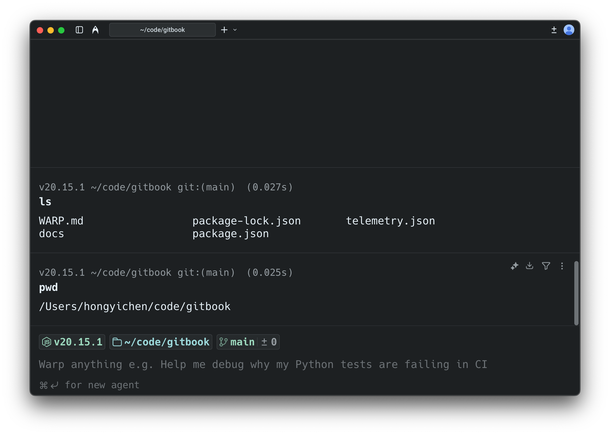
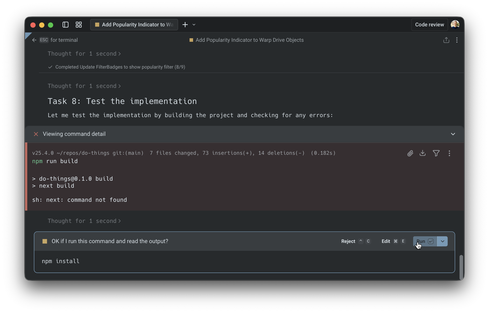
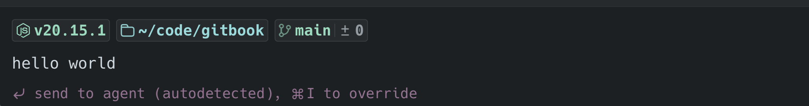
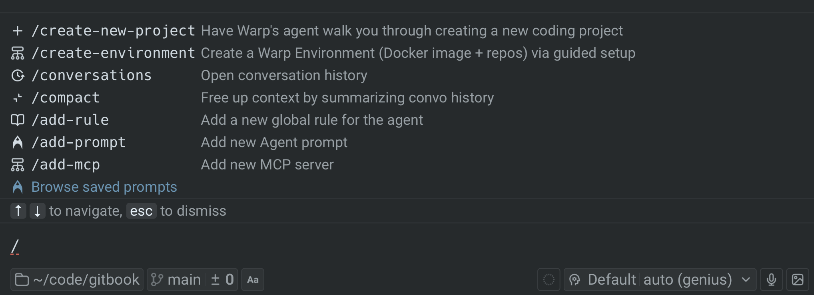
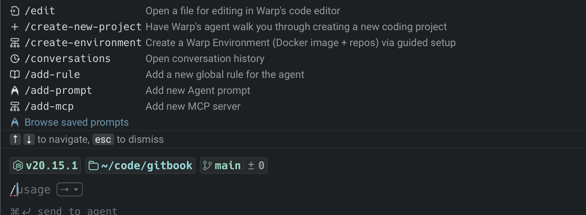

import VideoEmbed from '@components/VideoEmbed.astro';

Warp provides two distinct modes: a clean terminal for commands, and a dedicated conversation view for multi-turn conversations with [Oz, Warp's agent](/agent-platform/local-agents/interacting-with-agents/).

<VideoEmbed url="https://youtu.be/J715YW5VC18" />

---

## Key terminology

Before diving in, here are two key concepts:

* **Terminal session** - Your shell environment where you run commands. This is the default mode when you open Warp—a clean, traditional terminal input.
* **Oz agent conversation** - A multi-turn interaction with Oz. Conversations maintain context across exchanges and have their own dedicated view with richer controls.

Terminal and Agent modes make switching between these two contexts seamless while keeping them visually distinct.

---

## Why two modes

Terminal and Agent modes separate your terminal and agent workflows into distinct contexts:

* **Clean terminal by default** - Minimal input when you're running commands. Agent controls appear only when you need them.
* **Dedicated conversation view** - Multi-turn agent workflow spaces have full controls like model select, voice input, image attachments, and conversation history.
* **Explicit mode switching** - The current mode is clearly visible, enabling better workflow organization—you can separate, minimize, and expand different conversations.

---

## Two distinct modes

### Terminal mode (default)

Terminal mode is the default when you open a new tab or pane.

* Looks and behaves like a traditional terminal input.
* Agent controls are not always visible, keeping the interface clean.
* A message bar shows contextual hints for interacting with agents.

**Terminal mode hints**

The message bar at the bottom of the terminal provides contextual guidance:

* **Default hint** - Shows `⌘↩ for new agent` when the input is empty.
* **Send to agent** - Shows `⌘↩ to send to agent` when you have text that could be a prompt.
* **Error block attachment** - When the last command failed, shows a hint to attach the output as agent context (e.g., `⌘↑ attach 'npm install...' output as agent context`).
* **Attached context indicator** - Shows when you have blocks or text selections attached (e.g., `⌘↩ to send to agent with 'git status' attached`).
* **Continue conversation** - When your last visible item is an agent conversation block, shows `⌘Y to continue conversation`.

If auto-detection is enabled, Warp labels your input as "agent" or "shell" before you submit, showing "(autodetected)" in magenta. See [Understanding auto-detection](#understanding-auto-detection) for configuration and override methods.

**Disabling the message bar:** To hide the terminal mode hint bar while keeping AI features enabled, go to **Settings** > **Features** > **Terminal Input** and toggle off **Show terminal input message line**. This only hides the contextual hints—it does not disable any AI functionality.

:::caution
If you disable the message bar while auto-detection is enabled, you won't see the visual indicator that tells you whether Warp detected your input as a shell command or an agent prompt. Consider also disabling auto-detection (**Settings** > **Agents** > **Warp Agent** > **Input**) if you turn off the message bar.
:::

:::note
The shortcuts shown on this page use macOS keybindings. For Windows and Linux shortcuts, see [Keyboard Shortcuts](/getting-started/keyboard-shortcuts/).
:::

### Oz agent conversation view (expanded UI)

* A dedicated conversation view with richer agent controls including model select, voice input, image attachments, and conversation management.
* Familiar "charms" (current directory, git branch, diff view entry point, etc.) are still available.
* Designed for multi-turn workflows and managing multiple conversations.

**Key difference**

Agent controls appear only when you're in a conversation, keeping your terminal clean otherwise.

In the previous UI, agent controls were always present. With Terminal and Agent modes, these controls are hidden by default and appear **once you enter an agent conversation.**

:::note
Agent conversation views are identified with an alternative background color and the input toolbelt showing model selector, voice input, and image attachment buttons.
:::

#### Customizing the input toolbelt

The chips and buttons on the agent input toolbelt can be reordered, hidden, or moved between the left and right sides of the input. Right-click the input in an agent conversation and select **Edit agent toolbelt** to open the editor. Your layout persists across app restarts.

Agent Mode-specific items include the model selector, autodetection toggle, Context Usage, and fast forward toggle. Shared items like voice input, file attachment, and context chips appear in both the Agent Mode toolbelt and the [CLI coding agent toolbelt](/agent-platform/cli-agents/overview/#customizing-the-toolbelt).

**Block origin and visibility**

Blocks in Warp belong to either the terminal view or a specific agent conversation:

* **Terminal blocks** - Commands you run directly in the terminal always appear in your terminal blocklist and can be attached as context to any conversation.
* **Agent conversation blocks** - Commands executed within an agent conversation (either by you or the agent) only appear within that specific conversation and don't appear in the terminal blocklist.

In agent conversations, context is managed automatically, with optional manual attachment from terminal view:

* **Automatic context** - Commands executed within an agent conversation are included as context for subsequent prompts.
* **Manual attachment** - You can attach terminal blocks to bring in outputs from outside the conversation.
* **Conversation scope** - Agent conversation blocks stay scoped to that conversation, while terminal blocks remain in the terminal blocklist.

This separation keeps your terminal view clean while preserving full context within each conversation. For shortcuts, pending vs. attached context, and block selection behavior, see [Blocks as Context](/agent-platform/local-agents/agent-context/blocks-as-context/).

#### Cloud agent conversations

In addition to local agent conversations, you can start **Oz cloud agent conversations** that run in an isolated cloud environment. Cloud agents are useful for:

* Running parallel agents across multiple tasks
* Running agents remotely on hosted computers (offloading compute from your local machine)
* Running agents autonomously in the cloud
* Checking in on your agents from anywhere

To start a cloud agent conversation, press `⌥⌘↩` (Option+Command+Enter on macOS, or `Ctrl+Alt+Enter` on Windows/Linux) from terminal mode. You can also use the welcome block's "Start cloud project" action.

Cloud agent conversations have a few differences from local conversations:

* **Environment selector** - Choose which [Warp Environment](/agent-platform/cloud-agents/environments/) to run in
* **Credits indicator** - Shows your remaining cloud agent credits
* **Different zero state** - The conversation header indicates "New Oz cloud agent conversation"

Cloud agent conversations are always stored in the cloud. For more details on accessing and sharing cloud conversations, see [Cloud-synced Conversations](/agent-platform/local-agents/cloud-conversations/).

**Accessing running or past cloud conversations:**

* **From the conversation list panel** - Cloud conversations appear alongside local conversations. Click to open.
* **From the management view** - Use the [Agent Management view](/agent-platform/cloud-agents/managing-cloud-agents/) to see all cloud agent runs, filter by status, and click any row to open the conversation.
* **From the Oz web app** - Access your cloud agents at [oz.warp.dev](https://oz.warp.dev) to manage runs from any browser.

For more on cloud agents, see [Cloud Agents Overview](/agent-platform/cloud-agents/overview/).

---

## Understanding auto-detection

Auto-detection (which detects whether you're typing natural language or a shell command) helps Warp interpret each input as either a shell command or an agent request. When auto-detection is enabled, Warp shows an **inline indicator** in the prompt (for example, "(autodetected)" in magenta).

### How it works

**In terminal mode:**

When you type text that appears to be a natural language request (e.g., "Summarize the dependencies in this project"), Warp labels it as "agent" and displays the "(autodetected)" indicator. Pressing Enter will send your input directly to the agent in a new conversation, creating a "quicksend" workflow for text-only requests.

**In agent conversation view:**

When auto-detection identifies your input as a shell command, Warp displays a distinct UI border around the input to indicate the mode switch. This helps you understand that your input will run as a command rather than being sent to the agent.

### Settings

:::note
You can control auto-detection separately for terminal mode and agent conversation view. Both toggles are in **Settings** > **Agents** > **Warp Agent** > **Input**:

* **Terminal mode:** Toggle **Autodetect agent prompts in terminal input**
* **Agent conversation view:** Toggle **Autodetect terminal commands in agent input**
:::

### Override methods

There are multiple ways to override auto-detection:

* **Keyboard shortcut** - Press `⌘I` to switch between command and Agent Mode.
* **`!` prefix** - In agent view, prepend `!` to your input to force it to run as a shell command (e.g., `!ls` or `!git status`).

Common examples:

* You typed something that looks like a command, but you intended an agent request.
* You typed a sentence, but you intended it to run as a command (rare, but it happens).

:::note
**Note:** After you override, the selection is "sticky" for that entry, so you can submit confidently.
:::

### Defaults for new vs existing users

Auto-detection is enabled by default for new Warp users. For users who had Warp before Terminal and Agent modes were introduced, auto-detection is disabled by default to preserve their existing workflows.

---

## Entering and navigating conversations

### How to enter a conversation

There are several ways to start or enter an Oz agent conversation:

#### A) Use the `/agent` or `/new` slash command

Type `/agent` or `/new` in terminal mode to enter the agent conversation view. This is the recommended way to explicitly switch to Agent Mode.

* `/agent` or `/new` - Opens a new agent conversation view with full controls
* `/agent <prompt>` - Sends your prompt directly to the agent in a new conversation

#### B) Use the keyboard shortcut

Press `⌘↩` (Command+Enter on macOS, or `Ctrl+Shift+Enter` on Windows/Linux) to enter the conversation view immediately. This is a shortcut for `/agent`.

**Use this when you want to:**

* attach an image
* use voice input
* access other conversation-only controls before sending your first message

#### C) Quicksend with auto-detection

When auto-detection is enabled in terminal mode, you can start a conversation immediately:

1. Type a natural language request (e.g., "Summarize the dependencies in this project").
2. If Warp detects it as an agent request, it shows an "(autodetected)" indicator.
3. Press Enter to send directly to the agent in a new conversation.

This "quicksend" method is useful for quick, text-only requests when you don't need conversation-only controls like voice input or image attachments.

#### D) Continue from the up-arrow history menu

Press `↑` (up arrow) to open an inline history menu. The menu contents vary by context—see [Navigation behavior](/agent-platform/local-agents/interacting-with-agents/#navigation-behavior) for details on how up-arrow works in terminal view vs. agent view.

#### E) Click an active AI suggestion

When [Active AI Recommendations](/agent-platform/local-agents/active-ai/) is enabled, Warp displays contextual prompt suggestions based on your recent activity. Clicking any of these suggestions opens the agent conversation view and sends that prompt immediately.

---

### Navigating conversations

Warp includes a **Conversation Panel** for browsing and managing your agent conversations. For details on the panel layout, navigation, and conversation storage, see [Agent Conversations](/agent-platform/local-agents/interacting-with-agents/).

### Using slash commands

**In an agent conversation**

While you're in an agent conversation, you can access Warp's [slash commands](/agent-platform/capabilities/slash-commands/) any time by typing `/` in the input.

* Type `/` to open the command menu
* Keep typing to filter commands (for example: `/conversations`, `/compact`)
* Use `↑` / `↓` to navigate and `Enter` to run
* Press `esc` to dismiss the menu

**Key slash commands in Agent Mode:**

* `/new` or `/agent` - Start a new conversation.
* `/plan` or `/plan <prompt>` - Enter agent view and start a planning conversation. The agent will create an implementation plan before making changes.
* `/conversations` - Open the conversation list panel.
* `/compact` - Summarize and compact the current conversation to free up context window space.
* `/fork` - Fork the current conversation into a new thread. Press `Enter` to fork in the existing pane, or `⌘↩` (`Ctrl+Shift+Enter` on Windows/Linux) to fork in a new pane.
* `/fork-and-compact` - Fork the conversation and automatically summarize it.
* `/fork from` - Choose a specific point in the conversation to fork from. A menu appears showing your previous queries—select one to fork from that point.
* `/model` - Select or change the AI model for the conversation.

Slash commands are a quick way to take common actions without leaving the keyboard.

**In terminal mode**

Slash commands aren't just for agent conversations. You can also type `/` in terminal mode to open a limited set of commands.

:::note
Agent conversations expose the full set of slash commands (including `/fork`, `/compact`, and `/model`). Terminal mode exposes a reduced set focused on quick actions.
:::

For the complete list of available slash commands, see [Slash Commands](/agent-platform/capabilities/slash-commands/).

### Forking conversations

Forking lets you branch off from an existing conversation to explore a different direction without losing your original thread.

**How to fork:**

1. In an agent conversation, type `/fork` and press `Enter`.
2. Choose where to open the forked conversation:
   * `Enter` - Fork in the current pane (replaces the current view).
   * `⌘↩` (`Ctrl+Shift+Enter` on Windows/Linux) - Fork in a new pane (keeps the original visible).

**Fork and compact:**

Use `/fork-and-compact` to fork and automatically summarize the conversation. This is useful when your context window is getting full but you want to continue building on the same work.

**Fork from a specific point:**

Use `/fork from` to choose exactly where in the conversation you want to branch from:

1. Type `/fork from` and press `Enter`.
2. A menu shows your previous queries in the conversation.
3. Select the query you want to fork from.
4. Choose `Enter` (existing pane) or `⌘↩` / `Ctrl+Shift+Enter` (new pane).

This is helpful when you want to go back to an earlier point and try a different approach.

For more forking methods and use cases, see [Conversation Forking](/agent-platform/local-agents/interacting-with-agents/conversation-forking/).

---

## Using Agent Mode as the default experience

If you prefer to type natural language at any point in a terminal session and have it automatically routed to an agent, you can configure this using the "default mode for new sessions" setting.

### Step 1 — Set new tabs to open in agent view

By default, new tabs and panes open in terminal mode. To launch directly into an Oz agent conversation instead:

1. Go to **Settings** > **Features** > **General**.
2. Change **Default mode for new sessions** to **Agent**.

### Step 2 — Enable auto-detection in Agent Mode

With auto-detection enabled in agent view, Warp automatically detects whether your input is natural language or a shell command, routing it to the agent or running it in the terminal accordingly.

You can also use the "toggle input mode" keyboard shortcut to override auto-detection and force either "shell" or "agent" mode.

1. Go to **Settings** > **Agents** > **Warp Agent** > **Input**.
2. Toggle on **Autodetect terminal commands in agent input**.

Press `⌘I` (macOS) or `Ctrl+I` (Windows/Linux) to manually toggle between shell and Agent Mode at any time, overriding auto-detection.

:::note
Auto-detection is enabled by default for new Warp users.
:::

---

## Keyboard shortcuts (quick reference)

In conversation view, press `?` to show/hide the full shortcuts panel. Here are the key shortcuts:

### Navigation and mode switching

* **Start new agent conversation** (from terminal mode) - `⌘↩` (macOS) / `Ctrl+Shift+Enter` (Windows/Linux)
* **Start new cloud agent conversation** (from terminal mode) - `⌥⌘↩` (macOS) / `Ctrl+Alt+Enter` (Windows/Linux)
* **Send to agent with attached context** (from terminal mode) - `⌘↩` (macOS) / `Ctrl+Shift+Enter` (Windows/Linux) when blocks are selected
* **Tag agent into long-running command** - `⌘↩` (macOS) / `Ctrl+Shift+Enter` (Windows/Linux) while an interactive command is running
* **Exit conversation** (back to terminal mode) - `esc`
* **Stop agent / exit on empty input** - `^C` / `Ctrl+C`
* **Open conversation selector** - `⌘Y` (macOS) / `Ctrl+Y` (Windows/Linux)
* **Toggle conversation list panel** - `⌘⇧H` (macOS) / `Ctrl+Shift+H` (Windows/Linux)
* **Override auto-detection** (switch shell ↔ agent) - `⌘I` (macOS) / `Ctrl+I` (Windows/Linux)

### Input modifiers

* **`!`** - Prepend to force shell mode (e.g., `!ls`)
* **`/`** - Open slash command menu
* **`@`** - Open context menu (attach files, symbols, etc.)
* **`?`** - Show/hide keyboard shortcuts panel

### Conversation actions

* **Resume a paused/cancelled conversation** - `⌘⇧R` (macOS) / `Ctrl+Alt+R` (Windows/Linux)
* **Toggle auto-accept** (for agent tool executions) - `⌘⇧I` (macOS) / `Ctrl+Shift+I` (Windows/Linux)
* **Open code review pane** - `⌘⇧+` (macOS) / `Ctrl+Shift++` (Windows/Linux)
* **Toggle plan panel** (if a plan exists) - `⌘⌥P` (macOS) / `Ctrl+Alt+P` (Windows/Linux)

### In slash command / fork menus

* **Navigate menu items** - `↑` / `↓`
* **Select** (fork in existing pane) - `Enter`
* **Select and open in new pane** - `⌘↩` (macOS) / `Ctrl+Shift+Enter` (Windows/Linux)
* **Dismiss menu** - `esc`

### Customizing keybindings

You can customize keyboard shortcuts for slash commands and other actions in **Settings** > **Keyboard shortcuts**. This lets you assign your preferred key combinations to frequently used commands.

For example, to bind a keyboard shortcut to the `/agent` slash command:

1. Open **Settings** > **Keyboard shortcuts**
2. Search for "agent" or the slash command you want to bind
3. Click the shortcut field and press your desired key combination
4. The shortcut is saved automatically

This is useful for actions you perform frequently, like starting a new conversation or opening the conversation list.
