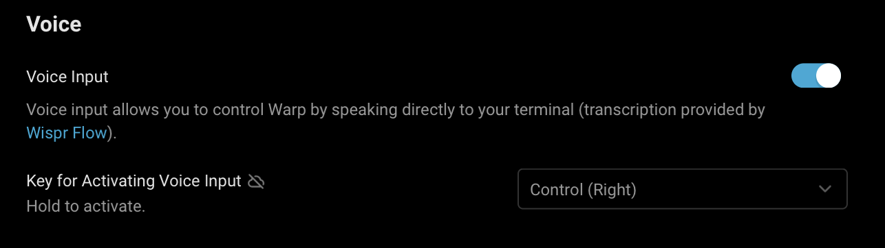

import { Tabs, TabItem } from '@astrojs/starlight/components';
import VideoEmbed from '@components/VideoEmbed.astro';

Warp's Voice feature transforms how you interact with your terminal, letting you naturally speak commands and questions instead of typing them. This is especially powerful when combined with Agent Mode for complex operations or when you need to explain longer scenarios.

:::note
Voice input functionality can be configured in **Settings** > **Agents** > **Warp Agent** > **Voice**. You can toggle voice input and select your preferred activation hotkey from pre-defined options.
:::

<VideoEmbed url="https://www.loom.com/share/77399be4e434443488bbe267b3548552?hideEmbedTopBar=true&hide_owner=true&hide_share=true&hide_title=true" title="Voice Demo" />

## Getting started with voice

### Initial setup

First-time users will need to grant microphone permissions:

* On macOS: Accept the system permission prompt or allow Warp microphone access in  > **System Settings** > **Privacy & Security** > **Microphone**
* On Windows: Allow Warp microphone access in **Settings** > **Privacy & Security** > **Microphone**
* On Linux: Configure through system sound settings

### Using voice

There are two ways to activate Voice:

1. **Microphone Button in Agent Mode**
   * Click the microphone icon in Agent Mode
   * Start speaking when the indicator shows it's listening
   * Click again to stop recording
2. **Hotkey Method**

<Tabs>
  <TabItem label="macOS">
    * Press and hold the `Fn` key (configurable) to start recording
    * Speak your command or query while holding the key
    * Release the `Fn` key to stop recording and transcribe
  </TabItem>
  <TabItem label="Windows">
    * Press and hold the `ALT-RIGHT` key (configurable) to start recording
    * Speak your command or query while holding the key
    * Release the `ALT-RIGHT` key to stop recording and transcribe
  </TabItem>
  <TabItem label="Linux">
    * Press and hold the `ALT-RIGHT` key (configurable) to start recording
    * Speak your command or query while holding the key
    * Release the `ALT-RIGHT` key to stop recording and transcribe
  </TabItem>
</Tabs>

### Sample use cases

Voice input makes complex interactions with Agent Mode more natural and efficient. Instead of typing lengthy queries, you can speak naturally to accomplish various tasks. For example, you can say "Create a new Node.js project, install Express and MongoDB, then set up a basic server with a health check endpoint," or "What's the difference between chmod and chown? Give me examples of when to use each one."

You can also describe multi-step system tasks like "Find all log files in my project that contain errors from the last 24 hours, create a summary of the errors, and email it to me." Agent Mode breaks down these requests into the necessary commands and provides detailed explanations.

Voice input is not limited to just Agent Mode - it works across all of Warp's input interfaces. Whether you're using the Find dialog to search through text, entering commands in the terminal, or working with other input editors, you can use voice commands to quickly input your text.

## Privacy & security

The transcription is powered by [Wispr Flow](https://wisprflow.ai/). Voice data is processed in real-time by Wispr Flow and is not retained as a recording after transcription.

## Usage limits

Voice features have anti-abuse limits in place to ensure fair usage. These limits are subject to change as we continue to improve the service.

## Troubleshooting

### Common issues

1. **Microphone not detected** If your microphone isn't being detected, first check your system permissions to ensure Warp has access. You should also verify that your microphone is properly connected to your system. If issues persist, try restarting Warp to reset the connection.
2. **Poor transcription quality** To improve transcription quality, try to minimize background noise in your environment. Position yourself closer to the microphone while speaking, and verify that your microphone input levels are properly adjusted in your system settings. For best results, speak clearly at a natural pace and use complete sentences to provide better context. When referring to specific file names or commands, enunciate them clearly. It's also recommended to review the transcription before sending to ensure accuracy.
3.  **Feature not activating** If the Voice feature isn't activating, confirm that your hotkey settings are correctly configured in Warp. Check for any conflicting keyboard shortcuts that might interfere with Voice activation. Also ensure that you're running the latest version of Warp, as older versions can have compatibility issues.

    If you are on an Enterprise plan, your administrator may have disabled Voice functionality, or it may be pending approval.
