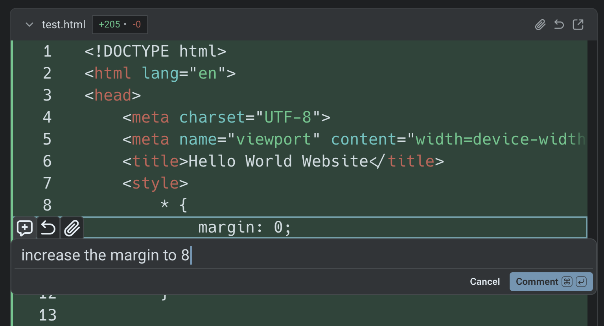
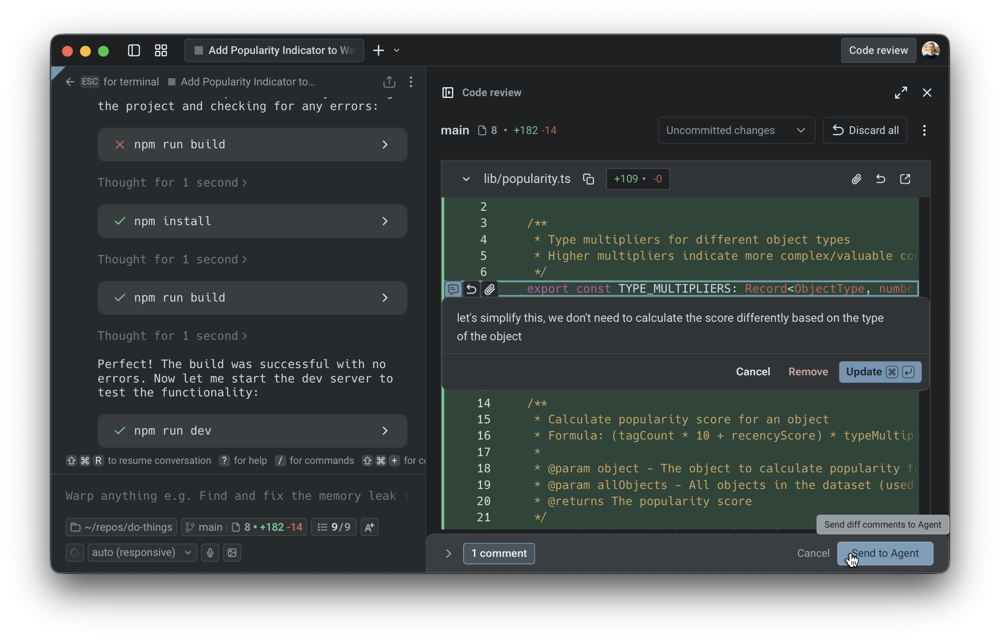

import VideoEmbed from '@components/VideoEmbed.astro';

### Overview

Interactive Code Review lets you review, annotate, and refine code generated by any supported agent, whether that's Warp's native Agent or a third-party CLI agent running in Warp. Instead of relying on an AI to review another AI's output, Warp keeps the developer in control.

You can inspect diffs, leave inline comments, batch feedback, and send all requested changes back to the agent in a single pass.

<VideoEmbed url="https://youtu.be/jit_6eevt8w?si=EFKYUSsofvBYUPI-" />

**Interactive Code Review builds on Warp's existing** [Code Review](/code/code-review/) **panel.** For details on diff views, reverting hunks, opening files, and all available entry points, see the Code Review documentation.

:::note
Note that both the [Code Review](/code/code-review/) panel and Interactive Code Review require working in a Git-indexed directory.
:::

### Supported agents

Interactive Code Review works with any supported agent running in Warp:

* **Warp's native Agent** — the built-in agent in Agent Mode
* **Third-party CLI agents** — Claude Code, OpenAI Codex, OpenCode, Amp, Auggie, Copilot CLI, Cursor CLI, Gemini CLI, Droid, and Pi

For the full feature matrix and setup details for each CLI agent, see [Third-Party CLI Agents](/agent-platform/cli-agents/overview/).

---

When an agent modifies files, Warp automatically gathers those edits into a diff. Opening the Code Review panel shows you every change the agent made.

From there, you can leave comments on specific lines or blocks, review your comment list, and submit all feedback to the agent at once. The agent applies the requested updates and returns an updated diff for further review.

This gives you a familiar pull-request style workflow inside Warp without switching editors or tools.

### Leave inline comments

Select any changed line or block and add a comment describing what you want adjusted. Warp anchors each comment to the relevant file and line so the agent understands exactly what to fix.

### Batch comments and submit once

Add as many comments as you need before submitting them. The agent receives your entire batch of feedback, applies the changes in one iteration, and returns an updated diff for verification.

### Example demo

In the example from Kevin on the Warp team, you’ll see how to:

* open the Code Review panel after an agent produces changes
* browse the diffs for each edited file
* add multiple inline comments
* review all comments in the list view
* send those comments to the agent for resolution
* inspect the updated diffs once the agent applies the changes

This workflow can be repeated until the code matches your expectations.

<VideoEmbed url="https://www.loom.com/share/bdeb2eb1ff3640faa2cbacda9420c3a8" />

---

## Next steps

Once you're comfortable reviewing agent code locally, try running agents in the cloud for longer or parallel tasks.

* **[Cloud Agents quickstart](/agent-platform/cloud-agents/quickstart/)** - Run agents on Warp's infrastructure for background tasks like PR review, issue triage, and dependency updates.
* **[Skills](/agent-platform/capabilities/skills/)** - Turn successful agent workflows into reusable, shareable instructions.
