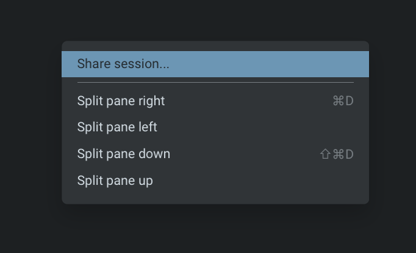
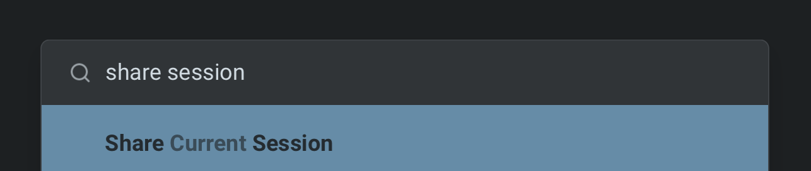

import VideoEmbed from '@components/VideoEmbed.astro';

**Agent Session Sharing** extends Warp's regular [Session Sharing](/knowledge-and-collaboration/session-sharing/) to include full visibility and control over Agent activity. Share any agent session — Oz or third-party — so collaborators can watch progress, review output, and steer the agent from the Warp desktop app, a web browser, or a mobile device.

<VideoEmbed url="https://www.loom.com/share/89e0e99c9bbf463a8a5e5bc2e96dabe4" title="Agent Session Sharing in action — sharing a live session and collaborating across devices." />

## Key capabilities

* **Full Agent visibility** - Viewers see Agent prompts, responses, thinking states, tool use, planning steps, and [credit](/support-and-community/plans-and-billing/credits/) consumption in real time
* **Cross-device access** - Open shared sessions from the Warp desktop app, any web browser, or a mobile device. No install required for web viewers.
* **Collaborative editing** - Grant edit access so collaborators can send their own Agent queries, execute commands, and start new conversations
* **Multi-viewer support** - Multiple participants can observe and interact with the same session simultaneously, each with their own cursor and avatar
* **Remote Control** - Publish third-party agent sessions to the cloud for persistent, asynchronous monitoring and steering from anywhere. See [Remote Control](/agent-platform/cli-agents/remote-control/).

## How it works

When you share an agent session, Warp publishes it to the cloud and generates a shareable link. The session stays in sync — any new agent output or terminal activity appears for all viewers in real time. The person who shares the session controls who can view and who can interact.

## Sharing a session

1. Start or open an agent session in Warp. The agent can be an Oz agent, a third-party coding agent, or any interactive agent running in your terminal.
2. Open the share action from any of these entry points:
   * **Command Palette** - Search for "Share session"
   * **Pane header** - Click the overflow menu in the pane header
   * **Right-click context menu** - Right-click inside the session pane
   * **`/remote-control` chip** - For third-party agent sessions, click the `/remote-control` chip in the agent view footer or the CLI footer to publish and share instantly. See [Remote Control](/agent-platform/cli-agents/remote-control/) for details.
3. Choose your starting point (full scrollback, no scrollback, or a specific block).
4. Confirm the share. Warp uploads the session to the cloud and generates a shareable link.
5. Copy the link and share it with teammates, or open it on another device.

## Viewing shared sessions

Shared sessions are accessible from:

* **Warp desktop app** - Paste the link into Warp on a different machine for the full desktop experience
* **Web browser** - Open the shared link in any browser. No app install required.
* **Mobile** - Open the link on a phone or tablet browser to check on progress while away from your desk

The web experience mirrors the desktop view, showing complete Agent activity including thinking steps, tool use, and terminal output.

## Collaboration and steering

### Watching Agent activity

Viewers see Agent actions unfold live as the sharer interacts with the Agent:

* **Thinking animations** - Real-time indicators of Agent reasoning
* **Tool use and planning** - Visible tool calls and planning steps
* **Credit consumption** - Live credit usage for the session
* **Final responses** - Completed Agent output

### Edit access

If a viewer requests edit access, the sharer can approve it. Once approved, collaborators can:

* Send new Agent queries
* Type directly into the prompt
* Execute commands
* Start and switch Agent conversations
* Run terminal commands alongside Agent queries

### Multi-viewer sessions

Multiple participants can join the same session from different machines, browsers, or environments. All participants:

* See each other's avatars and cursors
* Watch Agent activity in sync
* Edit together when granted access
* Run terminal or Agent commands concurrently

## Related pages

* [Remote Control](/agent-platform/cli-agents/remote-control/)
* [Third-Party CLI Agents](/agent-platform/cli-agents/overview/)
* [Cloud Agent Session Sharing](/agent-platform/cloud-agents/viewing-cloud-agent-runs/)
* [Session Sharing (terminal)](/knowledge-and-collaboration/session-sharing/)
