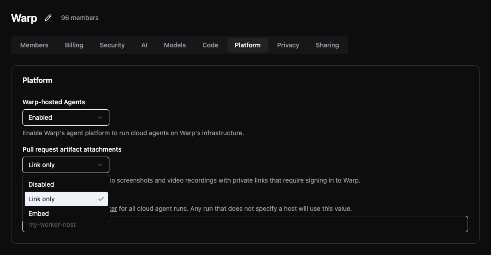

import { VARS } from '@data/vars';

When a cloud agent run opens or updates a pull request, the screenshots and video recordings it captured with [Computer Use](/agents/capabilities/computer-use/) are attached to the PR description automatically. Reviewers get visual proof of the change — a rendered UI state, a recorded flow, a bug reproduction — without leaving the pull request.

## What gets attached

* **Screenshots** - UI states the agent captures during its Computer Use session. Up to 10 screenshots are attached per pull request.
* **Video recordings** - Session recordings the agent produces. See [Testing and recordings](/agents/capabilities/computer-use/testing-and-recordings/) for how recordings are captured and processed.

Attachment is automatic: once a screenshot or recording artifact is associated with the run, the agent includes it the next time it creates or updates a pull request. You can encourage captures in your prompt — for example, "take screenshots of the before and after states" or "record the flow and attach it to the PR."

## Attachment modes

A team-level setting controls how artifacts are attached:

* **Link only (default)** - Screenshots and recordings are attached as links to a media page in the {VARS.WEB_APP} that shows the single capture. Artifacts stay private: opening a link requires access to the run.
* **Embed** - Screenshots render inline as images in the PR description, and recordings are attached as direct download links. To make this work, the attached artifacts are published at stable, publicly accessible URLs.
* **Disabled** - No screenshots or recordings are attached to pull requests.

:::caution
In **Embed** mode, attached screenshots and recordings become publicly downloadable by anyone with the URL — including anyone who can read the PR description. Use **Link only** if your Computer Use sessions may capture content that shouldn't leave your team.
:::

### Changing the attachment mode

Team admins control the attachment mode from the [Admin Panel](https://app.warp.dev/admin/):

1. In the Admin Panel sidebar, select your team under **Team admin**.
2. Click the **Platform** tab.
3. Under **Pull request artifact attachments**, choose **Disabled**, **Link only**, or **Embed**.

<figure>

<figcaption>The Pull request artifact attachments setting in the Admin Panel.</figcaption>
</figure>

## Sharing captures outside pull requests

A pull request isn't always where the evidence belongs. When an agent posts to Slack, comments on an issue or pull request, updates a Linear issue, or answers you in chat, it can pull shareable links for the screenshots and recordings the run captured and include the relevant ones in that message.

Each link opens a media page in the {VARS.WEB_APP} that shows one capture — for example, `https://oz.warp.dev/artifacts/ARTIFACT_UID`, where `ARTIFACT_UID` identifies the screenshot or recording. Access is checked when the link is opened, so a link is safe to paste into an external tool: viewers who can't access the run are asked to sign in and are turned away if they lack permission.

The team attachment mode applies here too:

* **Link only (default)** - The agent gets media page links. Captures stay private.
* **Embed** - The agent also gets direct image and video URLs, so screenshots and video thumbnails can render inline where the destination supports it. As in pull requests, those URLs are publicly accessible to anyone who has them.
* **Disabled** - No links are available, and the agent reports that sharing is turned off for your team.

To ask for this explicitly, tell the agent where the captures should go — for example, "post the screenshots to #eng-releases" or "reply with a link to the recording."

## Where else artifacts appear

Pull requests aren't the only place captures end up:

* **In the conversation** - Screenshots and recordings appear as blocks in the agent's conversation as they're captured.
* **On the run page** - Open the run in the [{VARS.WEB_APP}](/platform/oz-web-app/#runs) to view, play, or download all artifacts the run produced.
* **On a media page** - Every attached screenshot or recording also has its own page in the {VARS.WEB_APP} for viewing a single capture. See [Artifact media pages](/platform/oz-web-app/#artifact-media-pages).

## Related pages

* [Computer Use](/agents/capabilities/computer-use/) - Control Computer Use and understand security considerations.
* [Testing and recordings](/agents/capabilities/computer-use/testing-and-recordings/) - How the recording pipeline works and what finished videos contain.
* [Admin Panel for teams](/enterprise/team-management/admin-panel/) - The full reference for team settings, including the Platform section.
* [Viewing cloud agent runs](/platform/viewing-cloud-agent-runs/) - Open and inspect cloud agent run transcripts.
* [Privacy](/support-and-community/privacy-and-security/privacy/) - Warp's data handling policies, including how run artifacts are stored.
