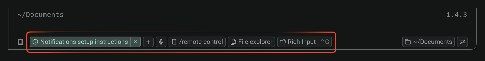

import { VARS } from '@data/vars';

Warp auto-detects supported CLI agents and enhances them with IDE-level features — a rich input editor, agent notifications, inline code review, [Remote Control](/agents/cli-agents/remote-control/), and more. Run your preferred coding agent inside Warp and get a better experience out of the box.

This feature set is also known as **universal agent support**.

Looking for Warp's own CLI instead? The [Warp Agent CLI](/agents/cli/) runs the Warp Agent itself in any terminal. This page covers running third-party coding agents inside the Warp app.

:::note
Claude Code and Codex are also supported as harnesses in the {VARS.WARP_AUTOMATION_PLATFORM} for [multi-agent orchestration](/platform/orchestration/). See [Harnesses in the {VARS.WARP_AUTOMATION_PLATFORM}](/platform/harnesses/).
:::

## Supported agents

Warp currently supports the following CLI coding agents:

* [**Claude Code**](/agents/cli-agents/claude-code/) — Anthropic's CLI coding agent
* [**OpenAI Codex**](/agents/cli-agents/codex/) — OpenAI's CLI coding agent
* [**OpenCode**](/agents/cli-agents/opencode/) — Open-source CLI coding agent
* **Amp** — Sourcegraph's CLI coding agent
* **Auggie** — Augment Code's CLI coding agent
* **Copilot CLI** — GitHub's CLI coding agent
* **Cursor CLI** — Cursor's CLI coding agent
* **Gemini CLI** — Google's CLI coding agent
* **Droid** — Factory's CLI coding agent
* **Pi** — Open-source CLI coding agent
* **Goose** — Block's CLI coding agent
* **Antigravity** — the Antigravity CLI coding agent (invoked with `agy`)
* **Hermes** — Nous Research's CLI coding agent
* **Mistral Vibe** — Mistral's CLI coding agent

When you launch a supported agent inside Warp, the **agent toolbelt** appears automatically, giving you quick access to Warp's enhanced features.

<figure>

<figcaption>The agent toolbelt for CLI agents.</figcaption>
</figure>

## Feature support

Not every feature is available for every agent. The table below shows current support.

| Feature&nbsp;&nbsp;&nbsp;&nbsp;&nbsp;&nbsp;&nbsp;&nbsp;&nbsp;&nbsp;&nbsp;&nbsp;&nbsp;&nbsp;&nbsp;&nbsp;&nbsp;&nbsp;&nbsp;&nbsp;&nbsp;&nbsp;&nbsp;&nbsp;&nbsp;&nbsp;&nbsp;&nbsp;&nbsp;&nbsp; | Claude Code | Codex | OpenCode | Amp | Auggie | Copilot CLI | Cursor | Gemini CLI | Droid | Pi |
|---|---|---|---|---|---|---|---|---|---|---|
| Rich input editor (`Ctrl-G`) | ✓ | ✓ | ✓ | ✓ | ✓ | ✓ | ✓ | ✓ | ✓ | ✓ |
| Agent notifications | ✓ | ✓ | ✓ | ✗ | ✗ | ✗ | ✗ | ✗ | ✗ | ✗ |
| Code review comments | ✓ | ✓ | ✓ | ✓ | ✓ | ✓ | ✓ | ✓ | ✓ | ✓ |
| Attach code as context | ✓ | ✓ | ✓ | ✓ | ✓ | ✓ | ✓ | ✓ | ✓ | ✓ |
| Vertical tabs + metadata | ✓ | ✓ | ✓ | ✓ | ✓ | ✓ | ✓ | ✓ | ✓ | ✓ |
| Tab Configs | ✓ | ✓ | ✓ | ✓ | ✓ | ✓ | ✓ | ✓ | ✓ | ✓ |
| Remote Control | ✓ | ✓ | ✓ | ✓ | ✓ | ✓ | ✓ | ✓ | ✓ | ✓ |

**Goose**, **Antigravity** (`agy`), **Hermes**, and **Mistral Vibe** are also recognized. They get the same enhanced features as the agents above — rich input editor, code review comments, attach code as context, vertical tabs and metadata, Tab Configs, and Remote Control — but don't support agent notifications yet.

:::note
Agent notifications require a one-time setup. Claude Code and OpenCode use a Warp notification plugin. Codex uses a native config change. See the individual agent pages for setup instructions. Amp, Auggie, Copilot CLI, Cursor, Gemini CLI, Droid, Pi, Goose, Antigravity, Hermes, and Mistral Vibe don't support notifications yet.
:::

## Customizing the toolbelt

The chips and buttons on the CLI agent toolbelt can be reordered, hidden, or moved between the left and right sides. Your layout is saved and persists across app restarts.

In the Warp app, open the **Edit CLI agent toolbelt** modal in one of two ways:

* Right-click the input area while a supported CLI coding agent is running and select **Edit CLI agent toolbelt**.
* Go to **Settings** > **Agents** > **Third party CLI agents**, then click the **Toolbar layout** preview.

## Getting started

Run a supported agent inside Warp — that's it. Warp detects the agent automatically and activates the agent toolbelt with all available features.

For **agent notifications**, each agent requires a one-time setup — either a notification plugin or a config change. See the individual agent pages for instructions.

:::note
If you don't see the agent toolbelt, make sure you're on the latest version of Warp.
:::

---

## Related pages

* [Remote Control](/agents/cli-agents/remote-control/) — publish a CLI agent session to monitor and steer it from another device
* [Cloud handoff and orchestration](/agents/cli/cloud-and-orchestration/) — hand off a {VARS.WARP_CLI} conversation to a cloud agent, or run multi-agent orchestration from the terminal
* [Agent Notifications](/agents/capabilities/agent-notifications/)
* [How to run multiple AI coding agents](/guides/agent-workflows/how-to-run-multiple-ai-coding-agents/) — run CLI agents in parallel with worktrees and cloud fan-out
* [Tabs](/terminal/windows/tabs/)
* [Tab Configs](/terminal/windows/tab-configs/)
