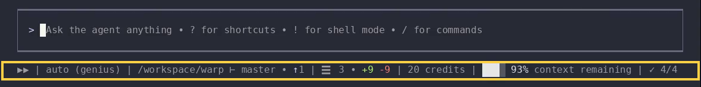

import { VARS } from '@data/vars';

The {VARS.WARP_CLI} keeps its configuration in a plain TOML settings file on your machine. You can change settings by editing the file directly, by running slash commands like `/theme` and `/statusline`, or by asking the agent to update a setting for you.

Beyond the CLI's own settings, this page also covers the agent's context, which includes the project rules, skills, and MCP servers the agent picks up as you work.

## The settings file

The CLI reads its settings from a `settings.toml` file:

* **macOS** - `~/.warp_cli/settings.toml`
* **Linux** - `~/.config/warp-terminal/cli/settings.toml` (respects `$XDG_CONFIG_HOME`)
* **Windows** - `%LOCALAPPDATA%\warp\Warp\config\cli\settings.toml`

The file is created the first time you change a setting, and you can also create it yourself. Settings use dotted TOML sections. For example:

```toml title="settings.toml"
[appearance]
theme = "dark"
```

:::note
CLI settings are local to your machine and are never synced to the cloud. They are also independent from the Warp app's settings: the app and the CLI keep separate settings files, so changing one never affects the other.
:::

## Edit settings

Change settings any of these ways:

### Edit the file directly

Open the settings file in your editor and change values directly. The CLI watches the file while it's running and reloads most values as you save, so edits take effect without a restart. Theme edits are the exception: they apply the next time you run `/theme` or restart the CLI. If a value is invalid, the CLI logs the problem and uses the default for that setting instead. If the file can't be parsed at all, the CLI starts with default settings.

### Use slash commands

Commands like `/theme` and `/statusline` open interactive panels for specific settings and save your choice to the settings file automatically. See [Themes](#themes) and [Statusline](#statusline).

### Ask the agent

Describe the change to the agent in your CLI session, in plain language. The CLI ships with a bundled skill and a schema of every available setting, which the agent uses to find the right key, validate the value, and update the settings file for you. Try prompts like:

* "Switch my theme to light."
* "Add the time to my [statusline](#statusline)."
* "What CLI settings can I change?"

The agent's edits follow the same hot-reload behavior as editing the file directly (see [Edit the file directly](#edit-the-file-directly)). For the full list of built-in skills, see [Bundled skills](#bundled-skills).

## Themes

The CLI renders with a light or dark color theme. Set it with the `/theme` slash command:

* **`/theme auto`** - Matches the host terminal's background (default).
* **`/theme light`** - Always uses the light theme.
* **`/theme dark`** - Always uses the dark theme.

Running `/theme` applies the change immediately and persists it across sessions as the `theme` key under `[appearance]` in the settings file.

In auto mode, detection runs at startup, so if you switch your terminal's colors while the CLI is running, restart it or set a theme explicitly.

## Statusline

The statusline is the row below the CLI's input box that shows session information at a glance. By default it shows the auto-approve indicator, the active model, the working directory, the Git branch, and the Git diff status inside a repository, plus the Vim mode indicator when Vim mode is on. You can enable any of these items:

<figure style={{ maxWidth: "736px" }}>

<figcaption>The statusline with credit usage, context window usage, and task list chips enabled.</figcaption>
</figure>

* **Auto-approve indicator** - A clickable `▶▶` toggle for auto-approve, highlighted when it's on.
* **Vim mode indicator** - The active Vim mode (such as `NOR` or `INS`), shown only when Vim mode is enabled.
* **Model** - The active model. Click it to open the model picker.
* **Working directory** - The current working directory.
* **Git branch** - The current branch, when the directory is a Git repository.
* **Git branch status** - The branch, plus how far it is ahead of or behind its upstream (for example, `master • ↑1`). Enabling this replaces the plain Git branch chip, rather than adding a second one.
* **Git diff status** - Files changed, with line additions and deletions.
* **GitHub pull request** - The pull request for the current branch. Click it to open the PR on GitHub.
* **Credit usage** - Credits used by the current conversation. Click it to switch between credits and provider cost.
* **Context window usage** - How much of the model's context window the conversation has used.
* **Agent to-do list** - The agent's progress through its current task list.

You can also add the date, the time (12- or 24-hour), and a voice input control.

Items only appear when they have something to show. For example, the Git items appear only inside a repository. In shell mode, the statusline always leads with a shell mode label.

### Customizing the statusline

Choose which items appear and in what order:

1. Run `/statusline`. The **Configure statusline** panel opens with every available item.
2. Select an item and press `Enter` to toggle its visibility.
3. Press `←` and `→` to move the highlighted item earlier or later in the row.
4. Press `Esc` to save and close. Press `Ctrl+C` to cancel without saving.

Your choices are saved to the settings file, so the layout persists across sessions. To start over, run `/reset-statusline`, which restores the default items and ordering.

## Start screen

The start screen appears when you launch the CLI, showing a rotating ASCII object alongside sections for your account, the changelog, project info, and MCP servers. Customize it with the `appearance.zero_state` settings:

* **`object`** - The rotating object. Keep the built-in one, or point the setting at your own ASCII art file (a path relative to the CLI settings directory). Changing the setting reloads the object. Edits to the linked file take effect after a restart.
* **`rotation_period_seconds`** - Seconds per full rotation, from 1 through 60.
* **`show_signed_in_user`, `show_changelog`, `show_project_info`, `show_mcp`, `show_animation`** - Toggle individual start-screen sections.
* **`freeze_animation_when_unfocused`** - Stop repainting the animation while your terminal window is unfocused, so an idle start screen doesn't use CPU in the background. Off by default, and applied as soon as you save the setting.

The fastest way to change these is to [ask the agent](#ask-the-agent), for example "use my own ASCII art for the start screen object".

## Project context and rules

The CLI gives its agent the same layered context system as the Warp app, combining your working directory, project rules, skills, and MCP servers, all scoped to the directory you're working in.

The agent works in your session's current directory. When you `cd`, project rules and skills re-scope to the new directory automatically.

Within a project, the CLI picks up the same rule files as the Warp app:

* **Project rules** - `AGENTS.md` (or `WARP.md`) files in your repository apply automatically, starting from the repository root and your current directory. See [Rules](/agents/capabilities/rules/) for the file format, nested rules in subdirectories, and precedence.
* **Global rules** - A rule file at `~/.agents/AGENTS.md` applies across all projects on your machine.

Because rules and skills come from the same shared locations, a repository already configured for agents in the Warp app (or any tool that reads `AGENTS.md`) works in the CLI immediately.

## Skills

[Skills](/agents/capabilities/skills/) are reusable instruction sets the agent can invoke to perform specific tasks. The CLI discovers the same skills as the Warp app. Project skills come from your repository's skill directories (e.g., `.agents/skills/`), and personal skills come from your home directory (e.g., `~/.agents/skills/`), scoped to your current working directory.

Run `/skills` to browse every skill in scope. Selecting a skill inserts `/skill-name` into the input so you can add extra instructions before running it. Any text after the skill name is passed along, either as [skill arguments](/agents/capabilities/skills/#skill-arguments) or as additional context for the agent. You can also invoke a skill directly by typing `/` followed by its name, for example `/deploy push the latest changes to staging`.

### Bundled skills

The CLI ships with built-in skills that appear in the skills menu alongside your own:

* **`/modify-settings`** - Updates CLI settings using the bundled settings schema to find and edit the right key. See [Ask the agent](#ask-the-agent).
* **`/tui-migrate-setup`** - Sets up the CLI from an existing Warp app installation. The agent copies compatible settings and global MCP server definitions from the app, and asks for approval before changing anything. Credentials and OAuth state are never copied, so MCP servers that require authentication prompt you to re-authenticate. Rules and skills don't need migration: the CLI and the Warp app both discover them from the same file locations (see [Project context and rules](#project-context-and-rules) and [Skills](#skills)).

## MCP servers

[MCP servers](/agents/capabilities/mcp/) extend the agent with external tools and data sources. The CLI keeps its own MCP server configuration, separate from the Warp app's, so each can run its own set of servers.

Servers are defined in a JSON config file using the same `mcpServers` format as [file-based MCP servers](/agents/capabilities/mcp/#file-based-mcp-servers) in the Warp app (on macOS, the file is `~/.warp_cli/.mcp.json`). Edit the file to add or remove servers. The CLI picks up changes automatically. Configured servers start automatically once you're logged in.

:::note
The CLI reads MCP servers from its global config file only. Project-scoped MCP config files in repositories are not detected. To copy global server definitions from the Warp app, use the `/tui-migrate-setup` bundled skill.
:::

### Managing servers with `/mcp`

Type `/mcp` to open the MCP management view. The header shows the path to the config file the CLI is reading.

Each configured server is listed with its transport (`stdio` or `HTTP/SSE`) and current status, including the number of tools a running server exposes.

Press `Enter` on a server to start, stop, or retry it depending on its state. Failed rows show the error message. Servers awaiting authentication reopen the OAuth page in your browser, and servers with saved credentials show a **Log out** row that clears them.

## Related pages

* [Rules](/agents/capabilities/rules/) - Full guide to project and global rules.
* [Skills](/agents/capabilities/skills/) - Authoring skills, skill arguments, and skill locations.
* [MCP servers](/agents/capabilities/mcp/) - Config format, server examples, and authentication.
* [Codebase Context](/agents/capabilities/codebase-context/) - Codebase indexing in the Warp app.
* [{VARS.WARP_CLI} reference](/agents/cli/reference/) - Command-line flags, slash commands, and keyboard shortcuts.
