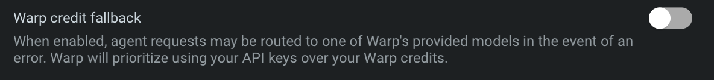

import VideoEmbed from '@components/VideoEmbed.astro';

Warp supports **Bring Your Own API Key (BYOK)** for users who want to connect agents to their own Anthropic, OpenAI, or Google API accounts.

This lets you use your own API keys for model access, giving you control over model selection, billing, and data routing. See [Model Choice](/agents/inference/model-choice/) for a list of supported models. For xAI's Grok models, you connect a [SuperGrok subscription](/agents/inference/grok-subscription/) instead of adding an API key.

BYOK provides greater flexibility in model access and ensures Warp **never consumes your** [AI credits](/support-and-community/plans-and-billing/credits/) for requests routed through your own keys.

<VideoEmbed url="https://youtu.be/jbSBnbPzQwY" title="How to BYOK to the Warp Agent" />

For xAI's Grok models, you can also connect your SuperGrok subscription instead of entering an API key. In the Warp app, go to **Settings** > **Agents** > **Warp Agent** and choose to connect your SuperGrok subscription — Warp opens your browser to complete the connection.

:::note
BYOK is available on Free and all eligible paid plans for individual users and organizations with 10 or fewer employees, subject to Warp's [Terms of Service](https://www.warp.dev/legal/terms-of-service). Larger organizations need a Business or Enterprise plan. See [Warp pricing](https://www.warp.dev/pricing) for current availability.
:::

## How BYOK differs from custom inference endpoints and BYOLLM

Warp offers several ways to bring your own AI infrastructure. Use this table to pick the right one, and follow the links for full details.

| Name | Meaning | Plans |
| --- | --- | --- |
| **Bring Your Own API Key** (BYOK) | Use your own API key for OpenAI, Anthropic, or Google models. Keys are stored locally on your device. | Free and all eligible paid plans |
| **[Custom inference endpoint](/agents/inference/custom-inference-endpoint/)** | Connect Warp to an OpenAI-compatible endpoint such as OpenRouter, LiteLLM, z.ai, or an internal gateway. | Free and all eligible paid plans |
| **[Bring Your Own LLM](/enterprise/enterprise-features/bring-your-own-llm/)** (BYOLLM) | Enterprise-managed inference through your cloud provider (AWS Bedrock and Gemini Enterprise Agent Platform (Vertex AI) today; Azure Foundry coming soon), with Warp handling routing, orchestration, governance, and observability. | Enterprise only |
| **[SuperGrok subscription](/agents/inference/grok-subscription/)** | Connect your SuperGrok subscription to use Grok models through your xAI account. Tokens are stored locally on your device. | Free and all eligible paid plans |

See [Warp pricing](https://www.warp.dev/pricing) for current plan availability.

Platform credits apply to every cloud agent run on any plan, and to local agent runs on Business and Enterprise when using BYOK, a custom inference endpoint, or BYOLLM. See [platform credits](/support-and-community/plans-and-billing/platform-credits/) for the full breakdown.

:::note
**Can I sign in with a ChatGPT or Claude subscription?** No. A ChatGPT (OpenAI) or Claude (Anthropic) consumer subscription can't be connected to Warp the way a [SuperGrok subscription](/agents/inference/grok-subscription/) can. OpenAI and Anthropic don't currently allow their subscription plans to be used in third-party clients like Warp. To use your own OpenAI or Anthropic account, add an API key with BYOK and pay your provider directly. A subscription and API access are billed separately by the provider.
:::

## How BYOK works

When you add your own model API keys in Warp, those keys are stored **only on your device** (in your OS keychain or equivalent secure storage), never on Warp's servers. They're used to make requests to your chosen model provider.

When you send a prompt using a model with the **key icon**:

1. Your local Warp client pulls your API key from your device's secure storage and sends it up to Warp's backend along with your prompt.
2. The Warp Agent harness, which runs on Warp's backend, assembles the full request (system instructions, conversation context, tools) and uses your key in-flight to call your chosen model provider (Anthropic, OpenAI, or Google).
3. The provider's response streams back through Warp's backend to your client.

Your API key passes through Warp's servers each time you send a request, but Warp never stores it there — it's used only in-flight to call the provider, then discarded.

:::note
**Why does the request route through Warp's backend?** The Warp Agent harness runs server-side — the same runtime that powers [Agent Mode](/agents/local-agents/interacting-with-agents/terminal-and-agent-modes/) with Warp-billed models. BYOK swaps the credential used to call the provider; it does not change where the harness runs.
:::

:::caution
BYOK does not apply to [Cloud Agents](/platform/). Because your API keys are stored locally on your device, they are not available to cloud-hosted agent runs, which consume [Warp credits](/support-and-community/plans-and-billing/credits/). Enterprise teams that need their own keys to work with cloud agents can use [team-managed API keys and endpoints](/enterprise/enterprise-features/team-managed-keys-and-endpoints/), which Warp stores server-side.
:::

When a model is selected using your own key:

* Warp **does not consume** any of your [credits](/support-and-community/plans-and-billing/credits/).
* Costs are billed directly through your model provider account.
* Warp does not retain or store your API key on any of its servers.

## Enabling BYOK

To enable and configure your API keys:

1. Open **Settings** and search for `API keys` to jump to the BYOK configuration.
2. Add your API key(s) for Anthropic, OpenAI, or Google.
3. Once added, you'll see a **key icon** next to supported models in the model picker.

:::note
The BYOK configuration widget doesn't currently live on a dedicated sidebar subpage; searching from the **Settings** window is the quickest way to reach it. We're tracking a follow-up to surface it under a persistent sidebar entry.
:::

When you explicitly select a model with a key icon, Warp routes requests through your own API key instead of consuming Warp's credits.

## BYOK usage and billing behavior

### Auto Model

Warp's **Auto** models dynamically route requests across different models based on context and performance. Because this routing logic depends on Warp's infrastructure, **Auto always consumes Warp's credits**, even if you've configured your own API keys.

To use your own key, select a specific provider model (for example, Claude Opus 4.7, Claude Sonnet 4.6, GPT-5.5, or Gemini 3.1 Pro) directly from the model picker with a key icon.

[Custom routers](/agents/inference/custom-routers/) behave differently: a router resolves each task to a concrete model you chose, and Warp then applies your API keys to that model. Requests that resolve to a model covered by one of your keys are billed through your provider account instead of consuming Warp credits. See [Credits and model availability](/agents/inference/custom-routers/#credits-and-model-availability) for details.

### Credit usage

When you select a model with the key icon in your model picker, Warp routes the request through your API key. In that case:

* Inference is billed directly through your provider account rather than drawing from your Warp AI credits.
* Agent Mode prioritizes BYOK over any available Warp credits.

:::note
On Business and Enterprise plans, local agent runs that use BYOK still consume platform credits for Warp's platform infrastructure (run lifecycle, integrations, observability). See [platform credits](/support-and-community/plans-and-billing/platform-credits/) for what's covered.
:::

**Other AI features in Warp**

Some AI-powered features are not affected by BYOK and are included as part of Warp’s paid plans.

| Feature                                                                       | Uses Warp's credits | Description                                                          |
| ----------------------------------------------------------------------------- | ------------------- | -------------------------------------------------------------------- |
| [Active AI Recommendations](/agents/local-agents/active-ai/) | No                  | Always included with Build and higher plans.                         |
| [Codebase Context](/agents/capabilities/codebase-context/)               | Yes                 | Uses Warp's AI infrastructure and consumes credits.                  |
| [Cloud Agents](/platform/) | Yes                 | BYOK keys are stored locally and not available to cloud-hosted runs. |

These features will continue to function normally regardless of whether you’ve configured BYOK.

### Failover and fallback behavior

If Warp detects an issue with your API key, you’ll see a clear error message corresponding with the AI request.

If your key:

* Is invalid: Warp notifies you and halts the request.
* Hits usage or rate limits: Warp will not retry using credits.

You can update or replace your keys anytime by opening **Settings** and searching for `API keys`.

**Failover and fallback:**

By default, Warp does not fall back to your credits when a BYOK request fails.

You can choose to enable **Warp credit fallback**. When enabled, if an agent request fails with your BYOK model (for example, due to an API error or quota limit), Warp will automatically route the request to one of Warp’s provided models. Warp always prioritizes your API keys first and only uses Warp credits when necessary.

### Zero Data Retention (ZDR) and BYOK

Warp is **SOC 2 compliant** and has **Zero Data Retention (ZDR)** policies with all of its contracted LLM providers. No customer AI data is retained, stored, or used for training by the model providers.

BYOK prompts and responses transit Warp's backend (see [How BYOK works](#how-byok-works)). Warp does not use this content for training; retention and analytics handling follow the same account-level privacy and telemetry settings that apply to Warp-billed traffic.

However, when you use your own API key:

* Data retention policies on the **provider side** depend on your provider’s account settings.
* Warp cannot enforce ZDR for requests sent through your API keys.
* If your Anthropic, OpenAI, or Google account does not have ZDR enabled, your requests may be retained by the provider according to their terms.

Warp itself never stores your LLM API keys.

### BYOK on Business and Enterprise plans

The BYOK described on this page is configured at the **user level** on every plan, including Business and Enterprise. Each team member adds and manages their own API keys locally on their device, and those keys work only for interactive requests, not [cloud agents](/platform/).

Enterprise teams can also configure **team-managed API keys** centrally: an admin sets shared keys in the [Admin Panel](/enterprise/team-management/admin-panel/), and they work for both interactive requests and cloud agents. See [Team-managed API keys and endpoints](/enterprise/enterprise-features/team-managed-keys-and-endpoints/) for details, or [contact sales](https://www.warp.dev/contact-sales).

## Related resources

* [Custom inference endpoint](/agents/inference/custom-inference-endpoint/) — Route Warp through any OpenAI-compatible endpoint, such as OpenRouter, LiteLLM, z.ai, or an internal gateway.
* [Bring Your Own LLM](/enterprise/enterprise-features/bring-your-own-llm/) — Enterprise-managed inference through your cloud provider or approved infrastructure.
* [SuperGrok subscription](/agents/inference/grok-subscription/) — Use Grok models through your xAI account instead of Warp credits.
* [Model Choice](/agents/inference/model-choice/) — Full list of supported models and `model_id` values.
* [Credits](/support-and-community/plans-and-billing/credits/) — How Warp credits work and when they're consumed.
