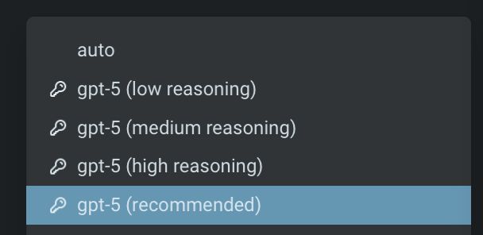
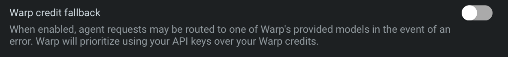

import VideoEmbed from '@components/VideoEmbed.astro';

Warp supports **Bring Your Own API Key (BYOK)** for users who want to connect agents to their own Anthropic, OpenAI, or Google API accounts.

This lets you use your own API keys for model access, giving you control over model selection, billing, and data routing. See [Model Choice](/agents/inference/model-choice/) for a list of supported models. You can also connect a [ChatGPT subscription](/agents/inference/chatgpt-subscription/) for eligible OpenAI models or a [SuperGrok subscription](/agents/inference/grok-subscription/) for Grok models.

Your provider bills inference routed through your keys. Applicable [platform charges](/support-and-community/plans-and-billing/platform-credits/) remain.

<VideoEmbed url="https://youtu.be/jbSBnbPzQwY" title="How to BYOK to the Warp Agent" />

:::note
BYOK is available on Free and all eligible paid plans for individual users and organizations with 10 or fewer employees, subject to Warp's [Terms of Service](https://www.warp.dev/legal/terms-of-service). Larger organizations need a Business or Enterprise plan. See [Warp pricing](https://www.warp.dev/pricing) for current availability.
:::

## How BYOK differs from custom inference endpoints and BYOLLM

Warp offers several ways to bring your own AI infrastructure. Use this table to pick the right one, and follow the links for full details.

| Name | Meaning | Plans |
| --- | --- | --- |
| **Bring Your Own API Key** (BYOK) | Use your own API key for OpenAI, Anthropic, or Google models. Keys are stored locally on your device. | Free and all eligible paid plans |
| **[Custom inference endpoint](/agents/inference/custom-inference-endpoint/)** | Connect Warp to an OpenAI-compatible endpoint such as OpenRouter, LiteLLM, z.ai, or an internal gateway. | Free and all eligible paid plans |
| **[Bring Your Own LLM](/enterprise/enterprise-features/bring-your-own-llm/)** (BYOLLM) | Enterprise-managed inference through your cloud provider (AWS Bedrock and Gemini Enterprise Agent Platform (Vertex AI) today; Azure Foundry coming soon), with Warp handling routing, orchestration, governance, and observability. | Enterprise only |
| **[SuperGrok subscription](/agents/inference/grok-subscription/)** | Connect your SuperGrok subscription to use Grok models through your xAI account. Tokens are stored locally on your device. | Free and all eligible paid plans |
| **[ChatGPT subscription](/agents/inference/chatgpt-subscription/)** | Connect your ChatGPT plan to use eligible OpenAI models with the Warp Agent in the Warp app. | See [Warp pricing](https://www.warp.dev/pricing) |

See [Warp pricing](https://www.warp.dev/pricing) for current plan availability.

Cloud runs incur platform charges for billable agent time. Local runs on Business and Enterprise that use customer-supplied inference also incur platform charges. See [platform usage](/support-and-community/plans-and-billing/platform-credits/) for rates and contract-specific terms.

:::note
**Can I sign in with a Claude subscription?** No. A Claude (Anthropic) consumer subscription can't be connected to Warp the way a [ChatGPT](/agents/inference/chatgpt-subscription/) or [SuperGrok](/agents/inference/grok-subscription/) subscription can. To use your own Anthropic account, add an API key with BYOK and pay Anthropic directly. A subscription and API access are billed separately.
:::

## How BYOK works

When you add your own model API keys in Warp, those keys are stored **only on your device** (in your OS keychain or equivalent secure storage), never on Warp's servers. They're used to make requests to your chosen model provider.

When you send a prompt using a model with the **key icon**:

1. Your local Warp client pulls your API key from your device's secure storage and sends it up to Warp's backend along with your prompt.
2. The Warp Agent harness, which runs on Warp's backend, assembles the full request (system instructions, conversation context, tools) and uses your key in-flight to call your chosen model provider (Anthropic, OpenAI, or Google).
3. The provider's response streams back through Warp's backend to your client.

Your API key passes through Warp's servers each time you send a request, but Warp never stores it there — it's used only in-flight to call the provider, then discarded.

:::note
**Why does the request route through Warp's backend?** The Warp Agent harness runs server-side — the same runtime that powers [Agent Mode](/agents/local-agents/interacting-with-agents/terminal-and-agent-modes/) with Warp-billed models. BYOK swaps the credential used to call the provider; it does not change where the harness runs.
:::

:::caution
Personal BYOK keys are not available to [cloud runs](/platform/). Business and Enterprise teams can configure [team-managed API keys and endpoints](/enterprise/enterprise-features/team-managed-keys-and-endpoints/) for cloud inference. Compute and platform charges still apply where eligible.
:::

When a model is selected using your own key:

* The request does not consume Warp-provided inference usage.
* Costs are billed directly through your model provider account.
* Warp does not retain or store your API key on any of its servers.

## Enabling BYOK

To enable and configure your API keys:

1. Open **Settings** and search for `API keys` to jump to the BYOK configuration.
2. Add your API key(s) for Anthropic, OpenAI, or Google.
3. Once added, you'll see a **key icon** next to supported models in the model picker.

:::note
The BYOK configuration widget doesn't currently live on a dedicated sidebar subpage; searching from the **Settings** window is the quickest way to reach it. We're tracking a follow-up to surface it under a persistent sidebar entry.
:::

When you select a model with a key icon, Warp routes inference through your own API key instead of consuming Warp-provided inference usage.

## BYOK usage and billing behavior

### Auto Model

Warp's **Auto** models use Warp-provided inference and consume your available usage, even if you've configured your own API keys.

To use your own key, select a specific provider model (for example, Claude Opus 4.7, Claude Sonnet 4.6, GPT-5.5, or Gemini 3.1 Pro) directly from the model picker with a key icon.

[Custom routers](/agents/inference/custom-routers/) resolve each task to a model you chose, then apply your API keys to that model. Requests covered by one of your keys bill inference through your provider account. See [usage and model availability](/agents/inference/custom-routers/#credits-and-model-availability) for details.

### Credit usage

When you select a model with the key icon in your model picker, Warp routes the request through your API key. In that case:

* Inference is billed through your provider account rather than your Warp usage balance.
* Agent Mode prioritizes BYOK over Warp-provided inference.

**Other AI features in Warp**

Some AI-powered features are not affected by BYOK and are included as part of Warp’s paid plans.

| Feature                                                                       | Uses Warp-provided usage | Description                                                          |
| ----------------------------------------------------------------------------- | ------------------- | -------------------------------------------------------------------- |
| [Active AI Recommendations](/agents/local-agents/active-ai/) | No                  | Always included with Build and higher plans.                         |
| [Codebase Context](/agents/capabilities/codebase-context/)               | Yes                 | Uses Warp-provided inference.                  |
| [Cloud Agents](/platform/) | Yes                 | BYOK keys are stored locally and not available to cloud-hosted runs. |

These features will continue to function normally regardless of whether you’ve configured BYOK.

### Failover and fallback behavior

If Warp detects an issue with your API key, you’ll see a clear error message corresponding with the AI request.

If your key:

* Is invalid: Warp notifies you and halts the request.
* Hits usage or rate limits: Warp will not retry using Warp-provided inference unless fallback is enabled.

You can update or replace your keys anytime by opening **Settings** and searching for `API keys`.

**Failover and fallback:**

By default, Warp does not fall back to Warp-provided inference when a BYOK request fails.

Enable **Warp credit fallback** to retry a failed BYOK request with Warp-provided inference. Fallback requests consume your available Warp usage.

### Zero Data Retention (ZDR) and BYOK

Warp is **SOC 2 compliant** and has **Zero Data Retention (ZDR)** policies with all of its contracted LLM providers. No customer AI data is retained, stored, or used for training by the model providers.

BYOK prompts and responses transit Warp's backend (see [How BYOK works](#how-byok-works)). Warp does not use this content for training; retention and analytics handling follow the same account-level privacy and telemetry settings that apply to Warp-billed traffic.

However, when you use your own API key:

* Data retention policies on the **provider side** depend on your provider’s account settings.
* Warp cannot enforce ZDR for requests sent through your API keys.
* If your Anthropic, OpenAI, or Google account does not have ZDR enabled, your requests may be retained by the provider according to their terms.

Warp itself never stores your LLM API keys.

### BYOK on Business and Enterprise plans

The BYOK described on this page is configured at the **user level** on every plan, including Business and Enterprise. Each team member adds and manages their own API keys locally on their device, and those keys work only for interactive requests, not [cloud agents](/platform/).

Business and Enterprise teams can also configure **team-managed API keys** centrally: an admin sets shared keys in the [Admin Panel](/enterprise/team-management/admin-panel/), and they work for both interactive requests and cloud agents. See [Team-managed API keys and endpoints](/enterprise/enterprise-features/team-managed-keys-and-endpoints/) for details, or [contact sales](https://www.warp.dev/contact-sales).

## Related resources

* [Custom inference endpoint](/agents/inference/custom-inference-endpoint/) — Route Warp through any OpenAI-compatible endpoint, such as OpenRouter, LiteLLM, z.ai, or an internal gateway.
* [Bring Your Own LLM](/enterprise/enterprise-features/bring-your-own-llm/) — Enterprise-managed inference through your cloud provider or approved infrastructure.
* [SuperGrok subscription](/agents/inference/grok-subscription/) — Use Grok models through your xAI account.
* [ChatGPT subscription](/agents/inference/chatgpt-subscription/) — Use eligible OpenAI models in Warp Agent conversations in the Warp app through your ChatGPT plan.
* [Model Choice](/agents/inference/model-choice/) — Full list of supported models and `model_id` values.
* [Usage and billing](/support-and-community/plans-and-billing/credits/) - Inference, compute, and platform charges.
