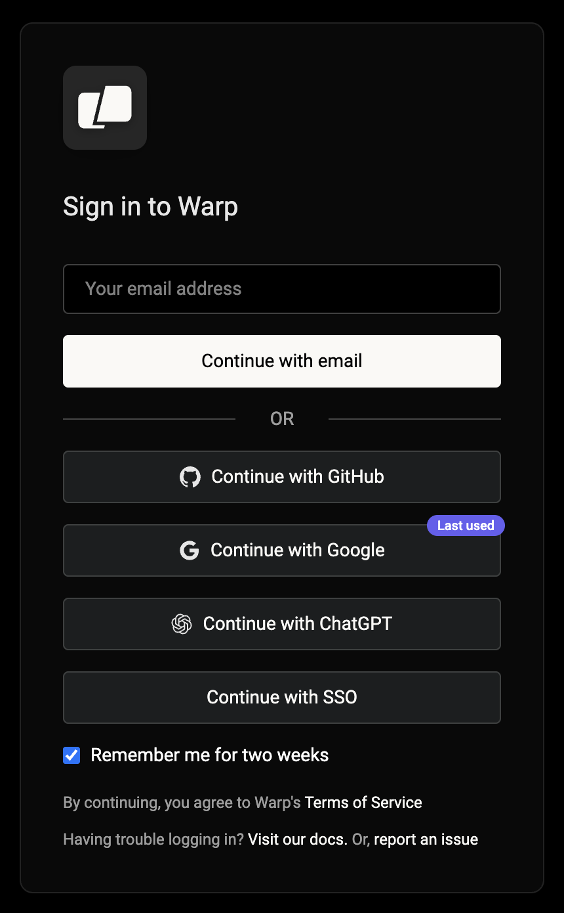

Connect a ChatGPT subscription to use eligible OpenAI models with the Warp Agent in the Warp app. Connected requests count toward your ChatGPT limits instead of consuming Warp-provided inference usage.

You can connect during Warp sign-up or sign-in, or link ChatGPT to an existing Warp account from Settings.

## Connect during sign-up or sign-in

Use **Continue with ChatGPT** to create a Warp account or sign in to an existing account with the same verified email address.

1. Open the [Warp sign-in page](https://app.warp.dev/login).
2. Click **Continue with ChatGPT**.
3. Sign in to ChatGPT and approve the connection.
4. Return to Warp. Warp signs you in and links the ChatGPT subscription to your account.

<figure style={{ maxWidth: "375px" }}>

<figcaption>ChatGPT on the Warp sign-in form.</figcaption>
</figure>

## Link an existing Warp account

Connect from Settings when you already use a different sign-in method for Warp.

1. In the Warp app, go to **Settings** > **Agents** > **Warp Agent**.
2. In the "OpenAI ChatGPT plan" row, click **Continue with ChatGPT**.
3. Sign in to ChatGPT and approve the connection in your browser.
4. Return to Warp. Settings shows the email address for the connected ChatGPT account.

If the setting isn't available, your workspace admin may have disabled member-provided inference. See [Warp pricing](https://www.warp.dev/pricing) for current plan availability.

## Use your ChatGPT subscription

Choose a specific OpenAI model from the model picker. OpenAI determines which models and capabilities your ChatGPT plan can use.

* Requests made through the connection count toward your ChatGPT usage limits. Review your usage in [ChatGPT settings](https://chatgpt.com/settings/usage).
* A saved OpenAI API key takes precedence over the ChatGPT connection.
* **Auto** models use Warp-provided inference and consume your available Warp usage.
* A ChatGPT subscription doesn't fund cloud agent runs.

On Business and Enterprise, local runs that use a ChatGPT subscription also incur [platform charges](/support-and-community/plans-and-billing/platform-credits/).

If OpenAI rejects a request, Warp may offer **Try again**, **Manage ChatGPT usage**, or **Continue with Warp credits**. Choosing **Continue with Warp credits** uses Warp-provided inference and consumes Warp usage for the rest of that conversation.

## Disconnect your subscription

In the Warp app, go to **Settings** > **Agents** > **Warp Agent**. In the "OpenAI ChatGPT plan" row, click **Disconnect**.

After you disconnect, eligible OpenAI requests use your saved OpenAI API key, if you have one. Otherwise, they use Warp-provided inference and consume your available Warp usage.

## Troubleshoot the connection

### "That ChatGPT account is already connected to a different Warp account"

Disconnect the existing link before connecting another ChatGPT or Warp account.

### "Verify the email on your ChatGPT account with OpenAI, then try again"

Verify the email with OpenAI, then click **Continue with ChatGPT** again.

### "Reconnect to use your plan for requests"

Disconnect the ChatGPT subscription, then connect it again.

## Related pages

* [Bring Your Own API Key](/agents/inference/bring-your-own-api-key/) — Use your own Anthropic, OpenAI, or Google API key.
* [Model choice](/agents/inference/model-choice/) — Review the models available in Warp.
* [Usage and billing](/support-and-community/plans-and-billing/credits/) - See when Warp usage is consumed.
