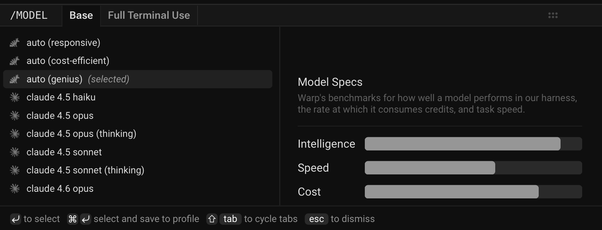

Warp lets you choose from a curated set of large language models to power your agents, or let Warp auto-select the best model for each task. Models from OpenAI, Anthropic, Google, and open source providers are available, with configurable reasoning levels and per-profile defaults. You can also define [custom routers](/agents/inference/custom-routers/) that pick a model for each task using your own logic.

## Available models

Warp lets you choose from a curated set of large language models (LLMs) to power your Agentic Development Environment.

**Warp supports the following models.**

The `model_id` values shown below can be used when configuring models via the [Oz Platform](/platform/overview/) or [CLI](/reference/cli/).

### Auto models

| Model | `model_id` | Description |
| --- | --- | --- |
| Auto (Responsive) | `auto` | Selects the highest-quality, fastest available model. May consume credits more quickly. |
| Auto (Cost-efficient) | `auto-efficient` | Optimizes for lower credit consumption while maintaining strong output quality. |
| Auto (Genius) | `auto-genius` | Adapts to task complexity and selects Warp's most capable model when it's worth it. Best for deep debugging, architecture decisions, and `/plan` sessions. |
| Auto (Open-weights) | `auto-open` | Routes between the best open-source models available in Warp. Optimizes for low cost and fast speed using open-weights models. |

All Auto models perform well across all agent workflows and are ideal if you prefer Warp to manage model selection dynamically.

#### OpenAI

| Model | `model_id` | Reasoning Level |
| --- | --- | --- |
| GPT-5.6 Sol | `gpt-5-6-sol-low` | Low |
| GPT-5.6 Sol | `gpt-5-6-sol-medium` | Medium |
| GPT-5.6 Sol | `gpt-5-6-sol-high` | High |
| GPT-5.6 Sol | `gpt-5-6-sol-xhigh` | Extra High |
| GPT-5.6 Terra | `gpt-5-6-terra-low` | Low |
| GPT-5.6 Terra | `gpt-5-6-terra-medium` | Medium |
| GPT-5.6 Terra | `gpt-5-6-terra-high` | High |
| GPT-5.6 Terra | `gpt-5-6-terra-xhigh` | Extra High |
| GPT-5.6 Luna | `gpt-5-6-luna-low` | Low |
| GPT-5.6 Luna | `gpt-5-6-luna-medium` | Medium |
| GPT-5.6 Luna | `gpt-5-6-luna-high` | High |
| GPT-5.6 Luna | `gpt-5-6-luna-xhigh` | Extra High |
| GPT-5.5 | `gpt-5-5-low` | Low |
| GPT-5.5 | `gpt-5-5-medium` | Medium |
| GPT-5.5 | `gpt-5-5-high` | High |
| GPT-5.5 | `gpt-5-5-xhigh` | Extra High |
| GPT-5.4 | `gpt-5-4-low` | Low |
| GPT-5.4 | `gpt-5-4-medium` | Medium |
| GPT-5.4 | `gpt-5-4-high` | High |
| GPT-5.4 | `gpt-5-4-xhigh` | Extra High |
| GPT-5.3 Codex | `gpt-5-3-codex-low` | Low |
| GPT-5.3 Codex | `gpt-5-3-codex-medium` | Medium |
| GPT-5.3 Codex | `gpt-5-3-codex-high` | High |
| GPT-5.3 Codex | `gpt-5-3-codex-xhigh` | Extra High |
| GPT-5.2 Codex | `gpt-5-2-codex-low` | Low |
| GPT-5.2 Codex | `gpt-5-2-codex-medium` | Medium |
| GPT-5.2 Codex | `gpt-5-2-codex-high` | High |
| GPT-5.2 Codex | `gpt-5-2-codex-xhigh` | Extra High |
| GPT-5.2 | `gpt-5-2-low` | Low |
| GPT-5.2 | `gpt-5-2-medium` | Medium |
| GPT-5.2 | `gpt-5-2-high` | High |
| GPT-5.2 | `gpt-5-2-xhigh` | Extra High |

#### Anthropic

| Model | `model_id` | Variant |
| --- | --- | --- |
| Claude Opus 5 | `claude-5-opus-high` | Default effort |
| Claude Opus 5 | `claude-5-opus-low` | Low effort |
| Claude Opus 5 | `claude-5-opus-medium` | Medium effort |
| Claude Opus 5 | `claude-5-opus-xhigh` | Extra high effort |
| Claude Opus 5 | `claude-5-opus-xhigh-fast` | Fast mode |
| Claude Opus 5 | `claude-5-opus-max` | Max effort |
| Claude Fable 5 | `claude-5-fable-high` | Default effort |
| Claude Fable 5 | `claude-5-fable-low` | Low effort |
| Claude Fable 5 | `claude-5-fable-medium` | Medium effort |
| Claude Fable 5 | `claude-5-fable-xhigh` | Extra high effort |
| Claude Fable 5 | `claude-5-fable-max` | Max effort |
| Claude Sonnet 5 | `claude-5-sonnet-xhigh` | Default effort |
| Claude Sonnet 5 | `claude-5-sonnet-low` | Low effort |
| Claude Sonnet 5 | `claude-5-sonnet-medium` | Medium effort |
| Claude Sonnet 5 | `claude-5-sonnet-high` | High effort |
| Claude Sonnet 5 | `claude-5-sonnet-max` | Max effort |
| Claude Opus 4.8 | `claude-4-8-opus-xhigh` | Default effort |
| Claude Opus 4.8 | `claude-4-8-opus-low` | Low effort |
| Claude Opus 4.8 | `claude-4-8-opus-medium` | Medium effort |
| Claude Opus 4.8 | `claude-4-8-opus-high` | High effort |
| Claude Opus 4.8 | `claude-4-8-opus-max` | Max effort |
| Claude Opus 4.8 | `claude-4-8-opus-xhigh-fast` | Fast mode |
| Claude Opus 4.7 | `claude-4-7-opus-xhigh` | Default effort |
| Claude Opus 4.7 | `claude-4-7-opus-high` | High effort |
| Claude Opus 4.7 | `claude-4-7-opus-max` | Max effort |
| Claude Opus 4.7 | `claude-4-7-opus-xhigh-fast` | Fast mode |
| Claude Opus 4.6 | `claude-4-6-opus-high` | Default effort |
| Claude Opus 4.6 | `claude-4-6-opus-max` | Max effort |
| Claude Sonnet 4.6 | `claude-4-6-sonnet-high` | Default effort |
| Claude Sonnet 4.6 | `claude-4-6-sonnet-max` | Max effort |
| Claude Opus 4.5 | `claude-4-5-opus` | Thinking off |
| Claude Opus 4.5 | `claude-4-5-opus-thinking` | Thinking on |
| Claude Sonnet 4.5 | `claude-4-5-sonnet` | Thinking off |
| Claude Sonnet 4.5 | `claude-4-5-sonnet-thinking` | Thinking on |
| Claude Haiku 4.5 | `claude-4-5-haiku` | — |

:::caution
Anthropic requires data retention for Claude Fable 5 for safety, abuse monitoring, and compliance reasons, so it is **not available under Zero Data Retention (ZDR)**. This requirement is specific to Claude Fable 5 and doesn't change the ZDR behavior of any other supported model. For Enterprise teams, the model is off by default and a workspace admin must enable it — see the [Admin Panel](/enterprise/team-management/admin-panel/#models-settings) and the [Security overview](/enterprise/security-and-compliance/security-overview/#zero-data-retention-zdr).
:::

#### Google

| Model | `model_id` |
| --- | --- |
| Gemini 3.1 Pro | `gemini-3.1-pro` |
| Gemini 3.7 Flash | `gemini-3.7-flash` |
| Gemini 3.6 Flash | `gemini-3.6-flash` |
| Gemini 3.5 Flash | `gemini-3.5-flash` |

#### xAI

| Model | `model_id` | Reasoning Level |
| --- | --- | --- |
| Grok 4.6 | `grok-4-6-low` | Low |
| Grok 4.6 | `grok-4-6-medium` | Medium |
| Grok 4.6 | `grok-4-6-high` | High |
| Grok 4.6 | `grok-4-6-xhigh` | Extra High |
| Grok 4.5 | `grok-4-5-low` | Low |
| Grok 4.5 | `grok-4-5-medium` | Medium |
| Grok 4.5 | `grok-4-5-high` | High |
| Grok 4.3 | `grok-4-3-low` | Low |
| Grok 4.3 | `grok-4-3-medium` | Medium |
| Grok 4.3 | `grok-4-3-high` | High |
| Grok Build 0.1 | `grok-build-0.1` | — |

You can run Grok models through your own SuperGrok subscription instead of Warp credits by connecting your xAI account. See [SuperGrok subscription](/agents/inference/grok-subscription/).

#### Hosted models (via [Fireworks AI](https://fireworks.ai))

Warp also supports leading open source models hosted via Fireworks AI, so you can run them from inside Warp without setting up your own inference infrastructure.

| Model | `model_id` |
| --- | --- |
| GLM 5.2 | `glm-5.2-fireworks` |
| Kimi K3 | `kimi-k3-fireworks` |
| Kimi K2.7 Code | `kimi-k27-code-fireworks` |
| Kimi K2.6 | `kimi-k26-fireworks` |
| Minimax 3 | `minimax-3-fireworks` |
| Minimax 2.7 | `minimax-2.7-fireworks` |
| Qwen 3.7 Plus | `qwen-3.7-plus-fireworks` |
| Qwen 3.6 Plus | `qwen-3.6-plus-fireworks` |
| DeepSeek V4 Pro | `deepseek-v4-pro-fireworks` |

### How to change models

You can use the model picker in your prompt input to quickly switch between models. The currently active model appears directly in the input editor.

<figure>

<figcaption>Model selector in Warp's input.</figcaption>
</figure>

To change models, click the displayed model name (for example, _Claude Sonnet 5_) to open a dropdown with all supported options. Your selection will automatically persist for future prompts.

### Custom routers

Beyond the built-in Auto models, you can define your own custom routers that automatically route each task to a concrete model based on task complexity or rules you write. Custom routers appear in the model picker alongside Auto and individual models.

Add and manage custom routers in **Settings** > **Agents** > **Warp Agent** > **Custom Routers**. See [Custom routers](/agents/inference/custom-routers/) for details on creating one.

### Model fallback

Warp uses a model fallback system to ensure uninterrupted service if your selected model becomes temporarily unavailable due to provider outages or capacity issues.

**How it works:**

* If your selected model isn't available, Warp automatically uses a fallback model from a predefined chain to continue your conversation without errors.
* As soon as your originally selected model becomes available again, Warp automatically switches back to it.
* The fallback model is selected to provide comparable quality and capabilities to your original choice.

### Configuring models per Agent Profile

You can configure the base model for each [Agent Profile](/agents/capabilities/agent-profiles-permissions/), alongside the Agent's autonomy, tool access, and other permissions. The base model is also used for [Planning](/agents/capabilities/planning/).

Edit your default profile or any other profile directly in **Settings** > **Agents** > **Profiles**.

### Zero data retention policies

Warp integrates with multiple large language model (LLM) providers to power its AI-driven features.

**These providers include, but are not limited to:**

* OpenAI
* Anthropic
* Google
* xAI
* Fireworks AI

Warp has executed **Zero Data Retention (ZDR)** agreements with these providers. This means that, by default across all plans:

* LLM providers commit not to train their models on any customer-generated data processed through Warp’s services.
* LLM providers commit to delete inputs and outputs after generating the relevant output, within a fixed time period.

Warp enforces these commitments through both technical measures and contractual safeguards with the LLM providers.

Zero data retention is available for supported models. Model availability may vary where providers require data retention for safety, abuse monitoring, or compliance reasons.
