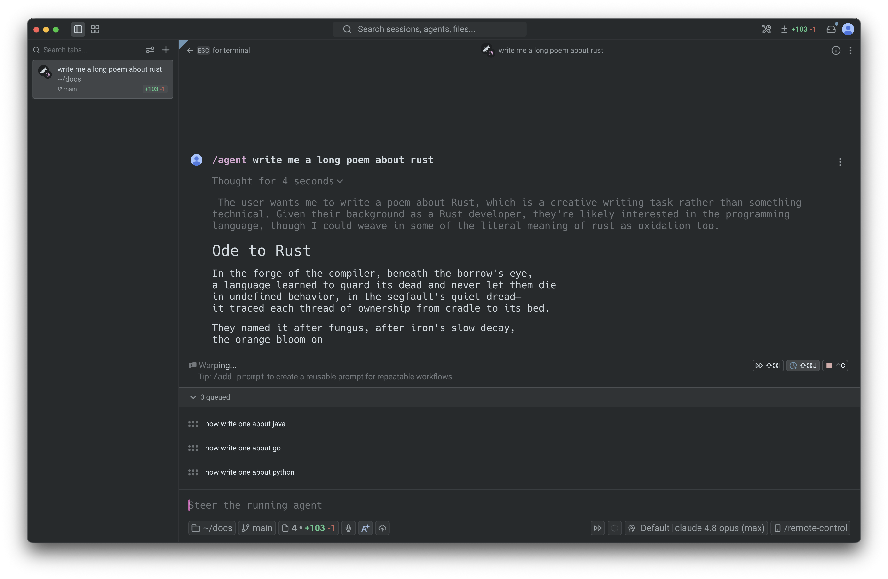
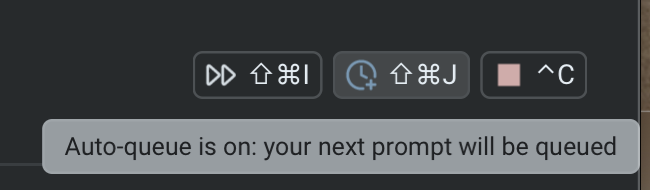
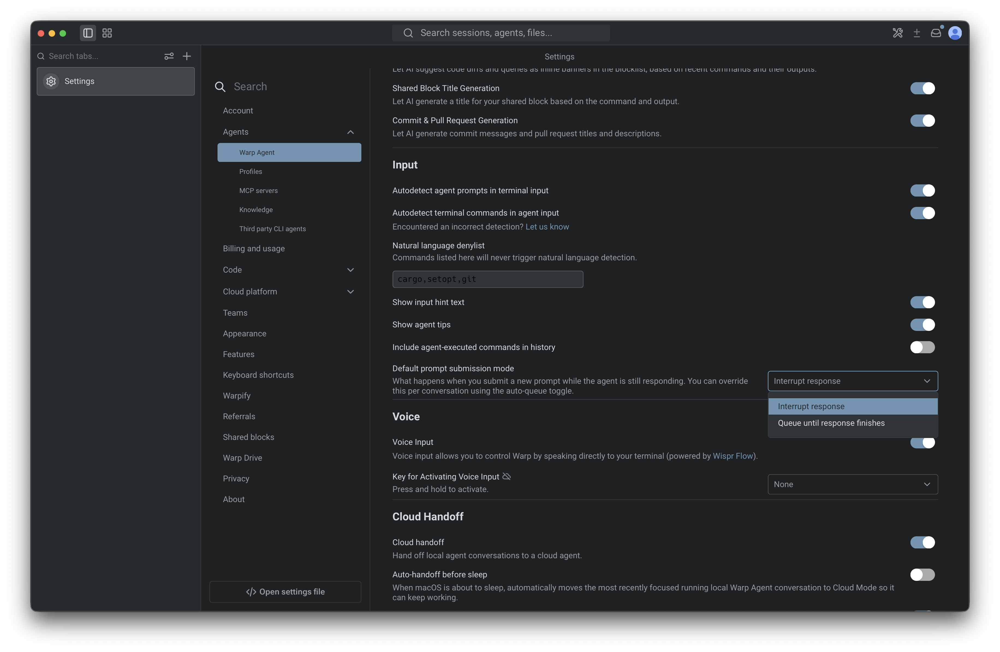
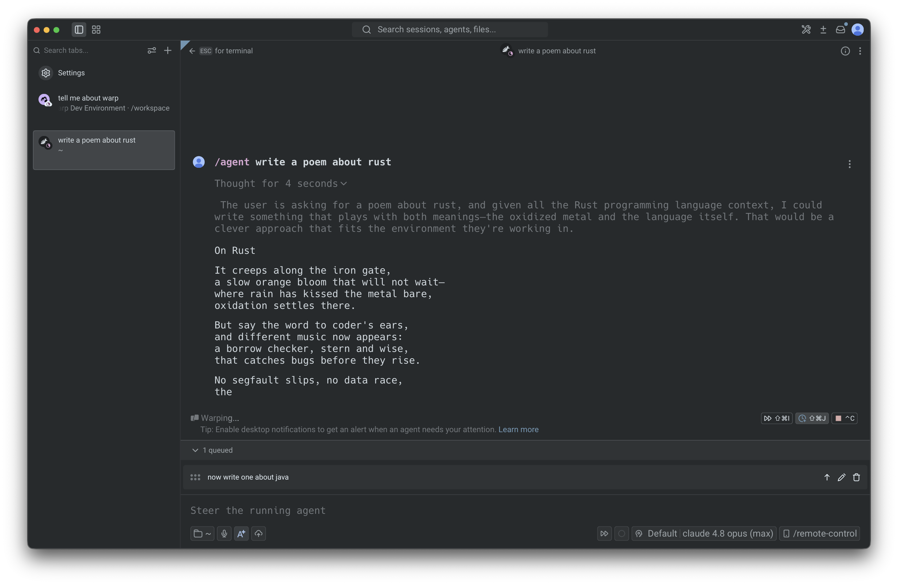
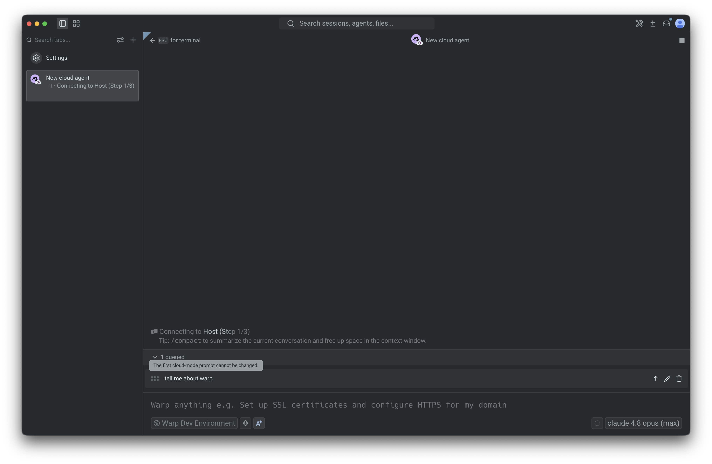

Prompt queueing lets you line up follow-up prompts while an agent is still working. Instead of waiting for the agent to finish—or interrupting it to send your next idea—you queue prompts and Warp sends them automatically, one at a time, as each response completes.

<figure style={{ maxWidth: "563px" }}>

<figcaption>The queued prompts panel, with three prompts queued while the agent responds.</figcaption>
</figure>

## Key features

* **Auto-queue toggle** - Turn on auto-queue so every prompt you submit while the agent is busy joins the queue instead of interrupting the current response.
* **`/queue` slash command** - Queue a single follow-up prompt inline, without switching modes.
* **Queued prompts panel** - View, reorder, edit, and remove every pending prompt from one collapsible panel above the input.
* **Automatic sequential sending** - Queued prompts fire one at a time as the agent finishes each response, in the order you set.
* **Send the next prompt with Enter** - When the input is empty, press `Enter` to send the top queued row immediately.
* **Auto-queue during long-running commands** - By default, prompts submitted while an agent is driving a long-running command it started are queued and sent when the command finishes.
* **Per-conversation queues** - Each conversation keeps its own queue and auto-queue state, which persist when you leave and re-enter the conversation.
* **Cloud agent support** - Queue follow-ups for cloud agents, even while the environment is still setting up.

## How it works

Each agent conversation has its own queue. When the current response finishes successfully, Warp sends the next prompt in the queue. This continues one prompt at a time until the queue is empty.

Queued prompts use the same submission flow as prompts you send manually, so slash commands, skills, and other input behave the same way.

A few things to know:

* **Shell commands are never queued.** If you submit in shell mode, Warp runs the command in the terminal immediately, regardless of your auto-queue setting. The exception is while an agent is driving a long-running command. See [Queueing during long-running commands](#queueing-during-long-running-commands).
* **Queues don't persist across restarts.** A conversation's queue is cleared when the conversation is deleted or cleared, and queues do not persist after an app restart.
* **One prompt is in flight at a time.** Warp waits for the current response to finish before sending the next queued prompt.

## Queueing a prompt

There are three ways to queue prompts yourself. The auto-queue toggle and `/queue` act on the active conversation; the default submission mode setting controls what happens app-wide. Warp also queues prompts automatically while an agent is driving a long-running command. See [Queueing during long-running commands](#queueing-during-long-running-commands).

### Auto-queue toggle

The auto-queue toggle is the fastest way to queue several prompts in a row. While the agent is responding, a clock-plus icon appears in the warping indicator (the status bar above the input).

<figure style={{ maxWidth: "350px" }}>

<figcaption>The auto-queue toggle in the warping indicator.</figcaption>
</figure>

1. Click the clock-plus icon, or press `⌘+Shift+J` (macOS) or `Ctrl+Shift+J` (Windows/Linux). The icon turns the accent color to show auto-queue is on.
2. Type a prompt and press `Enter`. Because the conversation is in progress, the prompt is added to the queue instead of interrupting the current response. The input refocuses so you can keep queuing.

The toggle is per-conversation and stays on across responses until you turn it off, so you can queue as many prompts as you like. Switching to another conversation shows that conversation's own toggle state.

### `/queue` slash command

Use `/queue` to add one follow-up prompt without turning on auto-queue.

1. In an agent conversation, type `/queue` followed by the prompt—for example, `/queue run the tests and fix any failures`.
2. Press `Enter`. The prompt is added to the queue and the input clears.

`/queue` requires an active conversation and a prompt. If you run `/queue` without a prompt, Warp shows an error.

Note: If the agent is idle, `/queue` sends the prompt immediately. It only queues prompts while a response is in progress.

### Set the default submission mode

By default, submitting a prompt while the agent is responding interrupts the current response and sends your new prompt right away. You can change this default so new conversations queue instead.

1. In the Warp app, go to **Settings** > **Agents** > **Warp Agent** > **Input**.
2. For **Default prompt submission mode**, choose one of:
   * **Interrupt response** - Cancel the in-flight response and send the new prompt immediately (the default).
   * **Queue until response finishes** - Hold the new prompt until the current response finishes, then send it.

This setting is the default for conversations that you haven't explicitly toggled. The per-conversation auto-queue toggle always overrides it for that conversation.

When **Interrupt response** is selected, a second dropdown, **Default long-running command submission mode**, appears directly below it. It controls what happens while an agent is driving a long-running command. See [Queueing during long-running commands](#queueing-during-long-running-commands).

<figure style={{ maxWidth: "563px" }}>

<figcaption>The Default prompt submission mode setting under Agent input settings.</figcaption>
</figure>

## Queueing during long-running commands

When an agent is driving a long-running command it started (a dev server, REPL, database shell, or other interactive program it launched through [Full Terminal Use](/agents/capabilities/full-terminal-use/)), prompts you submit are queued by default instead of steering the agent mid-command. Warp sends them to the agent automatically when the command finishes. This auto-queueing applies only to commands the agent started; if you start a command yourself and tag the agent in, your prompts keep steering the agent immediately.

While the agent is in control of the command (including while it's blocked waiting for an approval):

* **Prompts queue instead of interrupting.** Submitting a prompt adds it to the conversation's queue and clears the input so you can keep typing. These rows show an italic *(queued until the command finishes)* suffix after the prompt text, indicating they fire when the command ends rather than when the full response finishes.
* **Suffixed prompts send when the command finishes.** When the command finishes, Warp sends the suffixed prompts at the front of the queue, in order, even if you manually took over the command first. A suffixed prompt sends this way only while it stays at the front: if you reorder a prompt queued another way ahead of it, that suffixed prompt waits and sends later under the normal end-of-response rules. Prompts queued in other ways (`/queue`, the auto-queue toggle, or the queue default mode) always follow those normal rules.
* **Shell commands queue as regular commands.** Shell commands you submit during a long-running command are queued without the suffix and run in the terminal as usual; they are not sent to the agent when the command ends.
* **The UI reflects the queue state.** The auto-queue toggle in the warping indicator appears in its active, accent-colored state, and the empty input's ghost text shows the queue hint instead of the steer hint.
* **All queue interactions still work.** You can reorder, edit, delete, use send now, or press `Enter` on an empty input to send the top row early.

This queueing is per-conversation and derived from the running command rather than a sticky toggle: when the command ends or control transfers back to you, the conversation reverts to whatever queue state it had before the command (its own toggle state, or the app-wide default). It applies only while the agent is in control of the command, not while you are.

To steer the agent mid-command instead, turn the auto-queue toggle off: click the clock-plus icon, or press `⌘+Shift+J` (macOS) or `Ctrl+Shift+J` (Windows/Linux). Prompts then send immediately for the remainder of that command only; the override doesn't change the conversation's persistent toggle state, and the next command the agent starts auto-queues again. Toggling it back on re-enables queueing for the rest of the command.

### Change the long-running command submission mode

You can change this behavior app-wide:

1. In the Warp app, go to **Settings** > **Agents** > **Warp Agent** > **Input**.
2. For **Default long-running command submission mode**, choose one of:
   * **Queue until command finishes** - Queue prompts submitted while an agent is driving a long-running command it started, and send them to the agent when the command finishes (the default).
   * **Send immediately** - Send the prompt to the agent right away, steering it mid-command.

The dropdown appears directly below **Default prompt submission mode**, and only when that setting is **Interrupt response**. When the default prompt submission mode is **Queue until response finishes**, this setting is hidden and ignored, because prompts already queue until the entire response finishes.

Changing the setting takes effect immediately, including in the middle of a running command. You can also change it from the Command Palette using **Set long-running command submission: send immediately** or **Set long-running command submission: queue until command finishes**, which are available while the default prompt submission mode is **Interrupt response**.

## Managing queued prompts

When a conversation has at least one queued prompt, the queued prompts panel appears between the warping indicator and the input box. Its header shows the count, such as **2 queued**, with a chevron to collapse or expand the list. The panel is expanded by default, and prompts are listed from top (next to send) to bottom (last to send).

Hovering a row reveals controls for that prompt:

* **Reorder** - Drag a row up or down by its handle to change the order. The row at the top of the list always sends next.
* **Send now** - Click the up-arrow icon to send that prompt immediately instead of waiting for the agent to finish the current response. You can also press `Enter` while the input box is empty to send the top row. See [Send the next prompt with Enter](#send-the-next-prompt-with-enter) below.
* **Edit** - Click the pencil icon to edit the prompt inline. Press `Enter` to save your changes or `Esc` to cancel.
* **Delete** - Click the trash icon to remove the prompt from the queue. If the input is empty, Warp moves the deleted prompt into the input so you can revise and resend it. If the input already has text, the deleted prompt is discarded.

<figure style={{ maxWidth: "563px" }}>

<figcaption>A queued row with its send now, edit, and delete controls revealed on hover.</figcaption>
</figure>

Deleting the last prompt removes the panel, since the queue is now empty.

### Send the next prompt with Enter

When the queued prompts panel is showing and the input box is empty, pressing `Enter` sends the row at the top of the queue immediately, exactly like clicking that row's send now button. Each press sends one row: the remaining rows stay queued, and pressing `Enter` again sends the new top row, until the queue is empty. The input stays empty throughout.

This works for both row types: queued prompts are sent to the agent, and queued shell commands run in the terminal. If the input has any text, `Enter` keeps its normal behavior and submits the typed input, leaving the queue untouched. `Enter` also keeps its normal behavior while the CLI agent Rich Input composer is open.

The panel header shows this shortcut: next to the queued count, an **⏎ to send** hint appears whenever pressing `Enter` would send the top row. The hint is hidden when it wouldn't, for example while you're editing a row inline, while the input has text, or when the top row is a cloud run's locked initial prompt. That locked prompt can never be sent this way; `Enter` does nothing while it sits at the head of the queue, and the rows behind it wait until it's removed.

## When sending pauses

Queued prompts only continue after a response finishes successfully. If the response errors, is stopped, or is interrupted with `Ctrl+C`, Warp pauses the queue so you can review what should happen next. The queue stays intact, and no queued prompts are discarded.

When sending pauses and you're viewing that conversation, Warp helps you pick up where you left off:

* If the input box is empty, the first queued prompt is removed from the queue and its text is placed in the input so you can review and resend it.
* If the input box already has text, the queue is left untouched.

Any remaining prompts stay in the panel so you can review, edit, reorder, or delete them. Sending resumes automatically the next time the conversation completes a response cleanly.

## Prompt queueing with cloud agents

Prompt queueing also works for [cloud agents](/platform/), including while a cloud environment is still setting up. You can queue follow-up work before the agent is live, and Warp sends those prompts once the agent is ready and the current response finishes.

For cloud agents, the prompt that started the run appears as a locked first row in the queue because it has already been accepted by the agent. You can't edit, reorder, or delete that first prompt, but any follow-up prompts queued behind it remain editable.

<figure style={{ maxWidth: "563px" }}>

<figcaption>A cloud run's locked initial prompt during environment setup.</figcaption>
</figure>

While the environment is setting up, queued prompts wait until the cloud agent is live. After setup, the locked row is removed and the rest of the queue sends in order as each response completes.

Because cloud conversations keep running after you leave the agent view, their queues continue to send in the background and are restored when you return.

## Related pages

* [Slash Commands](/agents/capabilities/slash-commands/) - The full list of built-in commands, including `/queue`.
* [Full Terminal Use](/agents/capabilities/full-terminal-use/) - How agents attach to and drive interactive long-running commands.
* [Terminal and Agent modes](/agents/local-agents/interacting-with-agents/terminal-and-agent-modes/) - How input is routed between the terminal and the agent.
* [Cloud agents overview](/platform/) - Run agents in the cloud from any trigger.
