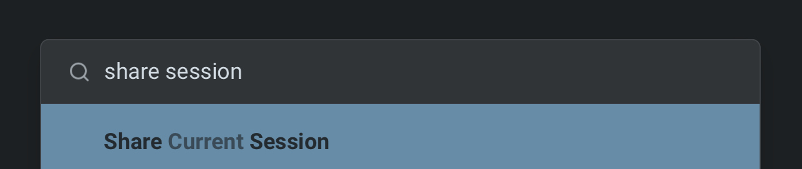

import VideoEmbed from '@components/VideoEmbed.astro';

**Agent Session Sharing** extends Warp's regular [Session Sharing](/knowledge-and-collaboration/session-sharing/) to include full visibility and control over Agent activity. Share any agent session — Oz or third-party — so collaborators can watch progress, review output, and steer the agent from the Warp app, a web browser, or a mobile device.

Use Agent Session Sharing when teammates need the execution context behind an agent's work, not just the final answer or code diff. A shared agent session can show the prompt, responses, thinking states, tool use, planning steps, terminal output, and follow-up messages in one reviewable link.

<VideoEmbed url="https://www.loom.com/share/89e0e99c9bbf463a8a5e5bc2e96dabe4" title="Agent Session Sharing in action — sharing a live session and collaborating across devices." />

## Key capabilities

* **Full Agent visibility** - Viewers see Agent prompts, responses, thinking states, tool use, planning steps, and [credit](/support-and-community/plans-and-billing/credits/) consumption in real time
* **Cross-device access** - Open shared sessions from the Warp app, any web browser, or a mobile device. No install required for web viewers.
* **Collaborative editing** - Grant edit access so collaborators can send their own Agent queries, execute commands, and start new conversations
* **Multi-viewer support** - Multiple participants can observe and interact with the same session simultaneously, each with their own cursor and avatar
* **Remote Control** - Publish third-party agent sessions to the cloud for persistent, asynchronous monitoring and steering from anywhere. See [Remote Control](/agents/cli-agents/remote-control/).

## Review agent work with a shared session

When you share an agent session, collaborators can inspect the work at the same level of detail you saw while the agent was running. This is useful when:

* A teammate wants to review how an agent reached a conclusion
* A reviewer needs the agent's execution context alongside a PR or code diff
* An agent used a third-party CLI tool and you want a persistent record of the terminal session
* A workflow needs asynchronous review from a teammate on another machine or mobile device

Share the link only with collaborators who should be able to see the session contents, including prompts, terminal output, and any context visible in the scrollback.

## How it works

When you share an agent session, Warp uploads the session's scrollback and live output to Warp's servers and generates a shareable link. Session Sharing works through Warp's servers rather than as a direct, peer-to-peer connection between devices, so the session stays in sync — any new agent output or terminal activity appears for all viewers in real time. The person who shares the session controls who can view and who can interact.

## Data retention and access

Understanding how long shared data sticks around, how to stop sharing it, and who can see it helps you decide what's safe to share.

### How long shared data is kept

Shared session data expires automatically about one week after you create the share. After that, the link can no longer be opened. This matches the message Warp shows when you try to open an expired link: "Sessions expire after one week and cannot be opened."

### Stopping a share

Stopping a share immediately ends live access for every participant — no one can continue watching or interacting once you stop it. The share link can no longer be opened after the one-week expiry. There's currently no separate control to delete a single shared session's data before that expiry.

:::note
Shared [Blocks](/terminal/blocks/block-sharing/) work differently. Unsharing a Block permanently deletes it. Session shares rely on the one-week expiry instead of an immediate-delete action.
:::

To remove all of your shared session data through account deletion rather than waiting for the shared-session expiry, delete your Warp account and data. Deletion jobs run every 24 hours, so removal is not immediate. See [Delete your account and data](/support-and-community/privacy-and-security/privacy/#delete-your-account-and-data).

### Who can access a shared session

Access to a shared session is based on who you grant it to, not just who has the link:

* **Owner** - You, the person who started the share, control who can view and interact
* **Invited collaborators** - People you explicitly invite to the session
* **Your team** - Optionally, you can extend access to your whole team
* **Anyone with the link** - Available as a setting when you want broader access

Viewers must sign in to a Warp account to open a shared session. Workspace admins can disable invites and link sharing for the team by policy. Roles determine what a participant can do once they have access — some participants can only view the session, while others can also steer it by sending commands or agent queries. See [Collaboration and steering](#collaboration-and-steering) below.

### Secrets in shared sessions

:::caution
[Secret Redaction](/support-and-community/privacy-and-security/secret-redaction/) isn't applied to Session Sharing. Anything visible in a shared session's scrollback, including values that Secret Redaction would otherwise redact elsewhere, is visible to everyone who can access the share. Treat sharing a session like sharing your screen: review what's in the scrollback before you share it.
:::

### AI and shared sessions

Sharing a session doesn't, by itself, send its contents to a model. Shared sessions are excluded from Warp Drive's AI indexing, so a shared session's contents aren't made searchable or citable by agents just because it was shared. An agent only sees a shared session's terminal content when someone actually uses an AI feature inside that session — either you, or a collaborator you've granted edit access to.

## Sharing a session

1. Start or open an agent session in Warp. The agent can be Warp's built-in agent, a third-party coding agent, or any interactive agent running in your terminal.
2. Open the share action from any of these entry points:
   * **Command Palette** - Search for "Share current session"
   * **Pane header** - Click the overflow menu in the pane header
   * **Right-click context menu** - Right-click inside the session pane
   * **`/remote-control` chip** - For third-party agent sessions, click the `/remote-control` chip in the agent view footer or the CLI footer to publish and share instantly. See [Remote Control](/agents/cli-agents/remote-control/) for details.
3. Choose your starting point (full scrollback, no scrollback, or a specific block).
4. Confirm the share. Warp uploads the session to the cloud and generates a shareable link.
5. Copy the link and share it with teammates, or open it on another device.

<figure style={{ maxWidth: "350px" }}>

<figcaption>Start a shared session via the right click menu.</figcaption>
</figure>

<figure style={{ maxWidth: "375px" }}>

<figcaption>Start a shared session via the Command Palette.</figcaption>
</figure>

## Viewing shared sessions

Shared sessions are accessible from:

* **Warp app** - Paste the link into Warp on a different machine for the full app experience
* **Web browser** - Open the shared link in any browser. No app install required.
* **Mobile** - Open the link on a phone or tablet browser to check on progress while away from your desk

The web experience mirrors the desktop view, showing complete Agent activity including thinking steps, tool use, and terminal output.

## Collaboration and steering

### Watching Agent activity

Viewers see Agent actions unfold live as the sharer interacts with the Agent:

* **Thinking animations** - Real-time indicators of Agent reasoning
* **Tool use and planning** - Visible tool calls and planning steps
* **Credit consumption** - Live credit usage for the session
* **Final responses** - Completed Agent output

### Edit access

If a viewer requests edit access, the sharer can approve it. Once approved, collaborators can:

* Send new Agent queries
* Type directly into the prompt
* Execute commands
* Start and switch Agent conversations
* Run terminal commands alongside Agent queries

### Multi-viewer sessions

Multiple participants can join the same session from different machines, browsers, or environments. All participants:

* See each other's avatars and cursors
* Watch Agent activity in sync
* Edit together when granted access
* Run terminal or Agent commands concurrently

## Related pages

* [Remote Control](/agents/cli-agents/remote-control/)
* [Third-party CLI agents](/agents/cli-agents/overview/)
* [Cloud Agent Session Sharing](/platform/viewing-cloud-agent-runs/)
* [Attach agent session context to GitHub PRs](/guides/agent-workflows/how-to-attach-agent-session-context-to-github-prs/)
* [Session Sharing (terminal)](/knowledge-and-collaboration/session-sharing/)
* [Secret Redaction](/support-and-community/privacy-and-security/secret-redaction/)
* [Privacy and data control](/support-and-community/privacy-and-security/privacy/)
