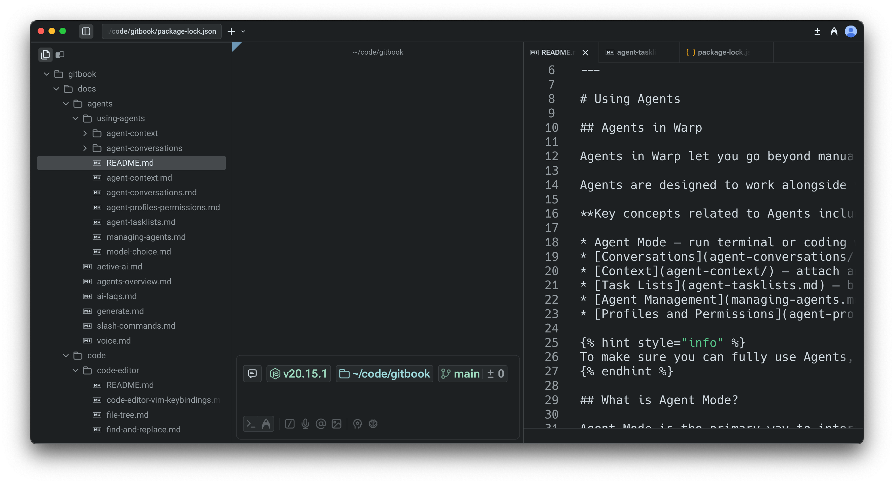
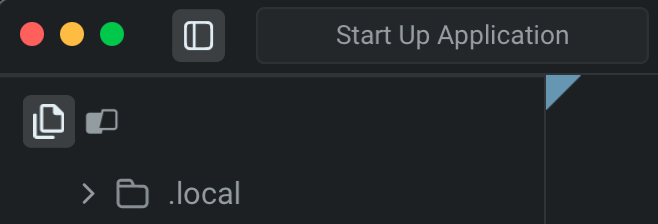
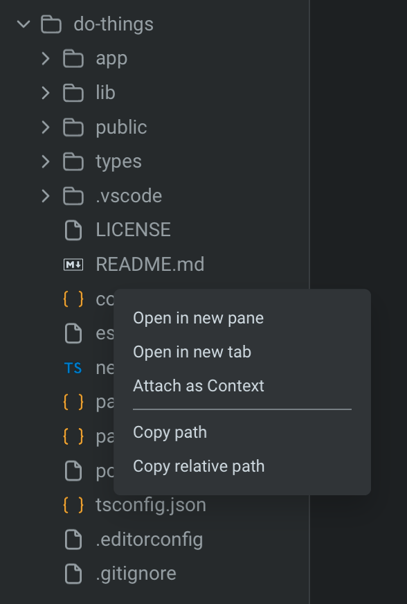
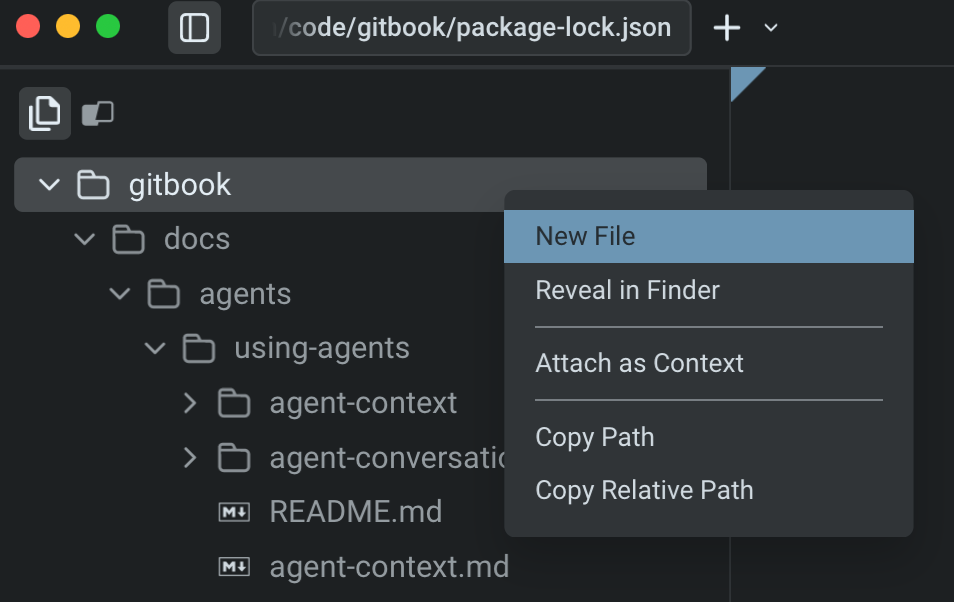

Warp includes a **native file tree** that makes it easy to explore and manage project files. The file tree is available whenever in any directory and it automatically reflects your project structure as files are added, removed, or changed.

:::note
The file tree also works over SSH on macOS and Linux when Warp's [SSH extension](/terminal/warpify/ssh/#installing-the-ssh-extension) is installed on the remote host.
:::

### Opening the file tree

You can open the file tree from the tools panel on the left hand side:

* **Tools panel**: Click the Tools sidebar button, then open the File Tree tab (first tab in the panel).
* Press `CMD + \` to open the left panel, then assign your own shortcut for File Tree (and Warp Drive) in **Settings** > **Keyboard shortcuts**.

:::note
Warp supports icons for common file types. If a file type is missing an icon, please [file a GitHub issue](https://github.com/warpdotdev/Warp/issues) so we can review and add support.
:::

### Browsing and opening files

Clicking on a file opens it directly in Warp’s [**native Code Editor**](/code/code-editor/), where you can view and edit code in a separate pane or tab.

## File and folder actions

Right-clicking any **file** opens a context menu with several useful options:

* **Open in new pane**: Open the file in a side-by-side pane.
* **Open in new tab**: Open the file in a new tab.
* **Attach as context**: Insert the file into an agent prompt so the Agent can analyze or reference it.
* **Copy path**: Copy the absolute file path.
* **Copy relative path**: Copy the path relative to your current working directory.

Right-clicking any **folder** opens a context menu with the following options:

*   **Create new file**: Add a new file directly from the tree.

    
* **Attach as context**: Insert the selected file into your agent prompt so the Agent can analyze or reference it.
* **Copy path**: Copy the absolute file path to your clipboard.
* **Copy relative path**: Copy the path relative to your current working directory.

