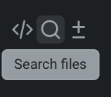
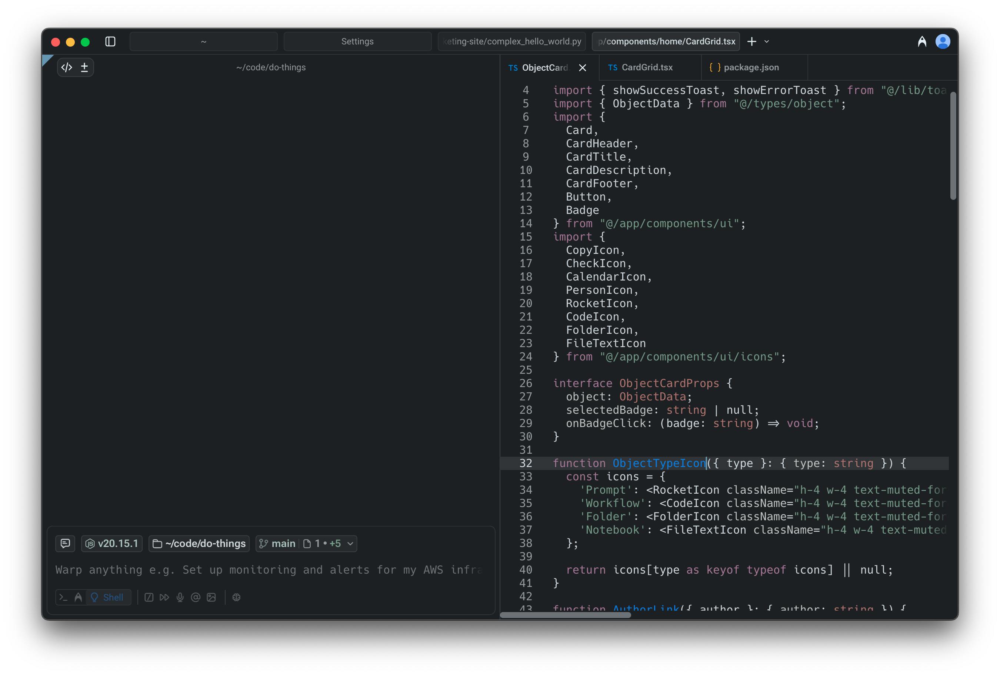

import VideoEmbed from '@components/VideoEmbed.astro';

Warp comes with a native code editor designed for quick, in-flow edits alongside your Agent conversations. Instead of switching back and forth to an IDE, you can open and edit files directly in Warp — with essentials like syntax highlighting, a tabbed file viewer, find and replace, Vim keybindings, and a file tree for browsing and adding files as context.

The editor is built for fast changes to agent-generated code: renaming a variable, tweaking copy, or rewriting a short function. Having just enough editing power in-context makes it easier to land an agent’s changes and keep momentum.

### Opening files in Warp

**You can open files in the editor in several ways:**

1. **Click a file path** from the terminal output or an AI conversation and select "Open in Warp."
2.  **Use the file menu in the Command Palette** (`CMD + O` on macOS, `CTRL + SHIFT + O` on Windows or Linux) when in a Git-tracked repo to search for and open files inside that repo.

    1. You can also access this via the magnifying glass icon in the pane coding toolbelt at the top left of any pane.

    
3. **Browse via the** [File Tree (Project Explorer)](/code/code-editor/file-tree/) to open or create files.
4. **Opening a generated code diff** from an Agent Conversation: [Code Diffs in Agent Conversations](/agent-platform/local-agents/code-diffs/).

<VideoEmbed url="https://screen.studio/share/H7hTUgf2" />

**To save your changes to files**: use `CMD + S` on macOS or `CTRL + S` on Windows or Linux.

### Tabbed file viewer

Warp can group multiple files into a single tabbed viewer, reducing clutter and making it easier to work across multiple files.

* Enabled by default for new users (can be toggled in **Settings** > **Features** > **General** > **Group files into a single editor pane**)
* Reorder, close, or drag file viewers between tabs.
* Merge entire panes together by dragging one into another.

**Here's a more in-depth demo:**

<VideoEmbed url="https://www.loom.com/share/a682461da66944f583e2fa3d27b71189?sid=679ce8f6-e530-4c0d-99ab-0613d1269f8b" />

### **File layout options**

Choose how new files open in Warp by default in: **Settings** > **Features** > **General** > **Choose a layout to open files in Warp**

* **Split pane**: new files open alongside the current editor
* **New tab**: new files open in their own tabbed viewer

### Supported languages

The editor supports syntax highlighting and editing for a wide range of languages, including:

Rust, Go, YAML, Python, JavaScript/TypeScript, JSX/TSX, Java/Groovy, C++, Shell/Bash, C#, HTML, CSS, C, JSON, HCL/Terraform, Lua, Ruby, PHP, TOML, Swift, Kotlin, Starlark, SQL, Powershell, and Elixir.

We’re continuously expanding language support.

### Shared buffers

When you open the same file in multiple tabs or panes, Warp keeps them in sync automatically. Edits made in one view are immediately reflected in all others, and when a file changes on disk (for example, after switching branches), every view updates together.

### Other editor features

Warp's native code editor also supports the following features:

* [Language Server Protocol (LSP)](/code/code-editor/language-server-protocol/) - Get hover info, go-to-definition, find references, inline diagnostics, and format-on-save powered by language servers for Rust, Go, Python, TypeScript/JavaScript, and C/C++.
* [File Tree (Project Explorer)](/code/code-editor/file-tree/) - Browse, open, and manage your project with Warp's native file tree.
* [Find and Replace](/code/code-editor/find-and-replace/) - Use Warp's built-in find and replace to quickly search across a file, jump between matches, and make precise edits with options for regex, case sensitivity, and smart case preservation.
* [Code Editor Vim Keybindings](/code/code-editor/code-editor-vim-keybindings/) - Use Vim keybindings to edit code and text in Warp's native code editor.

