import DemoVideo from '@components/DemoVideo.astro';
import VideoEmbed from '@components/VideoEmbed.astro';

## Overview

When you are working locally in a Git repository with uncommitted changes, the **Code Review panel** lets you inspect, edit, and manage code changes directly inside Warp. It integrates with Git and Warp's Agents, giving you the ability to:

* Review diffs and attach them as context for the Agent
* Apply, edit, or revert changes in real time
* See changes made outside of Warp or by Warp's Agents automatically reflected

Any uncommitted changes appear in the panel (or compare the changes on your branch against `main` or `master` ). Switching branches or saving files updates the panel instantly, so it always reflects the current state of your codebase.

<VideoEmbed url="https://www.loom.com/share/96581523168742eb9b95c3973924728c?sid=a3ee9164-4274-4468-ac32-38ce6807f9a8" title="Code Review Demo" />

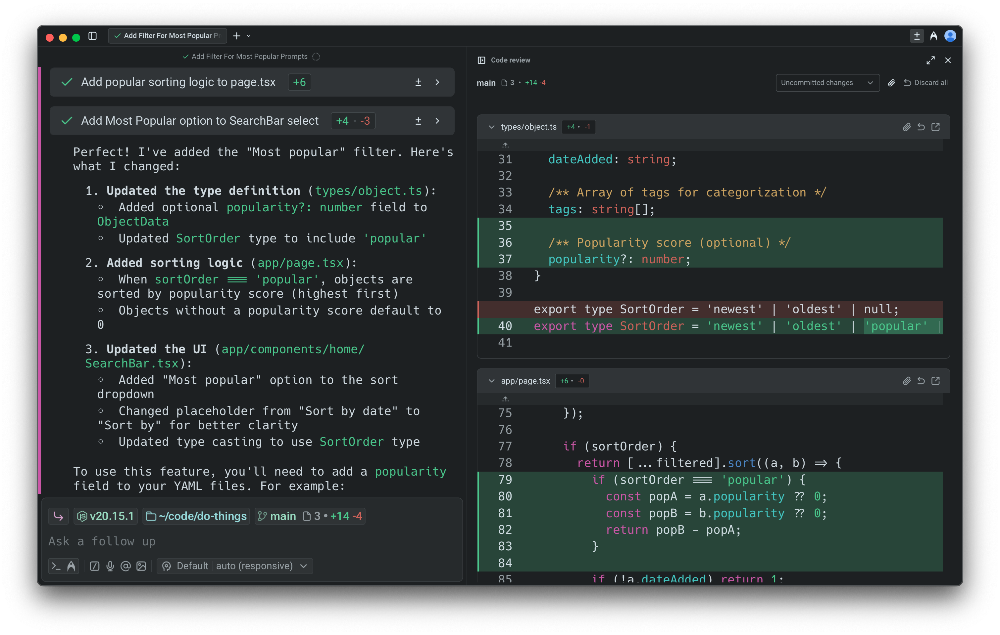

:::note
To review agent-generated diffs, leave inline comments, batch your feedback, and have the agent apply all requested changes, see [Interactive Code Review](/agent-platform/local-agents/interactive-code-review/).
:::

## Opening the Code Review panel

The Code Review panel can be opened in several ways. Each entry point makes it easy to inspect and manage changes without leaving your workflow.

:::tip
You can also open the Code Review panel with `CMD – SHIFT – +` on macOS or `CTRL – SHIFT – +` on Windows and Linux.
:::

#### 1. Git diff chip (terminal input)

In terminal mode, when you're in a Git repository with changes, the Git diff chip shows the number of files modified along with lines added and removed. Clicking the chip opens the Code Review panel with the relevant diffs.

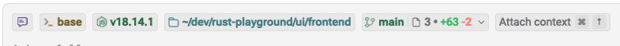

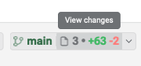

#### 2. Agent conversation: review changes button

When an Agent makes code edits in an [Agent Conversation](/agent-platform/local-agents/interacting-with-agents/), a `Review changes` button appears at the bottom of the conversation. Click the button to open the code review panel.

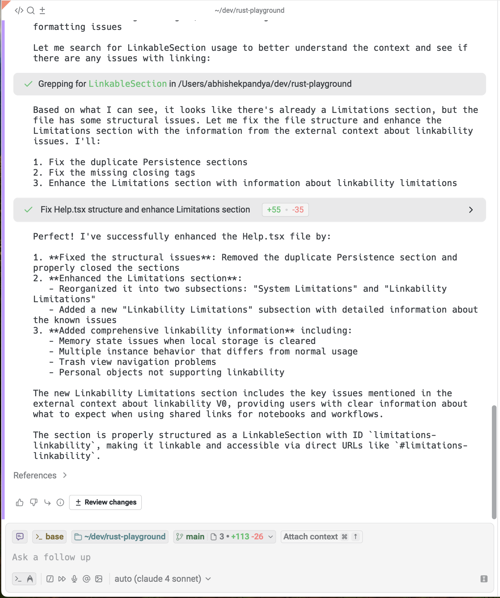

#### 3. Agent conversation: toolbelt (bottom right)

During an Agent conversation, you can view all changed files in the toolbelt chips at the persistent bottom right. From there, you can open the Code Review panel directly.

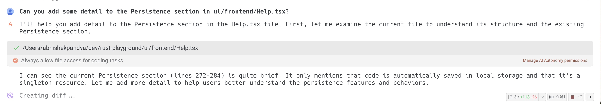

#### 4. Warp tab bar

In any Git-tracked repository, you can open the Code Review panel by clicking the `Code review` button in the top-right corner of Warp, next to your avatar.

#### Viewing all edited files

Inside the Code Review panel, you can open the file sidebar to browse all changed files in your repository. Clicking on a file will automatically scroll to that file in the panel.

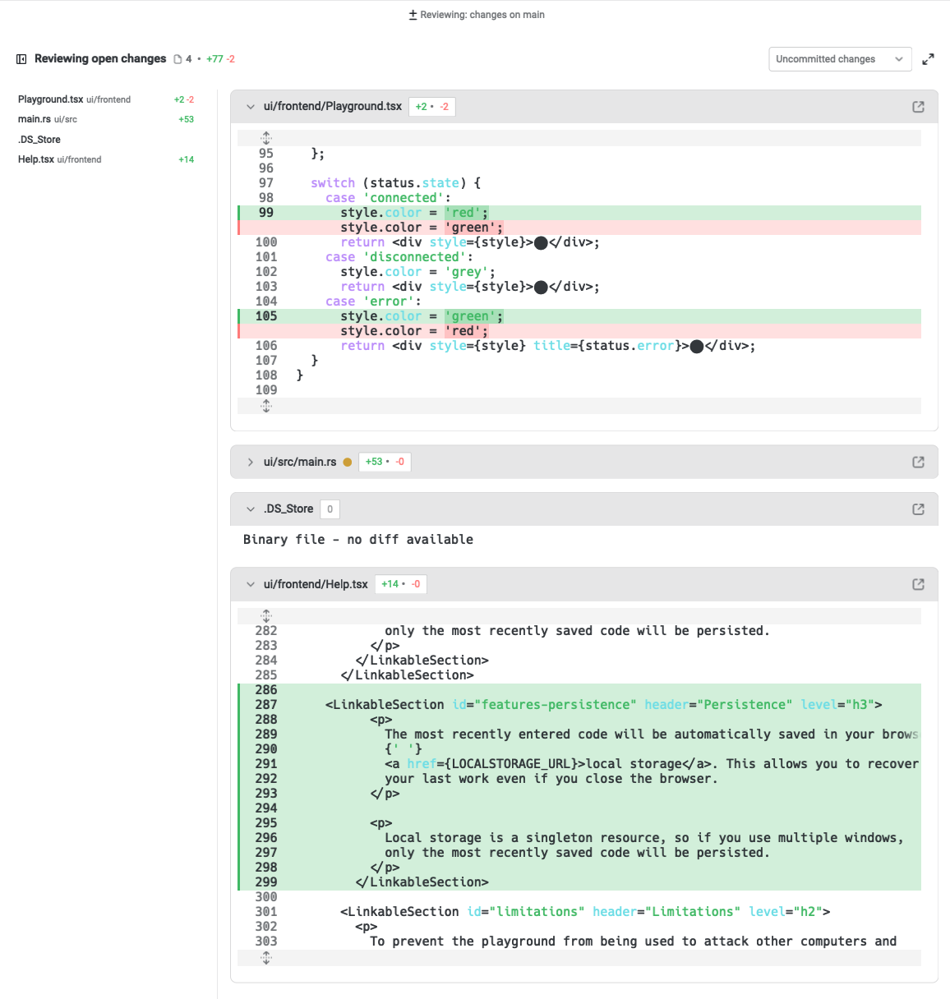

:::note
By default, the Code Review panel opens as a pane on the right, but you can drag it to reposition wherever you prefer.
:::

## Reviewing diffs

By default, the Code Review panel shows all **uncommitted changes** on your current branch, excluding changes to files ignored by `.gitignore`.

Warp offers two ways to review changes:

1. **Uncommitted changes**: view all edits you've made locally on the current branch.
2. **Changes vs. main**: compare your branch against `main` or `master` to see what would be included in a pull request to that branch, for instance.
   1. Warp automatically detects the target branch and updates the comparison accordingly.
3. **Changes vs. another branch**: compare your work against any arbitrary branch for stacked PRs, feature comparisons, or alternate base branches.

You can manually switch between the two views either in the Code Review panel or via the Git diff chip in the terminal input:

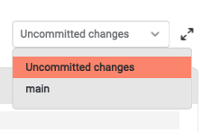

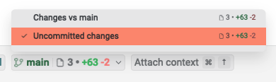

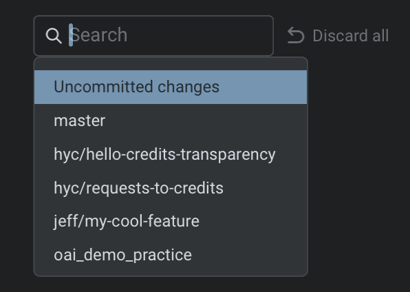

Any saved edits made outside of Warp (e.g. in another editor), as well as changes applied by Warp's Agents, appear automatically. The panel updates in real time, ensuring it always reflects the current state of your working file and directory.

#### Attaching diffs as context

The Code Review pane makes it simple to share changes with the Agent. You can attach an entire diff to a prompt so the Agent has full visibility into what was added or removed.

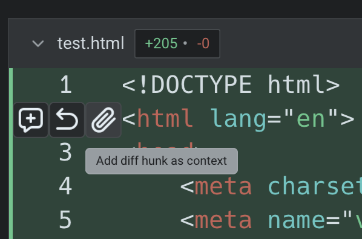

This ensures responses are grounded in your latest edits, whether you're asking for feedback, explanations, or follow-up changes. For more details, see [Selection as Context](/agent-platform/local-agents/agent-context/selection-as-context/).

#### Reverting diffs

The Code Review panel lets you easily undo changes at different levels. In the gutter next to each diff, you’ll see an option to revert a hunk: roll back a specific set of changes (a “diff hunk”) within a file. This removes the added or modified lines and restores the previous version.

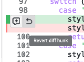

When you revert, the changes are immediately updated in your working directory. The file is restored to match the selected version, so you can continue editing or commit without the reverted code.

### Opening Files from Code Review

In addition to reviewing and editing diffs directly in the Code Review pane, you can open a file directly in Warp's [Code Editor](/code/code-editor/).

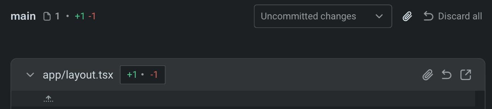

* Clicking the **expand button** (right-most button on the header) opens the file in a new editor tab, allowing you to see the full file beyond just the changed lines.
  * This is useful when you need additional context around a diff, want to make broader edits, or prefer working in the full editor rather than inline.
* Once opened, the file behaves like any other editor tab: you can scroll, edit, search, and save.
* Any changes made in the editor automatically sync back into the Code Review pane, so the diff view always stays current.

**Note**: from this code review file header, you can also attach a file diff as context into Warp's agent, or discard all the changes on a single file.&#x20;

#### Directly editing code diffs

Alternatively, from the Code Review panel, you are able to click and edit the diffs directly:

### Sending comments to a running agent

You can leave inline comments in the Code Review panel and send them directly to a running coding agent session, including third-party CLI agents like Claude Code, Codex, and others.

This extends Warp's [Interactive Code Review](/agent-platform/local-agents/interactive-code-review/) workflow to any supported CLI agent running in Warp. The agent receives your batch of comments and applies the requested changes.

<DemoVideo src="/assets/terminal/code-review-inline-comment.mp4" label="Adding an inline comment on a diff line and sending it to a running agent" />

For more on supported agents, see [Third-Party CLI Agents](/agent-platform/cli-agents/overview/).

### Discarding all changes

The Code Review panel also lets you discard every uncommitted change on your branch in one action. Clicking Discard all removes all local modifications shown in the panel and restores each file to its state on the base branch. This is useful when you want to reset your working directory, abandon a set of edits, or start a new iteration from a clean slate.

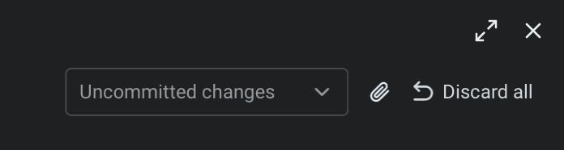

Discarding changes will ask you confirm, but still make sure you've saved or backed up anything you want to keep before using it.

:::note
Warp natively supports Git worktrees for Code Review and other features. See [Git worktrees](/code/git-worktrees/) for details.
:::
