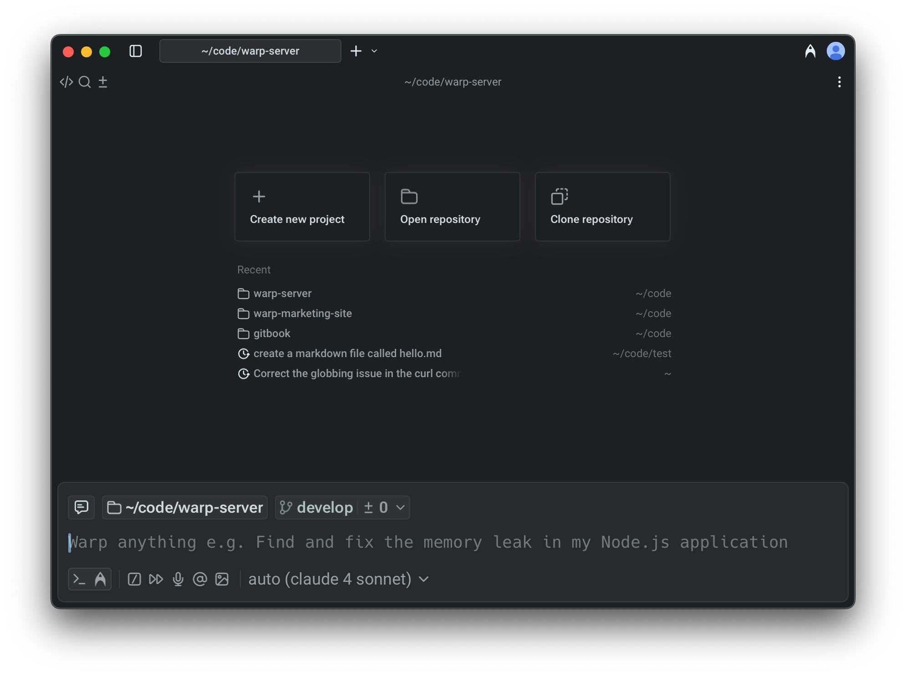

import VideoEmbed from '@components/VideoEmbed.astro';

:::note
Several coding features — including Codebase Context, code diffs, the code editor, and the file tree — are not yet available in SSH or WSL sessions.
:::

## From prompt to production

Warp Code is a suite of features designed to help you take agent-generated code from the initial prompt and project setup all the way to deployment and production. It is powered by Warp’s dedicated coding agent, which consistently ranks among the top results on [SWE-bench Verified](https://www.swebench.com/#verified) and [Terminal-Bench](https://www.tbench.ai/leaderboard).

In addition to Warp’s modern, [native code editor](/code/code-editor/), it includes:

* [Codebase Context](/agent-platform/capabilities/codebase-context/) for accurate, context-aware agent responses
* [Project Rules](/agent-platform/capabilities/rules/) and Commands to tailor agent behavior per repository
* A dedicated [Code Review](/code/code-review/) experience for reviewing and editing diffs
* [Zero-state and setup flows](/code/overview/#getting-started-with-coding-in-warp) to quickly start a new project or initialize an existing one

### Coding Agent

Warp’s coding agent is designed to help you generate, edit, and manage code directly in the [Agentic Development Environment](https://www.warp.dev/blog/reimagining-coding-agentic-development-environment). It detects opportunities to apply code diffs and surfaces them inline, allowing you to review and apply changes without switching to an external IDE. When you need to make manual edits, you can open Warp’s native code editor.

### How it works

* **Prompt-driven coding**: You write natural language prompts such as _“Add a retry mechanism to this API call”_ or _“Fix the failing unit test in auth.test.ts.”_
* **Inline code diffs**: When the agent proposes changes, it shows them as diffs you can inspect, modify, or reject.
* **Agent steering**: You can refine prompts, interrupt and retry, or attach context (such as a file, diff, or selection) to guide the agent toward better results.

<VideoEmbed url="https://youtu.be/W8rCsznM5HA" title="Coding Features Overview" />

:::note
Warp's coding agent only works on local repositories. The agent can make changes on remote or docker repositories, but falls back to using terminal commands (i.e. `sed`, `grep` ) to make the changes.
:::

### Examples of coding capabilities

Code responds to prompts related to code generation, editing, and analysis. Here are some examples:

* **Code creation**
  * “Write a function in JavaScript to debounce an input”
  * “Generate a Python class for managing user sessions with Redis.”
* **Error-driven fixes**
  * “Fix the TypeScript error shown in the last build output.”
  * “Resolve this merge conflict by keeping backend changes and updating tests accordingly.”
* **Refactoring**
  * “Update all instances of var to let in this file.”
  * “Extract the database logic from app.js into a new db.js module and update imports.”
* **Multi-file and repo-wide changes**
  * “Add headers to all .py files in this directory.”
  * “Replace requests with httpx across the codebase, updating imports and error handling.”
* **Complex workflows** (examples shown below — in practice, prompts should include more detail for best results)
  * “Implement OAuth2 authentication, update affected routes, and add tests.”
  * “Identify functions without test coverage and create Jest test files for them.”
  * “Optimize slow SQL queries in queries.sql and regenerate migrations.”

<VideoEmbed url="https://youtu.be/IuFSuOYstfg" title="How to kick off a coding task" />

<VideoEmbed url="https://youtu.be/dm-P63USsVg" title="How to interpret & edit Warp’s coding output" />

## Getting started with coding in Warp

Warp provides multiple entry points to begin coding with agents, whether you are starting a new project, opening an existing one, or cloning from GitHub. Each new tab shows a **zero state** that lets you choose how to proceed.

#### 1. Starting a new project

To begin a new project, select **Create a New Project** from the tab. You can start directly with a prompt (Warp will suggest ideas) or configure the project manually. Warp sets up the repository with an `AGENTS.md` file (filename must be in all caps) containing [project rules](/agent-platform/capabilities/rules/#project-rules) and enables [codebase indexing](/agent-platform/capabilities/codebase-context/) to provide the agent with full context.

#### 2. Open an existing repo

Select **Open Repository** to use your computer's file picker. If you choose a Git repository, Warp automatically changes into the directory and runs the `/init` setup command (a built-in "[slash command](/agent-platform/capabilities/slash-commands/)") if the repo has not already been initialized. Warp will detect the repository, index the codebase, and prepare it for coding.

* For non-Git folders, Warp simply changes into the directory without initialization.
* If you have an existing project that is not yet initialized, you can run `/init` manually to bootstrap it with a version-controlled `AGENTS.md` file.
* This view also shows a list of your three most recently used repositories and AI conversations for quick access, as well as a list of recent directories (which behave like running `cd`).

#### 3. Clone a repo

Select **Clone Repository** to paste in a repo link or clone directly from GitHub. Warp places you in the cloned folder and automatically runs the `/init` flow to set up project rules and indexing.

## Learn more about code features:

* [Code Editor](/code/code-editor/) - Warp's built-in code editor lets you make quick, in-context edits with essentials like syntax highlighting, tabs, find and replace, Vim keybindings, and a file tree.
  * [Language Server Protocol (LSP)](/code/code-editor/language-server-protocol/) - Warp integrates with language servers to provide hover info, go-to-definition, find references, inline diagnostics, and format-on-save for Rust, Go, Python, TypeScript/JavaScript, and C/C++.
* [Codebase Context](/agent-platform/capabilities/codebase-context/) - Warp indexes your Git-tracked codebase to help Agents understand your code and generate accurate, context-aware responses. No code is stored on Warp servers.
* [Code Review](/code/code-review/) - review, edit, and manage Git diffs in real time, with options to attach, revert, or open files directly.
  * You can also enter [Interactive Code Review](/agent-platform/local-agents/interactive-code-review/) to comment on changes, guide the agent, or adjust individual edits as they happen.
* [Code Diffs](/agent-platform/local-agents/code-diffs/) - Learn how to review, refine, and apply code changes generated by Warp's agents using the built-in visual diff editor.
