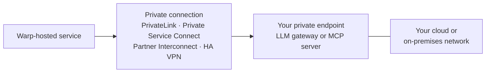

Private networking lets Warp reach an LLM gateway or MCP server without exposing the service to the public internet. You keep the service, access controls, and network policy in infrastructure you manage.

:::note
Private networking setup is manual and coordinated with Warp. Contact your Warp account team to start private networking onboarding.
:::

## Supported service connections

Private networking applies to services that Warp calls from its hosted services:

* **Private LLM endpoints** - Connect a team-managed, OpenAI-compatible endpoint such as an internal LiteLLM gateway. See [team-managed LLM API keys and endpoints](/enterprise/enterprise-features/team-managed-keys-and-endpoints/) for endpoint and model configuration.
* **Private MCP servers** - Connect a URL-based managed MCP installation. Include private OAuth or identity provider endpoints in the onboarding scope when the MCP server depends on them. See [MCP servers for cloud agents](/platform/mcp/#oauth-authentication).

Self-serve custom inference endpoints remain device-level settings and require a public URL.

Private networking for MCP servers applies only to managed MCP installations used by Warp-hosted cloud agents. Self-hosted cloud agents use their execution environment's network access; see [managed self-hosting](/factories/self-hosting/). A direct `url` MCP configuration doesn't use private networking.

## Connection flow

## Requirements

Prepare these items before onboarding:

* **Service details** - Provide the endpoint type, service hostname, and HTTPS port for each LLM endpoint or MCP server.
* **TLS certificate** - Serve the endpoint over HTTPS. Provide CA certificates when the endpoint doesn't use a publicly trusted authority.
* **OAuth endpoints** - For an OAuth-protected private MCP server, provide any private authorization, token, registration, or identity provider endpoints it uses.

## Choose a connection method

Use a provider-native private endpoint when the service is in AWS, Azure, or Google Cloud. Use Google Cloud Partner Interconnect for an on-premises or colocation network with a supported provider. Use HA VPN for a network that can establish a route-based IPsec tunnel.

| Service location | Connection method |
| --- | --- |
| Google Cloud | Private Service Connect |
| AWS | AWS PrivateLink |
| Azure | Azure Private Link |
| On-premises or colocation network | Google Cloud Partner Interconnect |
| Network with a public VPN gateway | HA VPN |

### Set up Google Cloud Private Service Connect

1. Put the service behind a load balancer supported by Private Service Connect.
2. Publish a regional service attachment in the region Warp specifies. See the Google Cloud guide to [publishing a service with Private Service Connect](https://cloud.google.com/vpc/docs/configure-private-service-connect-producer).
3. Configure explicit approval for the Warp consumer project supplied during onboarding.
4. Give Warp the service attachment URI, service hostname, and HTTPS port.

Warp and your team confirm that the private connection is ready before you configure the LLM endpoint or MCP server.

### Set up AWS PrivateLink

1. Put the service behind a VPC endpoint service, normally backed by a Network Load Balancer. See the AWS guide to [creating an endpoint service](https://docs.aws.amazon.com/vpc/latest/privatelink/create-endpoint-service.html).
2. Enable the AWS region Warp specifies during onboarding.
3. Allow the Warp AWS principal supplied during onboarding and accept Warp's connection.
4. Give Warp the endpoint service name, AWS region, service hostname, and HTTPS port.

Warp confirms when the consumer endpoint is connected and ready for an application test.

### Set up Azure Private Link

Give your Warp account team the endpoint type, service hostname, HTTPS port, and Azure region. Warp coordinates the remaining Private Link setup with your team.

### Set up Google Cloud Partner Interconnect

Use Partner Interconnect for an on-premises or colocation network connected through a supported Layer 3 provider:

1. Choose a supported provider and agree on the redundancy option with Warp. See the Google Cloud [Partner Interconnect overview](https://cloud.google.com/network-connectivity/docs/interconnect/concepts/partner-overview).
2. Give Warp the endpoint addresses or CIDR ranges, service hostname, HTTPS port, and any non-conflicting private ranges requested during onboarding.
3. Use the pairing keys Warp supplies to provision the connection with your provider.
4. Configure BGP to accept the proxy range supplied by Warp and advertise the service ranges.
5. Confirm that the BGP sessions and agreed redundant paths are available before testing the service.

### Set up HA VPN

Use HA VPN for a network that can establish a route-based IPsec tunnel:

1. Give Warp the public gateway addresses, BGP autonomous system number, endpoint addresses or CIDR ranges, service hostname, HTTPS port, and any required BGP `/30` ranges.
2. Agree on one or two tunnels with Warp and configure a unique pre-shared key for each tunnel.
3. Allow ESP and UDP ports `500` and `4500` through your firewall and NAT devices.
4. Configure BGP route exchange and advertise the service ranges.
5. Confirm that the tunnels and BGP sessions are available before testing the service.

## Validate the connection

After both sides report that the connection is ready:

1. Confirm the LLM gateway or MCP server is healthy on its private hostname and port.
2. For an LLM gateway, select a model configured on the team endpoint and send a test prompt.
3. For an MCP server, invoke a read-only tool through the managed MCP installation.
4. Check your service and network logs for the request, authentication result, and response.
5. If your policy requires private-only access, verify that the service isn't reachable from the public internet.

If a test request reaches your service but fails, check the HTTPS certificate, authentication configuration, and MCP OAuth hosts before changing routes.

## Related pages

* [Team-managed LLM API keys and endpoints](/enterprise/enterprise-features/team-managed-keys-and-endpoints/) - Configure the models, endpoint URL, and credentials for a private LLM gateway.
* [MCP servers for cloud agents](/platform/mcp/) - Configure a managed MCP installation and reference it from cloud agents.
* [Architecture and deployment](/enterprise/enterprise-features/architecture-and-deployment/) - Compare Warp-hosted, self-hosted, and hybrid deployment models.
* [Security overview](/enterprise/security-and-compliance/security-overview/) - Review data handling, encryption, and Enterprise security controls.
