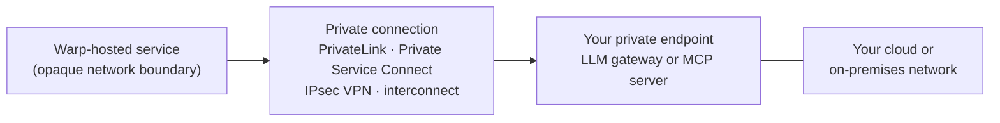

Private networking lets Warp reach an LLM gateway or MCP server without exposing the service to the public internet. You keep the service, access controls, and network policy in infrastructure you manage.

:::note
Private networking is an Enterprise deployment option coordinated with your Warp account team. [Contact sales](https://www.warp.dev/contact-sales) to evaluate your network and region requirements.
{/* VERIFY: Confirm that private networking is generally available on Enterprise and that Contact Sales is the correct intake path. */}
:::

## Supported service connections

Private networking applies to services that Warp calls from its hosted services:

* **Private LLM gateways** - Connect a team-managed, OpenAI-compatible endpoint such as an internal LiteLLM gateway. See [team-managed LLM API keys and endpoints](/enterprise/enterprise-features/team-managed-keys-and-endpoints/) for endpoint and model configuration.
* **Private MCP servers** - Connect a URL-based managed MCP installation, including any separate OAuth authorization or token hosts that the installation requires. Cloud agents reference the managed installation by its `warp_id`. See [MCP servers for cloud agents](/platform/mcp/#oauth-authentication).

{/* VERIFY: Confirm the customer-facing names and availability of private connections for team-managed LLM gateways and managed MCP installations. */}

Self-serve custom inference endpoints remain device-level settings and require a public URL. A direct `url` MCP configuration also doesn't use this private connection. If the service needs access from a cloud agent's execution environment rather than from Warp's hosted inference or managed MCP service, use [managed self-hosting](/factories/self-hosting/) or another execution environment with the required network access.

## Customer-facing connection flow

Warp's hosted network is an opaque endpoint of the connection.

Warp initiates HTTPS requests over the private connection. Your service returns LLM responses or MCP tool results over the same path.

## Requirements

Prepare these items before working with Warp:

* **Service details** - Record each service's fully qualified domain name, HTTPS port, health check behavior, and cloud region. For MCP servers, include every authorization, token, registration, or resource host involved in OAuth.
* **TLS certificate** - Serve HTTPS with a certificate whose subject alternative name matches the service hostname. If your organization uses a private certificate authority, provide its trust chain through the secure handoff agreed with your account team.
* **Stable endpoint** - Keep the service hostname and private endpoint addresses stable. Coordinate replacements before removing the old endpoint.
* **Network policy** - Allow the service port and provider health checks through your firewall, security group, or network security group. Restrict access to the connection and source ranges supplied during onboarding.
* **Application authentication** - Configure the API key, static headers, or OAuth flow separately from network access. A working private route doesn't grant application-level access.
* **No redirects** - Serve the configured LLM or MCP URL directly. Private connections don't follow HTTP redirects.

## Choose a connection method

Use your service's cloud provider when Warp and the service can establish a provider-native private endpoint. Use a VPN or interconnect for other clouds and on-premises networks.

| Service location | Connection method | Your responsibility |
| --- | --- | --- |
| AWS | AWS PrivateLink | Publish a VPC endpoint service, authorize the Warp consumer, approve the connection when required, and allow HTTPS from the endpoint. |
| Azure | Azure Private Link | Publish a Private Link service, grant Warp access, approve the private endpoint connection, and allow service and health-probe traffic. |
| Google Cloud | Private Service Connect | Publish a service attachment, authorize the Warp consumer project, accept the connection when required, and allow traffic from the attachment. |
| Other cloud or on-premises network | IPsec VPN | Provide redundant tunnels, exchange the required routes, and allow the service through your firewall. |
| On-premises network with dedicated connectivity | Cloud or partner interconnect | Provision the circuit and BGP session, advertise the service routes, and allow the agreed source ranges. |

{/* VERIFY: Confirm production availability for AWS PrivateLink and whether customer acceptance is always required. */}
{/* VERIFY: Confirm the Azure Private Link production rollout and exact customer approval requirements. */}
{/* VERIFY: Confirm the Google Cloud Private Service Connect production contract and consumer-project handoff. */}
{/* VERIFY: Confirm IPsec VPN and on-premises interconnects are supported production methods and whether redundant tunnels or BGP are required. */}

### Set up AWS PrivateLink

1. Put the LLM gateway or MCP server behind a Network Load Balancer.
2. Create a VPC endpoint service for that load balancer. See the AWS guide to [creating an endpoint service](https://docs.aws.amazon.com/vpc/latest/privatelink/create-endpoint-service.html).
3. Give your Warp account team the endpoint service name, region, service hostname, and port.
4. Allow the Warp consumer principal and approve the endpoint connection if acceptance is enabled.
5. Permit the application port from the endpoint network interfaces to the load balancer targets.

Warp confirms when the consumer endpoint is connected and ready for an application test.

### Set up Azure Private Link

1. Put the service behind an Azure Standard Load Balancer.
2. Create a Private Link service for the load balancer. See the Azure guide to [creating a Private Link service](https://learn.microsoft.com/en-us/azure/private-link/create-private-link-service-portal).
3. Give your Warp account team the Private Link service alias, region, service hostname, and port.
4. Grant Warp access and approve the private endpoint connection if the service uses manual approval.
5. Update network security groups and application rules to allow load-balancer health probes and HTTPS traffic.

Warp confirms when the private endpoint connection is approved and ready for an application test.

### Set up Google Cloud Private Service Connect

1. Put the service behind a load balancer supported by Private Service Connect.
2. Publish the service with a service attachment. See the Google Cloud guide to [publishing a service with Private Service Connect](https://cloud.google.com/vpc/docs/configure-private-service-connect-producer).
3. Add the Warp consumer project supplied by your account team to the service attachment's accept list.
4. Give your Warp account team the service attachment URI, region, service hostname, and port.
5. Accept the connection if your service attachment uses manual acceptance, then check that the connection reports an accepted status.

Warp confirms when the consumer endpoint is ready for an application test.

### IPsec VPN

Use an IPsec VPN when provider-native private endpoints aren't available:

1. Agree on redundant tunnel endpoints, IKE settings, BGP autonomous system numbers, and route ranges with your Warp account team.
2. Configure both tunnels and BGP sessions on your cloud router or edge device.
3. Advertise only the routes needed to reach the private services.
4. Allow the agreed source ranges and service ports through your firewall.
5. Verify both tunnels can carry traffic before testing the application.

### On-premises interconnect

Use a cloud or partner interconnect when your on-premises network already has dedicated connectivity:

1. Work with your connectivity provider and Warp to provision the circuit or virtual connection.
2. Configure the BGP session and advertise only the service routes.
3. Allow the agreed source ranges and service ports through your edge firewall.
4. Confirm route propagation and redundant path behavior before testing the application.

## Validate the connection

After both sides report that the connection is ready:

1. Confirm the LLM gateway or MCP server is healthy on its private hostname and port.
2. Ask Warp to run a connectivity check over the private path.
3. For an LLM gateway, select a model configured on the team endpoint and send a test prompt.
4. For an MCP server, invoke a read-only tool through the managed MCP installation.
5. Check your service and network logs for the request, TLS handshake, authentication result, and response.
6. If your policy requires private-only access, verify that the service isn't reachable from the public internet.

If the network check succeeds but the application request fails, check the certificate hostname, authentication configuration, and MCP OAuth hosts before changing routes.

## Related pages

* [Team-managed LLM API keys and endpoints](/enterprise/enterprise-features/team-managed-keys-and-endpoints/) - Configure the models, endpoint URL, and credentials for a private LLM gateway.
* [MCP servers for cloud agents](/platform/mcp/) - Configure a managed MCP installation and reference it from cloud agents.
* [Architecture and deployment](/enterprise/enterprise-features/architecture-and-deployment/) - Compare Warp-hosted, self-hosted, and hybrid deployment models.
* [Security overview](/enterprise/security-and-compliance/security-overview/) - Review data handling, encryption, and Enterprise security controls.
