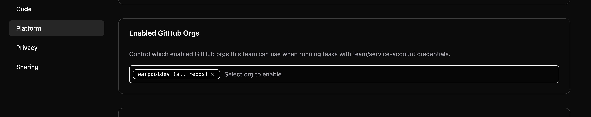

The Admin Panel provides administrators with centralized control over team settings in Warp. Configure agent behavior, security policies, codebase indexing, and collaboration features for your entire organization from a single interface.

## What is the Admin Panel?

The [Admin Panel](https://app.warp.dev/admin/) is your control center for managing Warp at scale. It allows IT admins, platform teams, and engineering managers to:

* **Control agent behavior** - Set autonomy levels, command permissions, and safety guardrails organization-wide
* **Enforce security policies** - Configure secret redaction, telemetry controls, and data handling
* **Manage team resources** - Enable Codebase Context, configure BYOLLM, and control sharing permissions
* **Monitor usage** - Track credit consumption and set spending limits
* **Maintain compliance** - Apply consistent policies that meet your organization's security requirements

:::note
Warp restricts Admin Panel access to team administrators. Regular team members can view settings that affect them but cannot modify organization-wide policies.
:::

## Accessing the Admin Panel

### For team admins

Access the Admin Panel in two ways:

**Option 1: Direct URL**
1. Navigate to [app.warp.dev/admin](https://app.warp.dev/admin/).
2. Log in with your SSO credentials.
3. The Admin Panel opens with all organization settings.

**Option 2: From Warp Settings**
1. Open Warp and click your profile icon in the top right.
2. Click **Settings**.
3. Navigate to the **Admin Panel** tab (visible only to team admins).

### For team members

Team members see organization-enforced settings in their personal Settings panel:

* Settings controlled by admins appear grayed out
* Indicated by message: "Your organization has configured this setting"
* Users retain control over settings where admins have selected "Respect User Setting"

## How settings enforcement works

The Admin Panel uses a three-tier enforcement model that keeps administrators in control while allowing appropriate flexibility.

### Setting enforcement levels

**Organization enforced**
* Setting applies to all team members regardless of individual preferences
* Users cannot override these settings
* Use for security-critical policies (e.g., secret redaction, command denylists)

**Respect user setting**
* Allows individual team members to control the setting themselves
* Admins set a default, but users can customize
* Use for preferences that don't impact security or compliance (e.g., AI model selection)

**Tier restricted**
* Setting is locked based on billing plan
* Cannot be changed until plan is upgraded
* Indicated by message: "Configuring this setting is not available on your plan"

### Testing before enforcement

:::note
Changes made in the Admin Panel take effect immediately for all team members. Test settings in your own Warp environment before applying organization-wide enforcement.
:::

To safely roll out new policies:

1. Configure settings with "Respect User Setting" initially.
2. Test with a small group of users.
3. Gather feedback and adjust configuration.
4. Switch to "Organization enforced" once validated.

## Plan limitations

The features available in the Admin Panel scale with your Warp plan:

### Free tier
* Most settings are fixed and non-configurable
* Limited Codebase Context (2 repositories)
* No BYOLLM support
* Basic sharing features

### Business plans
* Most settings become configurable by administrators
* Enhanced agent autonomy control
* Advanced sharing and privacy features
* Increased Codebase Context limits

### Enterprise plans
* **Full admin control** - Configure all available settings
* **Enterprise secret redaction** - Custom regex patterns for secrets
* **BYOLLM** - Route inference through your cloud infrastructure
* **Self-hosting cloud agent workers** - Deploy Oz cloud agent workers on your own infrastructure
* **Advanced compliance** - SOC 2, HIPAA, and custom data handling agreements
* **Priority support** - Dedicated Slack/Teams channels

For complete plan details, visit [warp.dev/pricing](https://www.warp.dev/pricing) or [contact sales](https://warp.dev/contact-sales).

## Admin Panel sections

The Admin Panel is organized into six main areas:

### AI settings

Configure how agents behave across your organization, including autonomy levels and command permissions. This is where you balance agent productivity with organizational safety requirements.

#### General AI settings

**AI in remote sessions**
* Controls whether agents are available during SSH sessions and remote connections
* Enterprise plans can toggle this setting
* Consider disabling for production servers or sensitive environments

**Prompt summarization caching**
* When conversations become long, the LLM provider caches summaries temporarily
* Improves performance for extended agent interactions
* Zero Data Retention agreements cover caching (short-lived)

#### Autonomy settings

Configure how much independence agents have when performing actions. Choose between:

* **Agent Decides** - Agent acts autonomously when confident, asks when uncertain (recommended)
* **Always Ask** - Require explicit approval for every action
* **Always Allow** - Maximum autonomy without confirmations
* **Respect User Setting** - Allow individual users to set their preference

**Apply code diffs**
Controls whether agents can apply code changes without approval. For production-critical codebases, consider "Always Ask" to maintain tight control.

**Create plans**
Whether agents can create structured task plans (`/plan` command) without user approval.

**Execute commands**
Manages the agent's ability to run terminal commands autonomously. Pair with command allowlists/denylists for granular control.

**Read files**
Controls agent access to reading files in the codebase. Enable for better context, restrict for sensitive repositories.

#### Directory and command control

**Directory allowlist**
Specify directories where agents can read files without restriction. Use absolute paths:
* `~/git/internal-tooling` - Grant access to specific projects
* `/home/user/repos/public-*` - Use wildcards for patterns

**Command allowlist**
Regular expressions matching commands agents can execute without asking permission. Common patterns:
* `grep .*` - Text search
* `ls(\\s.*)?` - Directory listing
* `git status` - Version control queries
* `which .*` - Finding executables

**Command denylist**
Regular expressions for commands that **always** require explicit user approval, regardless of autonomy settings:
* `rm -rf.*` - Recursive deletion
* `sudo.*` - Administrative commands
* `curl.*|wget.*` - Network requests
* `docker rm.*` - Container operations
* `.*production.*` - Commands containing "production"

:::caution
Command denylist rules take precedence over allowlist rules and agent autonomy settings. Use denylists to prevent high-risk operations even in high-autonomy configurations.
:::

### Privacy settings

Manage data collection and security policies to meet your organization's compliance requirements.

**User-generated content (UGC) data collection**
Controls how Warp collects and uses user-generated content to improve the service:
* **Disabled** - Warp collects no UGC data from your organization
* **Enabled** - Allow data collection for service improvement
* **Respect User Setting** - Let individual users decide

Enterprise teams with Zero Data Retention agreements can disable this completely.

**Enterprise secret redaction**
Automatically detects and redacts sensitive information before sending data to LLM providers:
* Enterprise plans enable this by default
* Includes automatic detection of common secret patterns (API keys, passwords, certificates)
* Supports custom regex patterns for organization-specific secrets
* Applies unconditionally across all team members

Configure custom patterns in the Admin Panel to match your organization's secret formats.

### Code settings

Control codebase indexing and agent code features for your team.

**Codebase Context**
Determines whether Warp indexes your team's Git repositories to provide context for agents:
* **Disabled** - No codebase indexing
* **Enabled** - Index codebases for improved agent responses across large, multi-repo systems
* **Respect User Setting** - Allow individual control

When enabled, agents understand your code patterns, architecture, and conventions across all indexed repositories. Enterprise plans support:
* Unlimited repositories
* Up to 200,000 files per repository
* Team-wide indexing with centralized configuration

### Billing settings

Configure billing preferences and spending controls to manage costs at scale.

**Usage-based pricing**
Enable pay-as-you-go billing for credits beyond your plan's included quota:
* Set monthly spending limits to control costs
* View current overage usage and costs
* Receive alerts when approaching spending thresholds

**Credit allocation**
For Enterprise plans with negotiated credit pools:
* Allocate credits across teams or projects
* Monitor usage by team
* Set per-team spending limits

Contact your account manager to configure advanced credit allocation.

### Sharing settings

Control how team members collaborate and share Warp Drive resources.

**Direct link sharing**
Allow team members to share Notebooks, Workflows, Prompts, and other Warp Drive objects via direct links:
* **Enabled** - Team members can generate shareable links
* **Team only** - Links work only for team members
* **Disabled** - No link sharing

**Anyone with link sharing**
Enable public access to shared objects:
* **Enabled** - Anyone with the link can view content without being a team member
* **Disabled** - Links require team membership to access

For organizations with sensitive internal processes, disable "Anyone with link" sharing to prevent accidental exposure.

### Platform settings

Configure Oz cloud agent settings for your team, including GitHub authorization for automated workflows.

**Enabled GitHub Orgs**

The **Enabled GitHub Orgs** setting associates your Warp team with one or more GitHub App installations, enabling Oz cloud agents initiated with a [team API key](/reference/cli/api-keys/) to clone repositories and open pull requests using the Oz by Warp GitHub App.

To configure:

1. Navigate to the **Platform** section of the Admin Panel.
2. Under **Enabled GitHub Orgs**, review the list of GitHub organizations where the Oz by Warp GitHub App is installed.
3. Select which organizations your team should have access to.

The organizations and repository access shown here reflect the Oz by Warp GitHub App installation scope, which is configured in [GitHub settings](https://github.com/settings/installations). To change which repositories the app can access, edit the installation directly in GitHub.

:::note
This setting controls GitHub access for team API key runs only. Runs triggered by individual users (via personal API key, Slack, or Linear) continue to use that user's personal GitHub token. For more details, see [Team GitHub authorization](/agent-platform/cloud-agents/team-access-billing-and-identity/#team-github-authorization).
:::

## Multi-admin functionality

Warp supports multiple team administrators to prevent single points of failure and enable distributed management.

### Promoting and demoting admins

Team admins can grant or revoke admin privileges:

1. Navigate to **Settings** > **Teams** > **Team Members**.
2. Find the user you want to modify.
3. Click the role dropdown next to their name.
4. Select **Admin** or **Member**.
5. Click **Save**.

:::note
We recommend at least one admin in addition to the Team Owner to prevent access issues if one is unavailable. The Team Owner has full access and can transfer ownership; Team Admins have the same permissions except they can't transfer ownership.
:::

## Common admin workflows

### Initial enterprise setup

After purchasing a Warp enterprise plan:

1. **Configure SSO** - Set up authentication with your identity provider.
2. **Enable Codebase Context** - Index your organization's repositories.
3. **Set agent autonomy** - Configure initial safety levels.
4. **Apply secret redaction** - Add custom patterns for your organization.
5. **Configure BYOLLM** (optional) - Route inference through your cloud accounts.
6. **Create shared resources** - Populate team Warp Drive with Workflows, Rules, and Prompts.

See [Roles and permissions](/enterprise/team-management/roles-and-permissions/) for details on user roles and access controls.

### Adjusting policies for different teams

For organizations with multiple teams (e.g., DevOps, Data, Frontend):

1. Create separate Warp teams for each group.
2. Assign team-specific admins.
3. Configure different autonomy levels per team.
4. Use directory allowlists to scope agent access to team repositories.

### Responding to security incidents

If an agent performs an unintended action:

1. **Immediate:** Review agent action logs in the affected user's session.
2. **Short-term:** Add specific commands to the command denylist.
3. **Long-term:** Adjust autonomy settings to prevent similar incidents.
4. **Review:** Check the Admin Panel settings for the affected user's team to confirm what autonomy levels, allowlists, and restrictions were in effect.

Warp logs all agent actions with full context, making incident investigation straightforward.

## Troubleshooting

### Users can't see new settings

**Problem:** You changed a setting in the Admin Panel, but users report they don't see the change.

**Solution:**
1. Verify the setting is not set to "Respect User Setting".
2. Ask users to restart Warp to force a settings refresh.
3. Confirm users are members of the correct team.
4. Check that users have logged in with SSO (not a personal account).

### Setting is grayed out in Admin Panel

**Problem:** A setting you want to configure appears grayed out or shows "Not available on your plan."

**Solution:**
* This setting is restricted to higher-tier plans
* Review plan features at [warp.dev/pricing](https://www.warp.dev/pricing)
* Contact your account manager or [sales team](https://warp.dev/contact-sales) to upgrade

### Command allowlist not working

**Problem:** Agents still ask permission for commands that match your allowlist patterns.

**Solution:**
1. Verify regex patterns are correct (test with a regex validator).
2. Check that commands don't also match the denylist (denylist takes precedence).
3. Confirm autonomy settings allow command execution.
4. Remember: Some commands are always restricted regardless of allowlist.

## Support

Enterprise customers have access to priority support:

* **Dedicated channels** - Private Slack or Teams channels with Warp engineers
* **Account manager** - Direct contact for escalations and feature requests
* **Technical support** - Help with Admin Panel configuration and troubleshooting

Reach out through your dedicated Slack/Teams channel or contact your account manager.
