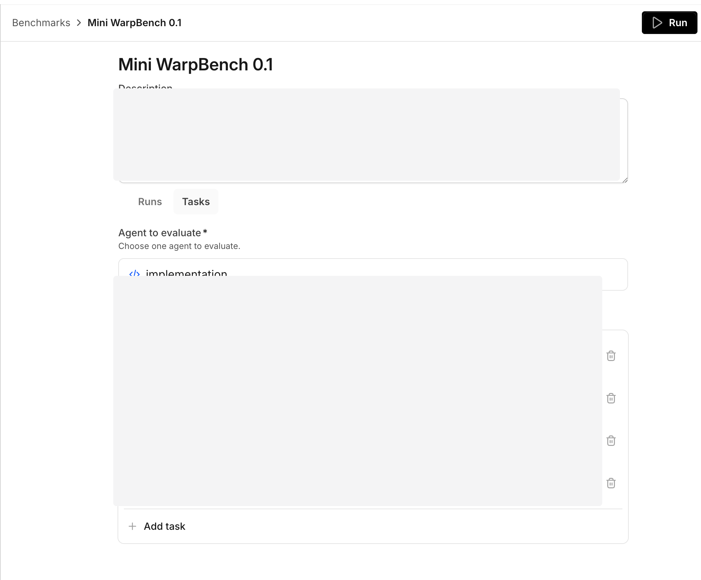

import { VARS } from '@data/vars';
import VideoEmbed from '@components/VideoEmbed.astro';

:::note
Warp Factories is in **Early Access** and available to a limited set of teams. [Request access](https://www.warp.dev/factories/request-access) to use it with your team.
:::

Benchmarks compare model and runner configurations for one factory agent on the same fixed tasks. Use a benchmark to test a change on representative work before you apply it to your factory.

## How benchmarks work

A benchmark helps you choose an agent configuration based on repeatable evidence. Run representative tasks with different configurations, then compare their results before you change a live factory.

A benchmark suite is a reusable collection of tasks that evaluates one factory agent. Each task has a prompt and "Correctness criteria," which tell the built-in Correctness Scorer what a successful trial must do. A trial is one run of one task under one configuration. Repetitions create additional trials.

When you launch a suite, choose the configurations, Scorers, and repetitions to compare. Warp runs the trials, then scores the completed ones. The run keeps those inputs, so later changes to the suite do not change its past results.

The following videos show how to create a benchmark suite from team coding tasks and compare cost-focused results.
<VideoEmbed url="https://www.youtube.com/watch?v=mojpQjwBXN0" title="Creating a model benchmark from your team's coding tasks" />
<VideoEmbed url="https://www.youtube.com/watch?v=LKx5MeUsptQ" title="Comparing factory benchmark results to reduce coding agent costs" />

Use separate suites for focused questions:

* **Factory default** - Compare models and runners to choose the default configuration for a coding agent.
* **Frontend changes** - Compare configurations on representative frontend tasks before applying one to that workflow.

## Create and run a benchmark

To use Benchmarks, you need a factory with an agent to evaluate. Use a completed run from that agent when you want a task to reproduce real work, or write a task yourself.

1. In the <a href={VARS.FACTORY_WEB_APP_URL}>{VARS.FACTORY_WEB_APP}</a>, open your factory, click **Benchmarks**, then click **New**.
2. Enter a name and optional description, then choose the agent to evaluate. The suite runs every task as that agent.

   <figure style={{ maxWidth: "563px" }}>
   
   <figcaption>The benchmark editor with a selected agent.</figcaption>
   </figure>

3. Click **Add task**. Warp saves the benchmark, then opens task setup.
4. Select a completed run, then click **Add task**. To write a task instead, click **Start from scratch instead**.
5. Click **Run**. In the launch dialog, choose the model and runner for each configuration. Optionally mark one configuration as the baseline. Third-party harness comparisons are not available yet.
6. Add configurations, select Scorers, and set "Repetitions." The dialog shows the number of trials created. More trials and Scorers increase the run's cost.
7. Click **Run benchmark**. The benchmark page shows its status and scored trials. You can cancel a running or scoring benchmark.

## Review benchmark results

After the run completes, review the result as a comparison, not as a universal model ranking:

* **Overall recommendation** - Identifies the highest-quality configuration when at least two configurations have comparable results.
* **Additional recommendations** - Highlight the most efficient and lowest-cost configurations when the result supports those comparisons.
* **Comparison chart** - Compare the selected result dimensions across configurations.
* **Overall table** - Compare each Scorer's average and the combined Overall value. Expand a configuration, task, and repetition to inspect its individual trials.
* **Scorer grids** - Show each task's results across configurations for a selected Scorer.

The run's "Total cost" includes trial and Scorer costs. A failed or cancelled benchmark shows only results that finished scoring before the run stopped.

## Apply a result

Change one configuration at a time. If the evidence supports a candidate, update the agent's model or runner in the factory dashboard, or submit the change through your [factory definition](/factories/factory-as-code/). Keep the relevant Scorers active, then compare later production runs with the baseline you recorded before the change.

For version-controlled factories, define reusable suites in `benchmarks/<suite-slug>/suite.yaml` and their tasks in `benchmarks/<suite-slug>/tasks/<task-slug>.yaml`. See [benchmark suite files](/factories/factory-as-code/#benchmarkssuite-slugsuiteyaml).

## Related pages

* [Measure and improve a factory](/factories/measure-and-improve/) - Configure Scorers and use benchmark evidence in an improvement loop.
* [Factory dashboard](/factories/factory-dashboard/) - Track factory work, runs, and benchmark suites.
* [Factory definition syntax](/factories/factory-as-code/) - Define factories and benchmark suites as code.
