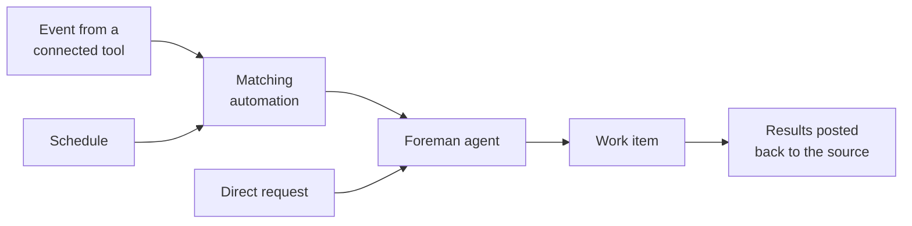

Connect your factory to the tools where your team already discusses, tracks, and reviews work. Wherever work starts, the factory keeps the original context — the thread, issue, or pull request — and posts results back to the same place.

## Choose a source

Pick the sources that match where work starts for your team. You can connect more than one.

| Source | Best for | Where follow-ups continue |
| --- | --- | --- |
| [Slack](/factories/integrations/slack/) | Chat and support requests | The Slack thread or DM |
| [GitHub](/factories/integrations/github/) | Issues, pull requests, reviews, and CI | The issue, pull request, or review thread |
| [GitLab](/factories/integrations/gitlab/) | Merge request activity and bot mentions | The merge request thread |
| [Linear](/factories/integrations/linear/) | Planned issues | The Linear issue and its agent session |
| [Jira](/factories/integrations/jira/) | Work items assigned to Warp | The Jira agent session |
| [Factory MCP](/factories/factory-mcp/) | Exchanging work with a local coding agent, in both directions | The factory work item |
| Direct runs and schedules | One-off or recurring work | The factory work item |

## Connect a source

1. Pick the factory you want to connect. If you don't have one yet, follow the [Warp Factories quickstart](/factories/quickstart/).
2. Connect the source: install the provider integration, set up the [Factory MCP](/factories/factory-mcp/), or create a schedule. Each integration guide below walks through authorization; grant only the access the factory needs.
3. Tell the factory how to respond. Provider connections come with default automations that decide which events start work and which agent handles them; review their [filters](/factories/automation-filters/) and run settings. Schedules and direct runs skip this step.
4. Send a test request, such as mentioning the factory in Slack or assigning it an issue, and confirm it picks up the work and replies at the source.

## How work reaches your factory

An event from a connected tool starts the automation whose filters match it, such as a specific repository, channel, or label. Schedules start their automation on a timer, and direct requests go straight to the factory.

Every request then lands with the foreman agent, the factory's orchestrator. The foreman turns the request into a work item, determines which stage the work needs next, and dispatches a specialized agent for each stage: triage to scope the request, spec when the design needs agreement, implementation to write the code, and review to check it. Between stages it relays questions and progress back to the source, and it pauses wherever a decision belongs to a human, such as approving a spec or merging a pull request. See [how Warp Factories work](/factories/how-factories-work/) for the full lifecycle.

## Review the default automations

When you create a factory through the setup wizard, Warp adds default automations for each tool you connect, so common requests work immediately:

* **GitHub** - Starts work when the factory is mentioned or assigned, and follows up when pull requests close or merge, completing a linked tracker issue when it can. See the [GitHub integration guide](/factories/integrations/github/).
* **GitLab** - Starts work when someone mentions the factory's bot in a merge request comment. See the [GitLab integration guide](/factories/integrations/gitlab/).
* **Jira** - Starts work when someone assigns or mentions Warp on a work item in one of the Jira projects you selected. See the [Jira integration guide](/factories/integrations/jira/).
* **Linear** - Starts work when a new agent session arrives from one of the Linear teams you selected. See the [Linear integration guide](/factories/integrations/linear/).
* **Slack** - Starts work from mentions and messages, as described in the [Slack integration guide](/factories/integrations/slack/).

These defaults are starting points. Review each automation's filters, agent, and run settings, and adjust them to match your workflow.

## Integration guides

* [Slack](/factories/integrations/slack/) - Route chat requests, direct messages, and thread follow-ups through a dedicated factory app.
* [GitHub](/factories/integrations/github/) - Route repository events with issue, pull request, review, or CI context.
* [GitLab](/factories/integrations/gitlab/) - Route merge request events and bot mentions through a per-factory service account.
* [Linear](/factories/integrations/linear/) - Route planned issues through issue activity and agent sessions.
* [Jira](/factories/integrations/jira/) - Route Jira work items assigned to Warp into factory work.

## Factory MCP

The Factory MCP connects local coding agents and other MCP clients to your factory, and it works in both directions: send work to the factory, or take work over from it — pull a task down to your machine, iterate on it locally, and hand it back to the same work item. See the [Factory MCP guide](/factories/factory-mcp/).

## Direct runs and schedules

Not every task starts in an external tool:

* Start a direct factory run for one-off work: describe the task and the foreman agent takes it from there.
* Create a scheduled automation for recurring work such as maintenance or reports.

See the [triggers overview](/platform/triggers/) for how schedules and other triggers work across the platform.

## Good to know

* **Follow-ups continue the same work item** - Replying in the same Slack thread, GitHub issue or pull request, Linear issue, or Jira agent session adds to the existing work item instead of starting a new one. Repeated event deliveries from a provider don't create duplicate work either.
* **One issue tracker per factory** - A factory can use [Linear](/factories/integrations/linear/) or [Jira](/factories/integrations/jira/), or no tracker at all, but not both at once. The setup wizard currently offers Linear; to use Jira, connect it after setup or in your [factory definition](/factories/factory-as-code/).
* **Filters route work; they don't restrict access** - Choosing which requests start work is separate from what a running agent can reach. See [automation filters](/factories/automation-filters/#filters-route-work-they-dont-restrict-access).
* **The factory hands off at the pull request** - It pushes branches and opens pull requests, then waits for a person. See [where your team stays in charge](/factories/how-factories-work/#where-your-team-stays-in-charge).

Next, customize which agents receive work and how it's routed with [factory definitions as code](/factories/factory-as-code/).
