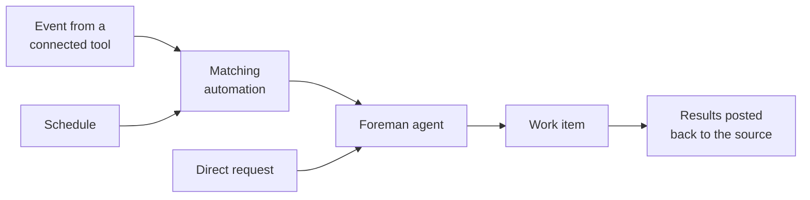

Connect your factory to the tools where your team already discusses, tracks, and reviews work. Wherever work starts, the factory keeps the original context — the thread, issue, or pull request — and posts results back to the same place.

## Choose a source

| Source | Best for | Where follow-ups continue | What you get back |
| --- | --- | --- | --- |
| [Slack](./integrations/slack) | Chat and support requests | The Slack thread or DM | A summary with issue or pull request links |
| [GitHub](./integrations/github) | Issues, pull requests, reviews, and CI | The issue, pull request, or review thread | Comments, branches, and pull requests |
| [Linear](./integrations/linear) | Planned issues | The Linear issue and its agent session | Plans, status updates, and pull request links |
| [Jira](./integrations/jira) | Work items assigned to Warp | The Jira agent session | Task status and a text result |
| [Factory MCP](./factory-mcp) | Sending work from a local coding agent | The factory work item | Notes and artifacts |
| Direct runs and schedules | One-off or recurring work | The factory work item | Summaries and code changes |

## Connect a source

1. Pick the factory you want to connect. If you don't have one yet, follow the [Warp Factories quickstart](./quickstart).
2. Connect the source: install the provider integration, set up the [Factory MCP](./factory-mcp), or create a schedule. Each integration guide below walks through authorization — grant only the access the factory needs.
3. Tell the factory how to respond. Provider connections come with default automations that decide which events start work and which agent handles them; review their filters and run settings. Schedules and direct runs skip this step.
4. Send a test request — for example, mention the factory in Slack or assign it an issue — and confirm it picks up the work and replies at the source.

## How work reaches your factory

An event from a connected tool starts the automation whose filters match it — a specific repository, channel, or label, for example. Schedules start their automation on a timer, and direct requests go straight to the factory. In every case, the factory's foreman agent — the orchestrator that assigns work to the right agents — turns the request into a work item and sees it through. See [how Warp Factories work](./how-factories-work) for what happens next.

## Review the default automations

When you create a factory through the setup wizard, Warp adds default automations for each tool you connect, so common requests work immediately:

* **GitHub** - Starts work when the factory is mentioned or assigned, and follows up when pull requests close or merge — including completing a linked tracker issue when it can. See the [GitHub integration guide](./integrations/github).
* **Jira** - Starts work when someone assigns or mentions Warp on a work item in one of the Jira projects you selected. See the [Jira integration guide](./integrations/jira).
* **Slack** - Starts work from mentions and messages, as described in the [Slack integration guide](./integrations/slack).

These defaults are starting points. Review each automation's filters, agent, and run settings, and adjust them to match your workflow.

## Integration guides

* [Slack](./integrations/slack) - Route chat requests, direct messages, and thread follow-ups through a dedicated factory app.
* [GitHub](./integrations/github) - Route repository events with issue, pull request, review, or CI context.
* [Linear](./integrations/linear) - Route planned issues through issue activity and agent sessions.
* [Jira](./integrations/jira) - Route Jira work items assigned to Warp into factory work.

## Factory MCP

The Factory MCP connects local coding agents and other MCP clients to your factory. Use it to send work to the factory from your terminal, check status, coordinate with the foreman agent, and hand finished work back to the same work item. See the [Factory MCP guide](./factory-mcp).

## Direct runs and schedules

Not every task starts in an external tool:

* Start a direct factory run for one-off work — describe the task, and the foreman agent takes it from there.
* Create a scheduled automation for recurring work such as maintenance or reports.

See the [triggers overview](../platform/triggers/) for how schedules and other triggers work across the platform.

## Good to know

* **Follow-ups continue the same work item** - Replying in the same Slack thread, GitHub issue or pull request, Linear issue, or Jira agent session adds to the existing work item instead of starting a new one. Repeated event deliveries from a provider don't create duplicate work either.
* **One issue tracker per factory** - A factory can use [Linear](./integrations/linear) or [Jira](./integrations/jira), or no tracker at all — but not both at once. The setup wizard currently offers Linear; to use Jira, connect it after setup or in your [factory definition](./factory-as-code).
* **Filters route work, they don't restrict access** - Automation filters (repository, channel, team, project, label, author, or status) choose which requests start work. To limit what an integration can reach, change what you authorize for that provider instead.
* **You stay in control of what ships** - The factory posts back only where you've connected it, and pushes code with the repository credentials you configure. Branch protection and code review still apply; your team decides what merges.

Next, customize which agents receive work and how it's routed with [factory definitions as code](./factory-as-code).
